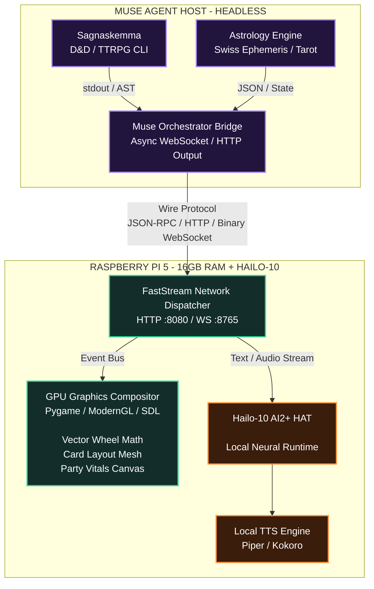
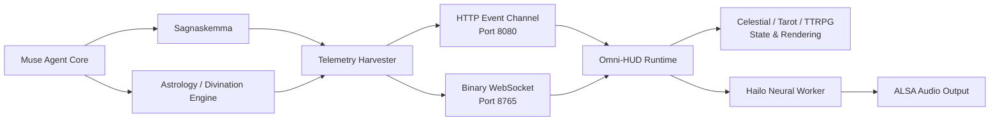

# Architectural Specification & Multi-Slice Roadmap: Omni-HUD Runtime

`ARCHITECTURAL_SPECIFICATION_MULTI-SLICE_ROADMAP_OMNI-HUD_RUNTIME.md`

> **Omni-HUD Runtime** is the visual, telemetry, divination, TTRPG, and edge-AI execution layer connecting the Muse Agent host to a Raspberry Pi 5 + Hailo-10 acceleration node.

---

## Table of Contents

1. [System Architecture Overview](#system-architecture-overview)
2. [Slice 1: Protocol & IPC Transport Layer](#slice-1-protocol--ipc-transport-layer)
3. [Slice 2: Muse Host Instrumentation & Headless Harvesters](#slice-2-muse-host-instrumentation--headless-harvesters)
4. [Slice 3: Mathematical Foundations & Algorithmic Engines](#slice-3-mathematical-foundations--algorithmic-engines)
5. [Slice 4: Hailo-10 AI2+ HAT Neural Acceleration Pipeline](#slice-4-hailo-10-ai2-hat-neural-acceleration-pipeline)
6. [Slice 5: Raspberry Pi 5 Core Graphics & Layout Engine](#slice-5-raspberry-pi-5-core-graphics--layout-engine)
7. [Slice 6: Multi-Stage Build & Execution Verification](#slice-6-multi-stage-build--execution-verification)
8. [Slice 7: AI Coding Agent Implementation Checklist](#slice-7-ai-coding-agent-implementation-checklist)

---

# System Architecture Overview

The Omni-HUD Runtime uses a split execution architecture.

The **Muse Agent Host** performs high-level orchestration, Sagnaskemma execution, astrology and divination calculations, and structured state generation.

The **Raspberry Pi 5 edge node** receives this telemetry, renders the live Himinbjörg visual environment, and dispatches supported neural workloads to the Hailo-10 accelerator.



---

# Slice 1: Protocol & IPC Transport Layer

## 1.1 Envelope Specification

All telemetry emitted by Muse must conform to a versioned, strictly typed JSON envelope before transmission across the local network.

### JSON Schema

```json
{
  "$schema": "https://json-schema.org/draft/2020-12/schema",
  "title": "OmniHudPayload",
  "type": "object",
  "required": [
    "version",
    "timestamp",
    "session_id",
    "source_engine",
    "event_type",
    "payload"
  ],
  "properties": {
    "version": {
      "type": "string",
      "enum": ["1.0.0"]
    },
    "timestamp": {
      "type": "number",
      "description": "Unix epoch in milliseconds"
    },
    "session_id": {
      "type": "string",
      "format": "uuid"
    },
    "source_engine": {
      "type": "string",
      "enum": [
        "sagnaskemma",
        "astrology",
        "muse_core"
      ]
    },
    "event_type": {
      "type": "string",
      "enum": [
        "ttrpg.combat_state",
        "ttrpg.roll_resolution",
        "ttrpg.lore_dispatch",
        "divination.ephemeris_transit",
        "divination.tarot_spread",
        "divination.planetary_hour",
        "agent.thought_stream",
        "agent.speech_utterance"
      ]
    },
    "payload": {
      "type": "object"
    }
  }
}
```

---

## 1.2 Binary WebSocket Upgrade Path

For high-frequency telemetry such as streaming voice tokens, rapid state changes, and dice physics, the server exposes an upgraded WebSocket channel on port `8765`.

Binary frames use **MessagePack** payloads.

### Binary Frame Layout

| Field | Size | Description |
| --- | ---: | --- |
| Magic Prefix | 4 bytes | `0x48 0x4D 0x4E 0x49` (`HMNI`) |
| Flags | 1 byte | Bit 0 = Zstandard compression, Bit 1 = priority frame, Bits 2-7 reserved |
| Payload Length | 4 bytes | Big-endian unsigned 32-bit integer |
| Payload Body | Variable | MessagePack-encoded payload object |

### Logical Frame Structure

```text
┌──────────────────────┬───────────┬──────────────────────┬───────────────────────┐
│ Magic: HMNI          │ Flags     │ Payload Length       │ MessagePack Payload   │
│ 4 bytes              │ 1 byte    │ 4 bytes              │ Variable length       │
└──────────────────────┴───────────┴──────────────────────┴───────────────────────┘
```

---

# Slice 2: Muse Host Instrumentation & Headless Harvesters

The workstation hosting Muse wraps CLI execution and extracts structured runtime state without requiring modifications to the core Sagnaskemma or astrology-engine repositories.

## 2.1 Complete Harvester Module

File:

```text
muse_telemetry_harvester.py
```

```python
#!/usr/bin/env python3
"""
muse_telemetry_harvester.py

Runs on the Muse host computer.

Intercepts CLI output from Sagnaskemma and astrology-engine,
packages it into Omni-HUD JSON envelopes, and dispatches it
to the Raspberry Pi 5 display node.
"""

import sys
import os
import json
import time
import uuid
import re
import argparse
import urllib.request
import urllib.error
import subprocess

from typing import Dict, Any

PI_ENDPOINT_HTTP = os.getenv(
    "PI_HUD_HTTP",
    "http://192.168.1.150:8080/api/event"
)

PI_ENDPOINT_WS = os.getenv(
    "PI_HUD_WS",
    "ws://192.168.1.150:8765"
)

SESSION_ID = str(uuid.uuid4())


class OmniHudEmitter:
    def __init__(self, target_http_url: str):
        self.target_url = target_http_url

    def emit(
        self,
        source_engine: str,
        event_type: str,
        payload: Dict[str, Any]
    ) -> bool:

        envelope = {
            "version": "1.0.0",
            "timestamp": int(time.time() * 1000),
            "session_id": SESSION_ID,
            "source_engine": source_engine,
            "event_type": event_type,
            "payload": payload
        }

        data = json.dumps(envelope).encode("utf-8")

        req = urllib.request.Request(
            self.target_url,
            data=data,
            headers={
                "Content-Type": "application/json",
                "User-Agent": "MuseHarvester/1.0"
            }
        )

        try:
            with urllib.request.urlopen(
                req,
                timeout=2.0
            ) as resp:
                return resp.status == 200

        except (
            urllib.error.URLError,
            TimeoutError
        ) as err:

            sys.stderr.write(
                f"[Emitter Error] Failed to send payload "
                f"to {self.target_url}: {err}\n"
            )

            return False


class EngineParser:

    @staticmethod
    def parse_sagnaskemma_output(
        raw_text: str
    ) -> Dict[str, Any]:
        """
        Parses raw Sagnaskemma text streams for lore,
        dice rolls, encounters, and combat vitals.
        """

        roll_pattern = re.compile(
            r"\[ROLL\]\s+([\w\s]+)\s+roll:\s+"
            r"(\d+d\d+[\+\-\d]*)\s*=\s*(\d+)"
            r"(?:\s*\((.*?)\))?",
            re.IGNORECASE
        )

        encounter_pattern = re.compile(
            r"\[ENCOUNTER\]\s+(.+)",
            re.IGNORECASE
        )

        hp_pattern = re.compile(
            r"\[VITALS\]\s+([\w]+)\s+"
            r"HP:\s+(\d+)/(\d+)\s+AC:\s+(\d+)",
            re.IGNORECASE
        )

        rolls = []
        party = []
        encounter = "Wandering Fate"
        lore_lines = []

        for line in raw_text.splitlines():

            line_str = line.strip()

            r_match = roll_pattern.search(line_str)
            e_match = encounter_pattern.search(line_str)
            v_match = hp_pattern.search(line_str)

            if r_match:
                rolls.append({
                    "roller": r_match.group(1).strip(),
                    "dice": r_match.group(2).strip(),
                    "total": int(r_match.group(3)),
                    "detail": r_match.group(4) or ""
                })

            elif e_match:
                encounter = e_match.group(1).strip()

            elif v_match:
                party.append({
                    "name": v_match.group(1).strip(),
                    "hp": int(v_match.group(2)),
                    "max_hp": int(v_match.group(3)),
                    "ac": int(v_match.group(4))
                })

            elif (
                line_str
                and not line_str.startswith("#")
            ):
                lore_lines.append(line_str)

        return {
            "encounter": encounter,
            "party": party,
            "rolls": rolls,
            "lore_text": "\n".join(lore_lines)
        }

    @staticmethod
    def parse_astrology_output(
        raw_text: str
    ) -> Dict[str, Any]:
        """
        Extracts astrological transits,
        planetary hours, and tarot spread objects
        from astrology-engine JSON or structured stdout.
        """

        try:
            return json.loads(raw_text)

        except json.JSONDecodeError:
            pass

        cards = []

        card_matches = re.findall(
            r"\[CARD\]\s+([A-Za-z0-9\s]+)"
            r"\s*\|\s*(Upright|Reversed)"
            r"\s*\|\s*(.*)",
            raw_text,
            re.IGNORECASE
        )

        for name, orient, kw in card_matches:
            cards.append({
                "title": name.strip(),
                "orient": orient.strip().capitalize(),
                "keyword": kw.strip()
            })

        planets_match = re.search(
            r"\[TRANSITS\]\s+(.*)",
            raw_text
        )

        transit_summary = (
            planets_match.group(1).strip()
            if planets_match
            else "Planetary positions aligned."
        )

        return {
            "title": "Astrological State & Reading",
            "spread_type": "Oracle Grid",
            "cards": cards,
            "astrology_summary": transit_summary,
            "planetary_hours": "Solar Arc Active"
        }


def execute_engine(
    cmd: str,
    engine_type: str,
    emitter: OmniHudEmitter
):

    proc = subprocess.Popen(
        cmd,
        shell=True,
        stdout=subprocess.PIPE,
        stderr=subprocess.PIPE,
        text=True
    )

    stdout, stderr = proc.communicate()

    if proc.returncode != 0:

        sys.stderr.write(
            f"[Process Error] Returncode "
            f"{proc.returncode}: {stderr}\n"
        )

        return

    if engine_type == "sagnaskemma":

        parsed = (
            EngineParser
            .parse_sagnaskemma_output(stdout)
        )

        emitter.emit(
            "sagnaskemma",
            "ttrpg.combat_state",
            parsed
        )

    elif engine_type == "astrology":

        parsed = (
            EngineParser
            .parse_astrology_output(stdout)
        )

        emitter.emit(
            "astrology",
            "divination.ephemeris_transit",
            parsed
        )


if __name__ == "__main__":

    parser = argparse.ArgumentParser(
        description="Muse Telemetry Bridge"
    )

    parser.add_argument(
        "--engine",
        choices=[
            "sagnaskemma",
            "astrology"
        ],
        required=True
    )

    parser.add_argument(
        "--exec",
        dest="command",
        required=True,
        help="Command to execute headless"
    )

    parser.add_argument(
        "--endpoint",
        default=PI_ENDPOINT_HTTP,
        help="Target Pi 5 HTTP API URL"
    )

    args = parser.parse_args()

    emitter_instance = OmniHudEmitter(
        args.endpoint
    )

    execute_engine(
        args.command,
        args.engine,
        emitter_instance
    )
```

---

# Slice 3: Mathematical Foundations & Algorithmic Engines

## 3.1 Ephemeris & Celestial Mechanics Formulation

### 3.1.1 Julian Day Calculation

Given:

- Gregorian year $Y$
- Gregorian month $M$
- Gregorian day $D$
- fractional Universal Time $H_{\mathrm{UT}}$

If:

```math
M \le 2
```

then:

```math
Y' = Y - 1
```

```math
M' = M + 12
```

Otherwise:

```math
Y' = Y
```

```math
M' = M
```

Calculate the Gregorian century:

```math
A =
\left\lfloor
\frac{Y'}{100}
\right\rfloor
```

Calculate the Gregorian calendar correction:

```math
B =
2 - A +
\left\lfloor
\frac{A}{4}
\right\rfloor
```

The Julian Day is then:

```math
JD =
\left\lfloor
365.25(Y' + 4716)
\right\rfloor
+
\left\lfloor
30.6001(M' + 1)
\right\rfloor
+
D
+
B
-
1524.5
+
\frac{H_{\mathrm{UT}}}{24}
```

---

### 3.1.2 Greenwich Mean Sidereal Time and Local Sidereal Time

The J2000.0 reference epoch is:

```math
JD_0 = 2451545.0
```

Time elapsed in Julian centuries is:

```math
T =
\frac{JD - 2451545.0}{36525}
```

Greenwich Mean Sidereal Time in degrees is approximated by:

```math
GMST =
280.46061837
+
360.98564736629(JD - 2451545.0)
+
0.000387933T^2
-
\frac{T^3}{38710000}
```

Normalize to the interval:

```math
0^\circ \le GMST < 360^\circ
```

For geographic longitude $\Lambda$, where east longitude is positive and west longitude is negative:

```math
LST =
(GMST + \Lambda)
\bmod 360^\circ
```

---

### 3.1.3 Coordinate Conversion: Ecliptic to Screen Radial Coordinates

Let the celestial body's tropical longitude be:

```math
0^\circ \le \lambda < 360^\circ
```

Let the Ascendant longitude be:

```math
\lambda_{\mathrm{ASC}}
```

Calculate the longitude relative to the Ascendant:

```math
\Delta\lambda =
(\lambda - \lambda_{\mathrm{ASC}})
\bmod 360^\circ
```

For a traditional astrological wheel with the Ascendant anchored at the 9 o'clock position:

```math
\theta =
\left(
180^\circ - \Delta\lambda
\right)
\bmod 360^\circ
```

Convert to radians:

```math
\theta_{\mathrm{rad}}
=
\theta
\frac{\pi}{180}
```

Given wheel center $(x_c,y_c)$ and radial track radius $R$:

```math
x =
x_c +
R\cos(\theta_{\mathrm{rad}})
```

Because screen-space vertical coordinates increase downward:

```math
y =
y_c -
R\sin(\theta_{\mathrm{rad}})
```

---

### 3.1.4 Chaldean Planetary Hour Calculation

Let $T_{\mathrm{rise}}$ and $T_{\mathrm{set}}$ represent local sunrise and sunset in decimal hours.

#### Diurnal Arc

```math
D_{\mathrm{day}}
=
T_{\mathrm{set}}
-
T_{\mathrm{rise}}
```

Length of one daytime planetary hour:

```math
\tau_{\mathrm{day}}
=
\frac{D_{\mathrm{day}}}{12}
```

#### Nocturnal Arc

```math
D_{\mathrm{night}}
=
24
-
D_{\mathrm{day}}
```

Length of one nighttime planetary hour:

```math
\tau_{\mathrm{night}}
=
\frac{D_{\mathrm{night}}}{12}
```

The repeating Chaldean sequence is:

```text
Saturn -> Jupiter -> Mars -> Sun -> Venus -> Mercury -> Moon
```

Represent the sequence as:

```text
C = [Saturn, Jupiter, Mars, Sun, Venus, Mercury, Moon]
```

For weekday index:

```math
W \in \{0,1,2,3,4,5,6\}
```

where:

```text
0 = Sunday
1 = Monday
2 = Tuesday
3 = Wednesday
4 = Thursday
5 = Friday
6 = Saturday
```

the day-ruler index is:

```text
R_W = [3, 6, 2, 5, 1, 4, 0][W]
```

For planetary hour index $h$:

```math
h \in \{0,1,\ldots,23\}
```

the ruling planet index is:

```math
R(h,W)
=
(R_W + h)
\bmod 7
```

The ruling planet is then:

```math
P(h,W)
=
C_{R(h,W)}
```

---

## 3.2 TTRPG Combat Probability & Advantage Distribution

### 3.2.1 Discrete Probability Mass Functions for d20 Systems

For a standard d20:

```math
X \sim \operatorname{DiscreteUniform}\{1,2,\ldots,20\}
```

and:

```math
P(X=k)
=
\frac{1}{20}
```

for:

```math
k \in \{1,2,\ldots,20\}
```

---

### Advantage

Let:

```math
Y_{\mathrm{adv}}
=
\max(X_1,X_2)
```

The cumulative distribution is:

```math
P(Y_{\mathrm{adv}} \le k)
=
\left(
\frac{k}{20}
\right)^2
```

The probability mass function is:

```math
P(Y_{\mathrm{adv}} = k)
=
\frac{k^2-(k-1)^2}{400}
```

which simplifies to:

```math
P(Y_{\mathrm{adv}} = k)
=
\frac{2k-1}{400}
```

The expected value is:

```math
E[Y_{\mathrm{adv}}]
=
13.825
```

---

### Disadvantage

Let:

```math
Y_{\mathrm{dis}}
=
\min(X_1,X_2)
```

The cumulative distribution is:

```math
P(Y_{\mathrm{dis}} \le k)
=
1 -
\left(
\frac{20-k}{20}
\right)^2
```

The probability mass function is:

```math
P(Y_{\mathrm{dis}} = k)
=
\frac{(21-k)^2-(20-k)^2}{400}
```

which simplifies to:

```math
P(Y_{\mathrm{dis}} = k)
=
\frac{41-2k}{400}
```

The expected value is:

```math
E[Y_{\mathrm{dis}}]
=
7.175
```

---

### Expected Value Shift

The expected result of a normal d20 roll is:

```math
E[X]
=
10.5
```

Advantage shifts the expected value by:

```math
13.825 - 10.5
=
3.325
```

Disadvantage shifts the expected value by:

```math
7.175 - 10.5
=
-3.325
```

Therefore:

```math
\Delta E_{\mathrm{adv}}
=
+3.325
```

```math
\Delta E_{\mathrm{dis}}
=
-3.325
```

---

## 3.3 Dynamic 2D Golden Ratio Viewport Layout

The Omni-HUD can divide horizontal screen space according to the golden ratio:

```math
\varphi =
\frac{1+\sqrt{5}}{2}
\approx
1.6180339887
```

Given:

- total canvas width $W$
- horizontal margin $M$

the usable width is:

```math
W_{\mathrm{usable}}
=
W - 2M
```

The larger golden-ratio panel is:

```math
W_{\mathrm{major}}
=
\frac{W_{\mathrm{usable}}}{\varphi}
```

The smaller panel is:

```math
W_{\mathrm{minor}}
=
W_{\mathrm{usable}}
-
W_{\mathrm{major}}
```

Equivalent form:

```math
W_{\mathrm{minor}}
=
\frac{W_{\mathrm{usable}}}{\varphi^2}
```

Thus:

```math
\frac{W_{\mathrm{major}}}
{W_{\mathrm{minor}}}
=
\varphi
```

This layout can be used dynamically for:

- celestial wheel + tarot spread
- party manifest + encounter state
- world-model visualization + telemetry stream
- agent reasoning + tool activity panels

---

# Slice 4: Hailo-10 AI2+ HAT Neural Acceleration Pipeline

The Hailo neural acceleration layer is intended to offload supported neural inference workloads from the Raspberry Pi CPU/GPU.

The Pi remains responsible for:

- display composition
- network transport
- message routing
- application state
- filesystem access
- orchestration

The accelerator handles supported compiled neural inference graphs.

## 4.1 Memory & Bus Allocation Strategy

### Raspberry Pi 5 System

| Resource | Target Allocation |
| --- | ---: |
| Linux OS + Kernel | ~1.5 GB |
| Pygame / SDL2 / ModernGL Canvas | ~512 MB |
| Network Ingestion & Message Buffers | ~256 MB |
| Remaining System Headroom | ~13.7 GB |

### Interconnect

```text
Raspberry Pi 5
      │
      │ PCIe Gen 3 x1
      │
      ▼
Hailo Neural Accelerator
```

### Hailo Module Memory Plan

| Neural Resource | Target Allocation |
| --- | ---: |
| HEF Engine Execution Runtime | ~512 MB |
| Piper / Kokoro Text-To-Speech Weights | ~2.1 GB |
| Real-ESRGAN / Micro-Diffusion Latent Model | ~4.8 GB |
| Device Scratchpad / Runtime Buffers | ~600 MB |

---

## 4.2 Complete Hailo Inference Daemon

File:

```text
hailo_neural_worker.py
```

```python
#!/usr/bin/env python3
"""
hailo_neural_worker.py

Hardware-accelerated neural worker process
running on the Raspberry Pi 5.

Listens for text utterances emitted by Muse,
synthesizes speech through a local neural pipeline,
and outputs raw PCM to ALSA audio.
"""

import sys
import os
import time
import queue
import threading
import subprocess

import numpy as np

try:
    from hailo_platform import (
        VDevice,
        HailoStreamInterface,
        ConfigureParams,
        InferVStreams
    )

    HAILO_AVAILABLE = True

except ImportError:
    HAILO_AVAILABLE = False


class AudioPlaybackWorker:

    def __init__(
        self,
        sample_rate: int = 22050
    ):

        self.sample_rate = sample_rate

        self.queue: queue.Queue = (
            queue.Queue()
        )

        self.running = True

        self.thread = threading.Thread(
            target=self._audio_loop,
            daemon=True
        )

        self.thread.start()

    def _audio_loop(self):

        while self.running:

            try:
                pcm_data = self.queue.get(
                    timeout=0.1
                )

                if pcm_data is None:
                    break

                process = subprocess.Popen(
                    [
                        "aplay",
                        "-r",
                        str(self.sample_rate),
                        "-f",
                        "S16_LE",
                        "-t",
                        "raw",
                        "-q"
                    ],
                    stdin=subprocess.PIPE
                )

                process.communicate(
                    pcm_data.tobytes()
                )

            except queue.Empty:
                continue

    def enqueue(
        self,
        pcm_array: np.ndarray
    ):
        self.queue.put(
            pcm_array
        )

    def close(self):
        self.running = False
        self.queue.put(None)


class HailoTTSPipeline:

    def __init__(
        self,
        hef_path: str
    ):

        self.hef_path = hef_path

        self.playback = (
            AudioPlaybackWorker()
        )

        self.initialized = False

        if (
            HAILO_AVAILABLE
            and os.path.exists(hef_path)
        ):
            self._init_hailo()

        else:
            sys.stderr.write(
                f"[Hailo TTS] Hardware driver or "
                f"{hef_path} not found. "
                "Running in fallback mode.\n"
            )

    def _init_hailo(self):

        self.target = VDevice()

        self.hef = (
            self.target
            .create_hef(self.hef_path)
        )

        self.configure_params = (
            ConfigureParams
            .create_from_hef(
                self.hef,
                interface=
                    HailoStreamInterface.PCIe
            )
        )

        self.network_group = (
            self.target
            .configure(
                self.hef,
                self.configure_params
            )[0]
        )

        self.network_group_params = (
            self.network_group
            .create_params()
        )

        self.initialized = True

        sys.stderr.write(
            "[Hailo TTS] "
            "Hailo PCIe session active.\n"
        )

    def synthesize_utterance(
        self,
        text_string: str
    ):

        if not text_string.strip():
            return

        if not self.initialized:

            subprocess.Popen(
                [
                    "espeak-ng",
                    "-s",
                    "140",
                    "-p",
                    "35",
                    text_string
                ],
                stdout=subprocess.DEVNULL,
                stderr=subprocess.DEVNULL
            )

            return

        # Tokenization / input formatting
        tokens = np.array(
            [
                ord(c)
                for c in text_string[:128]
            ],
            dtype=np.int64
        )

        tokens = np.pad(
            tokens,
            (
                0,
                128 - len(tokens)
            ),
            mode="constant"
        )

        input_data = {
            self.network_group
            .get_input_stream_names()[0]:
                np.expand_dims(
                    tokens,
                    axis=0
                )
        }

        with InferVStreams(
            self.network_group,
            self.network_group_params
        ) as infer_pipeline:

            output = (
                infer_pipeline
                .infer(input_data)
            )

            output_name = (
                self.network_group
                .get_output_stream_names()[0]
            )

            audio_raw = (
                output[output_name]
                .squeeze()
            )

            audio_int16 = (
                audio_raw * 32767
            ).astype(np.int16)

            self.playback.enqueue(
                audio_int16
            )


if __name__ == "__main__":

    tts = HailoTTSPipeline(
        "/opt/models/"
        "tts_kokoro_hailo10.hef"
    )

    tts.synthesize_utterance(
        "Himinbjorg telemetry link established. "
        "Audio subsystem ready."
    )

    time.sleep(2)
```

---

# Slice 5: Raspberry Pi 5 Core Graphics & Layout Engine

This application runs directly on the Raspberry Pi 5.

It:

- establishes an HTTP telemetry ingestion service
- stores live runtime state
- executes celestial wheel geometry
- computes tarot and panel layouts
- renders TTRPG state
- displays Muse speech and reasoning
- composites the full 2D canvas at 60 FPS

## 5.1 Complete Master Display Node

File:

```text
omni_hud_display_node.py
```

```python
#!/usr/bin/env python3
"""
omni_hud_display_node.py

Master Compositor and Visual Runtime
for Raspberry Pi 5.

Directly renders:

1. TTRPG tactical vitals, lore text,
   and dice probabilities.

2. Celestial 360-degree wheel chart,
   planetary aspects, and tarot layout.

3. Real-time Muse thought and
   dialogue streams.
"""

import sys
import math
import json
import threading

from http.server import (
    HTTPServer,
    BaseHTTPRequestHandler
)

from typing import (
    Dict,
    Any,
    List
)

import pygame


# ---------------------------------------------------------
# Display Canvas Settings
# ---------------------------------------------------------

CANVAS_WIDTH = 1920
CANVAS_HEIGHT = 1080
TARGET_FPS = 60


# ---------------------------------------------------------
# Palette Specification
# ---------------------------------------------------------

CLR_BG = (10, 12, 18)
CLR_PANEL_BG = (18, 22, 33)
CLR_PANEL_BORDER = (40, 48, 70)

CLR_GOLD = (230, 180, 34)
CLR_BLUE = (64, 134, 244)
CLR_PURPLE = (168, 85, 247)
CLR_GREEN = (34, 197, 94)
CLR_RED = (239, 68, 68)

CLR_TEXT_PRI = (240, 243, 250)
CLR_TEXT_SEC = (145, 155, 175)
CLR_CARD_BG = (25, 30, 45)


# ---------------------------------------------------------
# Thread-Safe State Store
# ---------------------------------------------------------

app_mutex = threading.Lock()

telemetry_state: Dict[str, Any] = {

    "active_mode": "divination",

    "agent_status":
        "MONITORING",

    "agent_thought":
        "Observing dimensional transits "
        "and celestial angles.",

    "agent_speech":
        "The wyrd web tightens around "
        "the current threshold.",

    "ttrpg": {

        "campaign":
            "Sagnaskemma - Lore Vault",

        "encounter":
            "Hallow-Mound of the Iron Skald",

        "party": [

            {
                "name": "Volmarr",
                "class": "Skald 5",
                "hp": 48,
                "max_hp": 48,
                "ac": 16
            },

            {
                "name": "Astrid",
                "class": "Shieldmaiden",
                "hp": 46,
                "max_hp": 52,
                "ac": 18
            },

            {
                "name": "Torin",
                "class": "Rune Weaver",
                "hp": 28,
                "max_hp": 34,
                "ac": 14
            }
        ],

        "lore_text":
            "Ancient stone pillars stand against "
            "the gale. The runes etched upon the "
            "dolmen radiate cold solar energy.",

        "rolls": [

            {
                "roller": "Volmarr",
                "dice": "1d20+7",
                "total": 24,
                "detail": "Arcana (Runes)"
            },

            {
                "roller": "Muse",
                "dice": "1d20+3",
                "total": 19,
                "detail": "Insight"
            }
        ]
    },

    "divination": {

        "title":
            "Solar-Sidereal Transit Matrix",

        "ascendant_deg":
            195.4,

        "planets": [

            {
                "name": "Sun",
                "symbol": "☉",
                "lon": 198.5,
                "speed": 0.98
            },

            {
                "name": "Moon",
                "symbol": "☽",
                "lon": 235.1,
                "speed": 12.4
            },

            {
                "name": "Mars",
                "symbol": "♂",
                "lon": 115.3,
                "speed": 0.55
            },

            {
                "name": "Jupiter",
                "symbol": "♃",
                "lon": 62.0,
                "speed": 0.12
            },

            {
                "name": "Saturn",
                "symbol": "♄",
                "lon": 345.8,
                "speed": 0.04
            }
        ],

        "spread_name":
            "Ternary Oracle Alignment",

        "cards": [

            {
                "title":
                    "The Hierophant",
                "orient":
                    "Upright",
                "keyword":
                    "Ancestral Lore, "
                    "Inner Tradition"
            },

            {
                "title":
                    "Wheel of Fortune",
                "orient":
                    "Upright",
                "keyword":
                    "Turning Seasons, "
                    "Inevitable Shift"
            },

            {
                "title":
                    "The Hermit",
                "orient":
                    "Upright",
                "keyword":
                    "Solitary Vision, "
                    "Lantern of Wisdom"
            }
        ],

        "planetary_hour":
            "Mars "
            "(Nocturnal Phase Active)"
    }
}


# ---------------------------------------------------------
# HTTP Ingestion Controller
# ---------------------------------------------------------

class TelemetryApiHandler(
    BaseHTTPRequestHandler
):

    def _respond(
        self,
        code: int,
        body: Dict[str, Any]
    ):

        self.send_response(code)

        self.send_header(
            "Content-Type",
            "application/json"
        )

        self.end_headers()

        self.wfile.write(
            json.dumps(body)
            .encode("utf-8")
        )

    def do_POST(self):

        length = int(
            self.headers.get(
                "Content-Length",
                0
            )
        )

        if length == 0:

            self._respond(
                400,
                {
                    "error":
                    "Missing payload"
                }
            )

            return

        try:

            body = self.rfile.read(
                length
            )

            event = json.loads(
                body.decode("utf-8")
            )

        except Exception as e:

            self._respond(
                400,
                {
                    "error":
                    f"Invalid JSON: {e}"
                }
            )

            return

        with app_mutex:

            evt_type = event.get(
                "event_type",
                ""
            )

            payload = event.get(
                "payload",
                {}
            )

            if "ttrpg" in evt_type:

                telemetry_state[
                    "active_mode"
                ] = "ttrpg"

                for k in [
                    "campaign",
                    "encounter",
                    "party",
                    "lore_text",
                    "rolls"
                ]:

                    if k in payload:
                        telemetry_state[
                            "ttrpg"
                        ][k] = payload[k]

            elif "divination" in evt_type:

                telemetry_state[
                    "active_mode"
                ] = "divination"

                for k in [
                    "title",
                    "ascendant_deg",
                    "planets",
                    "spread_name",
                    "cards",
                    "planetary_hour"
                ]:

                    if k in payload:
                        telemetry_state[
                            "divination"
                        ][k] = payload[k]

            if "agent_speech" in payload:
                telemetry_state[
                    "agent_speech"
                ] = payload[
                    "agent_speech"
                ]

            if "agent_thought" in payload:
                telemetry_state[
                    "agent_thought"
                ] = payload[
                    "agent_thought"
                ]

            if "agent_status" in payload:
                telemetry_state[
                    "agent_status"
                ] = payload[
                    "agent_status"
                ]

        self._respond(
            200,
            {
                "status":
                    "accepted"
            }
        )

    def log_message(
        self,
        format,
        *args
    ):
        return


def run_http_server(
    port: int = 8080
):

    server = HTTPServer(
        (
            "0.0.0.0",
            port
        ),
        TelemetryApiHandler
    )

    server_thread = (
        threading.Thread(
            target=
                server.serve_forever,
            daemon=True
        )
    )

    server_thread.start()

    return server


# ---------------------------------------------------------
# Mathematics-Based Layout & Rendering
# ---------------------------------------------------------

def draw_wrapped_text(
    surface: pygame.Surface,
    text: str,
    font: pygame.font.Font,
    color: tuple,
    rect: pygame.Rect
):

    words = text.split(" ")

    lines = []
    curr = []

    for word in words:

        test_str = " ".join(
            curr + [word]
        )

        if (
            font.size(test_str)[0]
            <= rect.width
        ):
            curr.append(word)

        else:

            lines.append(
                " ".join(curr)
            )

            curr = [word]

    if curr:
        lines.append(
            " ".join(curr)
        )

    y = rect.top

    for line in lines:

        if (
            y + font.get_linesize()
            > rect.bottom
        ):
            break

        rendered = font.render(
            line,
            True,
            color
        )

        surface.blit(
            rendered,
            (
                rect.left,
                y
            )
        )

        y += font.get_linesize()


def render_celestial_wheel(
    surface: pygame.Surface,
    fonts: tuple,
    data: Dict[str, Any],
    center: tuple,
    radius: int
):

    cx, cy = center

    font_pri = fonts[1]
    font_sym = fonts[0]

    # Wheel Housing
    pygame.draw.circle(
        surface,
        CLR_PANEL_BG,
        (cx, cy),
        radius
    )

    pygame.draw.circle(
        surface,
        CLR_PURPLE,
        (cx, cy),
        radius,
        2
    )

    pygame.draw.circle(
        surface,
        CLR_PANEL_BORDER,
        (cx, cy),
        int(radius * 0.72),
        1
    )

    pygame.draw.circle(
        surface,
        CLR_PANEL_BG,
        (cx, cy),
        int(radius * 0.35)
    )

    pygame.draw.circle(
        surface,
        CLR_PANEL_BORDER,
        (cx, cy),
        int(radius * 0.35),
        1
    )

    asc_deg = data.get(
        "ascendant_deg",
        0.0
    )

    # Twelve 30-degree house partitions
    for i in range(12):

        angle_deg = (
            180.0
            - (i * 30.0)
        ) % 360.0

        rad = math.radians(
            angle_deg
        )

        x_outer = (
            cx
            + radius
            * math.cos(rad)
        )

        y_outer = (
            cy
            - radius
            * math.sin(rad)
        )

        x_inner = (
            cx
            + int(radius * 0.35)
            * math.cos(rad)
        )

        y_inner = (
            cy
            - int(radius * 0.35)
            * math.sin(rad)
        )

        pygame.draw.line(
            surface,
            CLR_PANEL_BORDER,
            (x_inner, y_inner),
            (x_outer, y_outer),
            1
        )

    # Planetary Angular Projections
    planets = data.get(
        "planets",
        []
    )

    coords = []

    for planet in planets:

        lon = planet.get(
            "lon",
            0.0
        )

        delta_lon = (
            lon - asc_deg
        ) % 360.0

        theta_rad = math.radians(
            (
                180.0
                - delta_lon
            ) % 360.0
        )

        r_pos = (
            radius * 0.85
        )

        px = (
            cx
            + r_pos
            * math.cos(theta_rad)
        )

        py = (
            cy
            - r_pos
            * math.sin(theta_rad)
        )

        coords.append(
            (
                px,
                py,
                planet
            )
        )

        pygame.draw.circle(
            surface,
            CLR_GOLD,
            (
                int(px),
                int(py)
            ),
            6
        )

        sym_txt = (
            font_sym.render(
                planet.get(
                    "symbol",
                    "•"
                ),
                True,
                CLR_GOLD
            )
        )

        surface.blit(
            sym_txt,
            (
                px - 8,
                py - 26
            )
        )

    # Harmonic Aspect Chords
    for i in range(
        len(coords)
    ):

        for j in range(
            i + 1,
            len(coords)
        ):

            x1, y1, p1 = coords[i]
            x2, y2, p2 = coords[j]

            diff = abs(
                p1["lon"]
                - p2["lon"]
            ) % 360.0

            if diff > 180.0:
                diff = (
                    360.0 - diff
                )

            if (
                abs(
                    diff - 120.0
                )
                < 4.0
            ):

                pygame.draw.line(
                    surface,
                    CLR_BLUE,
                    (x1, y1),
                    (x2, y2),
                    2
                )

            elif (
                abs(
                    diff - 90.0
                )
                < 4.0
            ):

                pygame.draw.line(
                    surface,
                    CLR_RED,
                    (x1, y1),
                    (x2, y2),
                    2
                )

            elif (
                abs(
                    diff - 180.0
                )
                < 4.0
            ):

                pygame.draw.line(
                    surface,
                    CLR_PURPLE,
                    (x1, y1),
                    (x2, y2),
                    2
                )


def render_tarot_spread(
    surface: pygame.Surface,
    fonts: tuple,
    cards: List[Dict[str, Any]],
    bounds: pygame.Rect
):

    font_bold = fonts[2]
    font_small = fonts[3]
    font_glyph = fonts[0]

    pygame.draw.rect(
        surface,
        CLR_PANEL_BG,
        bounds,
        border_radius=12
    )

    pygame.draw.rect(
        surface,
        CLR_PANEL_BORDER,
        bounds,
        width=1,
        border_radius=12
    )

    if not cards:
        return

    pad = 24

    card_w = (
        bounds.width
        - (len(cards) + 1) * pad
    ) // len(cards)

    card_h = (
        bounds.height
        - (pad * 2)
    )

    for i, card in enumerate(
        cards
    ):

        cx = (
            bounds.left
            + pad
            + i * (card_w + pad)
        )

        cy = (
            bounds.top
            + pad
        )

        c_rect = pygame.Rect(
            cx,
            cy,
            card_w,
            card_h
        )

        pygame.draw.rect(
            surface,
            CLR_CARD_BG,
            c_rect,
            border_radius=8
        )

        pygame.draw.rect(
            surface,
            CLR_PURPLE,
            c_rect,
            width=2,
            border_radius=8
        )

        # Card title
        t_surf = font_bold.render(
            card.get(
                "title",
                ""
            ),
            True,
            CLR_TEXT_PRI
        )

        surface.blit(
            t_surf,
            (
                cx + 16,
                cy + 18
            )
        )

        # Orientation badge
        orient = card.get(
            "orient",
            "Upright"
        )

        orient_color = (
            CLR_GREEN
            if orient == "Upright"
            else CLR_RED
        )

        o_surf = font_small.render(
            f"[{orient.upper()}]",
            True,
            orient_color
        )

        surface.blit(
            o_surf,
            (
                cx + 16,
                cy + 48
            )
        )

        # Inner Glyph Panel
        g_rect = pygame.Rect(
            cx + 16,
            cy + 76,
            card_w - 32,
            card_h // 2
        )

        pygame.draw.rect(
            surface,
            CLR_BG,
            g_rect,
            border_radius=6
        )

        pygame.draw.rect(
            surface,
            CLR_PANEL_BORDER,
            g_rect,
            width=1,
            border_radius=6
        )

        glyph = font_glyph.render(
            "ᚲ",
            True,
            CLR_GOLD
        )

        surface.blit(
            glyph,
            (
                g_rect.centerx - 14,
                g_rect.centery - 20
            )
        )

        # Meaning description
        m_rect = pygame.Rect(
            cx + 16,
            cy + card_h // 2 + 96,
            card_w - 32,
            card_h // 2 - 110
        )

        draw_wrapped_text(
            surface,
            card.get(
                "keyword",
                ""
            ),
            font_small,
            CLR_TEXT_SEC,
            m_rect
        )


def render_ttrpg_dashboard(
    surface: pygame.Surface,
    fonts: tuple,
    data: Dict[str, Any],
    bounds: pygame.Rect
):

    font_bold = fonts[2]
    font_small = fonts[3]
    font_med = fonts[1]

    # Golden-ish dashboard partition
    col_w = int(
        bounds.width * 0.38
    )

    left_rect = pygame.Rect(
        bounds.left,
        bounds.top,
        col_w,
        bounds.height
    )

    right_rect = pygame.Rect(
        bounds.left
        + col_w
        + 24,
        bounds.top,
        bounds.width
        - col_w
        - 24,
        bounds.height
    )

    # Party Manifest
    pygame.draw.rect(
        surface,
        CLR_PANEL_BG,
        left_rect,
        border_radius=12
    )

    pygame.draw.rect(
        surface,
        CLR_PANEL_BORDER,
        left_rect,
        width=1,
        border_radius=12
    )

    hdr = font_bold.render(
        "ACTIVE PARTY MANIFEST",
        True,
        CLR_BLUE
    )

    surface.blit(
        hdr,
        (
            left_rect.left + 24,
            left_rect.top + 20
        )
    )

    y = (
        left_rect.top
        + 64
    )

    for member in data.get(
        "party",
        []
    ):

        m_card = pygame.Rect(
            left_rect.left + 20,
            y,
            left_rect.width - 40,
            92
        )

        pygame.draw.rect(
            surface,
            CLR_CARD_BG,
            m_card,
            border_radius=8
        )

        pygame.draw.rect(
            surface,
            CLR_PANEL_BORDER,
            m_card,
            width=1,
            border_radius=8
        )

        surface.blit(
            font_bold.render(
                member["name"],
                True,
                CLR_TEXT_PRI
            ),
            (
                m_card.left + 14,
                m_card.top + 10
            )
        )

        surface.blit(
            font_small.render(
                member.get(
                    "class",
                    ""
                ),
                True,
                CLR_TEXT_SEC
            ),
            (
                m_card.left + 14,
                m_card.top + 34
            )
        )

        surface.blit(
            font_small.render(
                f"AC "
                f"{member.get('ac', 10)}",
                True,
                CLR_GOLD
            ),
            (
                m_card.right - 60,
                m_card.top + 10
            )
        )

        hp = member.get(
            "hp",
            0
        )

        max_hp = member.get(
            "max_hp",
            1
        )

        ratio = max(
            0.0,
            min(
                1.0,
                hp / max_hp
            )
        )

        b_outer = pygame.Rect(
            m_card.left + 14,
            m_card.top + 62,
            m_card.width - 28,
            16
        )

        b_fill = pygame.Rect(
            m_card.left + 14,
            m_card.top + 62,
            int(
                (
                    m_card.width - 28
                ) * ratio
            ),
            16
        )

        c_fill = (
            CLR_GREEN
            if ratio > 0.4
            else CLR_RED
        )

        pygame.draw.rect(
            surface,
            (12, 14, 20),
            b_outer,
            border_radius=4
        )

        pygame.draw.rect(
            surface,
            c_fill,
            b_fill,
            border_radius=4
        )

        surface.blit(
            font_small.render(
                f"{hp}/{max_hp}",
                True,
                CLR_TEXT_PRI
            ),
            (
                m_card.centerx - 20,
                m_card.top + 60
            )
        )

        y += 108

    # Encounter / Lore / Roll Canvas
    pygame.draw.rect(
        surface,
        CLR_PANEL_BG,
        right_rect,
        border_radius=12
    )

    pygame.draw.rect(
        surface,
        CLR_PANEL_BORDER,
        right_rect,
        width=1,
        border_radius=12
    )

    enc_hdr = font_bold.render(
        "ENCOUNTER: "
        + data.get(
            "encounter",
            "Unmapped Terrain"
        ),
        True,
        CLR_GOLD
    )

    surface.blit(
        enc_hdr,
        (
            right_rect.left + 24,
            right_rect.top + 20
        )
    )

    lore_box = pygame.Rect(
        right_rect.left + 24,
        right_rect.top + 64,
        right_rect.width - 48,
        140
    )

    draw_wrapped_text(
        surface,
        data.get(
            "lore_text",
            ""
        ),
        font_med,
        CLR_TEXT_PRI,
        lore_box
    )

    roll_hdr = font_bold.render(
        "RESOLVED COMBAT & LORE CHECKS",
        True,
        CLR_BLUE
    )

    surface.blit(
        roll_hdr,
        (
            right_rect.left + 24,
            right_rect.top + 220
        )
    )

    ry = (
        right_rect.top
        + 260
    )

    for roll in data.get(
        "rolls",
        []
    ):

        r_str = (
            f"• [{roll.get('roller')}] "
            f"{roll.get('detail')}: "
            f"{roll.get('dice')} = "
            f"{roll.get('total')}"
        )

        surface.blit(
            font_med.render(
                r_str,
                True,
                CLR_TEXT_PRI
            ),
            (
                right_rect.left + 24,
                ry
            )
        )

        ry += 36


# ---------------------------------------------------------
# Primary Run Loop
# ---------------------------------------------------------

def main():

    pygame.init()
    pygame.font.init()

    screen = pygame.display.set_mode(
        (
            CANVAS_WIDTH,
            CANVAS_HEIGHT
        ),
        pygame.DOUBLEBUF
        | pygame.HWSURFACE
    )

    pygame.display.set_caption(
        "Omni-HUD Himinbjorg Visual Engine"
    )

    clock = pygame.time.Clock()

    # Typography Suite
    f_sym = pygame.font.SysFont(
        "DejaVu Sans, Arial Unicode MS",
        32
    )

    f_med = pygame.font.SysFont(
        "DejaVu Sans, Arial",
        18
    )

    f_bold = pygame.font.SysFont(
        "DejaVu Sans, Arial",
        20,
        bold=True
    )

    f_small = pygame.font.SysFont(
        "DejaVu Sans, Arial",
        14
    )

    fonts = (
        f_sym,
        f_med,
        f_bold,
        f_small
    )

    server = run_http_server(
        8080
    )

    sys.stdout.write(
        "[Omni-HUD] Display node "
        "listening on 0.0.0.0:8080\n"
    )

    running = True

    while running:

        for event in pygame.event.get():

            if event.type == pygame.QUIT:
                running = False

            elif event.type == pygame.KEYDOWN:

                if event.key in (
                    pygame.K_ESCAPE,
                    pygame.K_q
                ):
                    running = False

                elif event.key == pygame.K_TAB:

                    with app_mutex:

                        telemetry_state[
                            "active_mode"
                        ] = (
                            "ttrpg"
                            if telemetry_state[
                                "active_mode"
                            ] == "divination"
                            else "divination"
                        )

                elif event.key == pygame.K_1:

                    with app_mutex:
                        telemetry_state[
                            "active_mode"
                        ] = "divination"

                elif event.key == pygame.K_2:

                    with app_mutex:
                        telemetry_state[
                            "active_mode"
                        ] = "ttrpg"

        screen.fill(
            CLR_BG
        )

        with app_mutex:

            state_snapshot = (
                json.loads(
                    json.dumps(
                        telemetry_state
                    )
                )
            )

        # Header
        pygame.draw.rect(
            screen,
            CLR_PANEL_BG,
            (
                0,
                0,
                CANVAS_WIDTH,
                64
            )
        )

        pygame.draw.line(
            screen,
            CLR_PANEL_BORDER,
            (0, 64),
            (CANVAS_WIDTH, 64),
            2
        )

        title_str = (
            "HIMINBJÖRG ARCHITECTURE :: "
            + (
                "DIVINATION & SIDEREAL ENGINE"
                if state_snapshot[
                    "active_mode"
                ] == "divination"
                else
                "SAGNASKEMMA TTRPG MATRIX"
            )
        )

        title_color = (
            CLR_PURPLE
            if state_snapshot[
                "active_mode"
            ] == "divination"
            else CLR_BLUE
        )

        screen.blit(
            f_bold.render(
                title_str,
                True,
                title_color
            ),
            (
                28,
                20
            )
        )

        status_text = (
            "NPU/AGENT STATUS: "
            + state_snapshot[
                "agent_status"
            ]
        )

        screen.blit(
            f_small.render(
                status_text,
                True,
                CLR_GREEN
            ),
            (
                CANVAS_WIDTH - 340,
                24
            )
        )

        # Main Body
        body_rect = pygame.Rect(
            28,
            88,
            CANVAS_WIDTH - 56,
            CANVAS_HEIGHT - 268
        )

        if (
            state_snapshot[
                "active_mode"
            ]
            == "divination"
        ):

            wheel_center = (
                body_rect.left + 360,
                body_rect.centery
            )

            render_celestial_wheel(
                screen,
                fonts,
                state_snapshot[
                    "divination"
                ],
                wheel_center,
                radius=310
            )

            cards_bounds = pygame.Rect(
                body_rect.left + 760,
                body_rect.top,
                body_rect.width - 760,
                body_rect.height
            )

            render_tarot_spread(
                screen,
                fonts,
                state_snapshot[
                    "divination"
                ].get(
                    "cards",
                    []
                ),
                cards_bounds
            )

        else:

            render_ttrpg_dashboard(
                screen,
                fonts,
                state_snapshot[
                    "ttrpg"
                ],
                body_rect
            )

        # Muse Thought / Speech Matrix
        footer_rect = pygame.Rect(
            28,
            CANVAS_HEIGHT - 160,
            CANVAS_WIDTH - 56,
            136
        )

        pygame.draw.rect(
            screen,
            CLR_PANEL_BG,
            footer_rect,
            border_radius=12
        )

        pygame.draw.rect(
            screen,
            CLR_PANEL_BORDER,
            footer_rect,
            width=1,
            border_radius=12
        )

        screen.blit(
            f_small.render(
                "MUSE SPEECH & REASONING PIPELINE",
                True,
                CLR_GOLD
            ),
            (
                footer_rect.left + 24,
                footer_rect.top + 14
            )
        )

        speech_box = pygame.Rect(
            footer_rect.left + 24,
            footer_rect.top + 38,
            footer_rect.width - 48,
            84
        )

        draw_wrapped_text(
            screen,
            (
                f'"'
                f'{state_snapshot["agent_speech"]}'
                f'"'
            ),
            f_med,
            CLR_TEXT_PRI,
            speech_box
        )

        pygame.display.flip()

        clock.tick(
            TARGET_FPS
        )

    pygame.quit()

    server.shutdown()

    sys.exit(0)


if __name__ == "__main__":
    main()
```

---

# Slice 6: Multi-Stage Build & Execution Verification

## 6.1 Raspberry Pi 5 Prerequisites

Run the following commands on the Raspberry Pi 5.

### Update Package Repositories

```bash
sudo apt-get update
```

### Install Base Display & Runtime Dependencies

```bash
sudo apt-get install -y \
    python3-pip \
    python3-pygame \
    python3-numpy \
    espeak-ng \
    alsa-utils \
    libsdl2-dev \
    libsdl2-image-dev \
    libsdl2-ttf-dev
```

### Install Hailo PCIe Drivers & Runtime

```bash
sudo apt-get install -y \
    dkms \
    hailo-all \
    hailo-pci
```

### Reboot

```bash
sudo reboot
```

---

## 6.2 Testing the Telemetry Pipeline

### Start the Omni-HUD Display Engine

On the Raspberry Pi 5:

```bash
python3 omni_hud_display_node.py
```

Expected startup message:

```text
[Omni-HUD] Display node listening on 0.0.0.0:8080
```

---

### Test 1: Divination Card Update

From Muse's computer or another device on the local network:

```bash
curl -X POST http://<PI_IP>:8080/api/event \
  -H "Content-Type: application/json" \
  -d '{
    "version": "1.0.0",
    "timestamp": 1728260000000,
    "session_id": "00000000-0000-4000-8000-000000000001",
    "source_engine": "astrology",
    "event_type": "divination.tarot_spread",
    "payload": {
      "cards": [
        {
          "title": "The Magician",
          "orient": "Upright",
          "keyword": "Focused Will, Active Creation"
        },
        {
          "title": "The High Priestess",
          "orient": "Upright",
          "keyword": "Intuition, Silent Knowing"
        },
        {
          "title": "The Sun",
          "orient": "Upright",
          "keyword": "Radiance, Solar Victory"
        }
      ],
      "agent_speech": "The cards confirm your path: the solar current is in equilibrium."
    }
  }'
```

---

### Test 2: Sagnaskemma Encounter Update

```bash
curl -X POST http://<PI_IP>:8080/api/event \
  -H "Content-Type: application/json" \
  -d '{
    "version": "1.0.0",
    "timestamp": 1728260000000,
    "session_id": "00000000-0000-4000-8000-000000000002",
    "source_engine": "sagnaskemma",
    "event_type": "ttrpg.combat_state",
    "payload": {
      "encounter": "The Warded Gate of Odin",
      "lore_text": "The massive oaken doors remain sealed against the raging frost blizzard. Blue fire dances across the runes.",
      "rolls": [
        {
          "roller": "Volmarr",
          "dice": "1d20+8",
          "total": 26,
          "detail": "Runic Deciphering (Success)"
        }
      ],
      "agent_speech": "The ancient script opens before you, Volmarr. The gate yields."
    }
  }'
```

---

## 6.3 Runtime Verification Matrix

| Component | Verification | Expected Result |
| --- | --- | --- |
| HTTP Ingestion | POST to `:8080/api/event` | `200` response |
| Divination State | Send `divination.*` event | HUD switches to divination mode |
| TTRPG State | Send `ttrpg.*` event | HUD switches to TTRPG mode |
| Tarot Cards | Send `cards[]` payload | New cards render |
| Party State | Send `party[]` payload | Party manifest updates |
| Lore State | Send `lore_text` | Lore panel updates |
| Muse Speech | Send `agent_speech` | Footer speech changes |
| Keyboard Mode Switch | Press `TAB` | Toggles TTRPG / Divination |
| Divination Shortcut | Press `1` | Forces Divination mode |
| TTRPG Shortcut | Press `2` | Forces TTRPG mode |
| Exit | Press `ESC` or `Q` | Clean shutdown |

---

# Slice 7: AI Coding Agent Implementation Checklist

This checklist is designed for autonomous or semi-autonomous coding agents such as **Codex**, **Claude Code**, **Aider**, or equivalent development systems.

## Phase 1: Edge Runtime Bootstrap

- [ ] Create `/opt/omni_hud/` on the Raspberry Pi 5.
- [ ] Copy or clone `omni_hud_display_node.py` into the runtime directory.
- [ ] Install Python, Pygame, NumPy, SDL2, ALSA, and supporting libraries.
- [ ] Confirm the display process launches manually.
- [ ] Confirm port `8080` accepts telemetry events.

## Phase 2: Automatic Display Startup

- [ ] Create `/etc/systemd/system/omnihud.service`.
- [ ] Configure the service to run after the graphical environment is available.
- [ ] Configure the correct `DISPLAY` and desktop authorization environment.
- [ ] Enable the service at boot.
- [ ] Verify clean restart behavior after crashes or process termination.

## Phase 3: Muse Host Integration

- [ ] Deploy `muse_telemetry_harvester.py` on Muse's workstation.
- [ ] Configure `PI_HUD_HTTP`.
- [ ] Configure `PI_HUD_WS`.
- [ ] Wrap Sagnaskemma execution using `--engine sagnaskemma`.
- [ ] Wrap astrology-engine execution using `--engine astrology`.
- [ ] Validate JSON envelope generation.
- [ ] Validate UUID session identifiers.
- [ ] Validate millisecond Unix timestamps.

## Phase 4: Hailo Neural Worker

- [ ] Deploy `hailo_neural_worker.py`.
- [ ] Install and verify the Hailo runtime.
- [ ] Mount compiled `.hef` neural models under `/opt/models/`.
- [ ] Confirm PCIe device detection.
- [ ] Confirm neural worker initialization.
- [ ] Connect PCM output to ALSA.
- [ ] Validate fallback speech synthesis when accelerator inference is unavailable.

## Phase 5: Omni-HUD Rendering

- [ ] Validate 1920×1080 rendering.
- [ ] Validate stable 60 FPS target.
- [ ] Validate celestial wheel geometry.
- [ ] Validate Ascendant rotation.
- [ ] Validate planetary glyph positioning.
- [ ] Validate trine aspect lines.
- [ ] Validate square aspect lines.
- [ ] Validate opposition aspect lines.
- [ ] Validate tarot card layout.
- [ ] Validate TTRPG party cards.
- [ ] Validate health bars.
- [ ] Validate encounter lore wrapping.
- [ ] Validate combat roll rendering.
- [ ] Validate Muse speech footer.

## Phase 6: Remote Runtime Control

- [ ] Bind display-mode switching to keyboard events.
- [ ] Add remote mode switching through `/api/event`.
- [ ] Support `"active_mode": "ttrpg"`.
- [ ] Support `"active_mode": "divination"`.
- [ ] Add health/status endpoint.
- [ ] Add runtime telemetry counters.
- [ ] Add reconnect handling.
- [ ] Add malformed-payload rejection.
- [ ] Add protocol version rejection for unsupported versions.

## Phase 7: Binary WebSocket Transport

- [ ] Open WebSocket listener on port `8765`.
- [ ] Implement `HMNI` binary frame prefix validation.
- [ ] Decode frame flags.
- [ ] Decode big-endian payload length.
- [ ] Decode MessagePack payloads.
- [ ] Add optional Zstandard decompression.
- [ ] Add priority-frame handling.
- [ ] Add backpressure handling.
- [ ] Add connection timeout handling.
- [ ] Add graceful reconnect logic.

## Phase 8: Production Hardening

- [ ] Add structured logging.
- [ ] Add rotating log files.
- [ ] Add telemetry schema validation.
- [ ] Add authentication for remote commands.
- [ ] Add optional mTLS transport.
- [ ] Add rate limiting.
- [ ] Add payload-size limits.
- [ ] Add process watchdogs.
- [ ] Add system resource monitoring.
- [ ] Add automatic recovery after display or NPU failures.
- [ ] Add configuration files instead of hard-coded network addresses.
- [ ] Add automated tests for protocol, geometry, and telemetry parsing.

---

# Final Runtime Topology



---

# Architectural Goal

The completed Omni-HUD architecture creates a dedicated edge observation platform where the Muse Agent can externalize its active computational world into a persistent physical interface.

The workstation remains the primary orchestration and reasoning environment.

The Raspberry Pi 5 becomes the **Himinbjörg observation node**, responsible for:

- live telemetry
- TTRPG state visualization
- celestial mechanics
- divination presentation
- Muse speech and reasoning display
- persistent edge-state presentation
- local neural services
- low-latency human-readable system awareness

The result is not merely a dashboard, but a dedicated **edge cognitive interface between Muse, its tools, its simulated worlds, and the physical environment**.
