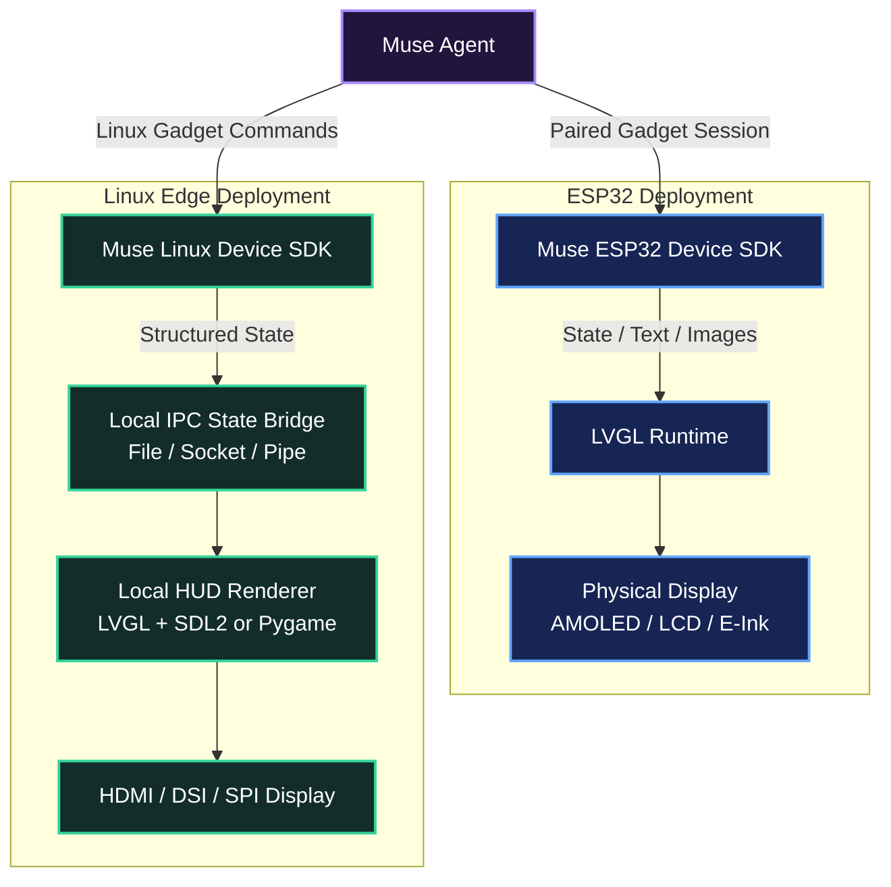
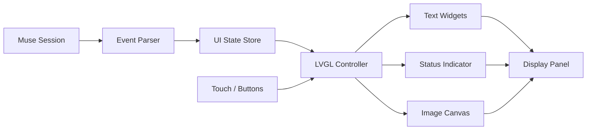
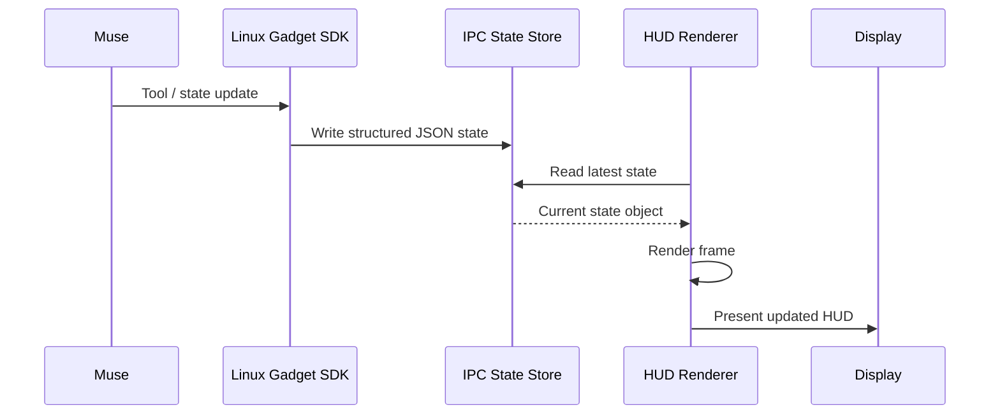
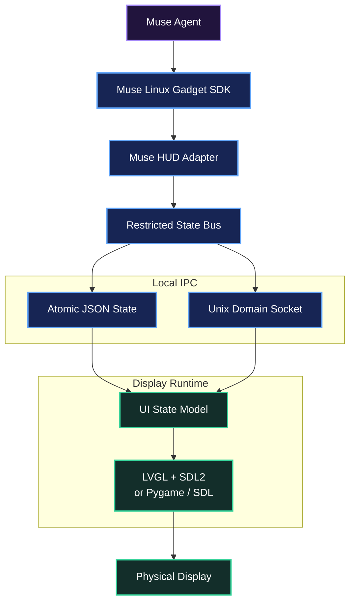

# Leveraging LVGL through Meta's `muse-gadget-sdk`

`Leveraging_LVGL_through_Metas_muse-gadget-sdk.md`

> **Design goal:** Treat the display as a decoupled state consumer for Muse. The agent produces structured state and events; the display layer consumes them independently, whether the target is an ESP32-class embedded gadget or a Linux edge host such as a Raspberry Pi 5.

---

## Table of Contents

1. [Architecture Overview](#architecture-overview)
2. [Choose Your Hardware Deployment Tier](#1-choose-your-hardware-deployment-tier)
3. [Dedicated ESP32 Device](#2-implementation-dedicated-esp32-device)
4. [Linux Edge Display Bridge](#3-implementation-linux-edge-display-bridge)
5. [Complete Display Bridge Service](#31-complete-display-bridge-service)
6. [State Payload Contract](#32-state-payload-contract)
7. [Operational Best Practices](#4-operational-best-practices)
8. [Recommended Deployment Topology](#5-recommended-deployment-topology)

---

# Architecture Overview

The cleanest architecture keeps **Muse's reasoning and command layer separate from the graphical display runtime**.

Muse produces structured state updates. The display device consumes those updates and renders them locally.



The important design principle is:

```text
Muse State
    ↓
Transport / Gadget SDK
    ↓
Local State Store
    ↓
Display Renderer
    ↓
Physical Screen
```

The renderer never needs to own Muse's reasoning loop. It only needs to know **what state should currently be displayed**.

---

# 1. Choose Your Hardware Deployment Tier

The Muse Gadget SDK supports two fundamentally different deployment styles.

| Tier | Best For | Typical Hardware | Display Strategy |
| --- | --- | --- | --- |
| **ESP32 Firmware (`esp32/`)** | Dedicated physical gadgets, desk companions, ambient HUDs, small touch displays | ESP32-S3, ESP32-C5, Waveshare displays, M5Stack devices, Seeed hardware | Native LVGL compiled into ESP-IDF firmware |
| **Linux SDK (`linux/`)** | High-resolution HUDs, Raspberry Pi displays, large dashboards, desktop overlays | Raspberry Pi 5, Linux SBCs, native Linux workstations | Separate local UI driven by the Linux SDK through IPC; LVGL + SDL2 or another lightweight renderer |

---

## 1.1 ESP32 Tier

Use the ESP32 route when the display itself is the gadget.

Typical characteristics:

- self-contained embedded firmware
- direct physical buttons or touch controls
- SPI, QSPI, RGB, or AMOLED display interface
- low idle power
- compact physical form factor
- LVGL running directly on the microcontroller
- optional PSRAM for image buffers and decoded assets

Example topology:

```text
Muse
  │
  ▼
Muse Gadget Session
  │
  ▼
ESP32-S3
  ├── Network Session
  ├── Gadget Event Handler
  ├── LVGL State Controller
  └── Display Driver
        │
        ▼
      AMOLED
```

---

## 1.2 Linux Tier

Use the Linux route when Muse should drive a richer edge-computing display.

Typical characteristics:

- Raspberry Pi or Linux workstation
- HDMI, DSI, SPI, or desktop window output
- large display resolution
- independent rendering process
- filesystem IPC
- Unix sockets
- local HTTP
- named pipes
- LVGL + SDL2
- Pygame / SDL
- OpenGL / ModernGL

Example topology:

```text
Muse
  │
  ▼
Muse Linux Gadget SDK
  │
  ▼
Structured IPC State
  │
  ├── state.json
  ├── Unix Socket
  └── Local Message Queue
        │
        ▼
Local Display Runtime
  │
  ▼
Physical HUD
```

---

# 2. Implementation: Dedicated ESP32 Device

When targeting an ESP32-class board, the board operates as the physical Muse gadget and maintains the gadget session over the network.

---

## 2.1 Obtain SDK Credentials

Provision the gadget through the Muse Gadget development flow.

The device requires its SDK credentials before pairing.

Keep credentials:

- outside source control
- outside public configuration files
- out of logs
- out of screenshots
- out of example payloads

Never commit gadget tokens to GitHub.

---

## 2.2 Enable Developer Mode

Enable Developer Mode in the Muse mobile application before pairing custom hardware.

The gadget can then be discovered and paired as a development device.

---

## 2.3 Configure the Board Overlay

Board-specific configuration belongs under:

```text
esp32/devices/
```

Select or create the appropriate `sdkconfig` overlay for the target hardware.

Typical configuration includes:

- ESP32 target family
- flash size
- PSRAM
- SPI / QSPI pins
- display controller
- touch controller
- buttons
- backlight GPIO
- audio hardware
- power-management settings
- LVGL memory configuration

Common display controller families include:

```text
ST7789
GC9A01
RM67162
```

---

## 2.4 LVGL State Model

The embedded UI should mirror Muse's operational state.

Recommended high-level states:

```text
IDLE
LISTENING
THINKING
DISPATCHING
ACTIVE
ERROR
OFFLINE
```

Represent the state independently from the widget implementation:

```c
typedef enum {
    MUSE_STATE_IDLE,
    MUSE_STATE_LISTENING,
    MUSE_STATE_THINKING,
    MUSE_STATE_DISPATCHING,
    MUSE_STATE_ACTIVE,
    MUSE_STATE_ERROR,
    MUSE_STATE_OFFLINE
} muse_ui_state_t;
```

Then let one UI function translate system state into LVGL presentation:

```c
void muse_ui_apply_state(muse_ui_state_t state);
```

This prevents transport logic from becoming tightly coupled to the display layout.

---

## 2.5 State Indicator

A status icon, ring, border, or animated glyph can reflect Muse's current state.

Example mapping:

| Muse State | Suggested Display Behavior |
| --- | --- |
| `IDLE` | muted static indicator |
| `LISTENING` | pulsing input ring |
| `THINKING` | animated amber / rotating indicator |
| `DISPATCHING` | directional data animation |
| `ACTIVE` | green or blue active state |
| `ERROR` | red diagnostic state |
| `OFFLINE` | dimmed / disconnected state |

---

## 2.6 Streaming Text into LVGL

Incoming text can be displayed in an `lv_label` object.

Example:

```c
lv_obj_t *message_label = lv_label_create(parent);

lv_obj_set_width(
    message_label,
    280
);

lv_label_set_long_mode(
    message_label,
    LV_LABEL_LONG_WRAP
);

lv_obj_set_style_text_align(
    message_label,
    LV_TEXT_ALIGN_LEFT,
    0
);

lv_label_set_text(
    message_label,
    "Waiting for Muse..."
);
```

Place the label inside a vertically scrollable container:

```c
lv_obj_set_scroll_dir(
    container,
    LV_DIR_VER
);

lv_obj_set_scrollbar_mode(
    container,
    LV_SCROLLBAR_MODE_AUTO
);
```

Incoming text chunks can update the label:

```c
lv_label_set_text(
    message_label,
    incoming_text
);
```

For longer streams, maintain the text in an application-side ring buffer rather than repeatedly concatenating unbounded strings inside LVGL.

---

## 2.7 Image Ingestion

For JPEG or PNG imagery, enable the required image decoders in the LVGL configuration.

Example:

```c
#define LV_USE_PNG 1
```

If the firmware configuration supports an SJPG decoder:

```c
#define LV_USE_SJPG 1
```

On ESP32 boards with external PSRAM, large image buffers should preferentially use external memory.

Example:

```c
void *image_buffer = heap_caps_malloc(
    image_size,
    MALLOC_CAP_SPIRAM
);
```

Always check allocation success:

```c
if (image_buffer == NULL) {
    // Handle allocation failure.
}
```

This prevents large decoded images from unnecessarily exhausting internal SRAM.

---

## 2.8 Recommended Embedded UI Architecture



---

# 3. Implementation: Linux Edge Display Bridge

The Linux deployment should treat Muse's device SDK as the **agent-side control layer**, while a separate display runtime owns the screen.

Instead of giving the renderer responsibility for agent execution, Muse writes structured state into a restricted IPC channel.

Possible transport mechanisms:

| IPC Method | Best Use |
| --- | --- |
| JSON state file | Simple persistent dashboard state |
| Unix domain socket | Low-latency local streaming |
| Named pipe | Simple event stream |
| localhost HTTP | Multi-process service architecture |
| Message queue | Higher-volume asynchronous telemetry |

A minimal implementation can use:

```text
/tmp/muse_gadget_hud/state.json
```

The display process watches or periodically reads this file.

---

## 3.1 Complete Display Bridge Service

File:

```text
muse_hud_bridge.py
```

The reference implementation below uses **Pygame / SDL** as a lightweight Linux renderer.

The same IPC state contract can later be connected to an LVGL + SDL2 frontend without changing Muse's state-producing layer.

```python
#!/usr/bin/env python3
"""
muse_hud_bridge.py

Local display HUD bridge for the Muse Linux Gadget SDK.

Monitors a restricted IPC inbox containing state written
by the Muse-side integration and renders live agent status,
streaming text, and current objective information.
"""

import sys
import time
import json

from pathlib import Path

import pygame


# ---------------------------------------------------------
# Configuration
# ---------------------------------------------------------

HUD_WIDTH = 800
HUD_HEIGHT = 480
FPS = 60

INBOX_DIR = Path(
    "/tmp/muse_gadget_hud"
)

STATE_FILE = (
    INBOX_DIR / "state.json"
)


# ---------------------------------------------------------
# Palette
# ---------------------------------------------------------

COLOR_BG = (
    15,
    17,
    23
)

COLOR_PANEL = (
    26,
    29,
    39
)

COLOR_TEXT_PRIMARY = (
    235,
    237,
    243
)

COLOR_TEXT_MUTED = (
    130,
    137,
    153
)

COLOR_ACCENT = (
    79,
    128,
    255
)

COLOR_THINKING = (
    245,
    158,
    11
)

COLOR_ACTIVE = (
    16,
    185,
    129
)

COLOR_ERROR = (
    239,
    68,
    68
)

COLOR_BORDER = (
    45,
    51,
    69
)


# ---------------------------------------------------------
# State Management
# ---------------------------------------------------------

def initialize_environment():
    """
    Ensure the IPC directory and initial
    state file exist.
    """

    INBOX_DIR.mkdir(
        parents=True,
        exist_ok=True
    )

    if not STATE_FILE.exists():

        initial_payload = {
            "status": "IDLE",
            "agent_name": "Muse Agent",
            "message":
                "Waiting for Muse session input...",
            "task": "Standby",
            "timestamp": time.time()
        }

        with open(
            STATE_FILE,
            "w",
            encoding="utf-8"
        ) as file:

            json.dump(
                initial_payload,
                file,
                indent=2
            )


def load_state():
    """
    Safely read the latest JSON state
    written by the Muse-side bridge.
    """

    try:

        if STATE_FILE.exists():

            with open(
                STATE_FILE,
                "r",
                encoding="utf-8"
            ) as file:

                return json.load(file)

    except (
        json.JSONDecodeError,
        IOError
    ):
        pass

    return None


# ---------------------------------------------------------
# Text Wrapping
# ---------------------------------------------------------

def wrap_text(
    text,
    font,
    max_width
):

    words = text.split(" ")

    lines = []
    current_line = []

    for word in words:

        test_line = " ".join(
            current_line + [word]
        )

        if (
            font.size(test_line)[0]
            < max_width
        ):

            current_line.append(
                word
            )

        else:

            if current_line:
                lines.append(
                    " ".join(
                        current_line
                    )
                )

            current_line = [
                word
            ]

    if current_line:

        lines.append(
            " ".join(
                current_line
            )
        )

    return lines


# ---------------------------------------------------------
# Status Presentation
# ---------------------------------------------------------

def get_status_color(
    status
):

    normalized = status.upper()

    if normalized in (
        "ACTIVE",
        "LISTENING",
        "DISPATCHING"
    ):
        return COLOR_ACTIVE

    if normalized == "THINKING":
        return COLOR_THINKING

    if normalized == "ERROR":
        return COLOR_ERROR

    return COLOR_TEXT_MUTED


# ---------------------------------------------------------
# HUD Rendering
# ---------------------------------------------------------

def draw_hud(
    screen,
    fonts,
    state
):
    """
    Render the complete 2D HUD interface.
    """

    screen.fill(
        COLOR_BG
    )

    font_large, font_med, font_small = fonts

    # -----------------------------------------------------
    # Header Bar
    # -----------------------------------------------------

    pygame.draw.rect(
        screen,
        COLOR_PANEL,
        (
            0,
            0,
            HUD_WIDTH,
            60
        )
    )

    pygame.draw.line(
        screen,
        COLOR_BORDER,
        (
            0,
            60
        ),
        (
            HUD_WIDTH,
            60
        ),
        2
    )

    title_surf = (
        font_large.render(
            state.get(
                "agent_name",
                "Muse Agent"
            ),
            True,
            COLOR_TEXT_PRIMARY
        )
    )

    screen.blit(
        title_surf,
        (
            20,
            15
        )
    )

    # -----------------------------------------------------
    # Agent Status Indicator
    # -----------------------------------------------------

    status = state.get(
        "status",
        "IDLE"
    ).upper()

    status_color = (
        get_status_color(
            status
        )
    )

    pygame.draw.circle(
        screen,
        status_color,
        (
            HUD_WIDTH - 120,
            30
        ),
        8
    )

    status_surf = (
        font_small.render(
            status,
            True,
            status_color
        )
    )

    screen.blit(
        status_surf,
        (
            HUD_WIDTH - 100,
            20
        )
    )

    # -----------------------------------------------------
    # Main Content Panel
    # -----------------------------------------------------

    content_rect = pygame.Rect(
        20,
        80,
        HUD_WIDTH - 40,
        280
    )

    pygame.draw.rect(
        screen,
        COLOR_PANEL,
        content_rect,
        border_radius=8
    )

    pygame.draw.rect(
        screen,
        COLOR_BORDER,
        content_rect,
        width=1,
        border_radius=8
    )

    label_surf = (
        font_small.render(
            "LIVE OUTPUT / REASONING STREAM",
            True,
            COLOR_ACCENT
        )
    )

    screen.blit(
        label_surf,
        (
            35,
            95
        )
    )

    raw_message = state.get(
        "message",
        ""
    )

    lines = wrap_text(
        raw_message,
        font_med,
        HUD_WIDTH - 80
    )

    y_text = 130

    for line in lines[:6]:

        line_surf = (
            font_med.render(
                line,
                True,
                COLOR_TEXT_PRIMARY
            )
        )

        screen.blit(
            line_surf,
            (
                35,
                y_text
            )
        )

        y_text += 28

    # -----------------------------------------------------
    # Footer / Current Objective
    # -----------------------------------------------------

    footer_rect = pygame.Rect(
        20,
        380,
        HUD_WIDTH - 40,
        80
    )

    pygame.draw.rect(
        screen,
        COLOR_PANEL,
        footer_rect,
        border_radius=8
    )

    pygame.draw.rect(
        screen,
        COLOR_BORDER,
        footer_rect,
        width=1,
        border_radius=8
    )

    task_label = (
        font_small.render(
            "CURRENT OBJECTIVE",
            True,
            COLOR_TEXT_MUTED
        )
    )

    screen.blit(
        task_label,
        (
            35,
            395
        )
    )

    current_task = state.get(
        "task",
        "None"
    )

    task_surf = (
        font_med.render(
            current_task,
            True,
            COLOR_TEXT_PRIMARY
        )
    )

    screen.blit(
        task_surf,
        (
            35,
            420
        )
    )


# ---------------------------------------------------------
# Primary Runtime
# ---------------------------------------------------------

def main():

    initialize_environment()

    pygame.init()

    pygame.display.set_caption(
        "Muse Gadget Display HUD"
    )

    screen = pygame.display.set_mode(
        (
            HUD_WIDTH,
            HUD_HEIGHT
        )
    )

    clock = pygame.time.Clock()

    font_large = pygame.font.SysFont(
        "DejaVu Sans, Arial, Helvetica",
        24,
        bold=True
    )

    font_med = pygame.font.SysFont(
        "DejaVu Sans, Arial, Helvetica",
        18
    )

    font_small = pygame.font.SysFont(
        "DejaVu Sans, Arial, Helvetica",
        14,
        bold=True
    )

    fonts = (
        font_large,
        font_med,
        font_small
    )

    current_state = (
        load_state()
        or {
            "status": "IDLE",
            "agent_name": "Muse Agent",
            "message":
                "Waiting for state...",
            "task": "Standby"
        }
    )

    last_check = 0.0

    running = True

    while running:

        for event in pygame.event.get():

            if event.type == pygame.QUIT:
                running = False

            elif (
                event.type
                == pygame.KEYDOWN
                and event.key
                == pygame.K_ESCAPE
            ):
                running = False

        # Reload state every 100 ms.
        now = time.time()

        if (
            now - last_check
            > 0.1
        ):

            updated = load_state()

            if updated:
                current_state = updated

            last_check = now

        draw_hud(
            screen,
            fonts,
            current_state
        )

        pygame.display.flip()

        clock.tick(
            FPS
        )

    pygame.quit()

    sys.exit(0)


if __name__ == "__main__":
    main()
```

---

## 3.2 State Payload Contract

Muse only needs to write a small structured state object.

Example:

```json
{
  "status": "THINKING",
  "agent_name": "Muse Agent",
  "message": "Analyzing the current telemetry stream and preparing the next action.",
  "task": "Evaluate sensor state",
  "timestamp": 1791349200.0
}
```

The display renderer reads this state without needing access to Muse's internal reasoning architecture.

---

## 3.3 State Flow



---

## 3.4 Example State Writer

A minimal external process can safely update the display state.

```python
#!/usr/bin/env python3

import json
import time

from pathlib import Path

STATE_FILE = Path(
    "/tmp/muse_gadget_hud/state.json"
)

payload = {
    "status": "ACTIVE",
    "agent_name": "Muse Agent",
    "message":
        "Display bridge synchronized.",
    "task":
        "Monitor active session",
    "timestamp":
        time.time()
}

STATE_FILE.parent.mkdir(
    parents=True,
    exist_ok=True
)

temporary_file = STATE_FILE.with_suffix(
    ".tmp"
)

with open(
    temporary_file,
    "w",
    encoding="utf-8"
) as file:

    json.dump(
        payload,
        file,
        indent=2
    )

temporary_file.replace(
    STATE_FILE
)
```

The temporary-file replacement pattern prevents the renderer from reading a partially written JSON document.

---

# 4. Operational Best Practices

## 4.1 Constrain Linux Permissions

The Linux gadget daemon should not need unrestricted access to the entire machine.

Create a dedicated unprivileged service account:

```bash
sudo adduser \
  --system \
  --group \
  musegadget
```

Create the HUD IPC directory:

```bash
sudo mkdir -p \
  /tmp/muse_gadget_hud
```

Assign ownership:

```bash
sudo chown \
  musegadget:musegadget \
  /tmp/muse_gadget_hud
```

Restrict access:

```bash
sudo chmod \
  750 \
  /tmp/muse_gadget_hud
```

The display architecture should follow the principle:

```text
Muse Gadget Service
        │
        │ only required permissions
        ▼
Restricted IPC Directory
        │
        ▼
Display Renderer
```

Avoid running the gadget bridge as `root` unless a specific hardware operation genuinely requires elevated privileges.

---

## 4.2 Separate Command Execution from Display State

Do not treat display messages as shell commands.

Bad architecture:

```text
Muse Message
   ↓
Display Process
   ↓
shell=True
```

Preferred architecture:

```text
Muse
  ↓
Validated Gadget Command Layer
  ↓
Structured State Object
  ↓
Display Process
```

The renderer should consume data such as:

```json
{
  "status": "ACTIVE",
  "message": "Task complete.",
  "task": "System health check"
}
```

not arbitrary executable command strings.

---

## 4.3 Use Atomic State Updates

A renderer polling a file can encounter corrupted JSON if another process overwrites that file while it is being read.

Prefer:

```text
state.tmp
   ↓
complete write
   ↓
atomic rename
   ↓
state.json
```

rather than writing directly into `state.json`.

---

## 4.4 LVGL Double Buffering

For embedded displays, LVGL performance improves when rendering can proceed while the previous buffer is transferred to the panel.

A practical partial-framebuffer target is approximately:

```math
B_{\mathrm{pixels}}
=
\frac{W \times H}{10}
```

where:

- $W$ = display width
- $H$ = display height
- $B_{\mathrm{pixels}}$ = pixels in one partial draw buffer

For a 16-bit RGB565 framebuffer:

```math
B_{\mathrm{bytes}}
=
B_{\mathrm{pixels}}
\times 2
```

Two buffers require approximately:

```math
B_{\mathrm{double}}
=
2B_{\mathrm{bytes}}
```

Example for a `320 × 240` display:

```math
B_{\mathrm{pixels}}
=
\frac{320 \times 240}{10}
=
7680
```

At two bytes per RGB565 pixel:

```math
B_{\mathrm{bytes}}
=
7680 \times 2
=
15360
```

For two buffers:

```math
B_{\mathrm{double}}
=
30720
```

or approximately:

```text
30 KB
```

Large images and decoded assets can remain in PSRAM while latency-sensitive rendering buffers use the fastest memory available for the target board.

---

## 4.5 Keep Message Envelopes Concise

The HUD should receive **state**, not giant conversation transcripts.

Prefer:

```json
{
  "status": "THINKING",
  "message": "Evaluating local weather sensors.",
  "task": "Environmental analysis"
}
```

instead of shipping unnecessary internal history.

For large outputs:

```text
Large Muse Output
      │
      ▼
State Summarizer / Adapter
      │
      ├── current status
      ├── visible message
      ├── current task
      └── optional telemetry
             │
             ▼
           HUD
```

---

## 4.6 Bound the Text Buffer

Never allow an embedded UI label to grow indefinitely.

Recommended policy:

```text
Incoming Text
     │
     ▼
Ring Buffer
     │
     ├── retain newest N characters
     └── discard oldest overflow
             │
             ▼
          LVGL Label
```

Example conceptual limit:

```text
4 KB - 16 KB visible text history
```

depending on available memory and device class.

---

## 4.7 Separate Static Assets from Dynamic State

Static assets:

```text
fonts/
icons/
backgrounds/
frames/
symbols/
```

Dynamic state:

```text
status
message
task
image reference
telemetry
timestamp
```

Do not retransmit unchanged graphics with every state update.

---

## 4.8 Rate-Limit UI Updates

Muse may emit state faster than the physical display needs to redraw.

Example policy:

| Data Type | Suggested Update Behavior |
| --- | --- |
| Status changes | Immediate |
| New text tokens | Batch every 50-150 ms |
| Sensor values | 5-20 Hz |
| Full image update | On change |
| E-Ink refresh | Aggressively throttled |
| Animated LCD / AMOLED UI | 30-60 FPS render loop |

The **render loop** and **state update frequency** do not need to be identical.

---

# 5. Recommended Deployment Topology

For a larger Muse-powered Raspberry Pi display, the most maintainable topology is:



---

## 5.1 Why This Architecture Works

The separation creates four clean responsibilities.

### Muse

Responsible for:

- reasoning
- dialogue
- tool use
- deciding what information matters

### Gadget SDK

Responsible for:

- Muse connectivity
- gadget pairing
- command integration
- communication with the agent ecosystem

### State Bridge

Responsible for:

- validating display payloads
- reducing state to what the HUD needs
- writing state atomically
- isolating the GUI from agent execution

### Display Runtime

Responsible for:

- LVGL widgets
- Pygame / SDL widgets
- animation
- text wrapping
- image presentation
- hardware-specific display behavior

---

# 6. Suggested State Schema

A more extensible HUD contract can use the following structure:

```json
{
  "version": "1.0.0",
  "timestamp": 1791349200.0,
  "agent": {
    "name": "Muse Agent",
    "status": "THINKING"
  },
  "display": {
    "mode": "standard",
    "message": "Analyzing the requested task.",
    "task": "System analysis",
    "accent": "thinking"
  },
  "telemetry": {
    "cpu_percent": null,
    "temperature_c": null,
    "network_state": "connected"
  },
  "media": {
    "image": null,
    "icon": "thought"
  }
}
```

This leaves room for future widgets without forcing the renderer to understand Muse's internal implementation.

---

# 7. Recommended Project Layout

```text
muse-hud/
├── README.md
├── config/
│   └── hud.json
├── bridge/
│   ├── __init__.py
│   ├── muse_state_adapter.py
│   └── state_writer.py
├── renderer/
│   ├── __init__.py
│   ├── muse_hud_bridge.py
│   ├── widgets/
│   │   ├── status.py
│   │   ├── message.py
│   │   ├── objective.py
│   │   └── telemetry.py
│   └── assets/
│       ├── fonts/
│       ├── icons/
│       └── backgrounds/
├── protocol/
│   ├── __init__.py
│   └── state_schema.json
├── deploy/
│   ├── muse-hud.service
│   └── install.sh
└── examples/
    ├── idle.json
    ├── thinking.json
    ├── active.json
    └── error.json
```

---

# 8. Implementation Checklist

## ESP32 / LVGL

- [ ] Select target ESP32 board.
- [ ] Configure board overlay.
- [ ] Enable display controller.
- [ ] Configure PSRAM where available.
- [ ] Initialize LVGL.
- [ ] Create status state machine.
- [ ] Create streaming text widget.
- [ ] Create scrollable message container.
- [ ] Configure image decoder support.
- [ ] Allocate large image assets outside critical internal RAM where appropriate.
- [ ] Add bounded text buffering.
- [ ] Add connection-loss state.
- [ ] Add error state.
- [ ] Test redraw performance.
- [ ] Test memory pressure.
- [ ] Test reconnection behavior.

## Linux / Raspberry Pi

- [ ] Install Muse Linux Gadget SDK.
- [ ] Create restricted service user.
- [ ] Create `/tmp/muse_gadget_hud/`.
- [ ] Define JSON state schema.
- [ ] Add atomic state writer.
- [ ] Install display runtime.
- [ ] Add LVGL + SDL2 or Pygame frontend.
- [ ] Add local state polling or socket listener.
- [ ] Add text wrapping.
- [ ] Add agent-state indicator.
- [ ] Add current-objective panel.
- [ ] Add optional telemetry widgets.
- [ ] Create `systemd` service.
- [ ] Start display automatically on boot.
- [ ] Add process restart policy.
- [ ] Test Muse disconnect / reconnect behavior.

---

# 9. Final Design Principle

The display should remain a **physical manifestation of Muse's current state**, not another copy of the agent itself.

```text
                 MUSE
                   │
          intent / state / events
                   │
                   ▼
          ┌──────────────────┐
          │ Gadget SDK Layer │
          └────────┬─────────┘
                   │
             structured state
                   │
                   ▼
          ┌──────────────────┐
          │ Local State Bus  │
          └────────┬─────────┘
                   │
                   ▼
          ┌──────────────────┐
          │   LVGL / SDL UI  │
          └────────┬─────────┘
                   │
                   ▼
              PHYSICAL HUD
```

This keeps the architecture modular:

**Muse thinks. The SDK connects. The bridge translates. LVGL renders. The display becomes the visible edge of the agent.**
