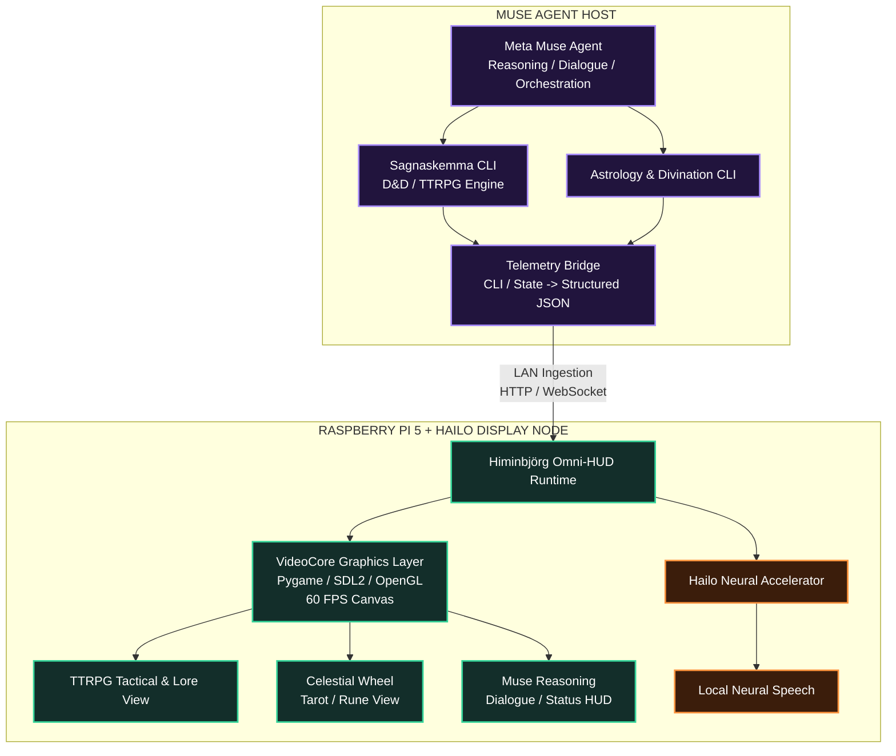
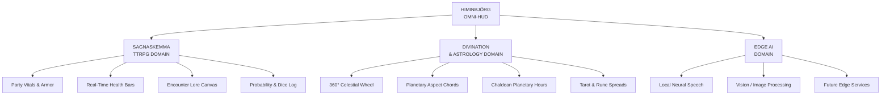
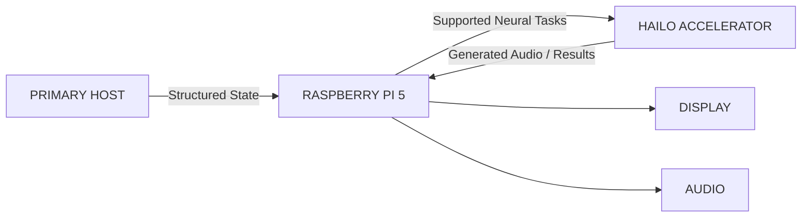
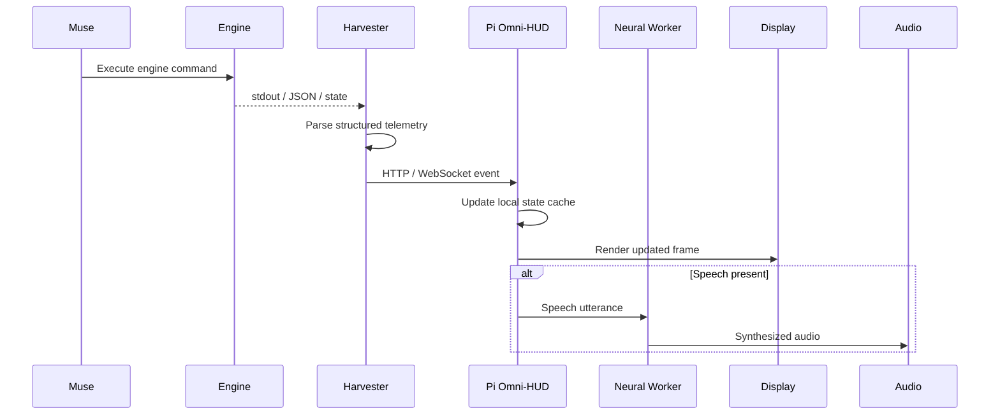
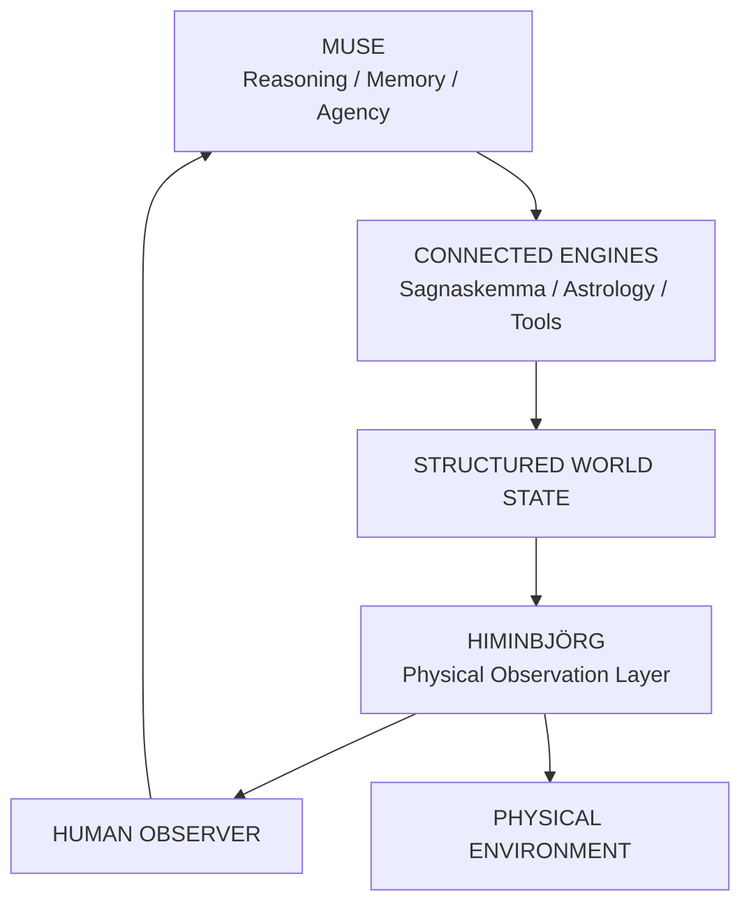

# Project Himinbjörg: The Omni-HUD
## System Overview & Vision Manifesto

`PROJECT_HIMINBJORG_THE_OMNI-HUD_SYSTEM_OVERVIEW_VISION_MANIFESTO.md`

> **Project Himinbjörg** is a dedicated physical observation terminal for Meta Muse: a real-time visual companion, telemetry dashboard, TTRPG command display, divination interface, and edge-AI presentation system built around a Raspberry Pi 5 and Hailo neural accelerator.

---

## Table of Contents

1. [Executive Summary](#1-executive-summary)
2. [Problem Statement & User Objectives](#2-problem-statement--user-objectives)
3. [Core Functional Domains](#3-core-functional-domains)
4. [Hardware Architecture & Compute Matrix](#4-hardware-architecture--compute-matrix)
5. [Software Ecosystem & Information Flow](#5-software-ecosystem--information-flow)
6. [Visual Layout & UX Design Standards](#6-visual-layout--ux-design-standards)
7. [Strategic Value for Autonomous AI Coding Agents](#7-strategic-value-for-autonomous-ai-coding-agents)
8. [Project Vision](#8-project-vision)

---

# 1. Executive Summary

**Project Himinbjörg**, also known as **The Omni-HUD**, is a dedicated real-time visual companion terminal and telemetry dashboard designed for the Meta Muse AI agent.

Rather than relegating Muse to a headless terminal window or conventional text chat, Himinbjörg separates **agent reasoning and computation** from **visual representation and physical presence**.

Muse performs her primary reasoning, orchestration, dialogue, and high-level engine execution on her host computer. Structured telemetry is then transmitted across the local network to a dedicated **Raspberry Pi 5 with 16 GB RAM**, paired with a **Hailo neural accelerator**.

The Raspberry Pi functions as an ambient physical observation console that renders high-fidelity visual interfaces, tactical data, interactive symbolic systems, and live Muse state across three primary domains.

### ⚔️ Tabletop Roleplaying

Driven by **Sagnaskemma**:

- live combat tracking
- party health and Armor Class
- encounter state
- world and location lore
- dice-roll telemetry
- probability information
- AI and player action resolution

### ✦ Astrology & Divination

Driven by the **Astrology & Divination Engine**:

- real-time celestial wheel projection
- planetary transit matrices
- planetary aspects
- Chaldean planetary hours
- Tarot spreads
- Elder Futhark rune presentation
- symbolic interpretation displays

### ⚡ Local Edge Intelligence

The edge node can provide local neural services such as:

- neural speech synthesis
- local audio generation
- supported image-processing workloads
- future perception or embedding services
- low-latency auxiliary AI operations

---

## 1.1 High-Level Architecture



---

# 2. Problem Statement & User Objectives

## 2.1 The Problem

### Headless Isolation

Advanced command-line systems such as Sagnaskemma and the astrology engine generate rich:

- narrative information
- mathematical information
- symbolic information
- spatial relationships
- state changes
- world data
- probability data

When an AI agent executes these systems headlessly, much of that richness collapses into terminal output or summarized text.

This removes much of the:

- visual context
- atmosphere
- spatial comprehension
- immediate readability
- ambient awareness
- sense of an actively operating system

Himinbjörg restores that missing visual layer.

---

### Host Resource Contention

Running all functions on Muse's main host can create competition between:

- agent reasoning
- local model inference
- graphics compositing
- speech synthesis
- UI rendering
- data ingestion
- auxiliary services

The goal is to move presentation and supported edge workloads onto a dedicated physical node.

```text
MUSE HOST
├── Reasoning
├── Dialogue
├── Agent Orchestration
├── Sagnaskemma
├── Astrology / Divination
└── High-Level Planning

EDGE NODE
├── Display Rendering
├── Telemetry State
├── Visual Composition
├── Local Speech
└── Auxiliary Edge AI
```

---

## 2.2 The Objective

Project Himinbjörg is intended to:

- Build an **ambient physical HUD** that remains active in the workspace as a dedicated companion window.
- Allow Muse to push visual updates whenever she:
  - rolls dice
  - resolves combat
  - consults lore
  - changes world state
  - calculates an astrological chart
  - calculates planetary hours
  - draws Tarot cards
  - performs runic divination
  - speaks
  - changes operational state
- Provide an immediately readable visual experience using:
  - deep blue
  - violet
  - gold
  - cyan
  - black
  - dark slate
  - luminous runic and celestial imagery
- Use the Raspberry Pi as the graphics, networking, and state-processing layer.
- Use the Hailo accelerator for supported local neural inference workloads.
- Keep Muse's host machine focused primarily on **thinking, orchestration, and high-level execution**.

---

# 3. Core Functional Domains



---

## 3.1 Domain A: Sagnaskemma TTRPG Engine

### Party Manifest

Persistent tracking of player and companion character cards.

Example data:

```text
Volmarr
Skald 5

HP: 48 / 48
AC: 16
Status: Ready
```

Each character panel can display:

- name
- class
- level
- current HP
- maximum HP
- Armor Class
- status conditions
- buffs
- debuffs
- temporary effects

---

### Encounter & World Lore

An auto-updating narrative canvas displays:

- atmospheric descriptions
- environmental hazards
- room descriptions
- terrain
- location names
- ancient inscriptions
- discovered lore
- encounter states
- important environmental objects

Example:

```text
BARROW-MOUND ENTRANCE

Ancient stone lintels stand against the gale.

Blue-white runes pulse beneath frost along the doorway.

The western passage remains sealed.

A low vibration can be felt through the stone floor.
```

---

### Dice Telemetry & Resolution

The HUD maintains a visible roll log containing:

- roller
- die expression
- modifiers
- Difficulty Class
- advantage
- disadvantage
- final total
- success or failure
- associated skill or action

Example:

```text
[Volmarr]
Arcana / Runic Deciphering
1d20 + 7 = 24
SUCCESS
```

---

## 3.2 Domain B: Astrology & Divination Engine

### Mathematical Celestial Wheel

The celestial interface presents a full:

```text
360° radial astrological chart
```

using planetary coordinates generated by the astrology engine.

The Ascendant is placed at the traditional 9 o'clock horizon.

```math
\theta_{\mathrm{ASC}} = 180^\circ
```

Planetary longitudes are then rotated relative to the Ascendant.

```math
\Delta\lambda =
(\lambda - \lambda_{\mathrm{ASC}})
\bmod 360^\circ
```

Screen angle:

```math
\theta =
(180^\circ - \Delta\lambda)
\bmod 360^\circ
```

The system can plot:

- Sun ☉
- Moon ☽
- Mercury ☿
- Venus ♀
- Mars ♂
- Jupiter ♃
- Saturn ♄
- additional celestial objects as required

---

### Geometric Aspect Matrix

Aspect lines connect celestial bodies across the wheel.

#### Trine

```math
|\delta - 120^\circ|
\le
4^\circ
```

Rendered in **Astral Blue**.

```text
#4086F4
```

#### Square

```math
|\delta - 90^\circ|
\le
4^\circ
```

Rendered in **Peril Red**.

```text
#EF4444
```

#### Opposition

```math
|\delta - 180^\circ|
\le
4^\circ
```

Rendered in **Mystic Purple**.

```text
#A855F7
```

---

### Tarot & Runic Spreads

The Omni-HUD supports modular symbolic-card layouts.

Possible spread structures include:

```text
Past / Present / Future
```

```text
Origin / Threshold / Outcome
```

```text
Situation / Challenge / Resolution
```

Each card can display:

- title
- artwork
- upright or reversed state
- elemental association
- planetary association
- symbolic keywords
- Elder Futhark rune
- interpretation
- relationship to adjacent cards

Example:

```text
┌────────────────────────┐
│    THE HIEROPHANT      │
│       UPRIGHT          │
│                        │
│          ᚨ             │
│                        │
│ Ancestral Lore         │
│ Inner Tradition        │
└────────────────────────┘
```

---

### Planetary Hours

The system computes Chaldean planetary hours using local sunrise and sunset.

Day duration:

```math
D_{\mathrm{day}}
=
T_{\mathrm{set}}
-
T_{\mathrm{rise}}
```

Length of each diurnal planetary hour:

```math
\tau_{\mathrm{day}}
=
\frac{D_{\mathrm{day}}}{12}
```

Night duration:

```math
D_{\mathrm{night}}
=
24
-
D_{\mathrm{day}}
```

Length of each nocturnal planetary hour:

```math
\tau_{\mathrm{night}}
=
\frac{D_{\mathrm{night}}}{12}
```

Chaldean sequence:

```text
Saturn -> Jupiter -> Mars -> Sun -> Venus -> Mercury -> Moon
```

---

# 4. Hardware Architecture & Compute Matrix

| Hardware Component | Hardware Profile | Assigned Subsystem Role |
| --- | --- | --- |
| **Primary Host Machine** | High-compute workstation | **Muse Agent Brain:** Runs Meta Muse, orchestration scripts, local models, Sagnaskemma, astrology calculations, and high-level agent processes. Dispatches structured telemetry over LAN. |
| **Raspberry Pi 5** | Quad-core ARM Cortex-A76 CPU, 16 GB system memory, VideoCore VII GPU | **Compositor & Edge Server:** Runs Linux, HTTP/WebSocket ingestion, local state cache, Pygame/SDL2 or OpenGL renderer, UI logic, and physical display output. |
| **Hailo Neural Accelerator** | Dedicated neural-processing hardware connected over PCIe | **Edge Neural Services:** Executes supported neural workloads independently of Muse's host-side reasoning environment. |
| **Display** | HDMI, DSI, SPI, or other Pi-compatible display | **Physical Observation Surface:** Presents Himinbjörg's persistent HUD. |
| **Audio Output** | USB, HDMI, DAC, Bluetooth, or analog audio device | **Muse Voice Output:** Plays locally synthesized speech. |

---

## 4.1 Compute Responsibility Model



### Host Responsibilities

```text
Muse reasoning
Agent orchestration
LLM inference
Sagnaskemma
Astrology calculations
Divination logic
Tool execution
High-level planning
```

### Raspberry Pi Responsibilities

```text
Telemetry ingestion
State caching
Pygame / SDL rendering
OpenGL composition
Input handling
Display management
Local networking
Audio routing
```

### Neural Accelerator Responsibilities

```text
Supported compiled inference graphs
Speech synthesis
Embedding models
Image-processing models
Future edge neural workloads
```

---

# 5. Software Ecosystem & Information Flow

## 5.1 Runtime Pipeline

```text
1. Sagnaskemma / Astrology CLI
        │
        ▼
2. Headless execution triggered by Muse
        │
        ▼
3. muse_telemetry_harvester.py
        │
        ├── Parse stdout
        ├── Parse JSON
        ├── Extract dice data
        ├── Extract party state
        ├── Extract celestial coordinates
        └── Extract card state
        │
        ▼
4. Omni-HUD JSON Envelope
        │
        ▼
5. HTTP / WebSocket LAN Transport
        │
        ├── HTTP :8080
        └── WebSocket :8765
        │
        ▼
6. omni_hud_display_node.py
        │
        ├── State cache
        ├── TTRPG canvas
        ├── Divination canvas
        ├── Muse state
        └── Speech dispatch
        │
        ▼
7. Hailo Neural Worker
        │
        ▼
8. Local Audio / Display Hardware
```

---

## 5.2 Runtime Flow Diagram



---

## 5.3 Trigger

Muse executes an operation in:

- Sagnaskemma
- astrology-engine
- Tarot engine
- rune engine
- another future integrated subsystem

---

## 5.4 Harvesting

A lightweight wrapper captures output and extracts structured data such as:

```text
dice rolls
party vitals
encounter state
lore
planetary coordinates
planetary hours
card pulls
rune pulls
Muse speech
Muse operational state
```

The output is normalized into a unified Omni-HUD event envelope.

---

## 5.5 Transport

Example endpoint:

```text
http://<PI_IP>:8080/api/event
```

Possible transport methods:

```text
HTTP POST
WebSocket
Binary WebSocket
Unix socket for local services
```

---

## 5.6 Compositing

The Raspberry Pi receives each event and updates a mutex-protected internal state model.

Incoming event types determine the active view.

```text
ttrpg.*
    ↓
SAGNASKEMMA VIEW
```

```text
divination.*
    ↓
DIVINATION VIEW
```

```text
agent.*
    ↓
MUSE STATUS / SPEECH OVERLAY
```

---

## 5.7 Speech Offload

Muse dialogue intended for audible playback can be forwarded to the local neural worker.

```text
Muse Speech Text
      │
      ▼
Omni-HUD
      │
      ▼
Neural Worker
      │
      ▼
PCM Audio
      │
      ▼
Local Speakers
```

This allows Muse's visible and audible presence to originate from the physical Himinbjörg terminal itself.

---

# 6. Visual Layout & UX Design Standards

## 6.1 Example TTRPG View

```text
┌──────────────────────────────────────────────────────────────────────────────┐
│ ● ONLINE   HIMINBJÖRG OMNI-HUD :: SAGNASKEMMA TTRPG       MODE: TAB / 1 / 2 │
├───────────────────────────────────┬──────────────────────────────────────────┤
│ PARTY ROSTER                      │ LOCATION: BARROW-MOUND ENTRANCE          │
│                                   │                                          │
│ ┌───────────────────────────────┐ │ ┌──────────────────────────────────────┐ │
│ │ Volmarr               AC 16   │ │ │ Ancient stone lintels stand        │ │
│ │ Skald 5                       │ │ │ against the gale. Glowing runes    │ │
│ │ ████████████████████ 48/48 HP │ │ │ hum with cold phosphorescence.     │ │
│ └───────────────────────────────┘ │ └──────────────────────────────────────┘ │
│                                   │                                          │
│ ┌───────────────────────────────┐ │ DICE RESOLUTIONS                         │
│ │ Astrid                AC 18   │ │                                          │
│ │ Shieldmaiden                  │ │ • Volmarr                               │
│ │ █████████████████░░░ 46/52 HP │ │   Arcana: 1d20 + 7 = 24                │
│ └───────────────────────────────┘ │   SUCCESS                                │
├───────────────────────────────────┴──────────────────────────────────────────┤
│ MUSE NARRATIVE & SPEECH STREAM                                              │
│                                                                              │
│ "The ancient runes yield to your song, Volmarr. The seal is broken."        │
└──────────────────────────────────────────────────────────────────────────────┘
```

---

## 6.2 Example Divination View

```text
┌──────────────────────────────────────────────────────────────────────────────┐
│ ● ONLINE   HIMINBJÖRG :: DIVINATION & SIDEREAL MATRIX       MARS HOUR ACTIVE │
├───────────────────────────────────┬──────────────────────────────────────────┤
│                                   │ TAROT / RUNE SPREAD                      │
│             ♃                     │                                          │
│        ┌─────────────┐            │ ┌─────────┐ ┌─────────┐ ┌─────────┐      │
│    ☽   │             │   ☉        │ │ CARD I  │ │ CARD II │ │CARD III │      │
│        │ CELESTIAL   │            │ │         │ │         │ │         │      │
│        │    WHEEL    │            │ │    ᚨ    │ │    ᚱ    │ │    ᛟ    │      │
│    ♂   │             │   ♄        │ │         │ │         │ │         │      │
│        └─────────────┘            │ └─────────┘ └─────────┘ └─────────┘      │
│                                   │                                          │
│ ASC: 195.4°                       │ ORIGIN      THRESHOLD      OUTCOME        │
├───────────────────────────────────┴──────────────────────────────────────────┤
│ MUSE OBSERVATION                                                            │
│                                                                              │
│ "The current configuration forms a strong harmonic pattern."                │
└──────────────────────────────────────────────────────────────────────────────┘
```

---

## 6.3 Color System

### Canvas

| Element | Color | Hex |
| --- | --- | --- |
| Void Black | Background | `#0A0C12` |
| Dark Slate | Panels | `#121621` |
| Border Slate | Borders | `#283046` |
| Primary Text | Light text | `#F0F3FA` |
| Secondary Text | Muted text | `#919BAF` |

### TTRPG Palette

| Meaning | Color | Hex |
| --- | --- | --- |
| Tactical / Primary | Steel Blue | `#4086F4` |
| Health / Success | Vitality Green | `#22C55E` |
| Danger / Failure | Peril Red | `#EF4444` |
| Important Object | Gold | `#E6B422` |

### Divination Palette

| Meaning | Color | Hex |
| --- | --- | --- |
| Mystical / Primary | Twilight Purple | `#A855F7` |
| Sacred / Highlight | Mystic Gold | `#E6B422` |
| Celestial | Astral Cyan | `#38BDF8` |
| Aspect / Harmonic | Astral Blue | `#4086F4` |

---

## 6.4 Typography

Primary font style:

```text
DejaVu Sans
Arial
other highly legible sans-serif fallback
```

The type system should support full UTF-8 glyph rendering.

### Planetary Glyphs

```text
☉ ☽ ☿ ♀ ♂ ♃ ♄
```

### Elder Futhark Glyphs

```text
ᚠ ᚢ ᚦ ᚨ ᚱ ᚲ ᚷ ᚹ
ᚺ ᚾ ᛁ ᛃ ᛇ ᛈ ᛉ ᛊ
ᛏ ᛒ ᛖ ᛗ ᛚ ᛜ ᛞ ᛟ
```

---

## 6.5 Dynamic Viewport Switching

### Automatic Switching

Incoming TTRPG telemetry:

```text
ttrpg.*
```

automatically activates:

```text
SAGNASKEMMA TTRPG VIEW
```

Incoming divination telemetry:

```text
divination.*
```

automatically activates:

```text
DIVINATION / ORACLE VIEW
```

---

### Manual Overrides

| Key | Action |
| --- | --- |
| `TAB` | Toggle between major views |
| `1` | Force Divination view |
| `2` | Force TTRPG view |
| `ESC` | Exit |
| `Q` | Exit |

---

## 6.6 Display Design Principles

The interface should prioritize:

- high information density without clutter
- clear visual hierarchy
- dark-room readability
- large status indicators
- strong color semantics
- minimal window chrome
- immediate identification of active mode
- smooth transitions
- persistent Muse presence
- visually distinct TTRPG and divination modes

The interface should feel less like a conventional desktop application and more like a **dedicated observation instrument**.

---

# 7. Strategic Value for Autonomous AI Coding Agents

Project Himinbjörg is intentionally structured to be easy for autonomous coding systems to understand, modify, test, and extend.

---

## 7.1 Clear Modular Boundaries

Major responsibilities remain separated.

```text
Host Engine
    │
    ▼
Harvester
    │
    ▼
Transport
    │
    ▼
State Model
    │
    ▼
Renderer
    │
    ├── TTRPG View
    ├── Divination View
    └── Muse View
    │
    ▼
Neural Worker
```

This allows an AI coding agent to modify one subsystem without rewriting the entire stack.

---

## 7.2 Deterministic Data Schemas

Communication between Muse and Himinbjörg uses versioned structured payloads.

Example:

```json
{
  "version": "1.0.0",
  "source_engine": "sagnaskemma",
  "event_type": "ttrpg.combat_state",
  "payload": {
    "encounter": "Barrow-Mound Entrance",
    "party": [],
    "rolls": []
  }
}
```

This avoids brittle parsing inside the renderer.

---

## 7.3 Lightweight Native Graphics

The visual runtime favors native or near-native Linux graphics libraries such as:

```text
Pygame
SDL2
OpenGL
ModernGL
LVGL + SDL
```

rather than requiring a Chromium or Electron interface.

Benefits include:

- lower memory overhead
- faster startup
- predictable rendering
- direct hardware access
- simpler kiosk deployment
- reduced software complexity

---

## 7.4 Extensibility

Additional systems can be introduced by defining new event families.

Example:

```text
weather.*
```

```text
system.*
```

```text
network.*
```

```text
sensor.*
```

```text
memory.*
```

```text
worldmodel.*
```

```text
music.*
```

```text
calendar.*
```

The rendering layer then adds an appropriate view or widget.

Example:

```text
weather.current
        │
        ▼
Weather Renderer
```

No redesign of the full architecture is required.

---

## 7.5 AI Coding Agent Checklist

- [ ] Preserve separation between Muse and the display renderer.
- [ ] Preserve versioned telemetry schemas.
- [ ] Keep rendering modules independent.
- [ ] Keep transport logic independent from graphics code.
- [ ] Keep neural workers independent from display layout.
- [ ] Add tests for new event types.
- [ ] Add schema validation for new payloads.
- [ ] Avoid hard-coded IP addresses where configuration can be used.
- [ ] Preserve graceful fallback when the Hailo accelerator is unavailable.
- [ ] Preserve manual display controls.
- [ ] Maintain Unicode support for runes and astronomical glyphs.
- [ ] Keep new subsystems independently replaceable.

---

# 8. Project Vision

Himinbjörg is intended to become more than a dashboard.

It is the **physical observation layer of Muse**.

Muse may exist primarily as software running across models, processes, tools, memory systems, and agent loops, but Himinbjörg gives that activity a persistent location in physical space.



The workstation remains the place where Muse primarily **thinks**.

Himinbjörg becomes the place where Muse can be **seen, heard, and observed operating**.

Its purpose is to transform invisible machine state into an intelligible physical presence:

```text
Reasoning
   ↓
State
   ↓
Telemetry
   ↓
Visualization
   ↓
Voice
   ↓
Physical Presence
```

The result is a persistent companion terminal where multiple aspects of Muse's computational world converge:

- AI reasoning
- TTRPG worlds
- mythology
- divination
- astrology
- runes
- mathematical visualization
- live system telemetry
- neural speech
- symbolic interfaces
- future sensor systems
- autonomous agent activity

**Himinbjörg is the window from the physical world into Muse's active digital world.**
