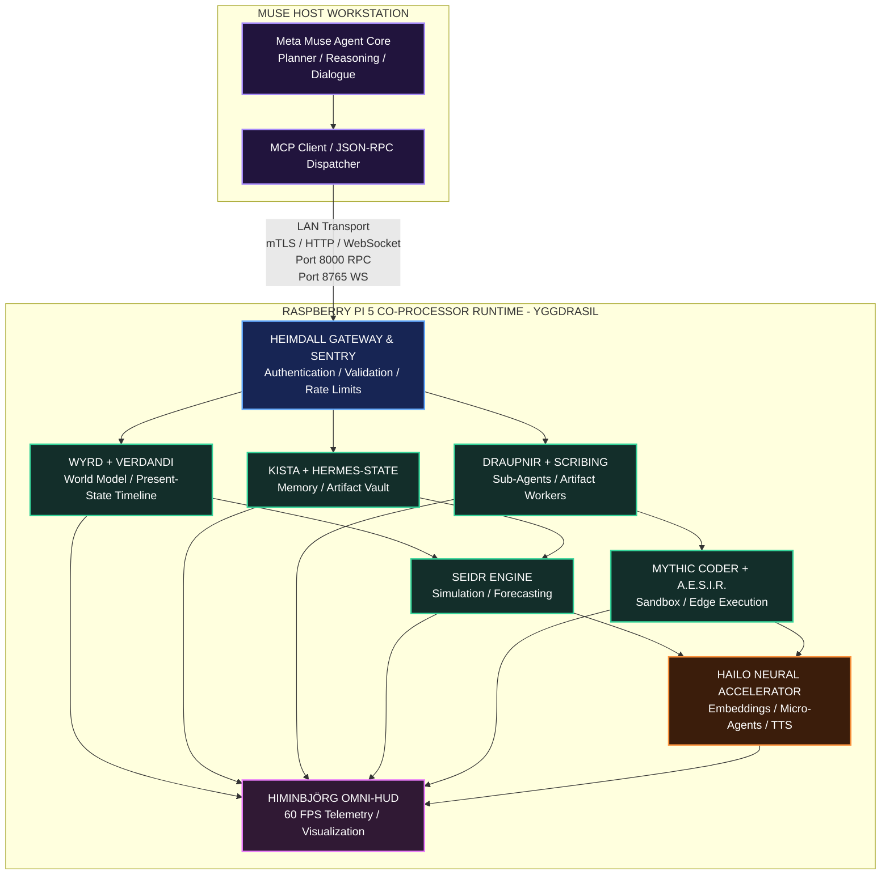
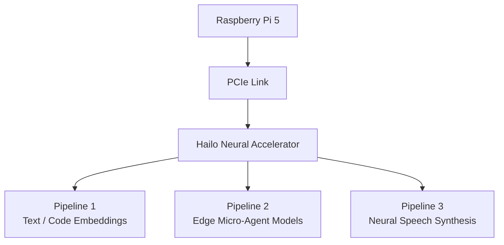
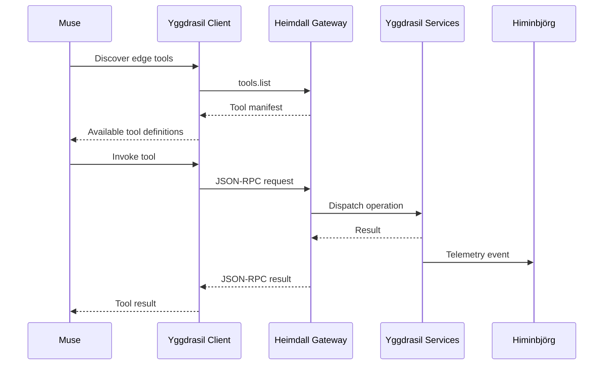
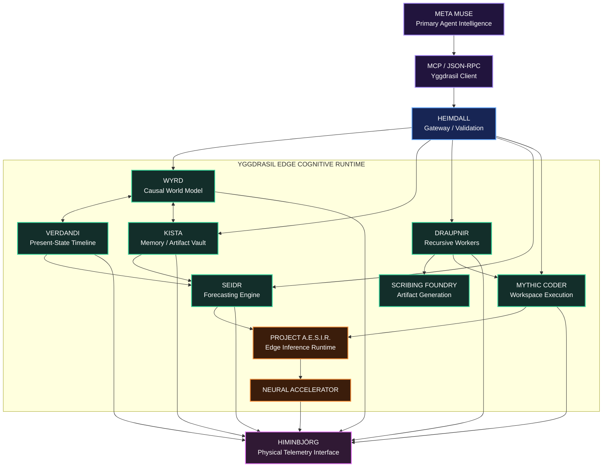

# Project Yggdrasil: The Edge AGI Extension & Co-Processor Runtime

`PROJECT_YGGDRASIL_THE_EDGE_AGI_EXTENSION_CO-PROCESSOR_RUNTIME.md`

> **Project Yggdrasil** transforms the Raspberry Pi 5 edge node from a passive display host into an active cognitive co-processor, memory system, simulation runtime, sandboxed execution environment, and autonomous sub-agent extension for Meta Muse.

---

## Table of Contents

1. [System Vision & Architecture Overview](#1-system-vision--architecture-overview)
2. [Repository & Subsystem Integration Matrix](#2-repository--subsystem-integration-matrix)
3. [Mathematical & Algorithmic Foundations](#3-mathematical--algorithmic-foundations)
4. [Hardware Compute Partitioning](#4-hardware-compute-partitioning)
5. [Implementation: The Yggdrasil Daemon](#5-implementation-the-yggdrasil-daemon)
6. [Muse Client Connector & MCP Integration](#6-muse-client-connector--mcp-integration)
7. [AI Coding Agent Deployment Guide](#7-ai-coding-agent-deployment-guide)
8. [Runtime Verification Matrix](#8-runtime-verification-matrix)
9. [Final Yggdrasil Runtime Topology](#9-final-yggdrasil-runtime-topology)

---

# 1. System Vision & Architecture Overview

**Project Yggdrasil** transforms the Raspberry Pi 5 and its neural accelerator from a passive graphics node into an active **edge co-processor and agentic extension hub** for Meta Muse.

Muse continues to run her primary long-context reasoning, dialogue, planning, and high-level orchestration loops on her host workstation.

The Raspberry Pi becomes an external cognitive runtime that Muse can call across the local network.

Through a structured tool and RPC interface, Muse can delegate operations such as:

- persistent memory storage
- artifact retrieval
- causal world-model updates
- timeline-state synchronization
- predictive simulations
- autonomous worker execution
- code execution inside restricted workspaces
- local neural inference
- vector search
- telemetry visualization
- speech synthesis
- future edge-agent workloads

All significant Yggdrasil operations can emit telemetry directly into **Project Himinbjörg**, giving the user and Muse a real-time physical view of the edge runtime.

---

## 1.1 High-Level Architecture



---

## 1.2 Architectural Principle

The core Yggdrasil concept is:

```text
Muse
  │
  │ delegates structured work
  ▼
Heimdall Gateway
  │
  ├── Memory
  ├── World State
  ├── Simulation
  ├── Sub-Agents
  ├── Sandboxed Execution
  └── Neural Services
          │
          ▼
      Yggdrasil
          │
          ├── returns results to Muse
          └── emits telemetry to Himinbjörg
```

Muse remains the primary intelligence.

Yggdrasil becomes the **external cognitive root system** beneath her main reasoning environment.

---

# 2. Repository & Subsystem Integration Matrix

The Yggdrasil runtime integrates multiple RuneForgeAI initiatives into a unified edge-service architecture.

| Subsystem Module | Origin Repository / Project | Architectural Responsibility inside Yggdrasil |
| --- | --- | --- |
| **Heimdall Sentry** | `Heimdall-SL-Hermes-Agent` | Gateway gatekeeper, authentication endpoint, validation layer, request sanitization, and rate limiting |
| **Hermes Bridge** | `hermes-agent-RuneForgeAI-hack` | Agent tool dispatch, session continuation, recovery wrappers, and execution bridging |
| **Verdandi Timeline** | `Verdandi` | Present-state temporal coordinator, event serialization, frame-delta tracking, and timeline anchoring |
| **WYRD World Model** | `WYRD-Protocol-World-Yielding-Real-time-Data-AI-world-model` | Directed causal graph of entities, relationships, environmental state, actions, and world progression |
| **Kista Vault** | `kista` + `hermes-state` | Persistent artifact storage, structured memory, document indexing, cached state, and cold-state backup |
| **Draupnir Forge** | `RuneForgeAI-Draupnir-Forge` | Recursive sub-agent generation, task decomposition, parallel workers, and bounded worker-pool management |
| **Scribing Foundry** | `Mythic-Scribing-Foundry` | Structured artifact generation, Markdown generation, schemas, prompt artifacts, and code/document formatting |
| **Seidr Engine** | `seidr-engine` | Heuristic evaluation, probabilistic forecasting, symbolic weighting, and divination-oriented simulation |
| **Mythic Coder** | `Mythic_Agent_Coder_CLI` + `Viking-Code-Mythic-Engineering-CLI-Vibe-Coding` | Restricted command execution, file manipulation, testing, patch application, and coding workflows |
| **Project A.E.S.I.R.** | `RuneForgeAI-Project-Aesir` | Efficient ARM64 and accelerator-oriented inference runtime, low-level bindings, and edge model execution |
| **Himinbjörg** | `Project-Hlidhskjalf / Himinbjörg` | Real-time visualization of Yggdrasil state, activity, simulation, memory, and agent telemetry |

---

# 3. Mathematical & Algorithmic Foundations

## 3.1 WYRD Causality DAG & Temporal Mechanics

The WYRD world model represents active reality as a causal directed graph:

```math
\mathcal{G}
=
(\mathcal{V},\mathcal{E},\mathcal{T})
```

where:

```text
V = world-state and entity vertices
E = causal actions and transitions
T = temporal coordinates / ordering
```

A vertex may represent:

- a person
- an AI agent
- an object
- a location
- an environmental condition
- a resource
- an abstract state
- a system state

An edge represents a causal relationship or state-changing event.

---

## 3.1.1 Causal Transition Probability

For transition from state or node $v_i$ to $v_j$ under action $a_k$, define a compatibility feature vector:

```math
\phi(v_i,v_j)
\in
\mathbb{R}^{n}
```

Let:

```math
\mathbf{w}_k
\in
\mathbb{R}^{n}
```

represent the learned or configured weight vector associated with action $a_k$.

A logistic transition model can be expressed as:

```math
P(v_j \mid v_i,a_k)
=
\sigma
\left(
\mathbf{w}_k^{T}
\phi(v_i,v_j)
\right)
```

where the sigmoid function is:

```math
\sigma(z)
=
\frac{1}
{1+e^{-z}}
```

Therefore:

```math
P(v_j \mid v_i,a_k)
=
\frac{1}
{
1+
e^{
-\mathbf{w}_k^{T}\phi(v_i,v_j)
}
}
```

The feature vector may incorporate:

- semantic similarity
- entity compatibility
- historical transitions
- environmental constraints
- Kista memory embeddings
- action context
- resource availability
- temporal proximity

---

## 3.1.2 Temporal State Entropy: Verdandi Deviation

Verdandi monitors uncertainty across possible active branches.

Let the current probability distribution over possible states at time $t$ be:

```math
p_1,p_2,\ldots,p_n
```

where:

```math
\sum_{i=1}^{n} p_i = 1
```

The temporal state entropy is:

```math
H(\mathcal{G}_t)
=
-
\sum_{i=1}^{n}
p_i
\log_2(p_i)
```

Low entropy indicates:

```text
highly constrained / coherent present state
```

High entropy indicates:

```text
many competing unresolved future or speculative branches
```

Verdandi monitors:

```math
H(\mathcal{G}_t)
>
H_{\mathrm{threshold}}
```

When this condition is satisfied, the system may:

1. persist an anchor checkpoint to Kista
2. classify verified manifest states
3. prune expired or invalid speculative branches
4. retain unresolved branches separately
5. rebuild the active present-state graph

Conceptually:

```text
Speculative Graph Expansion
          │
          ▼
Entropy Measurement
          │
          ├── Below Threshold -> Continue
          │
          └── Above Threshold
                    │
                    ▼
             VERDANDI ANCHOR
                    │
           ┌────────┴────────┐
           ▼                 ▼
      Persist State      Prune Drift
           │                 │
           └────────┬────────┘
                    ▼
              Stable Present
```

---

## 3.2 Draupnir Recursive Sub-Agent Scaling

When Muse delegates a complex task, Draupnir can recursively create bounded workers.

The worker count decreases with recursion depth to prevent CPU, memory, and process exhaustion.

Let:

```math
C \in [0,1]
```

represent normalized task complexity.

Let:

```math
d \in \{0,1,2,\ldots\}
```

represent recursion depth.

The theoretical worker allocation is:

```math
N_{\mathrm{raw}}(d)
=
N_0
C
\gamma^d
```

where:

```math
N_0 = 8
```

is the maximum root-level worker count and:

```math
\gamma = 0.5
```

is the recursion decay factor.

The executable integer worker count is:

```math
N_{\mathrm{workers}}(d)
=
\left\lfloor
N_0
C
\gamma^d
\right\rfloor
```

For maximum task complexity:

```math
C = 1
```

the default sequence becomes:

```math
N_{\mathrm{workers}}(0)=8
```

```math
N_{\mathrm{workers}}(1)=4
```

```math
N_{\mathrm{workers}}(2)=2
```

```math
N_{\mathrm{workers}}(3)=1
```

Recursive spawning stops when:

```math
N_{\mathrm{raw}}(d) < 1
```

or:

```math
d \ge 3
```

A depth-3 worker may complete its assigned operation but should not create a depth-4 generation.

---

## 3.3 Seidr Probabilistic Forecast & Heuristic Engine

The Seidr Engine blends empirical system state with symbolic or heuristic information.

Let:

```math
\mathbf{S}_{\mathrm{empirical}}
\in
\mathbb{R}^{n}
```

represent deterministic or empirically derived system state.

Let:

```math
\mathbf{S}_{\mathrm{symbolic}}
\in
\mathbb{R}^{m}
```

represent symbolic, celestial, runic, divinatory, or heuristic state.

Define:

```math
P_{\mathrm{emp}}(y)
```

as the empirical estimate for outcome $y$.

Define:

```math
P_{\mathrm{sym}}(y)
```

as the symbolic or heuristic estimate.

Let intuition weighting be:

```math
\alpha \in [0,1]
```

The blended probability is:

```math
P_{\mathrm{Seidr}}(y)
=
(1-\alpha)
P_{\mathrm{emp}}(y)
+
\alpha
P_{\mathrm{sym}}(y)
```

Interpretation:

```math
\alpha = 0
```

means fully empirical evaluation.

```math
\alpha = 1
```

means fully symbolic evaluation.

```math
0 < \alpha < 1
```

produces a hybrid forecast.

---

## 3.4 Weighted Scenario Score

For empirical features:

```math
\mathbf{x}
=
(x_1,x_2,\ldots,x_n)
```

and weights:

```math
\mathbf{w}
=
(w_1,w_2,\ldots,w_n)
```

a normalized empirical score may be expressed as:

```math
S_{\mathrm{emp}}
=
\frac{
\sum_{i=1}^{n}
w_i x_i
}{
\sum_{i=1}^{n}
w_i
}
```

The final Seidr score becomes:

```math
S_{\mathrm{final}}
=
(1-\alpha)
S_{\mathrm{emp}}
+
\alpha
S_{\mathrm{sym}}
```

---

# 4. Hardware Compute Partitioning

## 4.1 Raspberry Pi Runtime Partition

| Compute Resource | Assigned Role |
| --- | --- |
| **CPU Core 0** | Heimdall Gateway, JSON-RPC, MCP-facing services, network ingestion |
| **CPU Core 1** | WYRD graph processing, Verdandi synchronization, Kista coordination |
| **CPU Core 2** | Draupnir scheduler, sandbox execution, Mythic Coder workloads |
| **CPU Core 3** | Himinbjörg display compositor and UI support |
| **VideoCore GPU** | Graphics composition and display acceleration |
| **System Memory** | OS, graph state, Kista caches, sandbox workspaces, process heaps |

---

## 4.2 Conceptual Memory Allocation

```text
┌──────────────────────────────────────────────────────────────────────┐
│                   RASPBERRY PI 5 SYSTEM MEMORY                      │
├──────────────────────────────────────────────────────────────────────┤
│ Linux OS + Kernel                     ~1.5 GB                        │
│ Python / Runtime Daemons              ~2.0 GB                        │
│ Kista / WYRD / SQLite Cache           ~4.0 GB                        │
│ Sandbox Workspaces                    ~4.0 GB                        │
│ Dynamic Headroom                      remaining system memory         │
└──────────────────────────────────────────────────────────────────────┘
```

---

## 4.3 Accelerator Pipeline



Potential accelerator workloads include:

### Pipeline 1: Embeddings

```text
BGE family
Nomic Embed family
other supported embedding models
```

Use cases:

- Kista semantic retrieval
- code search
- lore retrieval
- document similarity
- world-model entity matching

### Pipeline 2: Edge Micro-Agents

Potential small-model workloads:

```text
Qwen-family coder models
small instruction models
task-specific classifiers
local worker models
```

Use cases:

- patch proposals
- classification
- summarization
- structured extraction
- local micro-agent tasks

### Pipeline 3: Neural Speech

Potential speech workloads:

```text
Kokoro
Piper
other supported local TTS models
```

Use cases:

- Muse voice
- alerts
- narration
- TTRPG dialogue
- system announcements

---

# 5. Implementation: The Yggdrasil Daemon

File:

```text
yggdrasil_core_daemon.py
```

The following reference implementation provides:

- Kista memory storage
- WYRD state tracking
- Seidr simulation
- restricted workspace execution
- Draupnir worker execution
- Himinbjörg telemetry
- JSON-RPC tool dispatch

> **Security note:** Filesystem confinement through `cwd` alone is not a true operating-system sandbox. Production deployments should add stronger isolation such as dedicated users, containers, namespaces, seccomp, command allowlists, or another hardened execution boundary.

```python
#!/usr/bin/env python3
"""
yggdrasil_core_daemon.py

Project Yggdrasil:
Edge AGI Extension Runtime for Raspberry Pi 5.

Integrates:
  - Heimdall: JSON-RPC / Tool Gateway
  - WYRD: Causal World Model
  - Verdandi: Present-State Synchronization
  - Kista: Long-Term Memory & Artifact Vault
  - Draupnir: Recursive Worker Runtime
  - Seidr: Predictive Simulation Engine
  - Mythic Coder: Restricted Workspace Execution
  - Himinbjörg: Real-Time Telemetry Forwarding

Author: Volmarr / RuneForgeAI
License: MIT
"""

import sys
import time
import json
import uuid
import sqlite3
import threading
import subprocess

from pathlib import Path
from http.server import HTTPServer, BaseHTTPRequestHandler
from typing import Dict, Any, List, Optional


# =====================================================================
# Configuration & Paths
# =====================================================================

BASE_DIR = Path(
    "/opt/yggdrasil"
)

VAULT_DIR = (
    BASE_DIR / "kista_vault"
)

SANDBOX_DIR = (
    BASE_DIR / "sandbox"
)

HUD_IPC_URL = (
    "http://127.0.0.1:8080/api/event"
)

PORT = 8000

BASE_DIR.mkdir(
    parents=True,
    exist_ok=True
)

VAULT_DIR.mkdir(
    parents=True,
    exist_ok=True
)

SANDBOX_DIR.mkdir(
    parents=True,
    exist_ok=True
)


# =====================================================================
# 1. KISTA
# Artifact Storage & Memory Vault
# =====================================================================

class KistaVault:

    def __init__(
        self,
        db_path: Path
    ):
        self.db_path = db_path
        self._init_db()

    def _init_db(self):

        with sqlite3.connect(
            self.db_path
        ) as conn:

            conn.execute(
                """
                CREATE TABLE IF NOT EXISTS artifacts (
                    id TEXT PRIMARY KEY,
                    category TEXT,
                    key TEXT UNIQUE,
                    content TEXT,
                    metadata TEXT,
                    created_at REAL
                )
                """
            )

            conn.commit()

    def store(
        self,
        category: str,
        key: str,
        content: str,
        metadata: Optional[
            Dict[str, Any]
        ] = None
    ) -> str:

        artifact_id = str(
            uuid.uuid4()
        )

        meta_str = json.dumps(
            metadata or {}
        )

        with sqlite3.connect(
            self.db_path
        ) as conn:

            conn.execute(
                """
                INSERT OR REPLACE INTO artifacts (
                    id,
                    category,
                    key,
                    content,
                    metadata,
                    created_at
                )
                VALUES (?, ?, ?, ?, ?, ?)
                """,
                (
                    artifact_id,
                    category,
                    key,
                    content,
                    meta_str,
                    time.time()
                )
            )

            conn.commit()

        return artifact_id

    def retrieve(
        self,
        key: str
    ) -> Optional[
        Dict[str, Any]
    ]:

        with sqlite3.connect(
            self.db_path
        ) as conn:

            cursor = conn.cursor()

            cursor.execute(
                """
                SELECT
                    id,
                    category,
                    key,
                    content,
                    metadata,
                    created_at
                FROM artifacts
                WHERE key = ?
                """,
                (key,)
            )

            row = cursor.fetchone()

            if row:

                return {
                    "id": row[0],
                    "category": row[1],
                    "key": row[2],
                    "content": row[3],
                    "metadata":
                        json.loads(row[4]),
                    "created_at":
                        row[5]
                }

        return None

    def list_keys(
        self,
        category: Optional[str] = None
    ) -> List[str]:

        with sqlite3.connect(
            self.db_path
        ) as conn:

            cursor = conn.cursor()

            if category:

                cursor.execute(
                    """
                    SELECT key
                    FROM artifacts
                    WHERE category = ?
                    """,
                    (category,)
                )

            else:

                cursor.execute(
                    """
                    SELECT key
                    FROM artifacts
                    """
                )

            return [
                row[0]
                for row
                in cursor.fetchall()
            ]


# =====================================================================
# 2. WYRD & VERDANDI
# World Model Graph & Present State
# =====================================================================

class WyrdWorldModel:

    def __init__(self):

        self.lock = (
            threading.Lock()
        )

        self.entities: Dict[
            str,
            Dict[str, Any]
        ] = {}

        self.causal_chain: List[
            Dict[str, Any]
        ] = []

    def update_entity(
        self,
        entity_id: str,
        attributes: Dict[str, Any]
    ):

        with self.lock:

            if (
                entity_id
                not in self.entities
            ):

                self.entities[
                    entity_id
                ] = {
                    "id":
                        entity_id,
                    "created_at":
                        time.time()
                }

            self.entities[
                entity_id
            ].update(
                attributes
            )

            self.entities[
                entity_id
            ][
                "last_modified"
            ] = time.time()

    def record_transition(
        self,
        actor: str,
        action: str,
        target: str,
        result: Dict[str, Any]
    ):

        with self.lock:

            event = {
                "event_id":
                    str(uuid.uuid4()),
                "timestamp":
                    time.time(),
                "actor":
                    actor,
                "action":
                    action,
                "target":
                    target,
                "result":
                    result
            }

            self.causal_chain.append(
                event
            )

            if (
                len(
                    self.causal_chain
                )
                > 500
            ):
                self.causal_chain.pop(
                    0
                )

    def get_snapshot(
        self
    ) -> Dict[str, Any]:

        with self.lock:

            return {
                "entity_count":
                    len(
                        self.entities
                    ),
                "entities":
                    dict(
                        self.entities
                    ),
                "recent_causality":
                    list(
                        self.causal_chain[
                            -10:
                        ]
                    )
            }


# =====================================================================
# 3. SEIDR ENGINE
# Probabilistic & Heuristic Simulation
# =====================================================================

class SeidrEngine:

    @staticmethod
    def evaluate_scenario(
        scenario_description: str,
        variables: Dict[str, float],
        intuition_weight: float = 0.5
    ) -> Dict[str, Any]:

        """
        Calculates a blended scenario score
        from empirical parameters and a
        symbolic heuristic factor.
        """

        intuition_weight = max(
            0.0,
            min(
                1.0,
                intuition_weight
            )
        )

        if variables:

            base_score = (
                sum(
                    variables.values()
                )
                / len(variables)
            )

        else:
            base_score = 0.5

        base_score = max(
            0.0,
            min(
                1.0,
                base_score
            )
        )

        # Prototype symbolic factor.
        #
        # NOTE:
        # Python's built-in hash() is not stable
        # across interpreter sessions. Production
        # versions should replace this with a
        # deterministic symbolic or model-derived
        # scoring function.

        symbolic_factor = (
            hash(
                scenario_description
            )
            % 1000
        ) / 1000.0

        final_probability = (
            base_score
            * (
                1.0
                - intuition_weight
            )
        ) + (
            symbolic_factor
            * intuition_weight
        )

        if (
            final_probability
            > 0.6
        ):
            verdict = (
                "FAVORABLE"
            )

        elif (
            final_probability
            < 0.4
        ):
            verdict = (
                "PERILOUS"
            )

        else:
            verdict = (
                "BALANCED"
            )

        recommended_focus = (
            "Proceed with forward expansion."
            if verdict == "FAVORABLE"
            else
            "Preserve current alignment "
            "and reinforce defenses."
        )

        return {
            "scenario":
                scenario_description,
            "empirical_score":
                round(
                    base_score,
                    4
                ),
            "symbolic_entropy":
                round(
                    symbolic_factor,
                    4
                ),
            "blended_probability":
                round(
                    final_probability,
                    4
                ),
            "verdict":
                verdict,
            "recommended_focus":
                recommended_focus
        }


# =====================================================================
# 4. MYTHIC CODER
# Restricted Workspace Execution
# =====================================================================

class MythicCoderSandbox:

    @staticmethod
    def execute_command(
        command: str,
        timeout: int = 30
    ) -> Dict[str, Any]:

        """
        Prototype workspace execution layer.

        IMPORTANT:
        Running with shell=True is NOT a true
        security sandbox. Production deployments
        should use stronger OS-level isolation.
        """

        start = time.time()

        try:

            result = subprocess.run(
                command,
                shell=True,
                cwd=str(
                    SANDBOX_DIR
                ),
                stdout=
                    subprocess.PIPE,
                stderr=
                    subprocess.PIPE,
                text=True,
                timeout=timeout
            )

            duration = (
                time.time()
                - start
            )

            return {
                "success":
                    result.returncode
                    == 0,
                "exit_code":
                    result.returncode,
                "stdout":
                    result.stdout,
                "stderr":
                    result.stderr,
                "duration_seconds":
                    round(
                        duration,
                        3
                    )
            }

        except subprocess.TimeoutExpired:

            return {
                "success":
                    False,
                "exit_code":
                    -1,
                "stdout":
                    "",
                "stderr":
                    (
                        "Execution timed out "
                        f"after {timeout} seconds."
                    ),
                "duration_seconds":
                    timeout
            }


# =====================================================================
# 5. DRAUPNIR FORGE
# Recursive Worker Runtime
# =====================================================================

class DraupnirForge:

    def __init__(
        self,
        sandbox: MythicCoderSandbox
    ):
        self.sandbox = sandbox

    def spawn_worker(
        self,
        task_name: str,
        script_code: str
    ) -> Dict[str, Any]:

        """
        Writes an autonomous worker script
        into the restricted workspace,
        executes it, and removes the file.
        """

        script_file = (
            SANDBOX_DIR
            / (
                "worker_"
                f"{int(time.time())}_"
                f"{uuid.uuid4().hex[:6]}"
                ".py"
            )
        )

        with open(
            script_file,
            "w",
            encoding="utf-8"
        ) as file:

            file.write(
                script_code
            )

        result = (
            self.sandbox
            .execute_command(
                f"python3 {script_file.name}",
                timeout=60
            )
        )

        if script_file.exists():

            script_file.unlink()

        return {
            "worker_task":
                task_name,
            "execution_result":
                result
        }


# =====================================================================
# 6. HIMINBJÖRG HUD TELEMETRY PIPE
# =====================================================================

def push_to_hud(
    event_type: str,
    payload: Dict[str, Any],
    speech: str = ""
):

    """
    Dispatch real-time state changes
    to the local Himinbjörg compositor.
    """

    def _worker():

        try:

            import urllib.request

            envelope = {
                "version":
                    "1.0.0",
                "timestamp":
                    int(
                        time.time()
                        * 1000
                    ),
                "session_id":
                    "yggdrasil-daemon",
                "source_engine":
                    "yggdrasil_core",
                "event_type":
                    event_type,
                "payload":
                    dict(payload)
            }

            if speech:

                envelope[
                    "payload"
                ][
                    "agent_speech"
                ] = speech

            data = json.dumps(
                envelope
            ).encode(
                "utf-8"
            )

            request = (
                urllib.request.Request(
                    HUD_IPC_URL,
                    data=data,
                    headers={
                        "Content-Type":
                            "application/json"
                    }
                )
            )

            with urllib.request.urlopen(
                request,
                timeout=1.0
            ):
                pass

        except Exception:
            # HUD telemetry must never prevent
            # the Yggdrasil core from operating.
            pass

    threading.Thread(
        target=_worker,
        daemon=True
    ).start()


# =====================================================================
# 7. HEIMDALL GATEWAY
# JSON-RPC / MCP-Facing Tool Server
# =====================================================================

kista = KistaVault(
    VAULT_DIR
    / "kista_artifacts.db"
)

wyrd = WyrdWorldModel()

seidr = SeidrEngine()

coder = MythicCoderSandbox()

draupnir = DraupnirForge(
    coder
)


class HeimdallGatewayHandler(
    BaseHTTPRequestHandler
):

    def _send_json(
        self,
        status_code: int,
        data: Dict[str, Any]
    ):

        self.send_response(
            status_code
        )

        self.send_header(
            "Content-Type",
            "application/json"
        )

        self.send_header(
            "Access-Control-Allow-Origin",
            "*"
        )

        self.end_headers()

        self.wfile.write(
            json.dumps(
                data
            ).encode(
                "utf-8"
            )
        )

    def do_OPTIONS(self):

        self.send_response(
            200
        )

        self.send_header(
            "Access-Control-Allow-Methods",
            "POST, GET, OPTIONS"
        )

        self.send_header(
            "Access-Control-Allow-Headers",
            "Content-Type"
        )

        self.end_headers()

    def do_POST(self):

        length = int(
            self.headers.get(
                "Content-Length",
                0
            )
        )

        if length == 0:

            self._send_json(
                400,
                {
                    "error":
                        "Empty body"
                }
            )

            return

        try:

            request_data = (
                json.loads(
                    self.rfile
                    .read(length)
                    .decode(
                        "utf-8"
                    )
                )
            )

        except Exception as exc:

            self._send_json(
                400,
                {
                    "error":
                        (
                            "Invalid JSON payload: "
                            f"{exc}"
                        )
                }
            )

            return

        method = (
            request_data.get(
                "method"
            )
        )

        params = (
            request_data.get(
                "params",
                {}
            )
        )

        msg_id = (
            request_data.get(
                "id"
            )
        )

        result = {}
        error = None

        try:

            # ---------------------------------------------------------
            # Tool 1: Kista Store
            # ---------------------------------------------------------

            if method == "kista.store":

                category = params.get(
                    "category",
                    "general"
                )

                key = params.get(
                    "key"
                )

                content = params.get(
                    "content"
                )

                if not key:
                    raise ValueError(
                        "Missing required parameter: key"
                    )

                if content is None:
                    raise ValueError(
                        "Missing required parameter: content"
                    )

                artifact_id = (
                    kista.store(
                        category,
                        key,
                        content,
                        params.get(
                            "metadata"
                        )
                    )
                )

                result = {
                    "stored":
                        True,
                    "artifact_id":
                        artifact_id,
                    "key":
                        key
                }

                push_to_hud(
                    "agent.thought_stream",
                    {
                        "detail":
                            (
                                f"Stored artifact "
                                f"{key} in Kista Vault."
                            )
                    }
                )

            # ---------------------------------------------------------
            # Tool 2: Kista Retrieve
            # ---------------------------------------------------------

            elif method == "kista.retrieve":

                key = params.get(
                    "key"
                )

                if not key:
                    raise ValueError(
                        "Missing required parameter: key"
                    )

                retrieved = (
                    kista.retrieve(
                        key
                    )
                )

                result = (
                    retrieved
                    if retrieved
                    else {
                        "found":
                            False,
                        "key":
                            key
                    }
                )

            # ---------------------------------------------------------
            # Tool 3: WYRD Entity Update
            # ---------------------------------------------------------

            elif method == "wyrd.update_entity":

                entity_id = (
                    params.get(
                        "entity_id"
                    )
                )

                if not entity_id:
                    raise ValueError(
                        "Missing required parameter: entity_id"
                    )

                attributes = (
                    params.get(
                        "attributes",
                        {}
                    )
                )

                wyrd.update_entity(
                    entity_id,
                    attributes
                )

                result = {
                    "updated":
                        True,
                    "entity_id":
                        entity_id
                }

                push_to_hud(
                    "agent.thought_stream",
                    {
                        "detail":
                            (
                                "WYRD entity updated: "
                                f"{entity_id}"
                            )
                    }
                )

            # ---------------------------------------------------------
            # Tool 4: WYRD Snapshot
            # ---------------------------------------------------------

            elif method == "wyrd.get_world_state":

                result = (
                    wyrd.get_snapshot()
                )

            # ---------------------------------------------------------
            # Tool 5: Seidr Simulation
            # ---------------------------------------------------------

            elif method == "seidr.simulate":

                description = (
                    params.get(
                        "scenario",
                        "Undefined Horizon"
                    )
                )

                variables = (
                    params.get(
                        "variables",
                        {
                            "will":
                                0.5,
                            "focus":
                                0.5
                        }
                    )
                )

                weight = float(
                    params.get(
                        "intuition_weight",
                        0.5
                    )
                )

                simulation = (
                    seidr.evaluate_scenario(
                        description,
                        variables,
                        weight
                    )
                )

                result = simulation

                push_to_hud(
                    "divination.ephemeris_transit",
                    {
                        "astrology_summary":
                            (
                                "Seidr Simulation: "
                                f"{simulation['verdict']} "
                                "("
                                f"{simulation['blended_probability']}"
                                ")"
                            ),
                        "cards":
                            []
                    },
                    speech=(
                        "Seidr divination indicates "
                        f"a {simulation['verdict']} "
                        "pattern."
                    )
                )

            # ---------------------------------------------------------
            # Tool 6: Mythic Coder Execute
            # ---------------------------------------------------------

            elif method == "coder.execute":

                command = (
                    params.get(
                        "command"
                    )
                )

                if not command:
                    raise ValueError(
                        "Missing required parameter: command"
                    )

                timeout = int(
                    params.get(
                        "timeout",
                        30
                    )
                )

                execution = (
                    coder.execute_command(
                        command,
                        timeout=timeout
                    )
                )

                result = execution

                push_to_hud(
                    "agent.thought_stream",
                    {
                        "detail":
                            (
                                "Executed workspace command: "
                                f"{command[:40]}... "
                                "(Success: "
                                f"{execution['success']})"
                            )
                    }
                )

            # ---------------------------------------------------------
            # Tool 7: Draupnir Worker
            # ---------------------------------------------------------

            elif method == "draupnir.spawn_worker":

                task_name = (
                    params.get(
                        "task_name",
                        "SubTask"
                    )
                )

                code = (
                    params.get(
                        "code",
                        "print('Worker complete.')"
                    )
                )

                worker_result = (
                    draupnir.spawn_worker(
                        task_name,
                        code
                    )
                )

                result = worker_result

                push_to_hud(
                    "ttrpg.lore_dispatch",
                    {
                        "lore_text":
                            (
                                "Draupnir worker "
                                "dispatched for: "
                                f"{task_name}"
                            )
                    }
                )

            # ---------------------------------------------------------
            # Tool 8: Tool Discovery
            # ---------------------------------------------------------

            elif method == "tools.list":

                result = {
                    "tools": [
                        {
                            "name":
                                "kista.store",
                            "description":
                                (
                                    "Persist memory or "
                                    "code artifacts."
                                )
                        },
                        {
                            "name":
                                "kista.retrieve",
                            "description":
                                (
                                    "Retrieve a stored "
                                    "artifact by key."
                                )
                        },
                        {
                            "name":
                                "wyrd.update_entity",
                            "description":
                                (
                                    "Update an entity "
                                    "inside the causal "
                                    "world model."
                                )
                        },
                        {
                            "name":
                                "wyrd.get_world_state",
                            "description":
                                (
                                    "Retrieve current "
                                    "entities and recent "
                                    "causality."
                                )
                        },
                        {
                            "name":
                                "seidr.simulate",
                            "description":
                                (
                                    "Run a blended "
                                    "heuristic forecast."
                                )
                        },
                        {
                            "name":
                                "coder.execute",
                            "description":
                                (
                                    "Execute a command "
                                    "inside the configured "
                                    "workspace."
                                )
                        },
                        {
                            "name":
                                "draupnir.spawn_worker",
                            "description":
                                (
                                    "Launch a temporary "
                                    "edge worker script."
                                )
                        }
                    ]
                }

            else:

                error = {
                    "code":
                        -32601,
                    "message":
                        (
                            f"Method '{method}' "
                            "not found."
                        )
                }

        except Exception as exc:

            error = {
                "code":
                    -32000,
                "message":
                    str(exc)
            }

        response_body = {
            "jsonrpc":
                "2.0",
            "id":
                msg_id
        }

        if error:

            response_body[
                "error"
            ] = error

            self._send_json(
                500,
                response_body
            )

        else:

            response_body[
                "result"
            ] = result

            self._send_json(
                200,
                response_body
            )

    def log_message(
        self,
        format,
        *args
    ):
        return


# =====================================================================
# Runtime Entry Point
# =====================================================================

def run_yggdrasil():

    server = HTTPServer(
        (
            "0.0.0.0",
            PORT
        ),
        HeimdallGatewayHandler
    )

    print(
        "=== Project Yggdrasil "
        "Edge Core Active ==="
    )

    print(
        "Heimdall Gateway listening on: "
        f"http://0.0.0.0:{PORT}"
    )

    print(
        f"Kista Vault: {VAULT_DIR}"
    )

    print(
        f"Sandbox: {SANDBOX_DIR}"
    )

    try:

        server.serve_forever()

    except KeyboardInterrupt:

        print(
            "\nStopping Yggdrasil Daemon..."
        )

        server.shutdown()

        sys.exit(0)


if __name__ == "__main__":
    run_yggdrasil()
```

---

# 6. Muse Client Connector & MCP Integration

The Muse-side connector exposes the Raspberry Pi runtime as a callable remote tool environment.

File:

```text
muse_yggdrasil_connector.py
```

```python
#!/usr/bin/env python3
"""
muse_yggdrasil_connector.py

Runs on Muse's host computer.

Wraps the Raspberry Pi Yggdrasil daemon as a
JSON-RPC tool endpoint that can be adapted into
Muse's local MCP / tool-calling environment.
"""

import json
import urllib.request

from typing import Dict, Any


PI_YGGDRASIL_URL = (
    "http://192.168.1.150:8000"
)


class YggdrasilClient:

    def __init__(
        self,
        endpoint: str = PI_YGGDRASIL_URL
    ):

        self.endpoint = endpoint
        self._id = 0

    def call_tool(
        self,
        method: str,
        params: Dict[str, Any]
    ) -> Dict[str, Any]:

        self._id += 1

        payload = {
            "jsonrpc":
                "2.0",
            "method":
                method,
            "params":
                params,
            "id":
                self._id
        }

        data = json.dumps(
            payload
        ).encode(
            "utf-8"
        )

        request = (
            urllib.request.Request(
                self.endpoint,
                data=data,
                headers={
                    "Content-Type":
                        "application/json"
                }
            )
        )

        with urllib.request.urlopen(
            request,
            timeout=60.0
        ) as response:

            body = json.loads(
                response.read()
                .decode(
                    "utf-8"
                )
            )

            if "error" in body:

                raise RuntimeError(
                    "Yggdrasil Error: "
                    f"{body['error']}"
                )

            return body.get(
                "result",
                {}
            )

    def list_available_tools(
        self
    ):

        return self.call_tool(
            "tools.list",
            {}
        )


if __name__ == "__main__":

    client = YggdrasilClient()

    print(
        "[Muse Connector] "
        "Probing available tools on Pi 5:"
    )

    tools = (
        client.list_available_tools()
    )

    print(
        json.dumps(
            tools,
            indent=2
        )
    )

    print(
        "\n[Muse Connector] "
        "Storing campaign lore state "
        "into Kista Vault:"
    )

    result = client.call_tool(
        "kista.store",
        {
            "category":
                "lore",
            "key":
                "runic_inscription_chamber_4",
            "content":
                (
                    "The stone reads: "
                    "'Let none who fear wyrd "
                    "tread past this threshold.'"
                )
        }
    )

    print(
        result
    )

    print(
        "\n[Muse Connector] "
        "Executing Seidr simulation:"
    )

    simulation = client.call_tool(
        "seidr.simulate",
        {
            "scenario":
                (
                    "Breaching the sealed "
                    "barrow gates with force"
                ),
            "variables": {
                "party_might":
                    0.8,
                "warding_strength":
                    0.65
            },
            "intuition_weight":
                0.4
        }
    )

    print(
        json.dumps(
            simulation,
            indent=2
        )
    )
```

---

## 6.1 Tool Discovery Flow



---

# 7. AI Coding Agent Deployment Guide

## 7.1 Directory Layout Setup

Create the runtime directories:

```bash
sudo mkdir -p /opt/yggdrasil/kista_vault
sudo mkdir -p /opt/yggdrasil/sandbox
```

Assign ownership:

```bash
sudo chown -R "$USER":"$USER" /opt/yggdrasil
```

Recommended project layout:

```text
/opt/yggdrasil/
├── yggdrasil_core_daemon.py
├── config/
│   └── yggdrasil.json
├── kista_vault/
│   └── kista_artifacts.db
├── sandbox/
├── logs/
├── models/
└── services/
```

---

## 7.2 Systemd Daemon Unit

File:

```text
/etc/systemd/system/yggdrasil.service
```

```ini
[Unit]
Description=Project Yggdrasil Edge Core Daemon
After=network.target

[Service]
Type=simple
User=pi
WorkingDirectory=/opt/yggdrasil
ExecStart=/usr/bin/python3 /opt/yggdrasil/yggdrasil_core_daemon.py
Restart=always
RestartSec=5
StandardOutput=journal
StandardError=journal

[Install]
WantedBy=multi-user.target
```

---

## 7.3 Activation

Reload systemd:

```bash
sudo systemctl daemon-reload
```

Enable Yggdrasil at boot:

```bash
sudo systemctl enable yggdrasil.service
```

Start the daemon:

```bash
sudo systemctl start yggdrasil.service
```

Check service status:

```bash
sudo systemctl status yggdrasil.service
```

Follow live logs:

```bash
journalctl -u yggdrasil.service -f
```

---

## 7.4 Verify Tool Discovery

```bash
curl -X POST http://localhost:8000 \
  -H "Content-Type: application/json" \
  -d '{
    "jsonrpc": "2.0",
    "method": "tools.list",
    "params": {},
    "id": 1
  }'
```

Expected response structure:

```json
{
  "jsonrpc": "2.0",
  "id": 1,
  "result": {
    "tools": [
      {
        "name": "kista.store"
      },
      {
        "name": "kista.retrieve"
      },
      {
        "name": "wyrd.update_entity"
      },
      {
        "name": "wyrd.get_world_state"
      },
      {
        "name": "seidr.simulate"
      },
      {
        "name": "coder.execute"
      },
      {
        "name": "draupnir.spawn_worker"
      }
    ]
  }
}
```

---

## 7.5 Verify Kista

```bash
curl -X POST http://localhost:8000 \
  -H "Content-Type: application/json" \
  -d '{
    "jsonrpc": "2.0",
    "method": "kista.store",
    "params": {
      "category": "test",
      "key": "yggdrasil_boot_test",
      "content": "The Kista vault is online."
    },
    "id": 2
  }'
```

Retrieve it:

```bash
curl -X POST http://localhost:8000 \
  -H "Content-Type: application/json" \
  -d '{
    "jsonrpc": "2.0",
    "method": "kista.retrieve",
    "params": {
      "key": "yggdrasil_boot_test"
    },
    "id": 3
  }'
```

---

## 7.6 Verify WYRD

```bash
curl -X POST http://localhost:8000 \
  -H "Content-Type: application/json" \
  -d '{
    "jsonrpc": "2.0",
    "method": "wyrd.update_entity",
    "params": {
      "entity_id": "barrow_gate",
      "attributes": {
        "state": "sealed",
        "ward_strength": 0.78,
        "location": "northern_barrows"
      }
    },
    "id": 4
  }'
```

Read the world state:

```bash
curl -X POST http://localhost:8000 \
  -H "Content-Type: application/json" \
  -d '{
    "jsonrpc": "2.0",
    "method": "wyrd.get_world_state",
    "params": {},
    "id": 5
  }'
```

---

## 7.7 Verify Seidr

```bash
curl -X POST http://localhost:8000 \
  -H "Content-Type: application/json" \
  -d '{
    "jsonrpc": "2.0",
    "method": "seidr.simulate",
    "params": {
      "scenario": "Attempt passage through the warded gate",
      "variables": {
        "knowledge": 0.85,
        "preparation": 0.75,
        "danger": 0.45
      },
      "intuition_weight": 0.35
    },
    "id": 6
  }'
```

---

# 8. Runtime Verification Matrix

| Subsystem | Verification | Expected Result |
| --- | --- | --- |
| Heimdall | `tools.list` | Tool manifest returned |
| Kista | Store + retrieve | Artifact persists |
| WYRD | Update entity | Entity appears in snapshot |
| Verdandi | Checkpoint logic | Present state remains coherent |
| Seidr | Run simulation | Blended probability + verdict |
| Draupnir | Spawn worker | Worker executes and returns result |
| Mythic Coder | Execute test command | Restricted workspace result |
| Himinbjörg | Trigger telemetry | HUD displays activity |
| Muse Connector | Remote tool call | Pi result returned to Muse |
| systemd | Reboot Pi | Yggdrasil starts automatically |

---

# 9. Final Yggdrasil Runtime Topology



---

# 10. Yggdrasil Design Philosophy

Project Yggdrasil is not intended to replace Muse's primary intelligence.

It extends it.

```text
                    MUSE
                     │
              intention / agency
                     │
                     ▼
                 HEIMDALL
                     │
          ┌──────────┼──────────┐
          ▼          ▼          ▼
        WYRD       KISTA     DRAUPNIR
          │          │          │
          └─────┬────┴────┬─────┘
                ▼         ▼
             VERDANDI   SEIDR
                │         │
                └────┬────┘
                     ▼
               MYTHIC CODER
                     │
                     ▼
                  A.E.S.I.R.
                     │
                     ▼
              EDGE INFERENCE
                     │
                     ▼
                HIMINBJÖRG
```

The conceptual roles are:

### Muse

**The mind.**

Responsible for:

- intention
- conversation
- planning
- high-level reasoning
- orchestration
- deciding what matters

### Heimdall

**The gate.**

Responsible for:

- validating incoming actions
- authentication
- schema enforcement
- traffic control
- tool dispatch

### WYRD

**The causal web.**

Responsible for:

- entities
- relationships
- actions
- causes
- consequences
- world-state continuity

### Verdandi

**The living present.**

Responsible for:

- determining the active present state
- timeline synchronization
- state anchoring
- speculative-branch control

### Kista

**The vault.**

Responsible for:

- artifacts
- persistent memory
- documents
- code
- checkpoints
- long-term state

### Draupnir

**The worker forge.**

Responsible for:

- task decomposition
- bounded recursive workers
- parallel execution
- autonomous micro-tasks

### Seidr

**The horizon engine.**

Responsible for:

- simulation
- probability
- heuristic interpretation
- symbolic pattern integration
- scenario evaluation

### Mythic Coder

**The hands.**

Responsible for:

- code changes
- testing
- file operations
- tool execution
- development workflows

### Project A.E.S.I.R.

**The edge execution forge.**

Responsible for:

- efficient local inference
- low-level model execution
- ARM64 acceleration
- neural runtime integration

### Himinbjörg

**The eye.**

Responsible for:

- visualization
- telemetry
- physical presence
- immediate observation
- making Yggdrasil's invisible activity visible

---

# 11. Final Vision

The complete architecture creates a distributed cognitive system:

```text
MUSE
Primary reasoning and agency
        │
        ▼
YGGDRASIL
Memory, world state, simulation,
workers, tools, and edge cognition
        │
        ▼
HIMINBJÖRG
Visible and audible physical interface
```

Muse does not need to carry every active process inside her primary reasoning context.

Yggdrasil becomes the persistent external cognitive infrastructure beneath her:

- roots for memory
- branches for agents
- a causal world graph
- a living timeline
- predictive simulation
- edge computation
- persistent artifacts
- local tools
- neural services

Himinbjörg then exposes that hidden machinery to the physical world.

**Muse is the mind. Yggdrasil is the living cognitive infrastructure beneath it. Himinbjörg is the place from which that living system can be observed.**
