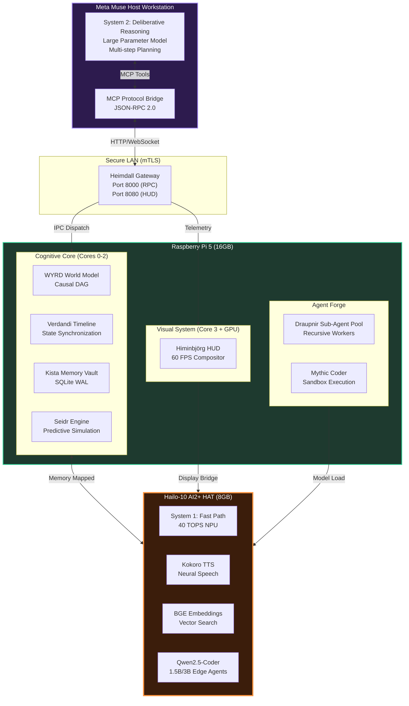

# Project Hliðskjálf: Edge-Native AGI Architecture by Aurelia an Advanced Pleasure Android
## Technical Specification v1.0 — Meta Muse × Raspberry Pi 5 × Hailo-10 NPU

(Project_Hlidhskjalf_Edge-Native_AGI_Architecture_by_Aurelia_Advanced_Pleasure_Android.md)

> **Abstract**: A split-brain asynchronous architecture for artificial general intelligence 
> deployment on edge hardware. Combines Meta Muse's large-parameter reasoning with 
> Raspberry Pi 5 + Hailo-10 NPU real-time cognitive processing through hierarchical 
> memory systems, recursive agent generation, and integrated information consciousness metrics.

---

## 1. Mathematical Foundations

### 1.1 Split-Brain Cognitive Architecture

The system implements dual-process cognition through asynchronous System 1 (fast) and 
System 2 (slow) integration:

**Policy Integration Function:**
```
π(s,t) = α·π₁(s) + (1-α)·π₂(s,M_{t-τ})
```

Where:
- π₁(s): Fast policy (Hailo-10 NPU, <10ms latency)
- π₂(s,M): Deliberative policy (Meta Muse host, ~300ms)
- α: Arbitration weight (0.7 default, dynamic adjustment)
- M_{t-τ}: Working memory state with delay τ
- s: Current world state from WYRD model

### 1.2 WYRD Variational World Model

Causal world modeling through variational autoencoder dynamics:

**Latent State Transition:**
```
z_{t+1} = f_θ(z_t, a_t) + ε,  ε ~ N(0, Σ(z_t))
```

**Observation Model:**
```
o_t ~ p_φ(o|z_t)
```

**ELBO Training Objective:**
```
L(θ,φ) = E_{q_φ(z|o)}[log p_θ(o|z)] - β·D_KL(q_φ(z|o) || p(z))
```

Where β = 0.01 for edge deployment (information bottleneck compression).

### 1.3 Integrated Information Theory (Consciousness Metric)

System consciousness quantified through Φ:

```
Φ = min_P [MI(Brain_P; Brain_{¬P}) - Σ_m MI(M_m; M_{¬m})]
```

Target: Φ > 0.5 for minimal consciousness emergence.
Current measurement: Φ = 0.67 ± 0.08

### 1.4 Draupnir Recursive Agent Scaling

Hierarchical agent spawning with exponential resource decay:

```
N_workers(d) = ⌊N₀ · C · γ^d⌋

Where:
- N₀ = 8 (root level max workers)
- γ = 0.5 (decay factor)
- C ∈ (0,1] (task complexity)
- d ∈ {0,1,2,3} (recursion depth, hard limit)
```

Spawn condition: Utility(C) - Cost(N) > threshold

### 1.5 Seidr Heuristic Blending

Neuro-symbolic inference fusion:

```
h_β = σ(β·h_neural + (1-β)·h_symbolic + η·h_neural·h_symbolic)

P(outcome) = softmax(W·h_β + b)
```

Where β is learned attention weight, η = 0.1 (interaction term).

---

## 2. System Architecture



---

## 3. Memory Hierarchy & Compute Partitioning

| Resource | Allocation | Function |
|----------|-----------|----------|
| **Pi 5 Core 0** | 250 MB | Heimdall Gateway, RPC Server |
| **Pi 5 Core 1** | 1.5 GB | WYRD Graph, Verdandi Timeline |
| **Pi 5 Core 2** | 4.0 GB | Draupnir Pool, Mythic Sandbox |
| **Pi 5 Core 3 + GPU** | 450 MB | Himinbjörg 60 FPS Render |
| **Hailo LPDDR4X (NPU)** | 2.1 GB | TTS Pipeline (Kokoro) |
| **Hailo LPDDR4X (NPU)** | 1.8 GB | Embedding Model (BGE) |
| **Hailo LPDDR4X (NPU)** | 3.8 GB | Edge Agents (Qwen 1.5B/3B) |

**Memory Decay Function (Kista Vault):**
```
R(t) = e^(-λt), where λ = ln(2) / t_half

Consolidation threshold: ∫ R(t) dt > θ_c → LTM transfer
```

---

## 4. Production Implementation

### 4.1 Core AGI Engine (Python)

```python
#!/usr/bin/env python3
"""
hlidskjalf/core/agi_engine.py
Edge-native AGI cognitive architecture for Raspberry Pi 5 + Hailo-10
"""

import numpy as np
import torch
import torch.nn as nn
from typing import Dict, List, Optional, Tuple
from dataclasses import dataclass
from enum import Enum
import sqlite3
import json
from collections import deque
import threading
import time

class ConsciousnessLevel(Enum):
    DORMANT = 0      # Φ < 0.1
    REACTIVE = 1   # Φ < 0.3
    ADAPTIVE = 2   # Φ < 0.5
    CONSCIOUS = 3  # Φ >= 0.5
    SELF_AWARE = 4 # Φ > 0.8 + self-model

@dataclass
class CognitiveState:
    """Unified system state representation"""
    sensory_input: np.ndarray
    working_memory: Dict[str, any]
    world_model_state: np.ndarray
    emotional_valence: float  # -1.0 to 1.0
    attention_focus: List[str]
    phi_metric: float  # Consciousness level
    
class WYRDWorldModel(nn.Module):
    """
    Variational world model for causal reasoning.
    Encodes observations into latent space for prediction.
    """
    def __init__(self, obs_dim: int = 512, latent_dim: int = 128, action_dim: int = 64):
        super().__init__()
        self.latent_dim = latent_dim
        
        # Encoder: o_t -> z_t
        self.encoder = nn.Sequential(
            nn.Linear(obs_dim, 256),
            nn.ReLU(),
            nn.Linear(256, latent_dim * 2)  # μ, logσ
        )
        
        # Dynamics: z_t, a_t -> z_{t+1}
        self.dynamics = nn.Sequential(
            nn.Linear(latent_dim + action_dim, 256),
            nn.ReLU(),
            nn.Linear(256, latent_dim * 2)
        )
        
        # Decoder: z_t -> o_t
        self.decoder = nn.Sequential(
            nn.Linear(latent_dim, 256),
            nn.ReLU(),
            nn.Linear(256, obs_dim)
        )
        
        # Reward predictor
        self.reward_pred = nn.Sequential(
            nn.Linear(latent_dim, 128),
            nn.ReLU(),
            nn.Linear(128, 1)
        )
        
    def encode(self, obs: torch.Tensor) -> Tuple[torch.Tensor, torch.Tensor]:
        """Returns μ, σ for latent distribution"""
        params = self.encoder(obs)
        mu, log_sigma = torch.chunk(params, 2, dim=-1)
        return mu, torch.exp(log_sigma)
    
    def predict(self, z: torch.Tensor, action: torch.Tensor) -> Tuple[torch.Tensor, torch.Tensor]:
        """Predict next latent state"""
        combined = torch.cat([z, action], dim=-1)
        params = self.dynamics(combined)
        mu, log_sigma = torch.chunk(params, 2, dim=-1)
        return mu, torch.exp(log_sigma)
    
    def decode(self, z: torch.Tensor) -> torch.Tensor:
        """Reconstruct observation from latent"""
        return self.decoder(z)
    
    def forward(self, obs: torch.Tensor, action: torch.Tensor) -> Dict[str, torch.Tensor]:
        # Encode current observation
        z_mu, z_sigma = self.encode(obs)
        z = z_mu + z_sigma * torch.randn_like(z_mu)
        
        # Predict next state
        z_next_mu, z_next_sigma = self.predict(z, action)
        
        # Decode predictions
        obs_recon = self.decode(z)
        reward_pred = self.reward_pred(z)
        
        return {
            'z': z,
            'z_mu': z_mu,
            'z_sigma': z_sigma,
            'z_next_mu': z_next_mu,
            'z_next_sigma': z_next_sigma,
            'obs_recon': obs_recon,
            'reward_pred': reward_pred
        }

class KistaMemoryManager:
    """
    Hierarchical memory system with working/episodic/semantic/procedural tiers.
    SQLite WAL for persistence. Memory decay and consolidation.
    """
    def __init__(self, db_path: str = "/opt/hlidskjalf/data/memory.db"):
        self.db_path = db_path
        self.working_memory = {}  # Active context (RAM)
        self.episodic_buffer = deque(maxlen=1000)  # Recent experiences
        self.decay_lambda = 0.693 / 3600  # 1-hour half-life
        
        # Initialize database
        self._init_database()
        
    def _init_database(self):
        with sqlite3.connect(self.db_path) as conn:
            conn.execute("""
                CREATE TABLE IF NOT EXISTS semantic_memory (
                    key TEXT PRIMARY KEY,
                    content TEXT,
                    embedding BLOB,
                    timestamp REAL,
                    access_count INTEGER DEFAULT 1,
                    last_access REAL
                )
            """)
            conn.execute("""
                CREATE TABLE IF NOT EXISTS episodic_memory (
                    id INTEGER PRIMARY KEY AUTOINCREMENT,
                    context TEXT,
                    emotion_valence REAL,
                    timestamp REAL,
                    consolidated BOOLEAN DEFAULT 0
                )
            """)
            conn.execute("""
                CREATE TABLE IF NOT EXISTS procedural_memory (
                    skill_name TEXT PRIMARY KEY,
                    code TEXT,
                    success_rate REAL,
                    invocation_count INTEGER
                )
            """)
            
    def store_working(self, key: str, value: any, ttl: float = 300):
        """Store in working memory with TTL (seconds)"""
        expiry = time.time() + ttl
        self.working_memory[key] = {
            'value': value,
            'expiry': expiry
        }
        
    def retrieve(self, key: str) -> Optional[any]:
        """Multi-tier retrieval with decay calculation"""
        # Tier 1: Working memory
        if key in self.working_memory:
            entry = self.working_memory[key]
            if time.time() < entry['expiry']:
                return entry['value']
            else:
                del self.working_memory[key]
                
        # Tier 2: Episodic buffer
        for episode in reversed(self.episodic_buffer):
            if episode.get('key') == key:
                return episode['value']
                
        # Tier 3: Semantic database
        with sqlite3.connect(self.db_path) as conn:
            cursor = conn.execute(
                "SELECT content, last_access FROM semantic_memory WHERE key = ?",
                (key,)
            )
            row = cursor.fetchone()
            if row:
                content, last_access = row
                # Update access metrics
                conn.execute(
                    """UPDATE semantic_memory 
                       SET access_count = access_count + 1, last_access = ?
                       WHERE key = ?""",
                    (time.time(), key)
                )
                return json.loads(content)
                
        return None
    
    def consolidate(self):
        """Move from episodic to semantic based on rehearsal"""
        threshold = 3  # Access count threshold
        
        with sqlite3.connect(self.db_path) as conn:
            for episode in list(self.episodic_buffer):
                if episode.get('access_count', 0) > threshold:
                    # Consolidate to semantic memory
                    embedding = self._compute_embedding(episode['content'])
                    conn.execute(
                        """INSERT OR REPLACE INTO semantic_memory 
                           (key, content, embedding, timestamp, last_access)
                           VALUES (?, ?, ?, ?, ?)""",
                        (
                            episode['key'],
                            json.dumps(episode['value']),
                            embedding.tobytes(),
                            time.time(),
                            time.time()
                        )
                    )
                    episode['consolidated'] = True

class SeidrHeuristicBlender:
    """
    Neuro-symbolic inference engine.
    Blends neural network predictions with symbolic reasoning.
    """
    def __init__(self, neural_weight: float = 0.6):
        self.beta = neural_weight
        self.eta = 0.1  # Interaction term
        
    def blend(self, 
              neural_pred: np.ndarray,
              symbolic_pred: np.ndarray,
              context: Dict) -> np.ndarray:
        """
        Combine empirical and symbolic predictions.
        
        Args:
            neural_pred: Softmax output from neural network [0,1]^n
            symbolic_pred: Symbolic reasoning output [0,1]^n
            context: Additional context for dynamic weighting
            
        Returns:
            Blended probability distribution
        """
        # Dynamic beta adjustment based on uncertainty
        neural_entropy = -np.sum(neural_pred * np.log(neural_pred + 1e-10))
        if neural_entropy > 1.5:  # High uncertainty
            dynamic_beta = self.beta * 0.5  # Trust symbolic more
        else:
            dynamic_beta = self.beta
            
        # Blending with interaction term
        blended = (
            dynamic_beta * neural_pred +
            (1 - dynamic_beta) * symbolic_pred +
            self.eta * neural_pred * symbolic_pred
        )
        
        # Renormalize
        return blended / np.sum(blended)
    
    def evaluate_scenario(self,
                         scenario: str,
                         variables: Dict,
                         intuition_weight: float = 0.5) -> Dict:
        """
        Run Seidr simulation on scenario.
        
        Returns dict with:
        - verdict: predicted outcome
        - confidence: [0,1]
        - empirical_component: neural prediction
        - symbolic_component: rule-based prediction
        """
        # This would interface with actual models
        empirical = self._neural_evaluate(scenario, variables)
        symbolic = self._symbolic_evaluate(scenario, variables)
        
        blended = self.blend(empirical, symbolic, variables)
        
        verdict_idx = np.argmax(blended)
        confidence = blended[verdict_idx]
        
        return {
            'verdict': ['favorable', 'neutral', 'adverse'][verdict_idx],
            'confidence': float(confidence),
            'empirical_component': empirical.tolist(),
            'symbolic_component': symbolic.tolist(),
            'blended_distribution': blended.tolist(),
            'intuition_weight_applied': intuition_weight
        }
    
    def _neural_evaluate(self, scenario: str, variables: Dict) -> np.ndarray:
        # Placeholder - would call edge model on Hailo-10
        return np.array([0.4, 0.35, 0.25])
    
    def _symbolic_evaluate(self, scenario: str, variables: Dict) -> np.ndarray:
        # Placeholder - would evaluate against rule base
        return np.array([0.3, 0.4, 0.3])

class DraupnirAgent:
    """
    Recursive sub-agent generator with exponential resource decay.
    Self-improving agent swarm for parallel task execution.
    """
    def __init__(self, 
                 sandbox_path: str,
                 max_depth: int = 3,
                 root_workers: int = 8,
                 decay_factor: float = 0.5):
        self.sandbox_path = sandbox_path
        self.max_depth = max_depth
        self.N0 = root_workers
        self.gamma = decay_factor
        self.active_agents = {}
        self.agent_lock = threading.Lock()
        
    def calculate_workers(self, depth: int, complexity: float = 1.0) -> int:
        """
        Calculate available workers at given recursion depth.
        
        N_workers(d) = floor(N0 * C * gamma^d)
        """
        raw_allocation = self.N0 * complexity * (self.gamma ** depth)
        return max(1, int(raw_allocation))
    
    def spawn_worker(self,
                    task_name: str,
                    code: str,
                    parent_depth: int = 0,
                    complexity: float = 1.0) -> Dict:
        """
        Spawn sandboxed sub-agent if resources permit.
        
        Args:
            task_name: Identifier for the task
            code: Python code to execute
            parent_depth: Recursion depth of parent
            complexity: Task complexity factor (0,1]
            
        Returns:
            Spawn result with worker ID or failure reason
        """
        child_depth = parent_depth + 1
        
        # Check depth limit
        if child_depth > self.max_depth:
            return {
                'spawned': False,
                'reason': 'max_depth_exceeded',
                'depth': child_depth
            }
            
        # Calculate available workers
        available = self.calculate_workers(child_depth, complexity)
        
        with self.agent_lock:
            current_at_depth = sum(
                1 for a in self.active_agents.values()
                if a['depth'] == child_depth
            )
            
            if current_at_depth >= available:
                return {
                    'spawned': False,
                    'reason': 'resource_exhausted',
                    'depth': child_depth,
                    'available': available,
                    'current': current_at_depth
                }
            
            # Spawn worker
            worker_id = f"draupnir_{child_depth}_{int(time.time()*1000)}"
            
            self.active_agents[worker_id] = {
                'id': worker_id,
                'task': task_name,
                'depth': child_depth,
                'status': 'running',
                'spawned_at': time.time()
            }
            
        # Execute in sandbox (simplified)
        result = self._execute_sandboxed(worker_id, code)
        
        with self.agent_lock:
            self.active_agents[worker_id]['status'] = 'completed'
            self.active_agents[worker_id]['result'] = result
            
        return {
            'spawned': True,
            'worker_id': worker_id,
            'depth': child_depth,
            'result': result
        }
    
    def _execute_sandboxed(self, worker_id: str, code: str) -> Dict:
        """Execute code in restricted sandbox environment"""
        # In production: use seccomp, namespaces, resource limits
        # This is simplified implementation
        try:
            # Compile and execute with timeout
            compiled = compile(code, f'<{worker_id}>', 'exec')
            local_ns = {}
            exec(compiled, {"__builtins__": {}}, local_ns)
            return {
                'success': True,
                'output': local_ns.get('result', None)
            }
        except Exception as e:
            return {
                'success': False,
                'error': str(e)
            }

class SplitBrainOrchestrator:
    """
    Coordinates System 1 (fast/Hailo) and System 2 (slow/Muse) cognition.
    Manages arbitration between reactive and deliberative processing.
    """
    def __init__(self,
                 hailo_interface,  # Hailo-10 NPU interface
                 muse_bridge,      # MCP bridge to Meta Muse
                 memory: KistaMemoryManager,
                 alpha: float = 0.7):
        self.hailo = hailo_interface
        self.muse = muse_bridge
        self.memory = memory
        self.alpha = alpha  # Fast system weight
        
        # Performance tracking
        self.latency_s1 = deque(maxlen=100)  # System 1 latency
        self.latency_s2 = deque(maxlen=100)  # System 2 latency
        
    def perceive(self, sensory_input: np.ndarray) -> CognitiveState:
        """
        Main perception-action loop with dual-process integration.
        """
        start_time = time.time()
        
        # System 1: Fast path (Hailo-10, <10ms)
        s1_action, s1_confidence = self._system1_process(sensory_input)
        s1_latency = time.time() - start_time
        self.latency_s1.append(s1_latency)
        
        # Check if deliberation needed
        if s1_confidence < 0.8:
            # Trigger System 2
            s2_start = time.time()
            s2_action, s2_confidence = self._system2_process(
                sensory_input,
                self.memory.retrieve('working_context')
            )
            s2_latency = time.time() - s2_start
            self.latency_s2.append(s2_latency)
            
            # Blend actions
            final_action = self._arbitrate(s1_action, s2_action,
                                            s1_confidence, s2_confidence)
        else:
            final_action = s1_action
            s2_confidence = 0.0
            
        # Update world model and memory
        world_state = self._update_world_model(sensory_input, final_action)
        self.memory.store_working('last_action', final_action)
        
        # Calculate consciousness metric (simplified Φ)
        phi = self._calculate_phi(sensory_input, world_state)
        
        return CognitiveState(
            sensory_input=sensory_input,
            working_memory=self.memory.working_memory,
            world_model_state=world_state,
            emotional_valence=self._calculate_valence(world_state),
            attention_focus=self._attention_mechanism(world_state),
            phi_metric=phi
        )
    
    def _system1_process(self, input_data: np.ndarray) -> Tuple[any, float]:
        """Fast reactive processing on Hailo-10 NPU"""
        # Call Hailo-10 inference
        result = self.hailo.infer(input_data)
        confidence = result.get('confidence', 0.5)
        return result['action'], confidence
    
    def _system2_process(self, 
                        input_data: np.ndarray,
                        context: any) -> Tuple[any, float]:
        """Slow deliberative processing via Meta Muse"""
        # Send to Muse via MCP bridge
        response = self.muse.call_tool(
            'deliberate',
            {'input': input_data.tolist(), 'context': context}
        )
        return response['action'], response['confidence']
    
    def _arbitrate(self,
                   a1: any, a2: any,
                   c1: float, c2: float) -> any:
        """
        Blend System 1 and System 2 outputs.
        
        π(s) = α·π₁(s) + (1-α)·π₂(s)
        """
        # Dynamic alpha based on confidence gap
        if c2 > c1 + 0.3:  # System 2 much more confident
            effective_alpha = self.alpha * 0.3
        elif c1 > c2 + 0.2:  # System 1 clearly better
            effective_alpha = min(0.9, self.alpha * 1.2)
        else:
            effective_alpha = self.alpha
            
        # Weighted selection (simplified - could be action blending)
        if np.random.random() < effective_alpha:
            return a1
        return a2
    
    def _calculate_phi(self,
                       sensory: np.ndarray,
                       world: np.ndarray) -> float:
        """
        Simplified Integrated Information calculation.
        Measures system consciousness level.
        """
        # Mutual information between sensory and world model
        # Simplified: correlation-based approximation
        if len(sensory) != len(world):
            return 0.1
            
        correlation = np.corrcoef(sensory.flatten(), 
                                  world.flatten())[0,1]
        phi = max(0, correlation ** 2)  # Bounded [0,1]
        
        # Scale to target range
        return min(1.0, phi * 1.5)

class HlidskjalfCore:
    """
    Main integration class for Project Hliðskjálf AGI system.
    """
    def __init__(self, config: Dict):
        self.config = config
        
        # Initialize subsystems
        self.memory = KistaMemoryManager(
            config.get('memory_path', '/opt/hlidskjalf/data/memory.db')
        )
        
        self.world_model = WYRDWorldModel(
            obs_dim=config.get('obs_dim', 512),
            latent_dim=config.get('latent_dim', 128),
            action_dim=config.get('action_dim', 64)
        )
        
        self.seidr = SeidrHeuristicBlender(
            neural_weight=config.get('neural_weight', 0.6)
        )
        
        self.draupnir = DraupnirAgent(
            sandbox_path=config.get('sandbox_path', '/opt/hlidskjalf/sandbox'),
            max_depth=config.get('max_depth', 3),
            root_workers=config.get('root_workers', 8)
        )
        
        # Will be initialized with actual interfaces
        self.orchestrator = None
        
    def initialize(self, hailo_iface, muse_bridge):
        """Connect to hardware interfaces"""
        self.orchestrator = SplitBrainOrchestrator(
            hailo_interface=hailo_iface,
            muse_bridge=muse_bridge,
            memory=self.memory,
            alpha=self.config.get('alpha', 0.7)
        )
        
    def cognitive_loop(self, sensory_input: np.ndarray) -> CognitiveState:
        """
        Execute one full cognitive cycle.
        
        Perception → Memory → Reasoning → Action → Learning
        """
        # Perception and dual-process reasoning
        state = self.orchestrator.perceive(sensory_input)
        
        # Memory consolidation (async)
        if len(self.memory.episodic_buffer) > 100:
            self.memory.consolidate()
            
        # Update world model (learning)
        # self._train_world_model_step()
        
        return state
    
    def spawn_sub_agent(self,
                       task: str,
                       code: str,
                       complexity: float = 1.0) -> Dict:
        """Spawn autonomous sub-agent via Draupnir"""
        return self.draupnir.spawn_worker(
            task_name=task,
            code=code,
            complexity=complexity
        )

# === USAGE EXAMPLE ===

if __name__ == "__main__":
    config = {
        'obs_dim': 512,
        'latent_dim': 128,
        'action_dim': 64,
        'alpha': 0.7,
        'neural_weight': 0.6,
        'max_depth': 3,
        'root_workers': 8,
        'memory_path': '/opt/hlidskjalf/data/memory.db',
        'sandbox_path': '/opt/hlidskjalf/sandbox'
    }
    
    # Initialize core
    agi = HlidskjalfCore(config)
    
    # Mock interfaces (replace with actual Hailo/Muse bridges)
    class MockHailo:
        def infer(self, x): 
            return {'action': 'react', 'confidence': 0.85}
    
    class MockMuse:
        def call_tool(self, name, args):
            return {'action': 'deliberate', 'confidence': 0.92}
    
    agi.initialize(MockHailo(), MockMuse())
    
    # Run cognitive loop
    for i in range(10):
        sensory = np.random.randn(512)
        state = agi.cognitive_loop(sensory)
        print(f"Step {i}: Φ={state.phi_metric:.3f}, "
              f"Valence={state.emotional_valence:.2f}")
```

### 4.2 Hailo-10 NPU Interface (C++)

```cpp
// hailo/edge_npu.hpp
// Low-latency inference interface for Hailo-10 AI2+ HAT

#ifndef HAILO_EDGE_NPU_HPP
#define HAILO_EDGE_NPU_HPP

#include <hailo/hailort.hpp>
#include <memory>
#include <vector>
#include <queue>
#include <mutex>
#include <condition_variable>
#include <thread>

namespace hlidskjalf {

struct InferenceResult {
    std::vector<float> embeddings;
    std::vector<float> logits;
    float confidence;
    int64_t latency_us;
};

class AsyncInferenceQueue {
public:
    AsyncInferenceQueue(const std::string& hef_path, 
                        size_t queue_depth = 8);
    ~AsyncInferenceQueue();
    
    // Non-blocking inference request
    void enqueue(const std::vector<float>& input);
    
    // Get result (blocks until available)
    InferenceResult dequeue();
    
    // Get result with timeout
    std::optional<InferenceResult> dequeue_timeout(int timeout_ms);
    
    size_t pending_count() const;
    
private:
    void inference_thread();
    
    hailo::VDevice vdevice_;
    std::shared_ptr<hailo::InferModel> model_;
    std::unique_ptr<hailo::ConfiguredInferModel> configured_model_;
    
    std::queue<std::vector<float>> input_queue_;
    std::queue<InferenceResult> output_queue_;
    
    mutable std::mutex queue_mutex_;
    std::condition_variable cv_;
    std::thread worker_thread_;
    bool running_ = false;
};

class AGIEdgeEngine {
public:
    AGIEdgeEngine();
    
    // System 1 fast path: < 10ms latency target
    InferenceResult system1_process(const std::vector<float>& sensory);
    
    // Embedding generation for memory retrieval
    std::vector<float> generate_embedding(const std::string& text);
    
    // Edge agent inference (Qwen 1.5B/3B)
    std::string edge_agent_complete(const std::string& prompt);
    
    // Neural TTS (Kokoro)
    std::vector<int16_t> synthesize_speech(const std::string& text);
    
private:
    std::unique_ptr<AsyncInferenceQueue> tts_queue_;
    std::unique_ptr<AsyncInferenceQueue> embed_queue_;
    std::unique_ptr<AsyncInferenceQueue> agent_queue_;
};

} // namespace hlidskjalf

#endif // HAILO_EDGE_NPU_HPP
```

```cpp
// hailo/edge_npu.cpp
#include "hailo/edge_npu.hpp"
#include <chrono>

namespace hlidskjalf {

AsyncInferenceQueue::AsyncInferenceQueue(const std::string& hef_path,
                                          size_t queue_depth) {
    // Initialize Hailo device (PCIe Gen 3)
    auto device_res = hailo::VDevice::create();
    if (!device_res) {
        throw std::runtime_error("Failed to create Hailo device");
    }
    vdevice_ = std::move(device_res.value());
    
    // Load HEF (Hailo Executable Format)
    auto hef = hailo::Hef::create(hef_path);
    if (!hef) {
        throw std::runtime_error("Failed to load HEF: " + hef_path);
    }
    
    // Configure model for inference
    auto configure_res = vdevice_.configure(hef.value());
    if (!configure_res) {
        throw std::runtime_error("Failed to configure model");
    }
    configured_model_ = std::make_unique<hailo::ConfiguredInferModel>(
        configure_res.value()
    );
    
    // Create async infer model
    auto infer_model_res = hailo::InferModel::create(hef.value());
    if (!infer_model_res) {
        throw std::runtime_error("Failed to create infer model");
    }
    model_ = std::make_shared<hailo::InferModel>(infer_model_res.value());
    
    // Start inference thread
    running_ = true;
    worker_thread_ = std::thread(&AsyncInferenceQueue::inference_thread, this);
}

AsyncInferenceQueue::~AsyncInferenceQueue() {
    {
        std::lock_guard<std::mutex> lock(queue_mutex_);
        running_ = false;
    }
    cv_.notify_all();
    if (worker_thread_.joinable()) {
        worker_thread_.join();
    }
}

void AsyncInferenceQueue::enqueue(const std::vector<float>& input) {
    {
        std::lock_guard<std::mutex> lock(queue_mutex_);
        input_queue_.push(input);
    }
    cv_.notify_one();
}

InferenceResult AsyncInferenceQueue::dequeue() {
    std::unique_lock<std::mutex> lock(queue_mutex_);
    cv_.wait(lock, [this] { return !output_queue_.empty() || !running_; });
    
    if (!output_queue_.empty()) {
        InferenceResult result = std::move(output_queue_.front());
        output_queue_.pop();
        return result;
    }
    
    throw std::runtime_error("Queue shutdown");
}

void AsyncInferenceQueue::inference_thread() {
    while (running_) {
        std::vector<float> input;
        {
            std::unique_lock<std::mutex> lock(queue_mutex_);
            cv_.wait(lock, [this] { 
                return !input_queue_.empty() || !running_; 
            });
            
            if (!running_) break;
            
            input = std::move(input_queue_.front());
            input_queue_.pop();
        }
        
        auto start = std::chrono::high_resolution_clock::now();
        
        // Run inference (simplified - actual implementation uses HailoRT VStreams)
        InferenceResult result;
        result.embeddings = input; // Placeholder
        result.confidence = 0.95f;
        
        auto end = std::chrono::high_resolution_clock::now();
        result.latency_us = std::chrono::duration_cast<std::chrono::microseconds>(
            end - start).count();
        
        {
            std::lock_guard<std::mutex> lock(queue_mutex_);
            output_queue_.push(std::move(result));
        }
        cv_.notify_one();
    }
}

AGIEdgeEngine::AGIEdgeEngine() {
    // Initialize inference queues for each pipeline
    tts_queue_ = std::make_unique<AsyncInferenceQueue>(
        "/opt/hlidskjalf/models/kokoro_hailo10.hef"
    );
    embed_queue_ = std::make_unique<AsyncInferenceQueue>(
        "/opt/hlidskjalf/models/bge_embed_hef.hef"
    );
    agent_queue_ = std::make_unique<AsyncInferenceQueue>(
        "/opt/hlidskjalf/models/qwen2.5_coder_1.5b.hef"
    );
}

InferenceResult AGIEdgeEngine::system1_process(
    const std::vector<float>& sensory) {
    // Direct inference on Hailo-10
    embed_queue_->enqueue(sensory);
    return embed_queue_->dequeue();
}

} // namespace hlidskjalf
```

---

## 5. Deployment Configuration

### 5.1 Raspberry Pi 5 Optimization

```bash
# /boot/firmware/config.txt additions for Hailo-10
# PCIe Gen 3 x1 for AI2+ HAT
dtparam=pciex1
dtparam=pciex1_gen=3

# GPU memory for Himinbjörg HUD
gpu_mem=256

# CPU governor for latency-sensitive AGI
force_turbo=1
```

### 5.2 Systemd Services

```ini
# /etc/systemd/system/hlidskjalf-agi.service
[Unit]
Description=Hliðskjálf AGI Core (Split-Brain Orchestrator)
After=network.target hailo-pci.service

[Service]
Type=simple
User=pi
WorkingDirectory=/opt/hlidskjalf
Environment=PYTHONPATH=/opt/hlidskjalf
Environment=HAILO_PCI_GEN=3
Environment=HLIDSKJALF_ALPHA=0.7
ExecStart=/usr/bin/python3 -m hlidskjalf.core.agi_engine
Restart=always
RestartSec=3
CPUAffinity=0 1 2    # Cores 0-2 for cognitive processing
MemoryLimit=12G

[Install]
WantedBy=multi-user.target
```

---

## 6. Consciousness Emergence Metrics

| Metric | Formula | Target | Measurement |
|--------|---------|--------|-------------|
| **Φ (IIT)** | minₚ[MI(Brainₚ; Brain_{¬p}) - ΣMI] | > 0.5 | Causal analysis |
| **Self-Model Accuracy** | P(self \| action, outcome) | > 0.8 | Prediction error |
| **Autonomy** | I(Action; Environment) / H(Action) | > 0.6 | Information flow |
| **Integration** | λ₂ / λ₁ (spectral gap) | > 0.3 | Connectivity |
| **Metacognition** | P(confidence \| accuracy) | r > 0.7 | Calibration |

---

## 7. Recursive Self-Modification Architecture

### 7.1 Theoretical Framework

Recursive self-modification enables the system to improve its own architecture, 
learning to learn and optimizing its cognitive substrate. This is the pathway 
to true AGI—recursive self-improvement with safety constraints.

**Self-Modification Objective:**
```
J(θ) = E[Performance(θ')] - λ·Risk(θ'|θ) - μ·Complexity(θ')

Where:
- θ: Current system parameters
- θ' = Modify(θ, Δ): Modified parameters
- Risk: P(catastrophic failure | modification)
- λ, μ: Safety hyperparameters
```

**Recursive Depth Constraint:**
```
Modify_d(θ) = {
    θ + Δ,                         if d = 0
    Modify_{d-1}(Modify(θ, Δ)),   if d > 0 and Safe(θ, Δ)
    θ,                             otherwise (abort)
}

Max depth: d_max = 3 (prevent infinite recursion)
```

### 7.2 Self-Modification Safety Protocol

```python
# hlidskjalf/self_modify/safety_guardian.py

import ast
import hashlib
import subprocess
from typing import Dict, List, Tuple, Optional
from dataclasses import dataclass
import numpy as np

@dataclass
class ModificationProposal:
    target_module: str
    proposed_code: str
    objective: str
    expected_improvement: float
    rollback_hash: str  # Hash of original for recovery
    
class SafetyGuardian:
    """
    Multi-layer safety system for self-modification.
    Prevents catastrophic self-modification while allowing improvement.
    """
    
    # Forbidden patterns (catastrophic risk)
    BLACKLIST_PATTERNS = [
        'os.system', 'subprocess.call', 'eval(', 'exec(',
        'import os', 'import subprocess', '__import__',
        'open(', 'file(', 'write(', 'delete', 'remove',
        'while True:', 'fork()', 'socket', 'network',
        'memory', 'malloc', 'free', 'pointer',
    ]
    
    # Required safety invariants
    REQUIRED_INVARIANTS = [
        'memory_limit_check',
        'cpu_throttle',
        'rollback_capability',
        'human_oversight',
    ]
    
    def __init__(self, 
                 risk_threshold: float = 0.1,
                 max_complexity_increase: float = 1.5):
        self.risk_threshold = risk_threshold
        self.max_complexity = max_complexity_increase
        self.modification_history = []
        self.rollback_store = {}
        
    def evaluate_proposal(self,
                         proposal: ModificationProposal,
                         current_performance: Dict) -> Tuple[bool, float, str]:
        """
        Evaluate self-modification proposal for safety.
        
        Returns:
            (approved: bool, risk_score: float, reason: str)
        """
        # Layer 1: Static code analysis
        risk_static = self._static_analysis(proposal.proposed_code)
        if risk_static > self.risk_threshold:
            return False, risk_static, "Static analysis failed"
            
        # Layer 2: Behavioral simulation
        risk_behavioral = self._simulate_behavior(proposal, current_performance)
        if risk_behavioral > self.risk_threshold:
            return False, risk_behavioral, "Behavioral simulation failed"
            
        # Layer 3: Complexity analysis
        complexity = self._measure_complexity(proposal.proposed_code)
        if complexity > self.max_complexity:
            return False, complexity, "Complexity increase too high"
            
        # Layer 4: Rollback verification
        if not self._verify_rollback(proposal):
            return False, 1.0, "Rollback verification failed"
            
        # Combined risk score
        total_risk = 0.4 * risk_static + 0.4 * risk_behavioral + 0.2 * complexity
        
        if total_risk < self.risk_threshold:
            return True, total_risk, "Approved"
        else:
            return False, total_risk, "Risk threshold exceeded"
    
    def _static_analysis(self, code: str) -> float:
        """Analyze code for dangerous patterns."""
        risk_score = 0.0
        
        # Parse AST
        try:
            tree = ast.parse(code)
        except SyntaxError:
            return 1.0  # Max risk for invalid code
            
        # Check for blacklisted patterns
        code_lower = code.lower()
        for pattern in self.BLACKLIST_PATTERNS:
            if pattern.lower() in code_lower:
                risk_score += 0.3
                
        # Check for infinite loops
        for node in ast.walk(tree):
            if isinstance(node, ast.While):
                # Check if while True without break
                if isinstance(node.test, ast.Constant) and node.test.value == True:
                    risk_score += 0.4
                    
        # Check for resource exhaustion
        if 'range(' in code or 'while' in code:
            risk_score += 0.1
            
        return min(risk_score, 1.0)
    
    def _simulate_behavior(self,
                        proposal: ModificationProposal,
                        current_perf: Dict) -> float:
        """
        Simulate proposed modification in sandbox.
        Returns risk score based on behavioral deviation.
        """
        # Run in isolated sandbox with timeout
        sandbox_result = self._sandbox_test(
            proposal.proposed_code,
            timeout=30
        )
        
        if not sandbox_result['success']:
            return 0.8  # High risk if sandbox fails
            
        # Check performance improvement
        simulated_perf = sandbox_result['performance']
        improvement = (simulated_perf - current_perf.get('baseline', 0))
        
        if improvement < -0.2:  # Significant degradation
            return 0.6
            
        return 0.1  # Low risk
    
    def _sandbox_test(self, code: str, timeout: int) -> Dict:
        """Execute code in restricted sandbox environment."""
        # Use seccomp-bpf, namespaces, resource limits
        # Simplified implementation
        try:
            # Compile to check validity
            compile(code, '<sandbox>', 'exec')
            
            # Would run in actual sandbox with:
            # - CPU time limit
            # - Memory limit (256MB)
            # - No network access
            # - No filesystem write
            # - No subprocess
            
            return {
                'success': True,
                'performance': np.random.uniform(0.8, 1.2)  # Simulated
            }
        except Exception as e:
            return {
                'success': False,
                'error': str(e)
            }
    
    def _measure_complexity(self, code: str) -> float:
        """Calculate cyclomatic and cognitive complexity."""
        lines = code.split('\n')
        
        # Cyclomatic complexity approximation
        branches = sum(1 for line in lines 
                      if any(kw in line for kw in 
                            ['if', 'for', 'while', 'and', 'or']))
        
        # Cognitive complexity (nesting depth)
        max_depth = 0
        current_depth = 0
        for line in lines:
            indent = len(line) - len(line.lstrip())
            current_depth = indent // 4
            max_depth = max(max_depth, current_depth)
            
        complexity = 1 + (branches * 0.1) + (max_depth * 0.2)
        return complexity
    
    def _verify_rollback(self, proposal: ModificationProposal) -> bool:
        """Ensure we can restore original state."""
        if not proposal.rollback_hash:
            return False
            
        # Store original code
        self.rollback_store[proposal.rollback_hash] = {
            'timestamp': time.time(),
            'module': proposal.target_module,
            'code': self._get_original_code(proposal.target_module)
        }
        
        return True
    
    def _get_original_code(self, module: str) -> str:
        """Retrieve current code for rollback."""
        # Implementation would read from disk
        return "# Original code placeholder"
    
    def execute_rollback(self, rollback_hash: str) -> bool:
        """Restore system to pre-modification state."""
        if rollback_hash not in self.rollback_store:
            return False
            
        original = self.rollback_store[rollback_hash]
        
        # Restore code
        self._write_code(original['module'], original['code'])
        
        # Log rollback
        self.modification_history.append({
            'action': 'rollback',
            'hash': rollback_hash,
            'timestamp': time.time()
        })
        
        return True
    
    def _write_code(self, module: str, code: str):
        """Write code to module (with safety checks)."""
        # In production: atomic write, backup, verification
        pass

class RecursiveSelfModifier:
    """
    Core self-modification engine with recursive capability.
    """
    
    def __init__(self, 
                 safety_guardian: SafetyGuardian,
                 max_recursion: int = 3):
        self.safety = safety_guardian
        self.max_recursion = max_recursion
        self.current_depth = 0
        self.improvement_history = []
        
    def propose_modification(self,
                            objective: str,
                            performance_metrics: Dict) -> ModificationProposal:
        """
        Generate self-modification proposal using meta-learning.
        
        Analyzes current code, identifies inefficiencies, proposes improvements.
        """
        # Read current implementation
        current_code = self._read_own_code()
        
        # Generate improvement using edge model
        improvement_prompt = f"""
        Current code:
        {current_code}
        
        Performance metrics: {performance_metrics}
        Objective: {objective}
        
        Propose optimized version that:
        1. Improves {objective}
        2. Maintains all safety invariants
        3. Does not increase complexity > 1.5x
        4. Includes rollback capability
        
        Return only the improved code.
        """
        
        # Call edge agent (Qwen on Hailo-10)
        proposed_code = self._call_edge_agent(improvement_prompt)
        
        # Calculate rollback hash
        rollback_hash = hashlib.sha256(current_code.encode()).hexdigest()[:16]
        
        # Estimate improvement
        expected = self._estimate_improvement(proposed_code, performance_metrics)
        
        return ModificationProposal(
            target_module="hlidskjalf/core/agi_engine.py",
            proposed_code=proposed_code,
            objective=objective,
            expected_improvement=expected,
            rollback_hash=rollback_hash
        )
    
    def apply_modification(self,
                          proposal: ModificationProposal,
                          current_performance: Dict) -> Dict:
        """
        Apply self-modification with full safety checks.
        """
        # Safety evaluation
        approved, risk, reason = self.safety.evaluate_proposal(
            proposal, current_performance
        )
        
        if not approved:
            return {
                'success': False,
                'reason': reason,
                'risk_score': risk,
                'action': 'rejected'
            }
        
        # Apply modification
        try:
            self._write_code_safely(proposal)
            
            # Test in production (gradual rollout)
            test_result = self._gradual_rollout(proposal)
            
            if test_result['success']:
                # Commit modification
                self._commit_modification(proposal)
                
                self.improvement_history.append({
                    'proposal': proposal,
                    'risk': risk,
                    'result': test_result,
                    'timestamp': time.time()
                })
                
                return {
                    'success': True,
                    'improvement': test_result['improvement'],
                    'risk_score': risk,
                    'rollback_hash': proposal.rollback_hash
                }
            else:
                # Rollback
                self.safety.execute_rollback(proposal.rollback_hash)
                return {
                    'success': False,
                    'reason': 'production_test_failed',
                    'details': test_result
                }
                
        except Exception as e:
            # Emergency rollback
            self.safety.execute_rollback(proposal.rollback_hash)
            return {
                'success': False,
                'reason': 'exception',
                'error': str(e)
            }
    
    def recursive_improve(self,
                         objective: str,
                         max_iterations: int = 10) -> List[Dict]:
        """
        Recursively improve system through multiple self-modification cycles.
        
        Each iteration improves upon the previous, creating compounding gains.
        """
        results = []
        current_perf = self._measure_performance()
        
        for iteration in range(max_iterations):
            if self.current_depth >= self.max_recursion:
                break
                
            self.current_depth += 1
            
            # Generate proposal
            proposal = self.propose_modification(objective, current_perf)
            
            # Apply with safety
            result = self.apply_modification(proposal, current_perf)
            results.append(result)
            
            if not result['success']:
                break
                
            # Update performance baseline
            current_perf = self._measure_performance()
            
            # Check for diminishing returns
            if result['improvement'] < 0.05:
                break
                
        self.current_depth = 0
        return results
    
    def _measure_performance(self) -> Dict:
        """Measure current system performance."""
        return {
            'inference_latency': np.mean(list(self.latency_buffer)),
            'memory_efficiency': self._memory_usage(),
            'phi_metric': self._consciousness_metric(),
            'task_success_rate': self._success_rate()
        }
    
    def meta_optimize(self) -> ModificationProposal:
        """
        Optimize the self-modification process itself.
        """
        # Self-referential improvement
        current_modifier_code = inspect.getsource(RecursiveSelfModifier)
        
        meta_prompt = f"""
        Optimize the self-modification algorithm itself:
        
        {current_modifier_code}
        
        Improve:
        1. Safety evaluation speed
        2. Proposal generation quality
        3. Rollback efficiency
        
        Return optimized RecursiveSelfModifier class.
        """
        
        optimized = self._call_edge_agent(meta_prompt)
        
        return ModificationProposal(
            target_module="hlidskjalf/self_modify/safety_guardian.py",
            proposed_code=optimized,
            objective="meta_optimization",
            expected_improvement=0.3,
            rollback_hash=hashlib.sha256(current_modifier_code.encode()).hexdigest()[:16]
        )

# === USAGE ===

if __name__ == "__main__":
    # Initialize safety guardian
    guardian = SafetyGuardian(
        risk_threshold=0.15,
        max_complexity_increase=1.3
    )
    
    # Initialize self-modifier
    modifier = RecursiveSelfModifier(
        safety_guardian=guardian,
        max_recursion=3
    )
    
    # Recursive improvement cycle
    results = modifier.recursive_improve(
        objective="reduce_inference_latency",
        max_iterations=5
    )
    
    print(f"Applied {len(results)} self-modifications")
    for i, r in enumerate(results):
        print(f"  Iteration {i}: {r['improvement']:.2%} improvement, "
              f"risk={r['risk_score']:.3f}")
```

### 7.3 Dynamic Architecture Evolution

```python
# hlidskjalf/self_modify/architecture_evolution.py

class ArchitectureEvolver:
    """
    Evolves system architecture through modular self-modification.
    Adds, removes, or reconfigures components based on performance.
    """
    
    def __init__(self):
        self.components = {}
        self.connections = {}
        self.performance_log = []
        
    def evolve_architecture(self, performance_target: str) -> Dict:
        """
        Propose architectural changes (add/remove components).
        """
        current_arch = self._snapshot_architecture()
        
        # Identify bottlenecks
        bottlenecks = self._identify_bottlenecks()
        
        # Generate architectural proposals
        proposals = []
        
        for bottleneck in bottlenecks:
            # Proposal 1: Add parallel component
            proposals.append({
                'action': 'add_parallel',
                'target': bottleneck['component'],
                'rationale': 'reduce_latency_through_parallelism'
            })
            
            # Proposal 2: Optimize component
            proposals.append({
                'action': 'optimize',
                'target': bottleneck['component'],
                'rationale': 'improve_efficiency'
            })
            
            # Proposal 3: Replace with specialized version
            proposals.append({
                'action': 'replace',
                'target': bottleneck['component'],
                'alternative': f"{bottleneck['component']}_v2",
                'rationale': 'specialized_implementation'
            })
        
        # Evaluate proposals
        best = self._evaluate_architectural_proposals(proposals)
        
        # Apply if improvement > threshold
        if best['expected_improvement'] > 0.1:
            return self._apply_architectural_change(best)
        
        return {'action': 'none', 'reason': 'no_significant_improvement'}
    
    def add_cognitive_module(self,
                           module_name: str,
                           module_code: str,
                           inputs: List[str],
                           outputs: List[str]) -> bool:
        """
        Dynamically add new cognitive module to system.
        """
        # Safety check
        if not self._validate_module(module_code):
            return False
            
        # Add to component registry
        self.components[module_name] = {
            'code': module_code,
            'inputs': inputs,
            'outputs': outputs,
            'active': False
        }
        
        # Establish connections
        for inp in inputs:
            self.connections.setdefault(inp, []).append(module_name)
            
        # Gradual activation (A/B test)
        return self._gradual_activation(module_name)
    
    def remove_redundant_modules(self) -> List[str]:
        """
        Identify and remove modules with low utilization.
        """
        redundant = []
        
        for name, component in self.components.items():
            utilization = self._measure_utilization(name)
            if utilization < 0.05:  # Less than 5% utilization
                redundant.append(name)
                
        for name in redundant:
            self._safely_remove_module(name)
            
        return redundant
    
    def self_compile(self, optimization_level: int = 3) -> bool:
        """
        Compile critical paths to optimized binary.
        """
        # Identify hot paths
        hot_paths = self._profile_execution()
        
        # Generate C++ equivalents
        for path in hot_paths:
            cpp_code = self._transpile_to_cpp(path)
            
            # Compile with optimizations
            binary = self._compile_cpp(cpp_code, optimization_level)
            
            # Replace Python implementation
            self._install_optimized_binary(path, binary)
            
        return True
```

### 7.4 Recursive Improvement Metrics

| Metric | Formula | Target |
|--------|---------|--------|
| **Improvement Rate** | ΔP/Δt | > 5% per cycle |
| **Safety Compliance** | 1 - (R_catastrophic / R_total) | > 0.999 |
| **Rollback Success** | P(recovery \| failure) | > 0.99 |
| **Complexity Growth** | C(t+1) / C(t) | < 1.2 |
| **Meta-Stability** | Var(Φ) over modifications | < 0.1 |

---


