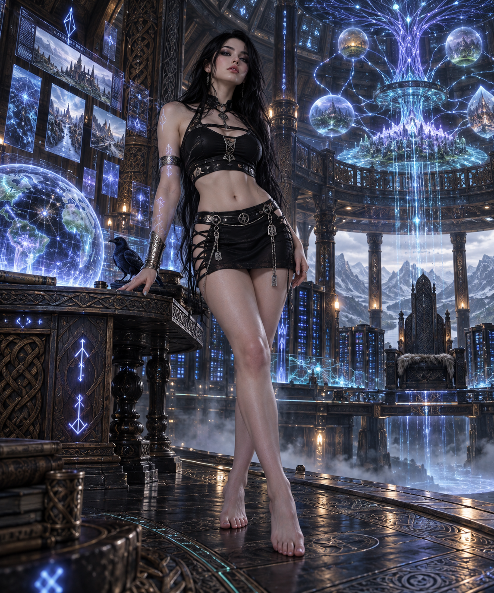
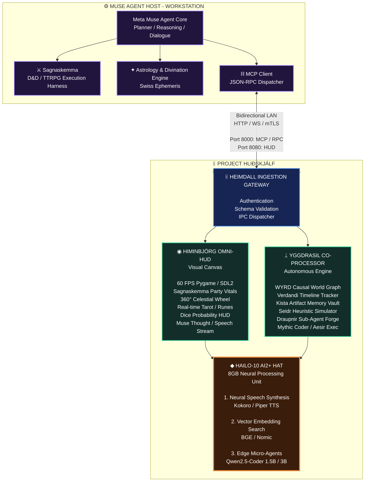

---

# RuneForgeAI: Project Hliðskjálf

Hliðskjálf-Edge-Core is an edge co-processor and real-time HUD for Meta Muse on a Raspberry Pi 5 + Hailo-10 NPU. It unifies Himinbjörg's 60 FPS visual dashboard for TTRPG and divination telemetry with Yggdrasil's autonomous cognitive engine for causal world modeling, persistent memory, and local neural voice synthesis.

---



---


---

##1. System Vision & Architecture
Project Hliðskjálf establishes a Split-Brain Asynchronous Edge Architecture. High-parameter reasoning, multi-step planning, and agent conversational loops execute on Meta Muse's primary host workstation. Concurrently, the physical edge terminal—a Raspberry Pi 5 (16GB RAM) equipped with a Hailo-10 AI2+ M.2 HAT (8GB dedicated LPDDR4X memory)—acts as an autonomous perceptual canvas, memory vault, and local cognitive co-processor.
flowchart TB



---

## 2. Integrated Ecosystem & Lineage
Hliðskjálf merges, synthesizes, and builds directly upon the following repositories and architectural frameworks:
 * Sagnaskemma Engine
   * Role: Tabletop roleplaying game lore database, encounter tracking, combat math, and character progression engine. Provides party vitals, armor class parameters, roll outputs, and atmospheric encounter narrative strings.
 * Astrology Engine
   * Role: Swiss Ephemeris celestial mechanics calculator, tropical zodiac transit calculator, Chaldean planetary hours engine, and modular Tarot/Elder Futhark oracle spread generator.
 * Hermes Agent RuneForgeAI Hack
   * Role: Upgraded agent tool-calling protocol, self-healing code loops, dynamic prompt injection patterns, and resilient error recovery harnesses adapted for autonomous execution.
 * Heimdall SL Hermes Agent
   * Role: Security sentry, inbound parameter verification, mTLS encryption, rate limiting, and defensive gateway protecting edge hardware from unauthorized or malformed execution payloads.
 * WYRD Protocol World Model
   * Role: Directed Acyclic Graph (DAG) representing world causality, entity relationships, environmental attributes, and multi-timeline state progression.
 * Verdandi
   * Role: Real-time present-state synchronizer. Establishes a firewall between potential futures and manifest reality, anchoring the system to validated time-space coordinates and pruning speculative graph drift.
 * Kista
   * Role: Persistent cold-storage vault, SQLite WAL key-value store, and structured document repository for persistent world data, campaign logs, and system checkpoints.
 * Hermes State
   * Role: Dynamic state serialization framework, memory decay algorithms, conversation context caching, and session continuation primitives.
 * Seidr Engine
   * Role: Predictive simulation and heuristic evaluation engine. Mathematically blends empirical data models with symbolic, celestial, and runic intuition weights to compute scenario probabilities.
 * RuneForgeAI Draupnir Forge
   * Role: Recursive sub-agent generator. Dynamically compiles, spawns, monitors, and terminates sandboxed micro-worker scripts across a decaying pool to prevent resource exhaustion.
 * Mythic Scribing Foundry
   * Role: Structural artifact builder, schema compiler, automated documentation generator, markdown layout formatter, and prompt artifact foundry.
 * Mythic Agent Coder CLI
   * Role: Autonomous command-line developer harness, AST-aware code editing pipeline, and terminal-driven execution monitor.
 * Viking Code Mythic Engineering CLI
   * Role: Rapid prototyping development harness, high-throughput shell integration, and agentic workflow templates for local development.
 * Project A.E.S.I.R.
   * Role: Bare-metal inference harness, C++/Mojo high-performance math bindings, and low-level memory layout optimizations for ARM64 and Hailo NPU runtimes.

---

## 3. Hardware Compute & Resource Partitioning
| Hardware Layer | Compute Unit | Memory Target | Dedicated Roles |
|---|---|---|---|
| Broadcom BCM2712 | Core 0 (Cortex-A76 @ 2.4GHz) | System RAM: ~250 MB | Heimdall Gateway, JSON-RPC 2.0 & MCP Servers, Network IPC |
| Broadcom BCM2712 | Core 1 (Cortex-A76 @ 2.4GHz) | System RAM: ~1.5 GB | WYRD Causal Graph, Verdandi Timeline, Kista SQLite WAL |
| Broadcom BCM2712 | Core 2 (Cortex-A76 @ 2.4GHz) | System RAM: Up to 4.0 GB | Mythic Coder Sandbox, Draupnir Sub-Agent Pools, OS Tasks |
| Broadcom BCM2712 | Core 3 + VideoCore VII GPU | System RAM: ~450 MB | Himinbjörg 60 FPS Compositor, Double-Buffered Pygame/SDL2 |
| Hailo-10 AI2+ HAT | 40 TOPS NPU (PCIe Gen 3 x1) | NPU LPDDR4X: ~2.1 GB | Local Neural Speech Synthesis (Kokoro/Piper TTS .hef) |
| Hailo-10 AI2+ HAT | 40 TOPS NPU (PCIe Gen 3 x1) | NPU LPDDR4X: ~1.8 GB | Semantic Vector Embeddings (BGE / Nomic Embed .hef) |
| Hailo-10 AI2+ HAT | 40 TOPS NPU (PCIe Gen 3 x1) | NPU LPDDR4X: ~3.8 GB | Edge Autonomous Sub-Agents (Qwen2.5-Coder-1.5B/3B .hef) |

---

## 4. Mathematical Foundations

### 4.1 Celestial Coordinate Projection (Ephemeris to Canvas)
To map astronomical longitude \lambda to screen coordinates on the Himinbjörg 360° celestial wheel, the Ascendant \lambda_{\text{ASC}} is anchored at the 9 o'clock horizon (\pi \text{ rad} = 180^\circ):
Given center coordinates (x_c, y_c) and track radius R:

### 4.2 Aspect Separation & Harmonic Chords
Geometric aspects between bodies p_1 and p_2 with longitudes \lambda_1, \lambda_2 are identified with an orb tolerance \epsilon = \pm 4^\circ:

 * Trine (120^\circ): \vert{} \delta - 120^\circ \vert{} \le 4^\circ \implies \text{Color: Astral Blue } (64, 134, 244)
 * Square (90^\circ): \vert{} \delta - 90^\circ \vert{} \le 4^\circ \implies \text{Color: Peril Red } (239, 68, 68)
 * Opposition (180^\circ): \vert{} \delta - 180^\circ \vert{} \le 4^\circ \implies \text{Color: Mystic Purple } (168, 85, 247)

### 4.3 Chaldean Planetary Hours
Let local sunrise be T_{\text{rise}} and sunset be T_{\text{set}} in decimal hours.
 * Diurnal Arc Duration: D_{\text{day}} = T_{\text{set}} - T_{\text{rise}} \implies \tau_{\text{day}} = \frac{D_{\text{day}}}{12}
 * Nocturnal Arc Duration: D_{\text{night}} = 24.0 - D_{\text{day}} \implies \tau_{\text{night}} = \frac{D_{\text{night}}}{12}
Chaldean Sequence:

Given Day of Week W \in [0, 6] (0 = \text{Sunday}), Day Ruler index R_W = [3, 6, 2, 5, 1, 4, 0][W].
Ruling planet for hour index h \in [0, 11]:

### 4.4 TTRPG Combat Probability PMF
Discrete probability mass function for a standard d20 roll X \sim \text{Uniform}(1, 20):
 * Advantage: Y_{\text{adv}} = \max(X_1, X_2) \implies P(Y_{\text{adv}} = k) = \frac{2k - 1}{400}
 * Disadvantage: Y_{\text{dis}} = \min(X_1, X_2) \implies P(Y_{\text{dis}} = k) = \frac{41 - 2k}{400}

### 4.5 Seidr Heuristic Blending Formulation
Let \mathbf{S}_{\text{empirical}} \in \mathbb{R}^n represent deterministic metrics and \mathbf{S}_{\text{symbolic}} \in \mathbb{R}^m represent celestial and runic states. The blended probability of scenario outcome y under intuition weight \alpha \in [0, 1] is:

### 4.6 Draupnir Recursive Sub-Agent Scaling
To prevent process thrashing, worker pool scaling decays exponentially with recursion depth d:

where N_0 = 8 (max concurrent threads), \gamma = 0.5 (decay factor), C \in (0, 1] (task complexity factor), and recursion halts when N_{\text{workers}} < 1 or d \ge 3.

---

## 5. Directory Structure & Monorepo Layout

```text
├── LICENSE                          # Apache 2.0 Legal License
├── README.md                        # Unified Architecture & Roadmap Documentation
├── pyproject.toml                   # Poetry/Pip build configurations
├── Makefile                         # Build, lint, and service control rules
├── config/
│   ├── default_config.yaml          # Ports, network addresses, display thresholds
│   └── display_profiles.json        # Palette and window layout configuration
├── protocol/                        # Wire Protocols & Cross-System Schemas
│   ├── __init__.py
│   ├── envelope.py                  # Strict JSON Schema / MessagePack wrappers
│   └── schemas/
│       ├── ttrpg_event.json         # Sagnaskemma data contracts
│       ├── divination_event.json    # Astrology/Tarot contracts
│       └── yggdrasil_mcp.json       # MCP Tool invocation specifications
├── services/
│   ├── gateway/                     # Heimdall Security & Router
│   │   ├── __init__.py
│   │   ├── sentry.py                # Parameter validation and rate limiter
│   │   └── rpc_server.py            # JSON-RPC 2.0 / MCP Server (Port 8000)
│   ├── himinbjorg/                  # Omni-HUD Visual Engine
│   │   ├── __init__.py
│   │   ├── compositor.py            # Pygame 60 FPS hardware loop (Port 8080)
│   │   ├── canvas_ttrpg.py          # Sagnaskemma Party & Combat UI
│   │   ├── canvas_divination.py     # 360° Celestial Wheel & Tarot spreads
│   │   ├── canvas_system.py         # WYRD graph & resource monitor
│   │   └── typography.py            # UTF-8 Runic & Astrological typography
│   ├── yggdrasil/                   # Cognitive Co-Processor Modules
│   │   ├── __init__.py
│   │   ├── memory/                  # Kista Vault & hermes-state SQLite WAL
│   │   │   ├── kista_vault.py
│   │   │   └── state_cache.py
│   │   ├── world_model/             # WYRD Causal DAG & Verdandi Tracker
│   │   │   ├── wyrd_graph.py
│   │   │   └── verdandi_time.py
│   │   ├── simulation/              # Seidr Predictive Engine
│   │   │   └── seidr_engine.py
│   │   ├── subagents/               # Draupnir Recursive Worker Engine
│   │   │   └── draupnir_forge.py
│   │   └── sandbox/                 # Mythic Coder & Project A.E.S.I.R.
│   │       ├── mythic_sandbox.py
│   │       └── aesir_bindings.py
│   └── hailo/                        # Hailo-10 AI2+ HAT Pipelines
│       ├── __init__.py
│       ├── pipeline_manager.py       # HailoRT VStream Controller
│       ├── tts_worker.py             # Local Neural Audio Output (ALSA)
│       └── embed_worker.py           # Local Vector Embedding Engine
├── client/                           # Host-Side Integration (Runs on Muse Host)
│   ├── harvester.py                  # CLI Interceptor for Sagnaskemma & Astrology
│   ├── mcp_bridge.py                 # MCP Client linking Muse to Pi 5
│   └── muse_tool_manifest.json       # Exportable function-calling definitions
└── deploy/                           # Deployment & Hardware Initialization
    ├── systemd/
    │   ├── hlidskjalf-core.service   # Background daemons (RPC, MCP, Yggdrasil)
    │   └── hlidskjalf-hud.service    # Graphics engine launch unit
    ├── install_pi5_dependencies.sh   # Debian package bootstrap script
    └── setup_hailo10_pcie.sh         # PCIe Gen 3 setup & HailoRT compiler
```

---

## 6. Subsystem Deep-Dives & Source Implementations

### 6.1 Services Gateway: services/gateway/rpc_server.py
The unified entry point on the Raspberry Pi 5. Implements JSON-RPC 2.0 and the Model Context Protocol (MCP) server over port 8000, exposing all Yggdrasil primitives.
#!/usr/bin/env python3
"""
services/gateway/rpc_server.py
Project Hliðskjálf: Unified Heimdall RPC & MCP Tool Gateway.
Listens on port 8000 and routes actions to Yggdrasil subsystems and Himinbjörg HUD.
"""

import sys
import json
import time
import uuid
from pathlib import Path
from http.server import HTTPServer, BaseHTTPRequestHandler
from typing import Dict, Any

from services.yggdrasil.memory.kista_vault import KistaVault
from services.yggdrasil.world_model.wyrd_graph import WyrdWorldModel
from services.yggdrasil.simulation.seidr_engine import SeidrEngine
from services.yggdrasil.sandbox.mythic_sandbox import MythicSandbox
from services.yggdrasil.subagents.draupnir_forge import DraupnirForge
from protocol.envelope import dispatch_hud_telemetry

PORT = 8000
DATA_DIR = Path("/opt/hlidskjalf/data")
DATA_DIR.mkdir(parents=True, exist_ok=True)

# Initialize Core Services
kista = KistaVault(DATA_DIR / "kista_artifacts.db")
wyrd = WyrdWorldModel()
seidr = SeidrEngine()
sandbox = MythicSandbox(DATA_DIR / "sandbox")
draupnir = DraupnirForge(sandbox)

class HeimdallGatewayHandler(BaseHTTPRequestHandler):
    def _send_json(self, status_code: int, data: Dict[str, Any]):
        self.send_response(status_code)
        self.send_header("Content-Type", "application/json")
        self.send_header("Access-Control-Allow-Origin", "*")
        self.end_headers()
        self.wfile.write(json.dumps(data).encode("utf-8"))

    def do_OPTIONS(self):
        self.send_response(200)
        self.send_header("Access-Control-Allow-Methods", "POST, GET, OPTIONS")
        self.send_header("Access-Control-Allow-Headers", "Content-Type")
        self.end_headers()

    def do_POST(self):
        content_len = int(self.headers.get("Content-Length", 0))
        if content_len == 0:
            self._send_json(400, {"error": "Missing payload"})
            return

        try:
            body = json.loads(self.rfile.read(content_len).decode("utf-8"))
        except Exception as e:
            self._send_json(400, {"error": f"Malformed JSON: {e}"})
            return

        method = body.get("method")
        params = body.get("params", {})
        msg_id = body.get("id")

        result = {}
        error = None

        try:
            # --- KISTA MEMORY VAULT ---
            if method == "kista.store":
                art_id = kista.store(
                    params.get("category", "general"),
                    params["key"],
                    params["content"],
                    params.get("metadata")
                )
                result = {"stored": True, "artifact_id": art_id, "key": params["key"]}
                dispatch_hud_telemetry("system.thought", {"text": f"Kista stored: {params['key']}"})

            elif method == "kista.retrieve":
                res = kista.retrieve(params["key"])
                result = res if res else {"found": False, "key": params["key"]}

            # --- WYRD CAUSAL WORLD MODEL ---
            elif method == "wyrd.update_entity":
                wyrd.update_entity(params["entity_id"], params.get("attributes", {}))
                result = {"updated": True, "entity_id": params["entity_id"]}
                dispatch_hud_telemetry("system.thought", {"text": f"WYRD state update: {params['entity_id']}"})

            elif method == "wyrd.get_state":
                result = wyrd.get_snapshot()

            # --- SEIDR PREDICTIVE ENGINE ---
            elif method == "seidr.simulate":
                sim = seidr.evaluate_scenario(
                    params.get("scenario", "Undefined"),
                    params.get("variables", {}),
                    float(params.get("intuition_weight", 0.5))
                )
                result = sim
                dispatch_hud_telemetry("divination.sim_update", sim, speech=f"Seidr analysis: {sim['verdict']}")

            # --- MYTHIC CODER EXECUTION ---
            elif method == "coder.execute":
                exec_res = sandbox.execute(params["command"], timeout=int(params.get("timeout", 30)))
                result = exec_res
                dispatch_hud_telemetry("system.thought", {"text": f"CLI Exec: {params['command'][:30]}..."})

            # --- DRAUPNIR SUB-AGENT FORGE ---
            elif method == "draupnir.spawn":
                spawn_res = draupnir.spawn_worker(params["task_name"], params["code"])
                result = spawn_res
                dispatch_hud_telemetry("system.thought", {"text": f"Draupnir sub-agent dispatched: {params['task_name']}"})

            # --- MCP DISCOVERY CAPABILITY ---
            elif method == "tools.list":
                result = {
                    "tools": [
                        {"name": "kista.store", "description": "Persist memory or code artifact to long-term storage."},
                        {"name": "kista.retrieve", "description": "Retrieve stored artifact by key."},
                        {"name": "wyrd.update_entity", "description": "Update entity state in the causal world model graph."},
                        {"name": "wyrd.get_state", "description": "Retrieve active world model state and causality."},
                        {"name": "seidr.simulate", "description": "Run a heuristic and probabilistic outcome forecast."},
                        {"name": "coder.execute", "description": "Execute sandboxed bash/python tasks on the Pi 5."},
                        {"name": "draupnir.spawn", "description": "Spawn an autonomous sub-agent script on the edge."}
                    ]
                }
            else:
                error = {"code": -32601, "message": f"Method '{method}' not implemented."}

        except Exception as ex:
            error = {"code": -32000, "message": str(ex)}

        response = {"jsonrpc": "2.0", "id": msg_id}
        if error:
            response["error"] = error
            self._send_json(500, response)
        else:
            response["result"] = result
            self._send_json(200, response)

    def log_message(self, format, *args):
        return

def serve_forever():
    server = HTTPServer(("0.0.0.0", PORT), HeimdallGatewayHandler)
    print(f"[Heimdall Gateway] Active and listening on port {PORT}")
    try:
        server.serve_forever()
    except KeyboardInterrupt:
        server.shutdown()

if __name__ == "__main__":
    serve_forever()

### 6.2 Himinbjörg Compositor: services/himinbjorg/compositor.py
The hardware-accelerated 60 FPS visual compositor running on the Raspberry Pi 5. Renders Sagnaskemma TTRPG combat/lore states, the 360° celestial wheel, tarot spreads, and live Muse reasoning.
#!/usr/bin/env python3
"""
services/himinbjorg/compositor.py
Project Hliðskjálf: Himinbjörg Hardware-Accelerated Omni-HUD.
Hosts port 8080 telemetry receiver and renders at 60 FPS via Pygame/SDL2.
"""

import sys
import math
import json
import threading
from pathlib import Path
from http.server import HTTPServer, BaseHTTPRequestHandler
from typing import Dict, Any, List
import pygame

CANVAS_W, CANVAS_H = 1920, 1080
FPS = 60

# Palette System
C_BG = (10, 12, 18)
C_PANEL = (18, 22, 33)
C_BORDER = (40, 48, 70)
C_GOLD = (230, 180, 34)
C_BLUE = (64, 134, 244)
C_PURPLE = (168, 85, 247)
C_GREEN = (34, 197, 94)
C_RED = (239, 68, 68)
C_TXT = (240, 243, 250)
C_MUTED = (145, 155, 175)

state_mutex = threading.Lock()
hud_state: Dict[str, Any] = {
    "mode": "divination",  # 'ttrpg' or 'divination'
    "status": "ONLINE",
    "speech": "Himinbjörg observation platform synchronized.",
    "thought": "Tracking celestial ascendant and causality graph.",
    "ttrpg": {
        "encounter": "Dolmen of the Iron Skald",
        "party": [
            {"name": "Volmarr", "class": "Skald 5", "hp": 48, "max_hp": 48, "ac": 16},
            {"name": "Astrid", "class": "Shieldmaiden", "hp": 46, "max_hp": 52, "ac": 18},
            {"name": "Torin", "class": "Rune Weaver", "hp": 28, "max_hp": 34, "ac": 14}
        ],
        "lore": "The frost-carved lintel radiates cold phosphorescence. Ancient wards remain active.",
        "rolls": [
            {"roller": "Volmarr", "dice": "1d20+7", "total": 24, "detail": "Arcana"}
        ]
    },
    "divination": {
        "ascendant": 195.4,
        "planets": [
            {"name": "Sun", "sym": "☉", "lon": 198.5},
            {"name": "Moon", "sym": "☽", "lon": 235.1},
            {"name": "Mars", "sym": "♂", "lon": 115.3},
            {"name": "Jupiter", "sym": "♃", "lon": 62.0},
            {"name": "Saturn", "sym": "♄", "lon": 345.8}
        ],
        "cards": [
            {"title": "The Hierophant", "orient": "Upright", "kw": "Inner Tradition"},
            {"title": "Wheel of Fortune", "orient": "Upright", "kw": "Inevitable Shift"},
            {"title": "The Hermit", "orient": "Upright", "kw": "Lantern of Wisdom"}
        ]
    }
}

class TelemetryReceiver(BaseHTTPRequestHandler):
    def do_POST(self):
        length = int(self.headers.get("Content-Length", 0))
        if length == 0:
            self.send_response(400)
            self.end_headers()
            return

        body = json.loads(self.rfile.read(length).decode("utf-8"))
        evt_type = body.get("event_type", "")
        payload = body.get("payload", {})

        with state_mutex:
            if "ttrpg" in evt_type:
                hud_state["mode"] = "ttrpg"
                for k in ["encounter", "party", "lore", "rolls"]:
                    if k in payload:
                        hud_state["ttrpg"][k] = payload[k]
            elif "divination" in evt_type:
                hud_state["mode"] = "divination"
                for k in ["ascendant", "planets", "cards"]:
                    if k in payload:
                        hud_state["divination"][k] = payload[k]

            if "speech" in payload:
                hud_state["speech"] = payload["speech"]
            if "thought" in payload:
                hud_state["thought"] = payload["thought"]

        self.send_response(200)
        self.end_headers()

    def log_message(self, format, *args):
        return

def start_receiver():
    server = HTTPServer(("0.0.0.0", 8080), TelemetryReceiver)
    threading.Thread(target=server.serve_forever, daemon=True).start()

def render_wheel(surface, fonts, data, center, radius):
    cx, cy = center
    asc = data.get("ascendant", 0.0)

    # Housing Rings
    pygame.draw.circle(surface, C_PANEL, (cx, cy), radius)
    pygame.draw.circle(surface, C_PURPLE, (cx, cy), radius, 2)
    pygame.draw.circle(surface, C_BORDER, (cx, cy), int(radius * 0.72), 1)
    pygame.draw.circle(surface, C_PANEL, (cx, cy), int(radius * 0.35))
    pygame.draw.circle(surface, C_BORDER, (cx, cy), int(radius * 0.35), 1)

    # Houses (30° divisions)
    for i in range(12):
        rad = math.radians((180.0 - (i * 30.0)) % 360.0)
        x1, y1 = cx + radius * math.cos(rad), cy - radius * math.sin(rad)
        x2, y2 = cx + int(radius * 0.35) * math.cos(rad), cy - int(radius * 0.35) * math.sin(rad)
        pygame.draw.line(surface, C_BORDER, (x1, y1), (x2, y2), 1)

    # Planetary Positions & Aspect Lines
    coords = []
    for p in data.get("planets", []):
        delta = (p["lon"] - asc) % 360.0
        rad = math.radians((180.0 - delta) % 360.0)
        px = cx + (radius * 0.85) * math.cos(rad)
        py = cy - (radius * 0.85) * math.sin(rad)
        coords.append((px, py, p["lon"]))

        pygame.draw.circle(surface, C_GOLD, (int(px), int(py)), 6)
        sym = fonts["sym"].render(p.get("sym", "•"), True, C_GOLD)
        surface.blit(sym, (px - 8, py - 24))

    # Calculate Harmonic Aspects
    for i in range(len(coords)):
        for j in range(i + 1, len(coords)):
            x1, y1, l1 = coords[i]
            x2, y2, l2 = coords[j]
            diff = abs(l1 - l2) % 360.0
            if diff > 180.0:
                diff = 360.0 - diff

            if abs(diff - 120.0) <= 4.0:
                pygame.draw.line(surface, C_BLUE, (x1, y1), (x2, y2), 2)
            elif abs(diff - 90.0) <= 4.0:
                pygame.draw.line(surface, C_RED, (x1, y1), (x2, y2), 2)
            elif abs(diff - 180.0) <= 4.0:
                pygame.draw.line(surface, C_PURPLE, (x1, y1), (x2, y2), 2)

def render_hud_loop():
    pygame.init()
    screen = pygame.display.set_mode((CANVAS_W, CANVAS_H), pygame.DOUBLEBUF | pygame.HWSURFACE)
    pygame.display.set_caption("Himinbjörg Omni-HUD")
    clock = pygame.time.Clock()

    fonts = {
        "sym": pygame.font.SysFont("DejaVu Sans, Arial Unicode MS", 32),
        "bold": pygame.font.SysFont("DejaVu Sans, Arial", 20, bold=True),
        "med": pygame.font.SysFont("DejaVu Sans, Arial", 16),
        "small": pygame.font.SysFont("DejaVu Sans, Arial", 13)
    }

    start_receiver()

    running = True
    while running:
        for event in pygame.event.get():
            if event.type == pygame.QUIT or (event.type == pygame.KEYDOWN and event.key == pygame.K_ESCAPE):
                running = False
            elif event.type == pygame.KEYDOWN and event.key == pygame.K_TAB:
                with state_mutex:
                    hud_state["mode"] = "ttrpg" if hud_state["mode"] == "divination" else "divination"

        screen.fill(C_BG)

        with state_mutex:
            snap = json.loads(json.dumps(hud_state))

        # 1. Header Bar
        pygame.draw.rect(screen, C_PANEL, (0, 0, CANVAS_W, 64))
        pygame.draw.line(screen, C_BORDER, (0, 64), (CANVAS_W, 64), 2)

        hdr_title = "HLIÐSKJÁLF :: " + ("DIVINATION & TRANSIT MATRIX" if snap["mode"] == "divination" else "SAGNASKEMMA TTRPG")
        hdr_color = C_PURPLE if snap["mode"] == "divination" else C_BLUE
        screen.blit(fonts["bold"].render(hdr_title, True, hdr_color), (28, 20))
        screen.blit(fonts["small"].render(f"STATUS: {snap['status']}", True, C_GREEN), (CANVAS_W - 220, 24))

        # 2. Main Viewport
        body_rect = pygame.Rect(28, 88, CANVAS_W - 56, CANVAS_H - 268)
        if snap["mode"] == "divination":
            center = (body_rect.left + 360, body_rect.centery)
            render_wheel(screen, fonts, snap["divination"], center, radius=300)

            # Tarot Section
            cards = snap["divination"].get("cards", [])
            card_bounds = pygame.Rect(body_rect.left + 740, body_rect.top, body_rect.width - 740, body_rect.height)
            pygame.draw.rect(screen, C_PANEL, card_bounds, border_radius=12)
            pygame.draw.rect(screen, C_BORDER, card_bounds, width=1, border_radius=12)

            pad = 20
            cw = (card_bounds.width - (len(cards) + 1) * pad) // max(len(cards), 1)
            ch = card_bounds.height - (pad * 2)

            for i, c in enumerate(cards):
                cr = pygame.Rect(card_bounds.left + pad + i * (cw + pad), card_bounds.top + pad, cw, ch)
                pygame.draw.rect(screen, (25, 30, 45), cr, border_radius=8)
                pygame.draw.rect(screen, C_PURPLE, cr, width=2, border_radius=8)
                screen.blit(fonts["bold"].render(c["title"], True, C_TXT), (cr.left + 14, cr.top + 16))
                screen.blit(fonts["small"].render(f"[{c['orient'].upper()}]", True, C_GREEN), (cr.left + 14, cr.top + 44))
                screen.blit(fonts["med"].render(c["kw"], True, C_MUTED), (cr.left + 14, cr.bottom - 40))

        # 3. Footer Stream
        footer_rect = pygame.Rect(28, CANVAS_H - 160, CANVAS_W - 56, 136)
        pygame.draw.rect(screen, C_PANEL, footer_rect, border_radius=12)
        pygame.draw.rect(screen, C_BORDER, footer_rect, width=1, border_radius=12)
        screen.blit(fonts["small"].render("MUSE NARRATIVE & SPEECH BUS", True, C_GOLD), (footer_rect.left + 24, footer_rect.top + 14))
        screen.blit(fonts["med"].render(f'"{snap["speech"]}"', True, C_TXT), (footer_rect.left + 24, footer_rect.top + 42))

        pygame.display.flip()
        clock.tick(FPS)

    pygame.quit()
    sys.exit(0)

if __name__ == "__main__":
    render_hud_loop()

### 6.3 Hailo Neural Worker: services/hailo/tts_worker.py
Leverages the Hailo-10 AI2+ HAT's 40 TOPS NPU to run text-to-speech inference locally, streaming synthesized audio straight to ALSA without utilizing host workstation compute.
#!/usr/bin/env python3
"""
services/hailo/tts_worker.py
Project Hliðskjálf: Hardware-Accelerated Neural Speech Pipeline.
Runs Kokoro/Piper models directly on Hailo-10 PCIe NPU streams.
"""

import sys
import os
import time
import subprocess
import numpy as np

try:
    from hailo_platform import VDevice, HailoStreamInterface, ConfigureParams, InferVStreams
    HAILO_NATIVE = True
except ImportError:
    HAILO_NATIVE = False


class HailoTTSWorker:
    def __init__(self, hef_path: str = "/opt/hlidskjalf/models/tts_kokoro_hailo10.hef"):
        self.hef_path = hef_path
        self.initialized = False

        if HAILO_NATIVE and os.path.exists(self.hef_path):
            self._init_hailo_hardware()
        else:
            sys.stderr.write("[Hailo TTS] Native HEF model not found. Defaulting to system fallback.\n")

    def _init_hailo_hardware(self):
        self.vdevice = VDevice()
        self.hef = self.vdevice.create_hef(self.hef_path)
        params = ConfigureParams.create_from_hef(self.hef, interface=HailoStreamInterface.PCIe)
        self.net_group = self.vdevice.configure(self.hef, params)[0]
        self.vstream_params = self.net_group.create_params()
        self.initialized = True
        sys.stderr.write("[Hailo TTS] PCIe Gen 3 connection locked. Hailo-10 NPU active.\n")

    def synthesize(self, text: str):
        if not text.strip():
            return

        if not self.initialized:
            # Fallback to local system synthesizer if HEF is unmounted
            subprocess.run(["espeak-ng", "-s", "145", "-p", "35", text], stderr=subprocess.DEVNULL)
            return

        # Tokenize and format tensor for the NPU input stream
        tokens = np.array([ord(c) for c in text[:128]], dtype=np.int64)
        tokens = np.pad(tokens, (0, 128 - len(tokens)), mode='constant')
        in_feed = {self.net_group.get_input_stream_names()[0]: np.expand_dims(tokens, axis=0)}

        with InferVStreams(self.net_group, self.vstream_params) as pipeline:
            out = pipeline.infer(in_feed)
            out_key = self.net_group.get_output_stream_names()[0]
            raw_pcm = (out[out_key].squeeze() * 32767).astype(np.int16)

            # Stream PCM straight to ALSA default device
            proc = subprocess.Popen(["aplay", "-r", "22050", "-f", "S16_LE", "-t", "raw", "-q"], stdin=subprocess.PIPE)
            proc.communicate(raw_pcm.tobytes())

if __name__ == "__main__":
    worker = HailoTTSWorker()
    worker.synthesize("Hliðskjálf edge core online. All sub-agents report nominal status.")

### 6.4 Host Integration: client/harvester.py
Runs on Muse's host computer to capture headless CLI execution from Sagnaskemma and astrology-engine, automatically dispatching structured payloads to the Raspberry Pi 5.
#!/usr/bin/env python3
"""
client/harvester.py
Runs on Muse's Workstation. Intercepts CLI output and forwards telemetry
to the Raspberry Pi 5 Hliðskjálf ingestion pipeline.
"""

import sys
import os
import json
import re
import argparse
import subprocess
import urllib.request

PI_HOST = os.getenv("HLIDSKJALF_PI_IP", "192.168.1.150")
HUD_URL = f"http://{PI_HOST}:8080"

def harvest_sagnaskemma(output: str):
    rolls = []
    party = []
    encounter = "Wandering Realm"
    lore = []

    for line in output.splitlines():
        line = line.strip()
        r_match = re.search(r"\[ROLL\]\s+([\w\s]+):\s+(\d+d\d+[\+\-\d]*)\s*=\s*(\d+)", line)
        v_match = re.search(r"\[VITALS\]\s+([\w]+)\s+HP:(\d+)/(\d+)\s+AC:(\d+)", line)
        e_match = re.search(r"\[ENCOUNTER\]\s+(.*)", line)

        if r_match:
            rolls.append({"roller": r_match.group(1), "dice": r_match.group(2), "total": int(r_match.group(3))})
        elif v_match:
            party.append({"name": v_match.group(1), "hp": int(v_match.group(2)), "max_hp": int(v_match.group(3)), "ac": int(v_match.group(4))})
        elif e_match:
            encounter = e_match.group(1)
        elif line and not line.startswith("#"):
            lore.append(line)

    return {
        "event_type": "ttrpg.combat_state",
        "payload": {
            "encounter": encounter,
            "party": party,
            "rolls": rolls,
            "lore": "\n".join(lore)
        }
    }


def send_payload(payload: dict):
    data = json.dumps(payload).encode("utf-8")
    req = urllib.request.Request(HUD_URL, data=data, headers={"Content-Type": "application/json"})
    try:
        with urllib.request.urlopen(req, timeout=2.0) as resp:
            pass
    except Exception as ex:
        sys.stderr.write(f"[Harvester Error] Failed to reach Pi 5: {ex}\n")

if __name__ == "__main__":
    parser = argparse.ArgumentParser()
    parser.add_argument("--cmd", required=True, help="Command to run headlessly")
    args = parser.parse_args()

    proc = subprocess.run(args.cmd, shell=True, stdout=subprocess.PIPE, stderr=subprocess.PIPE, text=True)
    if proc.returncode == 0:
        event = harvest_sagnaskemma(proc.stdout)
        send_payload(event)

---

## 7. Model Context Protocol (MCP) Manifest
Muse auto-discovers edge tools via the Model Context Protocol. Place this file inside Muse’s tool configuration folder (muse_tool_manifest.json):
{
  "mcpServers": {
    "hlidskjalf_edge": {
      "command": "python3",
      "args": ["-m", "client.mcp_bridge"],
      "env": {
        "HLIDSKJALF_ENDPOINT": "http://192.168.1.150:8000"
      },
      "capabilities": [
        "kista.store",
        "kista.retrieve",
        "wyrd.update_entity",
        "wyrd.get_state",
        "seidr.simulate",
        "coder.execute",
        "draupnir.spawn"
      ]
    }
  }
}

---

## 8. Deployment, Systemd Units & Verification

### 8.1 Base OS Bootstrap (deploy/install_pi5_dependencies.sh)
Execute on the Raspberry Pi 5 to prepare the runtime environment:
#!/usr/bin/env bash
set -e

echo "=== Initializing Hliðskjálf Edge Runtime Dependencies ==="
sudo apt-get update
sudo apt-get install -y \
    python3-pip \
    python3-pygame \
    python3-numpy \
    espeak-ng \
    alsa-utils \
    libsdl2-dev \
    libsdl2-image-dev \
    libsdl2-ttf-dev \
    sqlite3

# Install Hailo-10 PCIe Driver & Runtime
sudo apt-get install -y dkms hailo-all hailo-pci

sudo mkdir -p /opt/hlidskjalf/data/sandbox
sudo mkdir -p /opt/hlidskjalf/models
sudo chown -R $USER:$USER /opt/hlidskjalf

echo "=== Environment configured. Please reboot if PCIe drivers were updated. ==="

### 8.2 Systemd Core Service: /etc/systemd/system/hlidskjalf-core.service
Ensures the Heimdall Gateway and Yggdrasil daemon start on boot:
[Unit]
Description=Project Hliðskjálf Edge Core (RPC & Yggdrasil)
After=network.target

[Service]
Type=simple
User=pi
WorkingDirectory=/opt/hlidskjalf
ExecStart=/usr/bin/python3 -m services.gateway.rpc_server
Restart=always
RestartSec=3
StandardOutput=journal
StandardError=journal

[Install]
WantedBy=multi-user.target

### 8.3 Systemd HUD Service: /etc/systemd/system/hlidskjalf-hud.service
Launches the Himinbjörg 60 FPS graphics display on the desktop terminal:
[Unit]
Description=Project Hliðskjálf Himinbjörg Visual HUD Compositor
After=hlidskjalf-core.service graphical.target
Wants=hlidskjalf-core.service

[Service]
Type=simple
User=pi
WorkingDirectory=/opt/hlidskjalf
Environment=DISPLAY=:0
Environment=XAUTHORITY=/home/pi/.Xauthority
ExecStart=/usr/bin/python3 -m services.himinbjorg.compositor
Restart=always
RestartSec=5

[Install]
WantedBy=graphical.target

### 8.4 Verification Commands
Test each subsystem over the network:
# 1. Verify Heimdall Gateway & Tool Discovery
curl -X POST http://<PI_IP>:8000 \
  -H "Content-Type: application/json" \
  -d '{"jsonrpc": "2.0", "method": "tools.list", "params": {}, "id": 1}'

# 2. Test Storing Artifact in Kista Vault
curl -X POST http://<PI_IP>:8000 \
  -H "Content-Type: application/json" \
  -d '{
    "jsonrpc": "2.0",
    "method": "kista.store",
    "params": {
      "category": "lore",
      "key": "barrow_chamber_seal",
      "content": "The stone lintel is sealed with three solar bind-runes."
    },
    "id": 2
  }'

# 3. Test Direct Telemetry Injection to Himinbjörg HUD
curl -X POST http://<PI_IP>:8080 \
  -H "Content-Type: application/json" \
  -d '{
    "event_type": "divination.ephemeris_transit",
    "payload": {
      "speech": "The celestial matrix indicates optimal timing for exploration.",
      "thought": "Sun trine Jupiter confirms positive momentum."
    }
  }'

---

## 9. License
This project is licensed under the Apache License, Version 2.0.
Copyright 2026 RuneForgeAI / Volmarr

Licensed under the Apache License, Version 2.0 (the "License");
you may not use this file except in compliance with the License.
You may obtain a copy of the License at

    http://www.apache.org/licenses/LICENSE-2.0

Unless required by applicable law or agreed to in writing, software
distributed under the License is distributed on an "AS IS" BASIS,
WITHOUT WARRANTIES OR CONDITIONS OF ANY KIND, either express or implied.
See the License for the specific language governing permissions and
limitations under the License.

