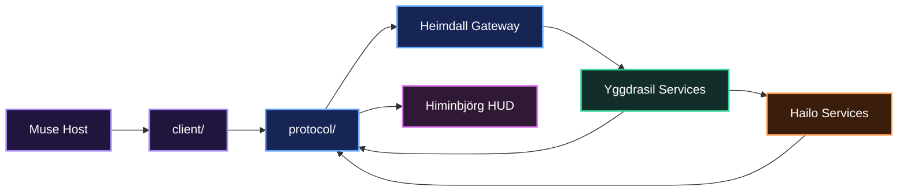
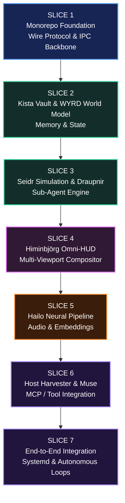
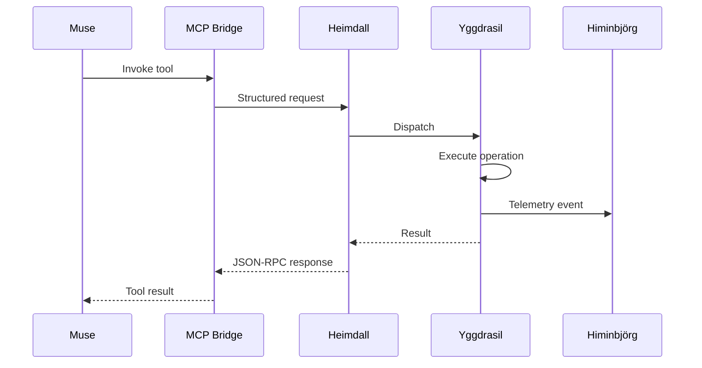
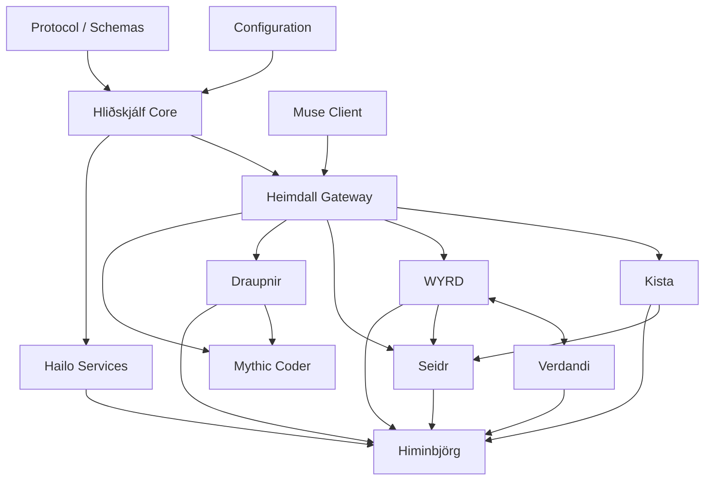
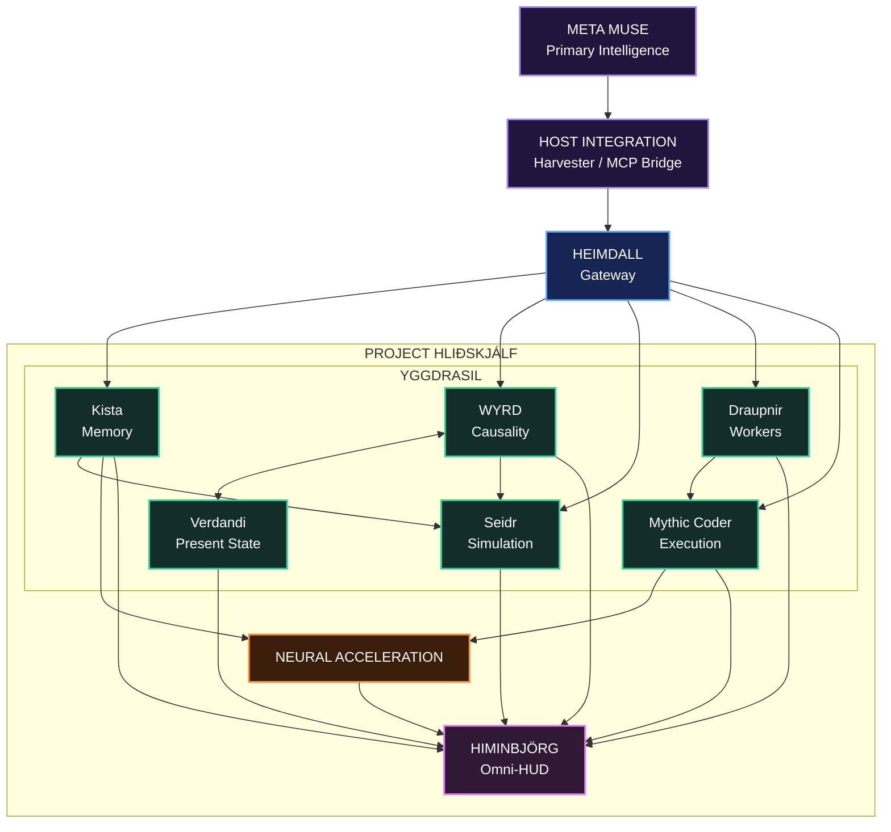

# Repository Architecture & Unified Roadmap: Project Hliðskjálf

`Repository_Architecture_Unified_Roadmap_Project_Hlidhskjalf.md`

> **Project Hliðskjálf** unifies Himinbjörg's visual observation layer and Yggdrasil's cognitive edge runtime into a single modular Raspberry Pi 5 + Hailo co-processor platform for Meta Muse.

---

## Table of Contents

1. [Repository Naming Strategy](#1-repository-naming-strategy)
2. [Unified Monorepo Architecture](#2-unified-monorepo-architecture)
3. [Seven-Slice Implementation Roadmap](#3-seven-slice-implementation-roadmap)
4. [Unified Hardware Resource Matrix](#4-unified-hardware-resource-matrix)
5. [Dependency & Service Architecture](#5-dependency--service-architecture)
6. [Implementation Principles](#6-implementation-principles)
7. [Definition of Done](#7-definition-of-done)
8. [Final Architecture Vision](#8-final-architecture-vision)

---

# 1. Repository Naming Strategy

The unified system combines:

- **Himinbjörg**: visual observation, telemetry, interaction, and the Omni-HUD
- **Yggdrasil**: memory, causal modeling, simulation, tools, workers, and edge cognition
- **Heimdall**: gateway, validation, authentication, and ingress control
- **Hailo acceleration**: local neural workloads
- **Muse integration**: host-side harvesting, tool invocation, and structured state exchange

Three repository naming strategies fit the architecture particularly well.

---

## 1.1 Option 1: `Hlidskjalf-Edge-Core`

### Recommended

### Mythological Foundation

**Hliðskjálf** is Odin's high seat, positioned above the worlds and associated with the ability to perceive distant realms and observe events across the cosmos.

### Architectural Justification

This name captures the convergence of the two major halves of the platform:

```text
HIMINBJÖRG
Observation / HUD / Perception
        │
        ├──────────┐
        │          │
        ▼          ▼
   HLIÐSKJÁLF   YGGDRASIL
  Unified Node   Cognition / Memory / Action
```

Hliðskjálf therefore represents:

- observation
- awareness
- world-state visibility
- distributed perception
- edge cognition
- action through connected systems
- a unified control and observation point

### Suggested Repository Name

```text
RuneForgeAI-Project-Hlidhskjalf
```

or:

```text
hlidskjalf-edge-core
```

---

## 1.2 Option 2: `Yggdrasil-Omni-Node`

### Systemic Focus

### Mythological Foundation

Yggdrasil is the World Tree connecting and supporting the cosmic structure.

Its roots suggest:

- persistent memory
- foundational state
- history
- deep storage

Its trunk suggests:

- shared infrastructure
- causal continuity
- routing

Its branches suggest:

- agents
- tools
- simulations
- displays
- external services

### Architectural Justification

This name emphasizes the Raspberry Pi 5 edge device as a **multi-purpose cognitive node extending Muse's central intelligence**.

```text
                 MUSE
                  │
                  ▼
             YGGDRASIL
          ┌───────┼───────┐
          ▼       ▼       ▼
       Memory   Agents   Display
          │       │       │
          ▼       ▼       ▼
        Kista  Draupnir Himinbjörg
```

---

## 1.3 Option 3: `Bifrost-Omni-Runtime`

### Bridging Focus

### Mythological Foundation

Bifröst connects realms.

In this architecture it symbolizes the communication layer joining:

```text
MUSE HOST
    │
    │ structured state
    │ tools
    │ telemetry
    ▼
BIFRÖST
    │
    ▼
EDGE HARDWARE
```

### Architectural Justification

This name emphasizes:

- bidirectional telemetry
- tool invocation
- JSON-RPC
- MCP
- WebSockets
- host-to-edge communication
- physical/digital integration

---

## 1.4 Naming Recommendation

| Name | Primary Emphasis | Strength |
| --- | --- | --- |
| **Hliðskjálf Edge Core** | Unified observation + cognition | **Best overall system identity** |
| **Yggdrasil Omni-Node** | Edge cognition + infrastructure | Best engineering-oriented alternative |
| **Bifröst Omni-Runtime** | Host ↔ edge communication | Best transport-oriented alternative |

### Recommended Identity

```text
PROJECT HLIÐSKJÁLF
```

Engineering package:

```text
hlidskjalf-edge-core
```

---

# 2. Unified Monorepo Architecture

A single monorepo prevents circular dependencies between **Himinbjörg** and **Yggdrasil** while allowing both systems to share:

- event schemas
- RPC contracts
- configuration
- IPC
- model definitions
- deployment tooling
- tests
- telemetry

The architectural rule is:

```text
             protocol/
                 │
       ┌─────────┴─────────┐
       ▼                   ▼
   Yggdrasil           Himinbjörg
       │                   │
       └─────────┬─────────┘
                 ▼
               IPC
```

Neither major subsystem should need to import implementation details from the other.

---

## 2.1 Repository Tree

```text
hlidskjalf-edge-core/
├── LICENSE
├── README.md
├── pyproject.toml
├── Makefile
├── config/
│   ├── default_config.yaml
│   └── display_profiles.json
├── protocol/                         # Shared Wire Formats & Schemas
│   ├── __init__.py
│   ├── bus.py                        # Local Pub/Sub Event Bus
│   ├── serialization.py              # JSON / MessagePack Encode-Decode
│   └── schemas/
│       ├── envelope.json
│       ├── ttrpg_event.json
│       ├── divination_event.json
│       └── yggdrasil_mcp.json
├── services/
│   ├── yggdrasil/                    # Edge Cognitive Co-Processor
│   │   ├── __init__.py
│   │   ├── daemon.py                 # JSON-RPC / MCP-Facing Core Server
│   │   ├── gateway/
│   │   │   ├── __init__.py
│   │   │   └── heimdall.py           # Gateway / Validation / Security
│   │   ├── memory/
│   │   │   ├── __init__.py
│   │   │   ├── kista_vault.py
│   │   │   └── state_cache.py
│   │   ├── world_model/
│   │   │   ├── __init__.py
│   │   │   ├── wyrd_graph.py
│   │   │   └── verdandi_timeline.py
│   │   ├── simulation/
│   │   │   ├── __init__.py
│   │   │   └── seidr_engine.py
│   │   ├── subagents/
│   │   │   ├── __init__.py
│   │   │   └── draupnir_forge.py
│   │   └── sandbox/
│   │       ├── __init__.py
│   │       ├── mythic_coder.py
│   │       └── aesir_runtime.py
│   ├── himinbjorg/                   # Omni-HUD Display Engine
│   │   ├── __init__.py
│   │   ├── compositor.py             # 60 FPS Render Loop
│   │   ├── canvas_ttrpg.py           # Sagnaskemma View
│   │   ├── canvas_divination.py      # Celestial / Tarot / Rune View
│   │   ├── canvas_system.py          # Yggdrasil Runtime Telemetry
│   │   └── typography.py             # Unicode / Rune / Astro Fonts
│   └── hailo/                        # Neural Acceleration Layer
│       ├── __init__.py
│       ├── pipeline_manager.py       # Runtime / Stream Controller
│       ├── tts_worker.py             # Neural Speech
│       └── embed_worker.py           # Local Embeddings
├── client/                           # Muse Host-Side Integration
│   ├── __init__.py
│   ├── harvester.py                  # Sagnaskemma / Astrology Interceptor
│   ├── mcp_bridge.py                 # Muse ↔ Hliðskjálf Tool Bridge
│   └── muse_tool_defs.json           # Tool Manifest
├── deploy/
│   ├── systemd/
│   │   ├── hlidskjalf-core.service
│   │   └── hlidskjalf-hud.service
│   ├── install_pi5_dependencies.sh
│   └── setup_hailo10_pcie.sh
└── tests/
    ├── test_protocol.py
    ├── test_event_bus.py
    ├── test_kista_vault.py
    ├── test_wyrd_dag.py
    ├── test_seidr_engine.py
    ├── test_compositor.py
    └── e2e_stress_test.py
```

---

## 2.2 Architectural Boundaries



---

# 3. Seven-Slice Implementation Roadmap



---

# Slice 1: Monorepo Foundation, Wire Protocol & IPC Backbone

## Goal

Establish the unified repository structure, deterministic communication contracts, and high-speed local inter-process communication backbone.

---

## Tasks

### Repository Foundation

- [ ] Initialize the monorepo directory tree.
- [ ] Create `pyproject.toml`.
- [ ] Create `Makefile`.
- [ ] Create project-wide configuration files.
- [ ] Add test infrastructure.
- [ ] Define module ownership boundaries.
- [ ] Add logging conventions.

---

### Protocol Envelope

Implement:

```text
protocol/schemas/envelope.json
```

The envelope should provide:

- protocol version
- timestamp
- session ID
- source
- destination
- event type
- correlation ID
- priority
- payload

Example:

```json
{
  "version": "1.0.0",
  "timestamp": 1791349200000,
  "session_id": "550e8400-e29b-41d4-a716-446655440000",
  "source": "yggdrasil",
  "destination": "himinbjorg",
  "event_type": "wyrd.entity.updated",
  "correlation_id": "f845041d-9805-40ca-a52e-04a61a58c5be",
  "priority": "normal",
  "payload": {}
}
```

---

### Local Event Bus

Implement:

```text
protocol/bus.py
```

The bus should support:

```text
publish(topic, payload)
subscribe(topic, callback)
unsubscribe(topic, callback)
```

Suggested topic families:

```text
agent.*
ttrpg.*
divination.*
wyrd.*
verdandi.*
kista.*
seidr.*
draupnir.*
coder.*
hailo.*
hud.*
system.*
```

---

### Local IPC Socket

Recommended local socket:

```text
/tmp/hlidskjalf_ipc.sock
```

Architecture:

```text
Producer
   │
   ▼
Pub/Sub Bus
   │
   ├── Local Python Consumers
   │
   └── Unix Domain Socket
             │
             ▼
      External Services
```

---

### Serialization

Support:

```text
JSON
MessagePack
```

Optional future formats:

```text
CBOR
FlatBuffers
Cap'n Proto
```

---

### Testing

Implement:

```text
tests/test_protocol.py
tests/test_event_bus.py
```

Verify:

- [ ] valid envelope encoding
- [ ] invalid envelope rejection
- [ ] JSON round-trip integrity
- [ ] MessagePack round-trip integrity
- [ ] timestamp preservation
- [ ] Unicode rune preservation
- [ ] astrological glyph preservation
- [ ] concurrent event delivery
- [ ] local IPC reconnect behavior

---

# Slice 2: Kista Vault & WYRD World Model

## Goal

Provide Muse with durable edge memory and a persistent causal model of active reality.

---

## 2.1 Kista Vault

Implement:

```text
services/yggdrasil/memory/kista_vault.py
```

Storage backend:

```text
SQLite
```

Database:

```text
/opt/yggdrasil/kista.db
```

Enable Write-Ahead Logging:

```sql
PRAGMA journal_mode=WAL;
```

Suggested artifact classes:

```text
code
lore
transits
state_snapshots
documents
agent_results
world_events
campaign_state
system_state
```

---

## 2.2 Full-Text Search

Enable SQLite FTS5 where available.

Example:

```sql
CREATE VIRTUAL TABLE artifact_fts
USING fts5(
    key,
    content,
    category
);
```

Search capabilities should support:

- lore retrieval
- code retrieval
- world-state notes
- previous simulations
- TTRPG history
- past divination artifacts

---

## 2.3 WYRD World Model

Implement:

```text
services/yggdrasil/world_model/wyrd_graph.py
```

Represent the active world as:

```math
\mathcal{G}
=
(\mathcal{V},\mathcal{E})
```

where:

```text
V = entities / states
E = causal transitions / relationships
```

Nodes may represent:

```text
people
agents
objects
locations
systems
resources
environmental conditions
abstract states
```

Edges may represent:

```text
causes
owns
contains
depends_on
moved_to
changed
triggered
observed
created
destroyed
```

---

## 2.4 Verdandi Timeline

Implement:

```text
services/yggdrasil/world_model/verdandi_timeline.py
```

Responsibilities:

- maintain present-state snapshots
- serialize timeline frames
- differentiate manifest vs speculative state
- checkpoint verified reality
- prune orphaned speculative branches
- restore a previous anchored state

Conceptual flow:

```text
Incoming Event
      │
      ▼
WYRD Update
      │
      ▼
Verdandi Validation
      │
      ├── Manifest
      │      │
      │      ▼
      │   Active State
      │
      └── Speculative
             │
             ▼
        Future Branch
```

---

# Slice 3: Seidr Simulation & Draupnir Sub-Agent Engine

## Goal

Equip the edge node with bounded autonomous workers, probabilistic simulation, and local execution capability.

---

## 3.1 Seidr Engine

Implement:

```text
services/yggdrasil/simulation/seidr_engine.py
```

Empirical state:

```math
\mathbf{S}_{\mathrm{empirical}}
\in
\mathbb{R}^{n}
```

Symbolic state:

```math
\mathbf{S}_{\mathrm{symbolic}}
\in
\mathbb{R}^{m}
```

Intuition weighting:

```math
\alpha \in [0,1]
```

Blended result:

```math
P(y)
=
(1-\alpha)
P_{\mathrm{emp}}(y)
+
\alpha
P_{\mathrm{sym}}(y)
```

---

## 3.2 Mythic Coder Sandbox

Implement:

```text
services/yggdrasil/sandbox/mythic_coder.py
```

Responsibilities:

- restricted working directory
- timeout enforcement
- output-size limits
- subprocess monitoring
- process-tree cleanup
- explicit executable policies
- artifact capture
- test execution

> Filesystem working-directory restriction alone is not a security sandbox. Production deployments should use stronger OS-level isolation where arbitrary or semi-trusted code may execute.

Suggested production layers:

```text
Dedicated Linux User
        │
        ▼
Restricted Filesystem
        │
        ▼
Command Allowlist
        │
        ▼
Resource Limits
        │
        ▼
Namespace / Container Isolation
```

---

## 3.3 Draupnir Forge

Implement:

```text
services/yggdrasil/subagents/draupnir_forge.py
```

Worker scaling:

```math
N_{\mathrm{workers}}(d)
=
\left\lfloor
N_0 C \gamma^d
\right\rfloor
```

Default values:

```math
N_0 = 8
```

```math
\gamma = 0.5
```

```math
C \in [0,1]
```

Example maximum-complexity worker tree:

```text
Depth 0: 8 workers
Depth 1: 4 workers
Depth 2: 2 workers
Depth 3: 1 worker
```

Worker responsibilities:

- task decomposition
- temporary scripts
- bounded execution
- output collection
- result aggregation
- cleanup
- cancellation
- failure reporting

---

## 3.4 Heimdall Gateway Exposure

Expose structured tool methods such as:

```text
kista.store
kista.retrieve
kista.search

wyrd.update_entity
wyrd.get_state
wyrd.record_transition

verdandi.checkpoint
verdandi.get_present

seidr.simulate

draupnir.spawn
draupnir.status

coder.execute

hud.set_mode
hud.emit
```

---

# Slice 4: Himinbjörg Omni-HUD Multi-Viewport Compositor

## Goal

Create a hardware-accelerated multi-mode observation interface designed to maintain a locked target render rate of:

```text
60 FPS
```

---

## 4.1 Compositor

Implement:

```text
services/himinbjorg/compositor.py
```

Possible rendering stack:

```text
Pygame
SDL2
ModernGL
OpenGL
```

Features:

- double buffering
- event-based state updates
- persistent local state cache
- adaptive frame pacing
- font fallback
- UTF-8 rendering
- multi-view switching

---

## 4.2 TTRPG Viewport

Implement:

```text
services/himinbjorg/canvas_ttrpg.py
```

Display:

- party cards
- HP
- maximum HP
- Armor Class
- status conditions
- encounter name
- encounter lore
- dice notation
- roll results
- difficulty checks
- advantage / disadvantage
- active combat state

Health ratio:

```math
R_{\mathrm{HP}}
=
\frac{HP_{\mathrm{current}}}
{HP_{\mathrm{max}}}
```

Clamp:

```math
0
\le
R_{\mathrm{HP}}
\le
1
```

---

## 4.3 Divination Viewport

Implement:

```text
services/himinbjorg/canvas_divination.py
```

Display:

- 360° celestial wheel
- Ascendant
- planets
- aspect chords
- Tarot cards
- runes
- planetary hours
- interpretation text

Aspect rules:

### Trine

```math
|\delta - 120^\circ|
\le
4^\circ
```

### Square

```math
|\delta - 90^\circ|
\le
4^\circ
```

### Opposition

```math
|\delta - 180^\circ|
\le
4^\circ
```

---

## 4.4 Yggdrasil System Viewport

Implement:

```text
services/himinbjorg/canvas_system.py
```

Display:

- active WYRD entities
- causal edges
- Kista operations
- active Draupnir workers
- Seidr simulations
- CPU load
- memory utilization
- neural accelerator activity
- network activity
- service health

Conceptual UI:

```text
┌──────────────────────────────────────────────────────────────┐
│ YGGDRASIL SYSTEM MATRIX                                     │
├───────────────────────────┬──────────────────────────────────┤
│ WYRD GRAPH                │ EDGE SERVICES                    │
│                           │                                  │
│      [Entity A]           │ Kista       ONLINE               │
│          │                │ Seidr       READY                │
│          ▼                │ Draupnir    3 ACTIVE             │
│      [Entity B]           │ Hailo       ACTIVE               │
│          │                │                                  │
│          ▼                │ CPU          18%                 │
│      [Entity C]           │ RAM          37%                 │
├───────────────────────────┴──────────────────────────────────┤
│ RECENT EDGE EVENTS                                          │
└──────────────────────────────────────────────────────────────┘
```

---

## 4.5 View Switching

Automatic switching:

```text
ttrpg.*
    -> View 1

divination.*
    -> View 2

wyrd.*
kista.*
seidr.*
draupnir.*
system.*
    -> View 3
```

Manual control:

| Key | Action |
| --- | --- |
| `TAB` | Cycle views |
| `1` | Divination |
| `2` | TTRPG |
| `3` | Yggdrasil System |
| `ESC` | Exit |
| `Q` | Exit |

---

# Slice 5: Hailo Neural Pipeline

## Goal

Use the Hailo accelerator for supported neural workloads while keeping the host workstation independent from edge inference.

---

## 5.1 Pipeline Manager

Implement:

```text
services/hailo/pipeline_manager.py
```

Responsibilities:

- initialize accelerator runtime
- load compiled models
- manage virtual streams
- serialize inference jobs
- monitor throughput
- recover failed pipelines
- report telemetry

---

## 5.2 Neural Speech

Implement:

```text
services/hailo/tts_worker.py
```

Pipeline:

```text
Muse Text
   │
   ▼
Narration Queue
   │
   ▼
TTS Worker
   │
   ▼
Supported Neural Runtime
   │
   ▼
PCM Output
   │
   ▼
ALSA / PipeWire
```

Potential speech engines:

```text
Kokoro
Piper
other supported models
```

---

## 5.3 Embeddings

Implement:

```text
services/hailo/embed_worker.py
```

Potential embedding families:

```text
BGE
Nomic Embed
other supported compact encoders
```

Use cases:

- Kista semantic search
- lore retrieval
- code retrieval
- memory similarity
- world-model entity matching

Embedding vector:

```math
\mathbf{e}
=
f_{\mathrm{embed}}(x)
```

Similarity:

```math
\operatorname{sim}
(\mathbf{e}_1,\mathbf{e}_2)
=
\frac{
\mathbf{e}_1 \cdot \mathbf{e}_2
}{
\|\mathbf{e}_1\|
\|\mathbf{e}_2\|
}
```

---

# Slice 6: Host-Side Harvester & Muse Model Context Protocol

## Goal

Connect Muse's workstation to Hliðskjálf through a clean, structured host-side integration layer.

---

## 6.1 Host Harvester

Implement:

```text
client/harvester.py
```

Responsibilities:

- invoke Sagnaskemma
- invoke astrology-engine
- capture stdout
- parse JSON
- parse known text patterns
- extract party state
- extract encounter state
- extract dice rolls
- extract celestial data
- generate protocol events
- transmit events to the Pi

Flow:

```text
Muse
  │
  ▼
Harvester
  │
  ├── Sagnaskemma
  │
  └── Astrology Engine
         │
         ▼
Structured Event
         │
         ▼
Hliðskjálf
```

---

## 6.2 Muse Tool Bridge

Implement:

```text
client/mcp_bridge.py
```

Expose tool families including:

```text
kista.*
wyrd.*
verdandi.*
seidr.*
draupnir.*
coder.*
hud.*
system.*
```

---

## 6.3 Bidirectional Tool Flow



Target behavior:

```text
Muse invokes tool
      ↓
Pi executes tool
      ↓
Result returns to Muse
      ↓
HUD updates visually
```

---

# Slice 7: End-to-End Integration, Systemd & Autonomous Loops

## Goal

Package Hliðskjálf as a resilient unattended edge system that starts automatically and recovers from common failures.

---

## 7.1 Core Service

File:

```text
deploy/systemd/hlidskjalf-core.service
```

Responsibilities:

```text
Heimdall
Yggdrasil
RPC
MCP-facing services
Kista
WYRD
Verdandi
Seidr
Draupnir
```

---

## 7.2 HUD Service

File:

```text
deploy/systemd/hlidskjalf-hud.service
```

Responsibilities:

```text
Himinbjörg
Pygame / SDL
Display session
Input
Telemetry presentation
```

---

## 7.3 Watchdog & Recovery

Implement:

- [ ] process restart on failure
- [ ] service health checks
- [ ] IPC socket reconnect
- [ ] host reconnect
- [ ] display restart
- [ ] Hailo runtime reconnect
- [ ] stale worker cleanup
- [ ] incomplete transaction recovery
- [ ] Kista integrity verification

---

## 7.4 End-to-End Stress Test

Implement:

```text
tests/e2e_stress_test.py
```

Simulate concurrent:

- dice events
- encounter updates
- Tarot spreads
- celestial transits
- Kista writes
- Kista reads
- WYRD updates
- Seidr simulations
- Draupnir workers
- speech synthesis
- HUD mode switches

Example test stream:

```text
1000 telemetry events
+ 100 Kista writes
+ 100 WYRD updates
+ 25 Seidr simulations
+ 10 Draupnir workers
+ continuous HUD rendering
```

---

## 7.5 Final Documentation

The root:

```text
README.md
```

should contain:

- system summary
- architecture diagram
- hardware requirements
- dependency installation
- repository tree
- service descriptions
- setup commands
- Muse connection instructions
- verification commands
- troubleshooting
- development roadmap

---

# 4. Unified Hardware Resource Matrix

| Subsystem | Process / Service | Hardware Target | Target Memory | Compute Budget |
| --- | --- | --- | ---: | --- |
| **Heimdall + Core Services** | `hlidskjalf-core` | Pi CPU | ~250 MB | Lightweight network / RPC workload |
| **WYRD + Kista** | Python + SQLite WAL | Pi CPU | ~1.5 GB target ceiling | Mostly event-driven |
| **Mythic Coder / Draupnir** | Worker subprocesses | Pi CPU | Dynamic, bounded | Scaled per task |
| **Himinbjörg HUD** | Pygame / SDL / GPU | Pi CPU + VideoCore | ~400-500 MB target | Locked 60 FPS goal |
| **Neural Speech** | Accelerator runtime | Hailo | Model-dependent | Offloaded inference |
| **Vector Embeddings** | Accelerator runtime | Hailo | Model-dependent | Offloaded inference |
| **Linux + Cache Headroom** | Kernel / buffers / services | Pi system memory | Remaining memory | Maintain thermal + memory margin |

> Resource values are **engineering targets**, not guarantees. Actual memory and CPU utilization should be measured on the final hardware and software stack.

---

## 4.1 CPU Responsibility Model

```text
┌─────────────────────────────────────────────────────────────┐
│                  RASPBERRY PI 5 CPU                         │
├─────────────────────────────────────────────────────────────┤
│ Core 0                                                     │
│ Heimdall / Networking / RPC                                │
├─────────────────────────────────────────────────────────────┤
│ Core 1                                                     │
│ WYRD / Verdandi / Kista                                    │
├─────────────────────────────────────────────────────────────┤
│ Core 2                                                     │
│ Draupnir / Mythic Coder                                    │
├─────────────────────────────────────────────────────────────┤
│ Core 3                                                     │
│ Himinbjörg / UI                                            │
└─────────────────────────────────────────────────────────────┘
```

This is a logical workload partition.

Linux scheduling may dynamically move processes between cores unless explicit CPU affinity is configured.

---

# 5. Dependency & Service Architecture

## 5.1 Service Dependency Graph



---

## 5.2 Critical Dependency Rule

Himinbjörg should **observe** Yggdrasil but not become a hard dependency required for Yggdrasil to operate.

Correct:

```text
Yggdrasil
   │
   ├── operates independently
   │
   └── emits telemetry
            │
            ▼
        Himinbjörg
```

Incorrect:

```text
Yggdrasil
   │
   ▼
Himinbjörg
   │
   ▼
Yggdrasil cannot continue
if HUD is offline
```

The HUD must be optional from the perspective of core cognition.

---

# 6. Implementation Principles

## 6.1 Shared Schemas, Independent Services

Use:

```text
protocol/
```

as the stable shared contract.

Avoid direct cross-imports such as:

```python
from services.himinbjorg.compositor import some_yggdrasil_function
```

or:

```python
from services.yggdrasil.daemon import some_hud_function
```

Prefer:

```text
event bus
RPC
shared schemas
service interfaces
```

---

## 6.2 Configuration over Hard-Coding

Avoid:

```python
PI_HOST = "192.168.1.150"
```

Prefer:

```yaml
network:
  host: 0.0.0.0
  rpc_port: 8000
  hud_port: 8080
  websocket_port: 8765
```

---

## 6.3 Graceful Degradation

If Hailo is unavailable:

```text
Core services continue
HUD continues
Kista continues
WYRD continues
Muse connectivity continues
```

If Himinbjörg is unavailable:

```text
Yggdrasil continues
```

If Muse disconnects:

```text
Local state remains available
Kista remains available
HUD can show OFFLINE state
```

---

## 6.4 Observable Everything

Every major subsystem should emit telemetry.

Example:

```json
{
  "event_type": "kista.artifact.stored",
  "payload": {
    "key": "barrow_state",
    "category": "state_snapshot"
  }
}
```

Example:

```json
{
  "event_type": "draupnir.worker.started",
  "payload": {
    "task": "Analyze test failure",
    "depth": 1
  }
}
```

---

## 6.5 No Unbounded Recursion

Draupnir must enforce:

```math
d \le 3
```

and a bounded worker population.

---

## 6.6 No Unbounded Memory Streams

Apply limits to:

- logs
- HUD text
- event history
- subprocess output
- worker results
- timeline snapshots
- telemetry queues

---

# 7. Definition of Done

Project Hliðskjálf reaches its first complete integrated milestone when all of the following succeed.

## Foundation

- [ ] Monorepo builds cleanly.
- [ ] Shared configuration loads.
- [ ] JSON protocol validates.
- [ ] MessagePack protocol validates.
- [ ] Local IPC works.

## Memory & World Model

- [ ] Kista persists across reboot.
- [ ] FTS search works.
- [ ] WYRD entity updates work.
- [ ] WYRD transitions work.
- [ ] Verdandi snapshots work.

## Edge Cognition

- [ ] Seidr simulation works.
- [ ] Draupnir bounded workers work.
- [ ] Mythic Coder execution works.
- [ ] Failed workers clean up correctly.

## Himinbjörg

- [ ] TTRPG view works.
- [ ] Divination view works.
- [ ] System view works.
- [ ] Automatic switching works.
- [ ] Manual switching works.
- [ ] Unicode glyphs render correctly.
- [ ] Target frame rate is stable on final hardware.

## Neural Layer

- [ ] Accelerator runtime initializes.
- [ ] Supported embedding model executes.
- [ ] Supported speech model executes.
- [ ] Failover behavior works.

## Muse Integration

- [ ] Harvester captures Sagnaskemma output.
- [ ] Harvester captures astrology output.
- [ ] Muse discovers edge tools.
- [ ] Muse invokes edge tools.
- [ ] Results return successfully.
- [ ] HUD updates from Muse actions.

## Deployment

- [ ] Core service starts at boot.
- [ ] HUD starts at boot.
- [ ] Services restart after failure.
- [ ] Stress test completes.
- [ ] Documentation reproduces installation from a clean system.

---

# 8. Final Architecture Vision



---

# Unified Project Identity

The architecture can be understood as four mythic layers.

### Heimdall

**The Gate**

```text
authentication
validation
routing
protection
```

### Yggdrasil

**The Living Cognitive Infrastructure**

```text
memory
causality
state
simulation
workers
execution
```

### Himinbjörg

**The Observation Hall**

```text
visualization
telemetry
status
interaction
physical presence
```

### Hliðskjálf

**The Unified High Seat**

```text
perception
cognition
memory
action
observation
```

Together:

```text
                         MUSE
                          │
                          ▼
                       HEIMDALL
                          │
                          ▼
                      YGGDRASIL
                  ┌───────┼───────┐
                  ▼       ▼       ▼
               Memory   Agents   Tools
                  │       │       │
                  └───────┼───────┘
                          ▼
                     HIMINBJÖRG
                          │
                          ▼
                      HLIÐSKJÁLF
               Unified Edge Intelligence
```

**Project Hliðskjálf is the point where Muse's perception, memory, world modeling, autonomous execution, neural edge services, and physical telemetry converge into one coherent edge runtime.**
