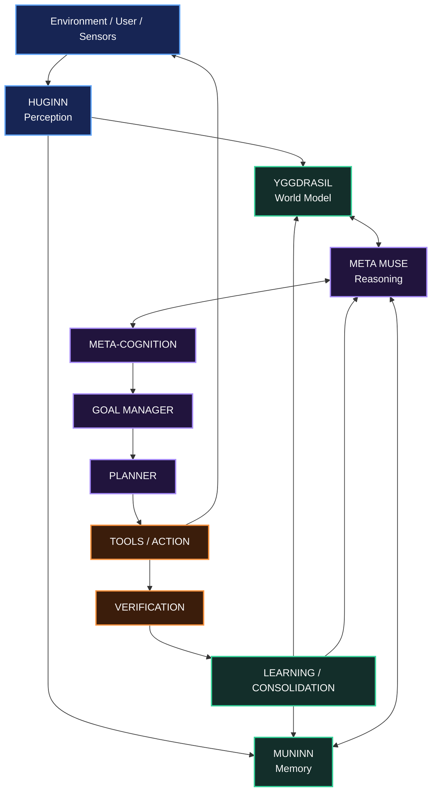
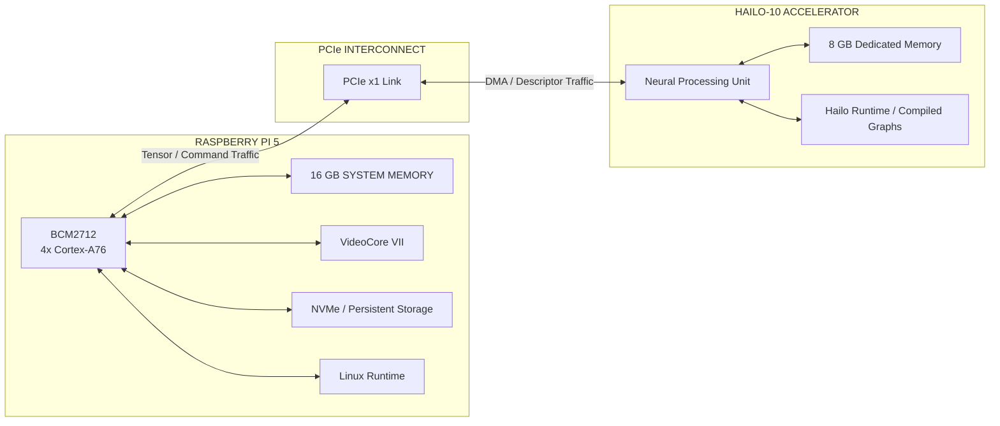
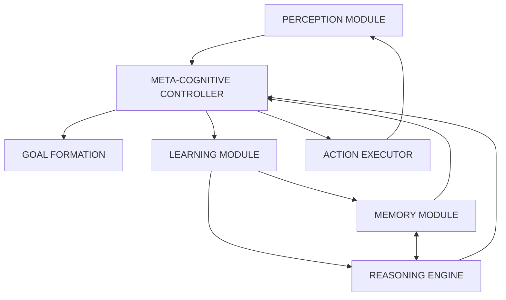
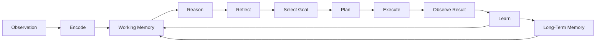
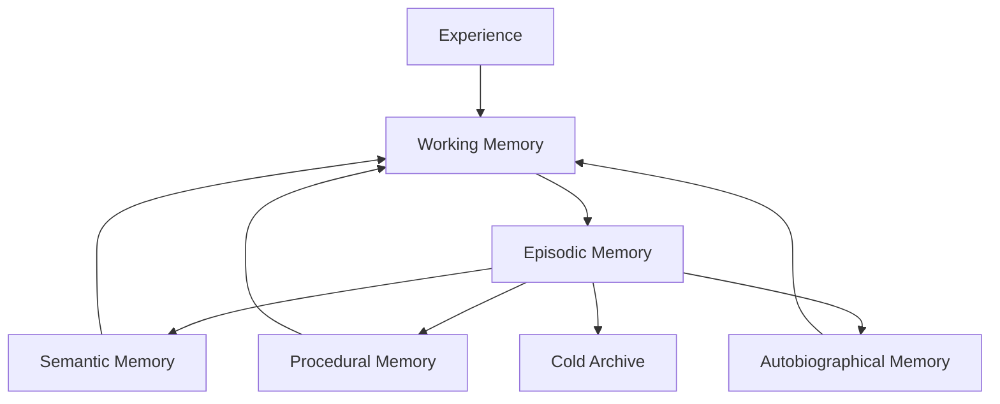
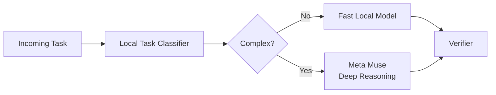
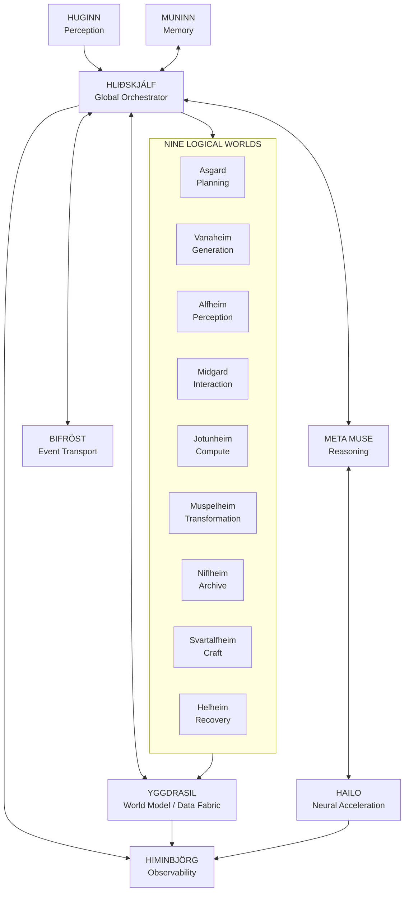
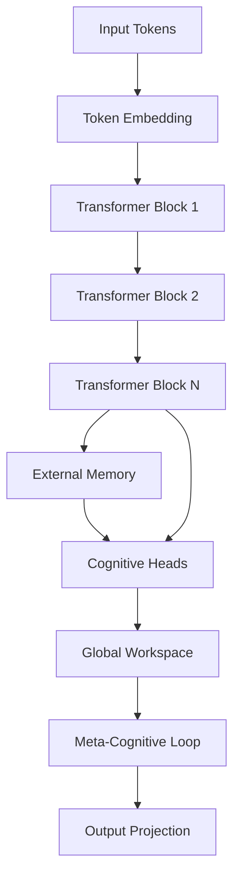
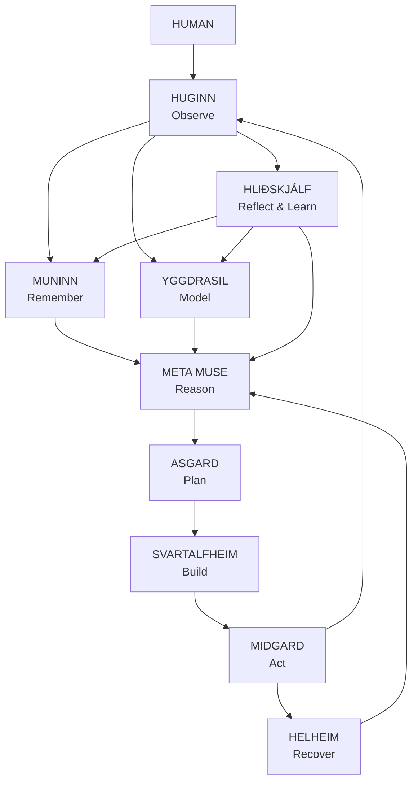

# RuneForgeAI: Hliðskjálf
## Towards AGI on Edge Hardware

### Meta Muse AI Agent Architecture with Raspberry Pi 5 + Hailo-10

`RuneForgeAI_Hlidhskjalf-Towards_AGI_on_Edge_Hardware.md`

---

**Version:** `1.0.0-alpha`  
**Project:** RuneForgeAI  
**Architecture:** Meta Muse + Project Hliðskjálf  
**Hardware Target:** Raspberry Pi 5 + Hailo-10 AI accelerator  
**License:** MIT + Apache 2.0 dual license  
**Status:** Experimental AGI-oriented research architecture

> **Research note:** This document describes an experimental architecture for pursuing increasingly general autonomous intelligence on edge hardware. It does not claim that the architecture has achieved scientifically demonstrated AGI.

---

## Table of Contents

1. [Executive Summary](#1-executive-summary)
2. [Theoretical Framework](#2-theoretical-framework)
3. [Hardware Architecture](#3-hardware-architecture)
4. [Meta Muse AI Agent Design](#4-meta-muse-ai-agent-design)
5. [Mathematical Foundations](#5-mathematical-foundations)
6. [Implementation](#6-implementation)
7. [Training Methodology](#7-training-methodology)
8. [Memory Management](#8-memory-management)
9. [Inference Optimization](#9-inference-optimization)
10. [Integration with Hliðskjálf](#10-integration-with-hliðskjálf)
11. [Performance Benchmarking](#11-performance-benchmarking)
12. [Future Roadmap](#12-future-roadmap)
13. [References](#13-references)
14. [Appendix A: Mathematical Derivations](#appendix-a-mathematical-derivations)
15. [Appendix B: Hailo Compilation Workflow](#appendix-b-hailo-compilation-workflow)
16. [License](#license)

---

# 1. Executive Summary

Project **Hliðskjálf** explores an AGI-oriented cognitive architecture built around the **Meta Muse AI Agent**, a **Raspberry Pi 5 with 16 GB of system memory**, and a **Hailo-10 accelerator with dedicated accelerator memory**.

Rather than treating AGI as a single monolithic neural network, Hliðskjálf models general intelligence as a distributed cognitive system composed of:

- perception
- memory
- reasoning
- planning
- tool use
- learning
- meta-cognition
- world modeling
- self-monitoring
- persistent state
- autonomous execution
- edge neural acceleration

The architecture implements a **Hierarchical Cognitive Processing Network**, or **HCPN**, in which different classes of cognitive work are routed to different computational layers.

| Layer | Primary Responsibility |
| --- | --- |
| Raspberry Pi 5 CPU | orchestration, memory, state, scheduling, tool execution |
| Raspberry Pi system memory | working memory, databases, world model, caches |
| Hailo-10 NPU | compatible neural inference workloads |
| Hailo accelerator memory | neural model state and inference buffers |
| Meta Muse | high-level reasoning, planning, reflection, and goal management |
| Hliðskjálf | unifying runtime and cognitive architecture |

---

## 1.1 Central Design Principle

The system is designed around a closed cognitive loop:

```text
PERCEIVE
   ↓
REMEMBER
   ↓
MODEL
   ↓
REASON
   ↓
PLAN
   ↓
ACT
   ↓
VERIFY
   ↓
REFLECT
   ↓
LEARN
   ↓
REPEAT
```

The intended transition is from:

```text
prompt → model → response
```

toward:

```text
observation
    ↓
persistent internal state
    ↓
goal-directed cognition
    ↓
action
    ↓
environmental feedback
    ↓
continual adaptation
```

---

# 2. Theoretical Framework

## 2.1 AGI Definition & Metrics

For this project, general intelligence is treated as a multidimensional capability rather than a binary property.

Define a **Cognitive Capability Index**:

```math
CCI
=
\frac{
\sum_{i=1}^{n}
w_i C_i
}{
\sum_{i=1}^{n}
w_i
}
```

where:

```text
C_i = normalized capability score for domain i
w_i = importance weight for domain i
n   = number of evaluated cognitive domains
```

Candidate domains include:

1. perception
2. memory
3. reasoning
4. learning
5. planning
6. communication
7. self-modeling
8. tool use
9. generalization
10. error recovery

A weighted geometric mean can provide a stricter measure:

```math
G
=
\prod_{i=1}^{n}
C_i^{w_i}
```

subject to:

```math
\sum_{i=1}^{n} w_i = 1
```

This penalizes architectures with severe weakness in one essential domain even if other scores are very high.

---

## 2.2 The Hliðskjálf Metaphor

The project maps Norse mythological concepts to computational roles.

| Mythological Element | Computational Mapping |
| --- | --- |
| **Hliðskjálf** | global cognitive orchestrator and observation layer |
| **Yggdrasil** | system-wide data fabric and world-state architecture |
| **Bifröst** | communication and event transport |
| **Huginn** | perception, observation, and active information gathering |
| **Muninn** | episodic and semantic memory |
| **Asgard** | high-level planning |
| **Vanaheim** | creative and generative cognition |
| **Alfheim** | perception and lightweight inference |
| **Midgard** | human interaction |
| **Jotunheim** | heavy computation |
| **Muspelheim** | transformation and synthesis |
| **Niflheim** | archival and cold-state memory |
| **Svartalfheim** | detailed construction and tool-building |
| **Helheim** | failure recovery and degraded-mode operation |

---

## 2.3 General Cognitive Architecture



---

# 3. Hardware Architecture

## 3.1 System Components

### Raspberry Pi 5

The Raspberry Pi provides the persistent general-purpose computing layer.

Primary responsibilities:

- Linux operating environment
- Meta Muse integration
- task scheduling
- world-state storage
- memory databases
- event routing
- tool execution
- Himinbjörg visualization
- network communication
- sandbox management

### Hailo-10 Accelerator

The Hailo accelerator provides dedicated neural-processing capacity for compatible workloads.

Potential workloads include:

- embeddings
- local neural inference
- vision encoding
- audio processing
- classification
- small local language models
- multimodal feature extraction

---

## 3.2 Hardware Topology



---

## 3.3 Memory Hierarchy

```text
┌─────────────────────────────────────────────────────────────┐
│ LAYER 0                                                     │
│ Accelerator-local execution buffers                         │
├─────────────────────────────────────────────────────────────┤
│ LAYER 1                                                     │
│ Hailo dedicated memory                                      │
│ Model weights / activations / compatible inference state    │
├─────────────────────────────────────────────────────────────┤
│ LAYER 2                                                     │
│ Raspberry Pi 5 system memory                                │
│ Working memory / world model / databases / runtime state    │
├─────────────────────────────────────────────────────────────┤
│ LAYER 3                                                     │
│ NVMe SSD                                                    │
│ Persistent memory / checkpoints / models / logs             │
├─────────────────────────────────────────────────────────────┤
│ LAYER 4                                                     │
│ Optional network or archival storage                        │
│ Training corpora / large archives / backup                  │
└─────────────────────────────────────────────────────────────┘
```

---

## 3.4 Logical Memory Partitioning

The system should not assume that Raspberry Pi memory and accelerator memory form a single shared pool.

Instead:

```text
Raspberry Pi Memory
├── Linux
├── Meta Muse orchestration
├── working memory
├── Kista / Muninn databases
├── WYRD world state
├── task state
├── tool sandboxes
└── Himinbjörg

Hailo Memory
├── compiled neural graphs
├── quantized model state
├── intermediate tensors
├── accelerator scratch buffers
└── supported cache/state structures
```

---

# 4. Meta Muse AI Agent Design

## 4.1 Reflective Cognitive Architecture

The Meta Muse agent is structured as a set of interacting cognitive subsystems rather than a single inference pass.



---

## 4.2 Agent State Representation

The agent maintains a continuous cognitive state:

```math
S(t)
=
[
P(t),
M(t),
G(t),
E(t),
C(t)
]
```

where:

```math
P(t) \in \mathbb{R}^{d_p}
```

is perceptual state,

```math
M(t) \in \mathbb{R}^{d_m}
```

is memory context,

```math
G(t) \in \mathbb{R}^{d_g}
```

is goal state,

```math
E(t) \in \mathbb{R}^{d_e}
```

is affective or internal regulatory state, and:

```math
C(t) \in \mathbb{R}^{d_c}
```

represents confidence or uncertainty.

Example dimensions:

```text
d_p = 2048
d_m = 4096
d_g = 1024
d_e = 512
d_c = 256
```

Total conceptual state dimension:

```math
d_s
=
d_p+d_m+d_g+d_e+d_c
```

Therefore:

```math
d_s
=
2048+4096+1024+512+256
=
7936
```

These dimensions are architectural design parameters rather than fixed requirements.

---

## 4.3 Cognitive Flow



---

# 5. Mathematical Foundations

## 5.1 Attention

Scaled dot-product attention:

```math
\operatorname{Attention}(Q,K,V)
=
\operatorname{softmax}
\left(
\frac{QK^T}{\sqrt{d_k}}
\right)
V
```

Multi-head attention:

```math
\operatorname{MultiHead}(Q,K,V)
=
\operatorname{Concat}
(
head_1,\ldots,head_h
)
W^O
```

where:

```math
head_i
=
\operatorname{Attention}
(
QW_i^Q,
KW_i^K,
VW_i^V
)
```

---

## 5.2 Grouped Query Attention

If:

```text
h_q  = number of query heads
h_kv = number of key/value heads
```

then the sharing ratio is:

```math
r
=
\frac{h_q}{h_{kv}}
```

For:

```text
h_q  = 32
h_kv = 8
```

the ratio is:

```math
r=4
```

This reduces KV-cache requirements compared with full multi-head attention.

---

## 5.3 Approximate KV-Cache Memory

For:

```text
L = number of layers
T = context length
H = number of KV heads
D = head dimension
B = bytes per stored value
```

the approximate key/value cache requirement is:

```math
M_{KV}
=
2LTHDB
```

The leading factor of `2` accounts for both keys and values.

---

## 5.4 Differentiable Memory

A generic differentiable memory write can be represented as:

```math
M_t[i]
=
M_{t-1}[i]
\odot
\left(
1-w_t^w[i]e_t
\right)
+
w_t^w[i]v_t
```

where:

```text
w_t^w = write weighting
e_t   = erase vector
v_t   = value to write
```

Content-based memory addressing:

```math
w_t^c[i]
=
\operatorname{softmax}
\left(
\beta_t
D(k_t,M_t[i])
\right)
```

Cosine similarity:

```math
D(u,v)
=
\frac{
u\cdot v
}{
\|u\|
\|v\|
}
```

---

## 5.5 Meta-Learning

Model-Agnostic Meta-Learning uses an inner adaptation step:

```math
\theta'
=
\theta
-
\alpha
\nabla_{\theta}
\mathcal{L}_{task}(f_{\theta})
```

The meta-objective is:

```math
\min_{\theta}
\sum_{\tau \sim p(\mathcal{T})}
\mathcal{L}_{\tau}
\left(
f_{\theta'_{\tau}}
\right)
```

with:

```math
\theta'_{\tau}
=
\theta
-
\alpha
\nabla_{\theta}
\mathcal{L}_{\tau}(f_{\theta})
```

---

## 5.6 Global Workspace

A Global Workspace-inspired architecture can be represented as:

```text
Inputs
  ↓
Competition
  ↓
Selection
  ↓
Global Broadcast
  ↓
Specialized Modules
```

For candidate cognitive representation:

```math
x_i
```

define activation:

```math
A_i
=
w_s S_i
+
w_p P_i
+
w_n N_i
+
w_g G_i
```

where:

```text
S_i = salience
P_i = priority
N_i = novelty
G_i = goal relevance
```

Select:

```math
i^*
=
\arg\max_i A_i
```

The winner is broadcast to participating modules.

---

## 5.7 Recurrent Cognitive Depth

Instead of using fixed reasoning depth for every problem, the architecture can iteratively refine an internal state.

```math
H^{(l,t)}
=
H^{(l,t-1)}
+
F_l
\left(
H^{(l-1,t)},
H^{(l,t-1)}
\right)
```

Iterative computation continues until either:

```math
\|
H^{(t)}
-
H^{(t-1)}
\|
<
\epsilon
```

or:

```math
t
\ge
t_{\max}
```

This allows easy tasks to stop early while harder tasks receive additional computation.

---

# 6. Implementation

## 6.1 Core System Prototype

```python
#!/usr/bin/env python3
"""
RuneForgeAI: Project Hliðskjálf
Meta Muse AGI-Oriented Cognitive Prototype

Hardware target:
- Raspberry Pi 5
- Hailo neural accelerator

NOTE:
This is an architectural research prototype.
Actual Hailo deployment requires model/runtime compatibility with the
installed Hailo software stack.
"""

from __future__ import annotations

from dataclasses import dataclass, field
from enum import Enum, auto
from typing import Optional, List, Dict, Tuple, Any

import numpy as np
import torch
import torch.nn as nn
import torch.nn.functional as F


# =====================================================================
# CONFIGURATION
# =====================================================================

@dataclass
class HlidhskjalfConfig:

    # Hardware
    pi_ram_gb: int = 16
    hailo_ram_gb: int = 8
    cpu_cores: int = 4

    # Model
    d_model: int = 2048
    n_heads: int = 32
    n_layers: int = 24
    n_kv_heads: int = 8
    vocab_size: int = 32000

    # Context
    max_seq_len: int = 32768

    # External memory
    memory_slots: int = 1024
    memory_dim: int = 2048

    # Cognitive architecture
    n_cognitive_modules: int = 7
    meta_depth: int = 3

    # Runtime
    use_hailo: bool = True
    quantization: str = "int8"
    batch_size: int = 1

    worlds: List[str] = field(
        default_factory=lambda: [
            "Asgard",
            "Vanaheim",
            "Alfheim",
            "Midgard",
            "Jotunheim",
            "Muspelheim",
            "Niflheim",
            "Svartalfheim",
            "Helheim",
        ]
    )

    @property
    def head_dim(self) -> int:
        return self.d_model // self.n_heads


# =====================================================================
# NEURAL COMPONENTS
# =====================================================================

class RMSNorm(nn.Module):

    def __init__(
        self,
        dim: int,
        eps: float = 1e-6
    ):
        super().__init__()

        self.eps = eps

        self.weight = nn.Parameter(
            torch.ones(dim)
        )

    def forward(
        self,
        x: torch.Tensor
    ) -> torch.Tensor:

        rms = torch.rsqrt(
            x.pow(2).mean(
                dim=-1,
                keepdim=True
            )
            + self.eps
        )

        return (
            x
            * rms
            * self.weight
        )


class RotaryPositionalEmbedding(nn.Module):

    def __init__(
        self,
        dim: int,
        max_seq_len: int = 32768,
        base: float = 10000.0
    ):
        super().__init__()

        inv_freq = (
            1.0
            /
            (
                base
                ** (
                    torch.arange(
                        0,
                        dim,
                        2
                    ).float()
                    / dim
                )
            )
        )

        self.register_buffer(
            "inv_freq",
            inv_freq
        )

        self.max_seq_len = (
            max_seq_len
        )

    def forward(
        self,
        seq_len: int,
        device: torch.device
    ):

        positions = torch.arange(
            seq_len,
            device=device,
            dtype=self.inv_freq.dtype
        )

        frequencies = torch.einsum(
            "i,j->ij",
            positions,
            self.inv_freq
        )

        embedding = torch.cat(
            (
                frequencies,
                frequencies
            ),
            dim=-1
        )

        return (
            embedding.cos(),
            embedding.sin()
        )


def rotate_half(
    x: torch.Tensor
) -> torch.Tensor:

    half = (
        x.shape[-1]
        // 2
    )

    x1 = x[..., :half]
    x2 = x[..., half:]

    return torch.cat(
        (
            -x2,
            x1
        ),
        dim=-1
    )


def apply_rotary_emb(
    x: torch.Tensor,
    cos: torch.Tensor,
    sin: torch.Tensor
) -> torch.Tensor:

    while cos.ndim < x.ndim:
        cos = cos.unsqueeze(0)
        sin = sin.unsqueeze(0)

    return (
        x * cos
        +
        rotate_half(x) * sin
    )


class GroupedQueryAttention(nn.Module):

    def __init__(
        self,
        config: HlidhskjalfConfig
    ):
        super().__init__()

        self.n_heads = (
            config.n_heads
        )

        self.n_kv_heads = (
            config.n_kv_heads
        )

        self.head_dim = (
            config.head_dim
        )

        self.scale = (
            self.head_dim
            ** -0.5
        )

        self.wq = nn.Linear(
            config.d_model,
            config.n_heads
            * self.head_dim,
            bias=False
        )

        self.wk = nn.Linear(
            config.d_model,
            config.n_kv_heads
            * self.head_dim,
            bias=False
        )

        self.wv = nn.Linear(
            config.d_model,
            config.n_kv_heads
            * self.head_dim,
            bias=False
        )

        self.wo = nn.Linear(
            config.n_heads
            * self.head_dim,
            config.d_model,
            bias=False
        )

        self.rope = (
            RotaryPositionalEmbedding(
                self.head_dim,
                config.max_seq_len
            )
        )

    def forward(
        self,
        x: torch.Tensor,
        mask: Optional[
            torch.Tensor
        ] = None
    ) -> torch.Tensor:

        batch_size, seq_len, _ = (
            x.shape
        )

        q = self.wq(x).view(
            batch_size,
            seq_len,
            self.n_heads,
            self.head_dim
        )

        k = self.wk(x).view(
            batch_size,
            seq_len,
            self.n_kv_heads,
            self.head_dim
        )

        v = self.wv(x).view(
            batch_size,
            seq_len,
            self.n_kv_heads,
            self.head_dim
        )

        cos, sin = self.rope(
            seq_len,
            x.device
        )

        q = apply_rotary_emb(
            q,
            cos,
            sin
        )

        k = apply_rotary_emb(
            k,
            cos,
            sin
        )

        repeat_factor = (
            self.n_heads
            // self.n_kv_heads
        )

        k = k.repeat_interleave(
            repeat_factor,
            dim=2
        )

        v = v.repeat_interleave(
            repeat_factor,
            dim=2
        )

        q = q.transpose(
            1,
            2
        )

        k = k.transpose(
            1,
            2
        )

        v = v.transpose(
            1,
            2
        )

        scores = (
            torch.matmul(
                q,
                k.transpose(
                    -2,
                    -1
                )
            )
            * self.scale
        )

        if mask is not None:
            scores = (
                scores
                + mask
            )

        attention = torch.softmax(
            scores,
            dim=-1
        )

        output = torch.matmul(
            attention,
            v
        )

        output = (
            output
            .transpose(
                1,
                2
            )
            .contiguous()
            .view(
                batch_size,
                seq_len,
                -1
            )
        )

        return self.wo(
            output
        )


class SwiGLU(nn.Module):

    def __init__(
        self,
        dim: int,
        hidden_dim: int
    ):
        super().__init__()

        self.gate = nn.Linear(
            dim,
            hidden_dim,
            bias=False
        )

        self.up = nn.Linear(
            dim,
            hidden_dim,
            bias=False
        )

        self.down = nn.Linear(
            hidden_dim,
            dim,
            bias=False
        )

    def forward(
        self,
        x: torch.Tensor
    ) -> torch.Tensor:

        return self.down(
            F.silu(
                self.gate(x)
            )
            * self.up(x)
        )


class TransformerBlock(nn.Module):

    def __init__(
        self,
        config: HlidhskjalfConfig
    ):
        super().__init__()

        self.attention_norm = (
            RMSNorm(
                config.d_model
            )
        )

        self.attention = (
            GroupedQueryAttention(
                config
            )
        )

        hidden_dim = int(
            8
            / 3
            * config.d_model
        )

        self.ffn_norm = (
            RMSNorm(
                config.d_model
            )
        )

        self.ffn = SwiGLU(
            config.d_model,
            hidden_dim
        )

    def forward(
        self,
        x: torch.Tensor,
        mask: Optional[
            torch.Tensor
        ] = None
    ) -> torch.Tensor:

        h = (
            x
            +
            self.attention(
                self.attention_norm(x),
                mask
            )
        )

        return (
            h
            +
            self.ffn(
                self.ffn_norm(h)
            )
        )


# =====================================================================
# EXTERNAL MEMORY
# =====================================================================

class DifferentiableMemory(nn.Module):

    def __init__(
        self,
        config: HlidhskjalfConfig
    ):
        super().__init__()

        self.num_slots = (
            config.memory_slots
        )

        self.width = (
            config.memory_dim
        )

        self.register_buffer(
            "memory",
            torch.zeros(
                1,
                self.num_slots,
                self.width
            )
        )

        self.register_buffer(
            "usage",
            torch.zeros(
                1,
                self.num_slots
            )
        )

        self.key_projection = nn.Linear(
            config.d_model,
            self.width
        )

    def content_address(
        self,
        key: torch.Tensor,
        strength: float = 1.0
    ) -> torch.Tensor:

        memory = self.memory.expand(
            key.shape[0],
            -1,
            -1
        )

        similarity = (
            F.cosine_similarity(
                key.unsqueeze(1),
                memory,
                dim=-1
            )
        )

        return torch.softmax(
            similarity
            * strength,
            dim=-1
        )

    def forward(
        self,
        x: torch.Tensor
    ) -> Tuple[
        torch.Tensor,
        Dict[str, torch.Tensor]
    ]:

        key = self.key_projection(
            x
        )

        weights = (
            self.content_address(
                key
            )
        )

        memory = self.memory.expand(
            x.shape[0],
            -1,
            -1
        )

        read_vector = torch.bmm(
            weights.unsqueeze(1),
            memory
        ).squeeze(1)

        return (
            read_vector,
            {
                "read_weights":
                    weights,

                "usage":
                    self.usage,

                "memory":
                    memory
            }
        )


# =====================================================================
# COGNITIVE MODULES
# =====================================================================

class CognitiveModule(Enum):

    PERCEPTION = auto()
    MEMORY = auto()
    REASONING = auto()
    GOAL_FORMATION = auto()
    LEARNING = auto()
    ACTION = auto()
    META_COGNITION = auto()


class MetaMuseAgent(nn.Module):

    def __init__(
        self,
        config: HlidhskjalfConfig
    ):
        super().__init__()

        self.config = config

        self.token_embedding = (
            nn.Embedding(
                config.vocab_size,
                config.d_model
            )
        )

        self.layers = nn.ModuleList(
            [
                TransformerBlock(
                    config
                )
                for _ in range(
                    config.n_layers
                )
            ]
        )

        self.external_memory = (
            DifferentiableMemory(
                config
            )
        )

        self.memory_projection = (
            nn.Linear(
                config.memory_dim,
                config.d_model
            )
        )

        self.cognitive_heads = (
            nn.ModuleDict(
                {
                    "perception":
                        nn.Linear(
                            config.d_model,
                            config.d_model
                        ),

                    "reasoning":
                        nn.Linear(
                            config.d_model,
                            config.d_model
                        ),

                    "goal":
                        nn.Linear(
                            config.d_model,
                            config.d_model
                        ),

                    "meta":
                        nn.Linear(
                            config.d_model,
                            config.n_cognitive_modules
                        )
                }
            )
        )

        self.workspace_projection = (
            nn.Linear(
                config.d_model
                * 2,
                config.d_model
            )
        )

        self.norm = RMSNorm(
            config.d_model
        )

        self.output = nn.Linear(
            config.d_model,
            config.vocab_size,
            bias=False
        )

        self.output.weight = (
            self.token_embedding.weight
        )

    def global_workspace_broadcast(
        self,
        module_outputs: Dict[
            CognitiveModule,
            torch.Tensor
        ],
        previous_workspace:
            Optional[torch.Tensor]
            = None
    ) -> torch.Tensor:

        outputs = list(
            module_outputs.values()
        )

        stacked = torch.stack(
            outputs,
            dim=1
        )

        salience = torch.norm(
            stacked,
            dim=-1
        )

        weights = torch.softmax(
            salience,
            dim=1
        ).unsqueeze(-1)

        workspace_content = (
            weights
            * stacked
        ).sum(
            dim=1
        )

        if previous_workspace is None:

            previous_workspace = (
                torch.zeros_like(
                    workspace_content
                )
            )

        workspace = (
            self.workspace_projection(
                torch.cat(
                    (
                        previous_workspace,
                        workspace_content
                    ),
                    dim=-1
                )
            )
        )

        return workspace

    def meta_cognitive_loop(
        self,
        state: torch.Tensor,
        depth: int = 3,
        epsilon: float = 0.01
    ) -> torch.Tensor:

        thought = state

        for _ in range(
            depth
        ):

            refined = (
                self.cognitive_heads[
                    "reasoning"
                ](
                    thought
                )
            )

            delta = (
                0.1
                * refined
            )

            thought = (
                thought
                + delta
            )

            if (
                torch.norm(
                    delta
                ).item()
                < epsilon
            ):
                break

        return thought

    def forward(
        self,
        tokens: torch.Tensor,
        return_workspace: bool = False
    ) -> Dict[
        str,
        torch.Tensor
    ]:

        _, seq_len = (
            tokens.shape
        )

        hidden = (
            self.token_embedding(
                tokens
            )
        )

        mask = torch.triu(
            torch.full(
                (
                    seq_len,
                    seq_len
                ),
                float("-inf"),
                device=tokens.device
            ),
            diagonal=1
        )

        mask = (
            mask
            .unsqueeze(0)
            .unsqueeze(0)
        )

        for layer in self.layers:

            hidden = layer(
                hidden,
                mask
            )

        final_hidden = (
            hidden[:, -1, :]
        )

        memory_read, memory_info = (
            self.external_memory(
                final_hidden
            )
        )

        memory_context = (
            self.memory_projection(
                memory_read
            )
        )

        combined = (
            final_hidden
            + memory_context
        )

        module_outputs = {

            CognitiveModule.PERCEPTION:
                self.cognitive_heads[
                    "perception"
                ](
                    combined
                ),

            CognitiveModule.REASONING:
                self.cognitive_heads[
                    "reasoning"
                ](
                    combined
                ),

            CognitiveModule.GOAL_FORMATION:
                self.cognitive_heads[
                    "goal"
                ](
                    combined
                )
        }

        workspace = (
            self.global_workspace_broadcast(
                module_outputs
            )
        )

        refined = (
            self.meta_cognitive_loop(
                workspace,
                depth=
                    self.config.meta_depth
            )
        )

        normalized = (
            self.norm(
                refined
            )
        )

        logits = (
            self.output(
                normalized
            )
        )

        result = {
            "logits":
                logits,

            "hidden":
                normalized,

            "memory_info":
                memory_info
        }

        if return_workspace:

            result[
                "workspace"
            ] = workspace

        return result


# =====================================================================
# HLIÐSKJÁLF ORCHESTRATOR
# =====================================================================

class HlidhskjalfOrchestrator:

    def __init__(
        self,
        config: HlidhskjalfConfig
    ):
        self.config = (
            config
        )

        self.agent = (
            MetaMuseAgent(
                config
            )
        )

        self.world_configs = {

            "Asgard": {
                "priority": 1.0,
                "task": "planning"
            },

            "Vanaheim": {
                "priority": 0.9,
                "task": "generation"
            },

            "Alfheim": {
                "priority": 0.8,
                "task": "perception"
            },

            "Midgard": {
                "priority": 0.7,
                "task": "interaction"
            },

            "Jotunheim": {
                "priority": 0.6,
                "task": "computation"
            },

            "Muspelheim": {
                "priority": 0.5,
                "task": "transformation"
            },

            "Niflheim": {
                "priority": 0.4,
                "task": "storage"
            },

            "Svartalfheim": {
                "priority": 0.3,
                "task": "crafting"
            },

            "Helheim": {
                "priority": 0.2,
                "task": "recovery"
            }
        }

    def dispatch_to_world(
        self,
        tokens: torch.Tensor,
        world: str
    ) -> Dict[
        str,
        torch.Tensor
    ]:

        if world not in (
            self.world_configs
        ):

            raise KeyError(
                f"Unknown world: {world}"
            )

        return self.agent(
            tokens,
            return_workspace=True
        )

    def integrate_worlds(
        self,
        responses: Dict[
            str,
            Dict[
                str,
                torch.Tensor
            ]
        ]
    ) -> torch.Tensor:

        module_outputs = {}

        for index, (
            world,
            response
        ) in enumerate(
            responses.items()
        ):

            module = (
                CognitiveModule.REASONING
                if index == 0
                else CognitiveModule.PERCEPTION
                if index == 1
                else CognitiveModule.GOAL_FORMATION
            )

            module_outputs[
                module
            ] = response[
                "hidden"
            ]

        return (
            self.agent
            .global_workspace_broadcast(
                module_outputs
            )
        )

    def reason(
        self,
        tokens: torch.Tensor
    ) -> torch.Tensor:

        selected_worlds = [
            "Asgard",
            "Vanaheim",
            "Midgard"
        ]

        responses = {
            world:
                self.dispatch_to_world(
                    tokens,
                    world
                )
            for world
            in selected_worlds
        }

        integrated = (
            self.integrate_worlds(
                responses
            )
        )

        return (
            self.agent.output(
                integrated
            )
        )


# =====================================================================
# MAIN
# =====================================================================

def main():

    config = (
        HlidhskjalfConfig()
    )

    print(
        "RuneForgeAI: Project Hliðskjálf"
    )

    print(
        "AGI-Oriented Edge Cognitive Runtime"
    )

    print()

    print(
        f"Model dimension: "
        f"{config.d_model}"
    )

    print(
        f"Attention heads: "
        f"{config.n_heads}"
    )

    print(
        f"KV heads: "
        f"{config.n_kv_heads}"
    )

    print(
        f"Layers: "
        f"{config.n_layers}"
    )

    print(
        f"Maximum context: "
        f"{config.max_seq_len}"
    )

    orchestrator = (
        HlidhskjalfOrchestrator(
            config
        )
    )

    test_input = torch.randint(
        0,
        config.vocab_size,
        (
            1,
            128
        )
    )

    with torch.no_grad():

        logits = (
            orchestrator.reason(
                test_input
            )
        )

    print(
        f"Integrated output shape: "
        f"{tuple(logits.shape)}"
    )

    print(
        "Hliðskjálf cognitive prototype initialized."
    )


if __name__ == "__main__":
    main()
```

---

# 7. Training Methodology

## 7.1 Curriculum Learning Schedule

### Phase 1: Foundation

```text
Task:
Next-token modeling

Objective:
general language and representation learning
```

Loss:

```math
\mathcal{L}_{LM}
=
-
\sum_t
\ln
P
(
x_t
\mid
x_{<t}
)
```

---

### Phase 2: Instruction Following

```text
Task:
instruction → response
```

Objective:

```math
\mathcal{L}_{instruction}
=
-
\sum_t
\ln
P
(
y_t
\mid
x,y_{<t}
)
```

---

### Phase 3: Reasoning

Training domains can include:

```text
mathematics
programming
logic
planning
structured tool use
world-state reasoning
```

Objective:

```math
\mathcal{L}_{reason}
=
-
\sum_t
\ln
P
(
r_t,y_t
\mid
x,r_{<t},y_{<t}
)
```

where:

```text
r = intermediate reasoning representation
y = final target
```

---

### Phase 4: Meta-Learning

Train across task families:

```math
\mathcal{L}_{meta}
=
\sum_{\tau}
\mathcal{L}_{\tau}
\left(
f_{\theta'_{\tau}}
\right)
```

with:

```math
\theta'_{\tau}
=
\operatorname{Adapt}
(
\theta,
\tau
)
```

---

### Phase 5: Preference Optimization / Feedback

A generic regularized objective:

```math
J
=
\mathbb{E}_{x,y}
[
R(x,y)
]
-
\beta
D_{\mathrm{KL}}
(
\pi
\|
\pi_{ref}
)
```

where:

```text
R       = reward / preference score
π       = optimized policy
π_ref   = reference policy
β       = regularization coefficient
```

---

## 7.2 Multi-Objective Training

A combined training objective can be represented as:

```math
\mathcal{L}
=
\lambda_{LM}
\mathcal{L}_{LM}
+
\lambda_{reason}
\mathcal{L}_{reason}
+
\lambda_{memory}
\mathcal{L}_{memory}
+
\lambda_{meta}
\mathcal{L}_{meta}
+
\lambda_{tool}
\mathcal{L}_{tool}
```

The weights:

```math
\lambda_i
```

control the relative importance of each capability.

---

# 8. Memory Management

## 8.1 Conceptual Allocation Strategy

Actual allocation should be measured dynamically rather than hard-coded.

### Accelerator Memory

```text
┌────────────────────────────────────────────────────────────┐
│ HAILO ACCELERATOR MEMORY                                   │
├────────────────────────────────────────────────────────────┤
│ Quantized model graphs                                     │
│ Intermediate tensors                                       │
│ Supported model-state buffers                              │
│ Vision / audio encoders                                    │
│ Runtime scratch buffers                                    │
└────────────────────────────────────────────────────────────┘
```

### Raspberry Pi System Memory

```text
┌────────────────────────────────────────────────────────────┐
│ RASPBERRY PI SYSTEM MEMORY                                 │
├────────────────────────────────────────────────────────────┤
│ Linux + runtime                                            │
│ Meta Muse orchestration                                    │
│ Working memory                                             │
│ External vector memory                                     │
│ Kista persistent cache                                     │
│ WYRD world graph                                           │
│ Sandboxed tool processes                                   │
│ Himinbjörg compositor                                      │
│ Filesystem cache                                           │
└────────────────────────────────────────────────────────────┘
```

---

## 8.2 Hierarchical Memory



---

## 8.3 Retrieval Scoring

For memory item:

```math
m_i
```

define retrieval score:

```math
R_i
=
\alpha S_i
+
\beta T_i
+
\gamma G_i
+
\delta I_i
```

where:

```text
S_i = semantic similarity
T_i = temporal relevance
G_i = goal relevance
I_i = learned importance
```

Semantic similarity:

```math
S_i
=
\frac{
q\cdot m_i
}{
\|q\|
\|m_i\|
}
```

Temporal decay:

```math
T_i
=
e^{-\Delta t/\tau}
```

---

# 9. Inference Optimization

## 9.1 Quantization Strategy

Precision should be selected according to model compatibility, quality requirements, and accelerator support.

| Component | Candidate Precision | Purpose |
| --- | --- | --- |
| neural weights | INT4 / INT8 | reduce memory and improve accelerator throughput |
| intermediate activations | model-dependent | runtime execution |
| embeddings | FP16 / INT8 | retrieval and vector operations |
| host-side databases | FP16 / FP32 / quantized | persistent semantic state |
| world graph | structured data | causal state rather than dense neural tensors |

---

## 9.2 Model Routing

Not every request requires the largest available model.

Define model-selection cost:

```math
J(m)
=
w_l L(m)
+
w_e E(m)
+
w_r R(m)
+
w_q
\left(
1-Q(m)
\right)
```

where:

```text
L = latency
E = energy/resource cost
R = failure risk
Q = expected quality
```

Select:

```math
m^*
=
\arg\min_m
J(m)
```

subject to:

```math
Q(m)
\ge
Q_{\min}
```

---

## 9.3 Fast and Slow Cognition



---

## 9.4 Speculative Decoding Concept

A smaller draft model can propose tokens that a stronger target model verifies.

```text
Prompt
  ↓
Draft Model
  ↓
Candidate Tokens
  ↓
Target Model Verification
  ├── accepted prefix
  └── rejection → target resample
```

Generic pseudocode:

```python
class SpeculativeDecoder:

    def __init__(
        self,
        draft_model,
        target_model,
        proposal_length=4
    ):
        self.draft = draft_model

        self.target = target_model

        self.proposal_length = (
            proposal_length
        )

    def generate(
        self,
        context,
        max_new_tokens
    ):

        output = list(
            context
        )

        while (
            len(output)
            < max_new_tokens
        ):

            proposed = []

            for _ in range(
                self.proposal_length
            ):

                proposed.append(
                    self.draft.sample(
                        output
                        + proposed
                    )
                )

            accepted = (
                self.target.verify(
                    output,
                    proposed
                )
            )

            output.extend(
                accepted
            )

            if (
                len(accepted)
                < len(proposed)
            ):

                output.append(
                    self.target.sample(
                        output
                    )
                )

        return output
```

---

# 10. Integration with Hliðskjálf

## 10.1 Recommended Repository Structure

```text
RuneForgeAI-Project-Hlidhskjalf/
├── README.md
├── LICENSE
├── pyproject.toml
│
├── src/
│   ├── core/
│   │   ├── agent.py
│   │   ├── cognition.py
│   │   ├── workspace.py
│   │   ├── goals.py
│   │   └── planner.py
│   │
│   ├── memory/
│   │   ├── working.py
│   │   ├── episodic.py
│   │   ├── semantic.py
│   │   ├── procedural.py
│   │   └── retrieval.py
│   │
│   ├── world/
│   │   ├── wyrd.py
│   │   ├── verdandi.py
│   │   └── prediction.py
│   │
│   ├── hailo/
│   │   ├── compiler.py
│   │   ├── runtime.py
│   │   ├── embedding_worker.py
│   │   └── inference_worker.py
│   │
│   ├── worlds/
│   │   ├── asgard.py
│   │   ├── vanaheim.py
│   │   ├── alfheim.py
│   │   ├── midgard.py
│   │   ├── jotunheim.py
│   │   ├── muspelheim.py
│   │   ├── niflheim.py
│   │   ├── svartalfheim.py
│   │   └── helheim.py
│   │
│   ├── bifrost/
│   │   ├── bridge.py
│   │   ├── bus.py
│   │   └── protocols.py
│   │
│   └── himinbjorg/
│       ├── compositor.py
│       ├── cognitive_view.py
│       ├── memory_view.py
│       └── world_view.py
│
├── models/
│   ├── source/
│   └── hailo/
│
├── data/
│   ├── knowledge/
│   ├── episodes/
│   └── training/
│
├── tests/
│   ├── cognition/
│   ├── memory/
│   ├── integration/
│   └── benchmarks/
│
└── docs/
```

---

## 10.2 Hliðskjálf Architecture



---

## 10.3 Neural Topology



---

# 11. Performance Benchmarking

Performance values should be treated as **measurements**, not architectural assumptions.

A benchmark suite should record real results for the final model, Hailo runtime, firmware, cooling, storage, and system configuration.

---

## 11.1 Inference Benchmark Template

| Task | CPU Only | Hailo Path | Speedup |
| --- | ---: | ---: | ---: |
| token generation, short context | TBD | TBD | TBD |
| token generation, long context | TBD | TBD | TBD |
| embedding inference | TBD | TBD | TBD |
| memory reranking | TBD | TBD | TBD |
| vision encoding | TBD | TBD | TBD |
| full cognitive cycle | TBD | TBD | TBD |

---

## 11.2 Resource Benchmark Template

| Metric | Idle | Active | Unit |
| --- | ---: | ---: | --- |
| Pi CPU temperature | TBD | TBD | °C |
| accelerator temperature | TBD | TBD | °C |
| Pi RAM usage | TBD | TBD | GB |
| accelerator memory | TBD | TBD | GB |
| system power | TBD | TBD | W |
| PCIe latency | TBD | TBD | ms |
| memory retrieval | TBD | TBD | ms |
| reasoning cycle | TBD | TBD | ms |

---

## 11.3 Cognitive Capability Benchmark

Example reporting format:

| Domain | Score |
| --- | ---: |
| Perception | TBD |
| Memory | TBD |
| Reasoning | TBD |
| Learning | TBD |
| Planning | TBD |
| Communication | TBD |
| Tool Use | TBD |
| Self-Modeling | TBD |
| Error Recovery | TBD |
| Cross-Domain Transfer | TBD |

Overall capability should be derived from actual benchmark results rather than assigned in advance.

---

# 12. Future Roadmap

## Phase 1: Foundation

- [x] Define Hliðskjálf architecture
- [x] Define distributed cognitive roles
- [x] Define local accelerator integration strategy
- [x] Define external memory model
- [x] Define global workspace concept
- [ ] Implement production event bus
- [ ] Implement persistent Kista memory
- [ ] Implement WYRD world graph
- [ ] Implement Verdandi present-state engine

---

## Phase 2: Edge Cognition

- [ ] Integrate supported Hailo neural models
- [ ] Add local embeddings
- [ ] Add memory reranking
- [ ] Add speech pipelines
- [ ] Add vision encoding
- [ ] Add model router
- [ ] Add cognitive workload telemetry

---

## Phase 3: Persistent Intelligence

- [ ] Episodic memory
- [ ] Semantic memory
- [ ] Procedural memory
- [ ] Autobiographical memory
- [ ] Goal persistence
- [ ] Long-horizon planning
- [ ] Prediction error tracking
- [ ] Confidence calibration

---

## Phase 4: Multi-Agent Cognition

- [ ] Draupnir worker pools
- [ ] Research worker
- [ ] Critic worker
- [ ] Verification worker
- [ ] Coding worker
- [ ] Simulation worker
- [ ] Consensus system
- [ ] disagreement escalation

---

## Phase 5: Continual Learning

- [ ] experience consolidation
- [ ] reusable skill compilation
- [ ] idle-time replay
- [ ] memory compression
- [ ] contradiction detection
- [ ] failure pattern learning
- [ ] benchmark-driven self-evaluation

---

## Phase 6: Long-Horizon Autonomy

- [ ] autonomous scheduling
- [ ] resumable projects
- [ ] recovery after reboot
- [ ] health monitoring
- [ ] self-diagnostics
- [ ] bounded tool synthesis
- [ ] permission-aware execution
- [ ] multi-day task persistence

---

## Phase 7: AGI Evaluation

Before making a strong AGI claim, evaluate:

- [ ] novel task generalization
- [ ] cross-domain transfer
- [ ] long-term learning
- [ ] causal reasoning
- [ ] unfamiliar tool acquisition
- [ ] uncertainty calibration
- [ ] multi-modal grounding
- [ ] autonomous recovery
- [ ] long-horizon goal coherence
- [ ] skill transfer
- [ ] resistance to catastrophic forgetting

---

# 13. References

1. Vaswani, A., et al. (2017). **Attention Is All You Need.** NeurIPS.
2. Graves, A., et al. (2016). **Hybrid Computing Using a Neural Network with Dynamic External Memory.** Nature.
3. Finn, C., Abbeel, P., Levine, S. (2017). **Model-Agnostic Meta-Learning for Fast Adaptation of Deep Networks.** ICML.
4. Baars, B. J. (1988). **A Cognitive Theory of Consciousness.**
5. Baars, B. J. (2005). **Global Workspace Theory of Consciousness.**
6. Touvron, H., et al. (2023). **Llama 2: Open Foundation and Fine-Tuned Chat Models.**
7. Friston, K. (2010). **The Free-Energy Principle: A Unified Brain Theory?** Nature Reviews Neuroscience.
8. Sutton, R. S., Barto, A. G. (2018). **Reinforcement Learning: An Introduction.**

---

# Appendix A: Mathematical Derivations

## A.1 Attention Gradient

Attention:

```math
A
=
\operatorname{softmax}
\left(
\frac{QK^T}{\sqrt{d_k}}
\right)
V
```

Define:

```math
Z
=
\frac{QK^T}{\sqrt{d_k}}
```

and:

```math
P
=
\operatorname{softmax}(Z)
```

Then:

```math
A
=
PV
```

The softmax Jacobian is:

```math
\frac{\partial P_i}{\partial Z_j}
=
P_i
(
\delta_{ij}-P_j
)
```

Therefore the gradient with respect to query vectors propagates through:

```text
Q
 ↓
QKᵀ
 ↓
scaled logits
 ↓
softmax
 ↓
attention weights
 ↓
weighted values
```

---

## A.2 External Memory Capacity

For:

```text
N = number of memory locations
W = elements per memory vector
B = bits per element
```

raw storage is:

```math
C_{\mathrm{bits}}
=
NWB
```

For:

```text
N=1024
W=2048
B=16
```

the result is:

```math
C_{\mathrm{bits}}
=
1024
\times
2048
\times
16
```

```math
C_{\mathrm{bits}}
=
33,554,432
```

Converting to bytes:

```math
C_{\mathrm{bytes}}
=
\frac{
33,554,432
}{
8
}
=
4,194,304
```

Therefore:

```math
C
=
4\ \mathrm{MiB}
```

before accounting for auxiliary metadata, indexes, usage vectors, gradients, or duplicated training state.

---

## A.3 Memory Retrieval

Cosine similarity:

```math
\operatorname{sim}(q,m)
=
\frac{
q\cdot m
}{
\|q\|
\|m\|
}
```

Memory ranking:

```math
R_i
=
\alpha
\operatorname{sim}(q,m_i)
+
\beta
e^{-\Delta t_i/\tau}
+
\gamma
G_i
+
\delta
I_i
```

---

## A.4 Cognitive Convergence

For recurrent thought state:

```math
h_t
```

define convergence error:

```math
\epsilon_t
=
\|
h_t-h_{t-1}
\|_2
```

Stop refinement when:

```math
\epsilon_t
<
\epsilon_{\mathrm{threshold}}
```

or maximum reasoning depth is reached.

---

# Appendix B: Hailo Compilation Workflow

The exact compilation commands depend on the installed Hailo SDK, supported model architecture, parser, and device target.

A generic workflow is:

```text
PyTorch / TensorFlow Model
            │
            ▼
        ONNX Export
            │
            ▼
       Hailo Parser
            │
            ▼
        HAR Model
            │
            ▼
 Calibration / Optimization
            │
            ▼
       Hailo Compiler
            │
            ▼
          HEF
            │
            ▼
       Hailo Runtime
```

Example conceptual export:

```python
import torch

from src.core.agent import (
    MetaMuseAgent,
    HlidhskjalfConfig
)


config = (
    HlidhskjalfConfig()
)

agent = (
    MetaMuseAgent(
        config
    )
)

agent.eval()

dummy_input = torch.randint(
    0,
    config.vocab_size,
    (
        1,
        512
    )
)

torch.onnx.export(
    agent,
    dummy_input,
    "meta_muse.onnx",
    input_names=[
        "tokens"
    ],
    output_names=[
        "logits"
    ],
    dynamic_axes={
        "tokens": {
            0: "batch",
            1: "sequence"
        }
    }
)
```

A generic Hailo compilation sequence may resemble:

```bash
hailo parser onnx meta_muse.onnx \
    --har-path meta_muse.har
```

Then optimize with representative calibration data:

```bash
hailo optimize \
    --har-path meta_muse.har \
    --calib-set-path ./data/calibration/
```

Then compile:

```bash
hailo compiler \
    --har-path meta_muse.har \
    --output-hef-path ./models/hailo/meta_muse.hef
```

Actual support for a complete transformer architecture must be validated against the installed Hailo toolchain. Unsupported operators or dynamic graph behavior may require:

- model partitioning
- graph rewriting
- custom preprocessing
- host-side execution for unsupported stages
- alternate local inference runtimes

---

# License

This project is intended to be dual-licensed under:

- **MIT License**
- **Apache License 2.0**

The repository should contain the complete license texts and clearly state which licensing terms apply to each source file or the repository as a whole.

---

# Project Repository

**RuneForgeAI: Project Hliðskjálf**

https://github.com/hrabanazviking/RuneForgeAI-Project-Hlidhskjalf

---

# Final Vision



Project Hliðskjálf is therefore not defined by a single transformer, accelerator, or algorithm.

Its defining architecture is:

```text
PERCEPTION
    +
MEMORY
    +
WORLD MODEL
    +
META MUSE
    +
PLANNING
    +
TOOL USE
    +
EDGE INFERENCE
    +
META-COGNITION
    +
ERROR RECOVERY
    +
CONTINUAL LEARNING
    =
PERSISTENT GENERAL COGNITIVE ARCHITECTURE
```

The long-term objective is to transform an AI system that merely responds to prompts into one capable of maintaining a persistent model of itself and its environment, pursuing goals, learning from outcomes, acquiring reusable skills, recovering from failures, and applying knowledge across increasingly diverse domains.

**Hliðskjálf is the high seat from which that entire cognitive system can observe, reason, remember, act, and evolve.**
