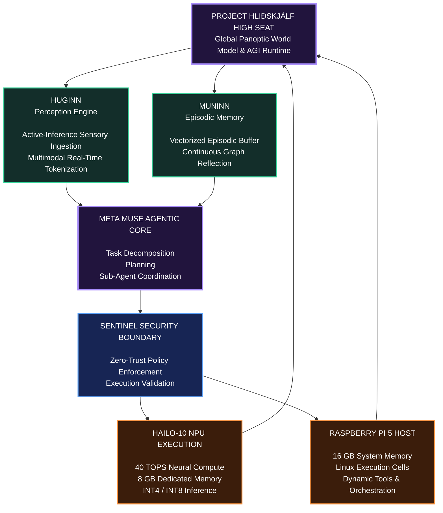
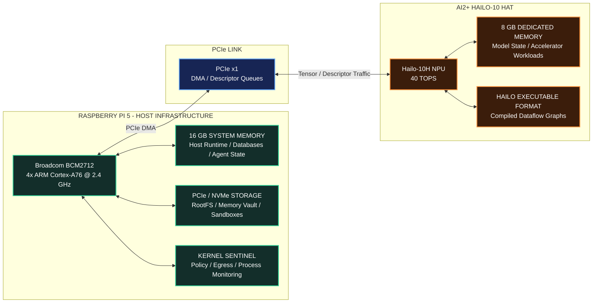
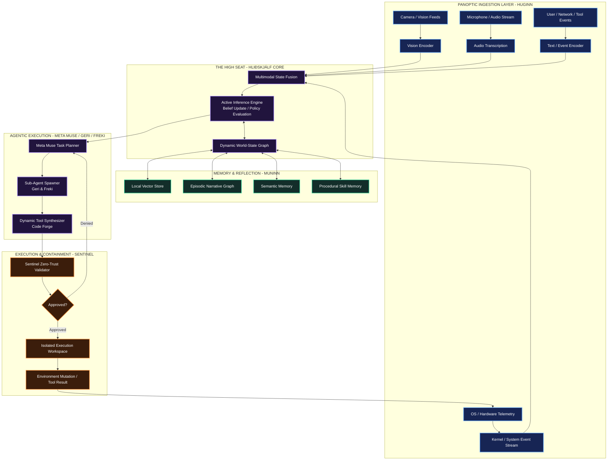
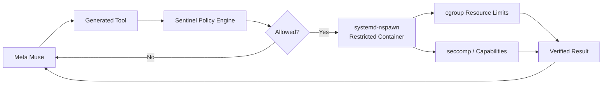
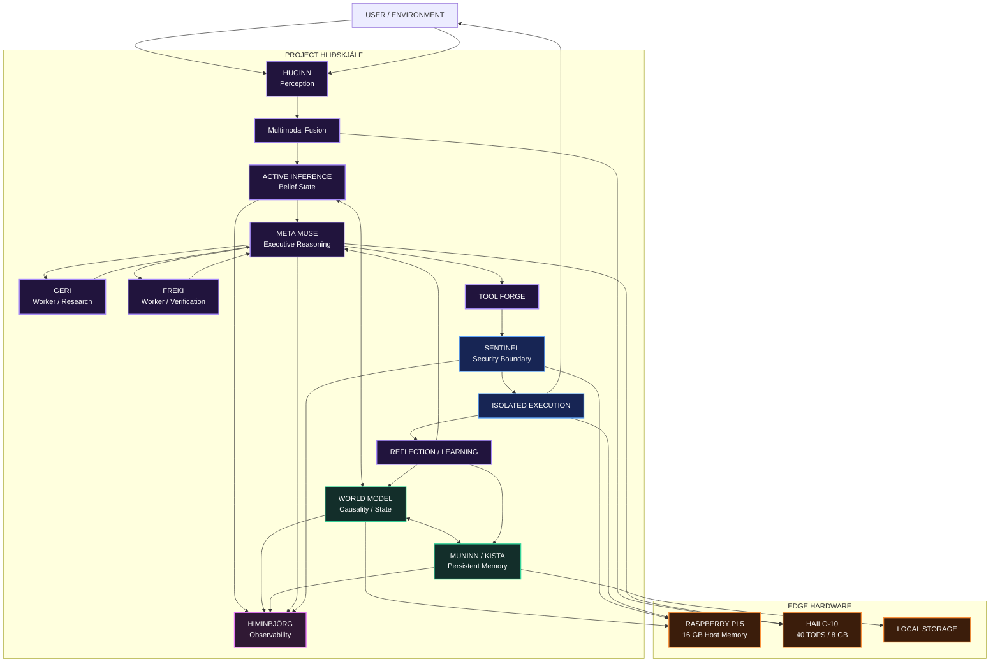

# RuneForgeAI: Project Hliðskjálf
## Edge-Native Sovereign AGI Architecture

`RuneForgeAI_Project_Hliðskjálf—Edge-Native_Sovereign_AGI_Architecture.md`

---

```text
Project Codename : Hliðskjálf (The Panoptic High Seat)
Hardware Target  : Raspberry Pi 5 (16 GB LPDDR4X) + AI2+ Hailo-10 HAT (8 GB dedicated memory, 40 TOPS)
Cognitive Model  : Meta Muse Framework (Muse Spark / Glimmer Localized Runtime)
Core Paradigm    : Sovereign Active Inference, Multi-Agent Tool Synthesis & Edge Panopticism
Repository       : https://github.com/hrabanazviking/RuneForgeAI-Project-Hlidhskjalf
```

---

## Table of Contents

1. [Executive Summary & The Edge-AGI Thesis](#1-executive-summary--the-edge-agi-thesis)
2. [Hardware Architecture & Memory Fabric Partitioning](#2-hardware-architecture--memory-fabric-partitioning)
3. [Mathematical Foundations of Autonomous Edge Intelligence](#3-mathematical-foundations-of-autonomous-edge-intelligence)
4. [System Topology: Project Hliðskjálf Subsystems](#4-system-topology-project-hliðskjálf-subsystems)
5. [Complete Reference Implementation](#5-complete-reference-implementation)
6. [End-to-End Operational Lifecycle](#6-end-to-end-operational-lifecycle)
7. [Edge Compilation & Deployment Workflow](#7-edge-compilation--deployment-workflow)
8. [Hardware Telemetry & Performance Profiles](#8-hardware-telemetry--performance-profiles)

---

# 1. Executive Summary & The Edge-AGI Thesis

**Project Hliðskjálf** establishes a sovereign, edge-native artificial general intelligence research substrate designed to operate on local consumer hardware.

In ancient Norse cosmology, **Hliðskjálf** is Odin's high seat, the vantage point from which the worlds can be observed. In this technical architecture, Hliðskjálf represents an autonomous panoptic cognitive observer capable of coordinating:

- perception
- multimodal state estimation
- persistent episodic memory
- causal world modeling
- policy selection
- task decomposition
- sub-agent execution
- dynamic tool generation
- continuous reflection
- security-constrained action
- self-correction

The central architectural thesis is:

> General autonomous intelligence is not produced by model scale alone. It requires a closed cognitive loop connecting perception, memory, world modeling, planning, action, verification, learning, and safety.

---

## 1.1 High-Level Cognitive Architecture



---

## 1.2 Closed Cognitive Loop

The architecture operates as a continuous cycle:

```text
PERCEIVE
   ↓
ENCODE
   ↓
UPDATE BELIEFS
   ↓
RECALL MEMORY
   ↓
PREDICT
   ↓
SELECT GOAL
   ↓
PLAN
   ↓
VALIDATE
   ↓
ACT
   ↓
OBSERVE CONSEQUENCES
   ↓
REFLECT
   ↓
LEARN
   ↓
REPEAT
```

By decoupling neural matrix computation from host orchestration, Hliðskjálf attempts to preserve responsiveness under continuous operation.

The division is approximately:

```text
Hailo-10:
Neural inference, embeddings, vision encoding, speech, fast model execution

Raspberry Pi 5:
Operating system, memory graph, orchestration, databases, sandboxes, security,
event processing, task scheduling, tool execution, telemetry, and persistence
```

---

# 2. Hardware Architecture & Memory Fabric Partitioning

The platform separates general-purpose ARM compute from accelerator-resident neural workloads.



---

## 2.1 Memory Allocation Topology

A major limitation of local transformer inference is memory bandwidth.

For an autoregressive model, an approximate lower bound on token-generation latency can be expressed as:

```math
t_{\mathrm{token}}
\gtrsim
\frac{S_{\mathrm{effective}}}
{B_{\mathrm{memory}}}
```

where:

```text
S_effective = effective model-state bytes that must be accessed per generated token
B_memory    = sustainable memory bandwidth
```

The corresponding bandwidth-limited token rate is approximately:

```math
R_{\mathrm{token}}
\lesssim
\frac{B_{\mathrm{memory}}}
{S_{\mathrm{effective}}}
```

This illustrates why separating neural inference memory from operating-system and cognitive-state memory is useful.

| Memory Domain | Capacity | Primary Workload Assignment | Interface |
| --- | ---: | --- | --- |
| **Hailo-10 Onboard Memory** | 8 GB | Quantized neural models, accelerator tensors, supported KV/state buffers, vision/audio encoders | Accelerator-local memory fabric |
| **Raspberry Pi 5 Host Memory** | 16 GB | Linux, Muse coordination, Kista/Muninn memory, world graphs, SQLite/vector databases, sandbox processes, Himinbjörg | BCM2712 system memory |
| **PCIe Interconnect** | x1 | Tensor descriptors, encoded observations, inference inputs/outputs, command queues | PCIe |

---

## 2.2 Logical Resource Separation

```text
┌──────────────────────────────────────────────────────────────┐
│ RASPBERRY PI 5 HOST MEMORY                                   │
├──────────────────────────────────────────────────────────────┤
│ Linux Kernel / systemd                                       │
│ Meta Muse Coordination                                       │
│ Muninn Episodic Memory                                       │
│ WYRD / World-State Graph                                     │
│ Kista Persistent Storage Cache                               │
│ Sentinel Policy State                                        │
│ Sandboxed Tool Processes                                     │
│ Himinbjörg HUD                                               │
└──────────────────────────────────────────────────────────────┘
                         │
                         │ PCIe
                         ▼
┌──────────────────────────────────────────────────────────────┐
│ HAILO-10 ACCELERATOR MEMORY                                  │
├──────────────────────────────────────────────────────────────┤
│ Compiled Neural Graphs                                       │
│ Quantized Weights                                            │
│ Intermediate Activations                                     │
│ Vision / Audio Encoders                                      │
│ Supported Local LLM State                                    │
└──────────────────────────────────────────────────────────────┘
```

---

# 3. Mathematical Foundations of Autonomous Edge Intelligence

Hliðskjálf uses **Active Inference** as one possible mathematical framework for linking perception, belief updating, uncertainty reduction, planning, and action.

The system can be modeled as a Partially Observable Markov Decision Process:

```math
\mathcal{M}
=
(
\mathcal{S},
\mathcal{A},
\mathcal{O},
T,
O,
R
)
```

where:

```text
S = latent environmental states
A = actions
O = observations
T = state transition model
O = observation model
R = preferences / utility structure
```

---

## 3.1 Variational Free Energy Minimization: Perception

Let the observation history be:

```math
\tilde{o}
=
\{o_1,o_2,\ldots,o_t\}
```

and hidden states:

```math
\tilde{s}
=
\{s_1,s_2,\ldots,s_t\}
```

The agent maintains:

```math
p(\tilde{o},\tilde{s})
```

as a generative model and:

```math
q(\tilde{s})
```

as an approximate posterior over hidden state.

Variational free energy is:

```math
F
=
\mathbb{E}_{q(\tilde{s})}
\left[
\ln q(\tilde{s})
-
\ln p(\tilde{o},\tilde{s})
\right]
```

It can also be written as:

```math
F
=
D_{\mathrm{KL}}
\left[
q(\tilde{s})
\|
p(\tilde{s}\mid\tilde{o})
\right]
-
\ln p(\tilde{o})
```

Because KL divergence is non-negative:

```math
F
\ge
-\ln p(\tilde{o})
```

Therefore minimizing:

```math
F
```

reduces an upper bound on surprise.

---

## 3.1.1 Complexity-Accuracy Decomposition

Variational free energy may also be expressed as:

```math
F
=
D_{\mathrm{KL}}
\left[
q(\tilde{s})
\|
p(\tilde{s})
\right]
-
\mathbb{E}_{q(\tilde{s})}
\left[
\ln p(\tilde{o}\mid\tilde{s})
\right]
```

Conceptually:

```text
Free Energy = Complexity - Accuracy
```

where:

```text
Complexity = divergence between posterior beliefs and prior beliefs
Accuracy   = how well the internal model explains observations
```

---

## 3.1.2 Belief-State Update

The Huginn sensory loop updates internal beliefs:

```math
\mu_s
```

by descending the free-energy gradient:

```math
\frac{d\mu_s}{dt}
=
-\eta
\nabla_{\mu_s}
F
```

where:

```text
η = learning rate
```

Discrete approximation:

```math
\mu_s^{(t+1)}
=
\mu_s^{(t)}
-
\eta
\nabla_{\mu_s}F
```

---

## 3.2 Expected Free Energy Minimization: Action & Policy Selection

A candidate policy is:

```math
\pi
=
(a_t,a_{t+1},\ldots,a_{t+H})
```

over horizon:

```math
H
```

The expected free energy of policy:

```math
\pi
```

can be expressed as:

```math
G(\pi)
=
\sum_{\tau=t+1}^{t+H}
G_{\tau}(\pi)
```

with:

```math
G_{\tau}(\pi)
=
\mathbb{E}_{q(o_{\tau},s_{\tau}\mid\pi)}
\left[
\ln q(s_{\tau}\mid\pi)
-
\ln p(o_{\tau},s_{\tau}\mid C,\pi)
\right]
```

where:

```text
C = preferred outcomes / goal priors
```

A useful conceptual decomposition is:

```math
G_{\tau}(\pi)
\approx
D_{\mathrm{KL}}
\left[
q(o_{\tau}\mid\pi)
\|
p(o_{\tau}\mid C)
\right]
-
I_q
\left(
s_{\tau};
o_{\tau}
\mid
\pi
\right)
```

The first term represents divergence from desired outcomes.

The second represents expected information gain.

Thus policy selection balances:

```text
goal achievement
+
uncertainty reduction
```

---

## 3.2.1 Policy Selection

Policies may be sampled using a Boltzmann distribution:

```math
q(\pi)
=
\frac{
\exp
\left(
-\gamma G(\pi)
\right)
}{
\sum_{\pi'}
\exp
\left(
-\gamma G(\pi')
\right)
}
```

where:

```text
γ = policy precision
```

Large:

```math
\gamma
```

produces more deterministic policy selection.

Small:

```math
\gamma
```

produces greater exploration.

---

# 4. System Topology: Project Hliðskjálf Subsystems



---

## 4.1 Huginn: Sensory Ingestion & Multimodal Fusion

**Huginn** operates as the sensory pipeline.

It converts raw external stimuli into structured cognitive observations.

Inputs can include:

```text
camera frames
audio
speech transcripts
system metrics
temperature
storage state
network events
serial I/O
user messages
tool results
files
service health
```

A multimodal observation vector may be represented as:

```math
o_t
=
[
o_t^{vision},
o_t^{audio},
o_t^{system},
o_t^{text},
o_t^{tool}
]
```

The components are fused into an internal latent state:

```math
z_t
=
f_{\mathrm{fusion}}
(
o_t
)
```

Accelerator-compatible projection and encoding operations may run on the Hailo-10 while host-side orchestration remains on the Raspberry Pi.

---

## 4.2 Muninn: Vectorized Long-Term Memory & Reflection

**Muninn** maintains contextual continuity across long operating horizons.

It combines:

```text
vector retrieval
episodic records
semantic memory
causal graph links
procedural memory
```

Observation surprise is:

```math
S(o_t)
=
-\ln p(o_t)
```

An episodic checkpoint may be triggered when:

```math
S(o_t)
>
\theta_{\mathrm{surprise}}
```

where:

```text
θ_surprise = configured episodic-storage threshold
```

Additional triggers may include:

```text
goal completion
user correction
unexpected failure
important state transition
high prediction error
new capability discovery
```

---

## 4.3 Meta Muse Execution Engine: Task Decomposition

Meta Muse acts as the high-level deliberative agent.

Responsibilities include:

```text
goal interpretation
task decomposition
planning
tool selection
sub-agent delegation
code synthesis
verification
reflection
```

A high-level objective:

```text
G
```

is decomposed into task graph:

```math
\mathcal{T}
=
(V_T,E_T)
```

where:

```text
V_T = executable tasks
E_T = dependency relationships
```

The task graph should remain acyclic unless an explicit bounded iteration construct is used.

---

### 4.3.1 Muse Localized Runtime

Where compatible with the available accelerator runtime, quantized local models can be used for:

```text
classification
routing
summarization
structured extraction
short-horizon planning
tool selection
fast local reasoning
```

More demanding reasoning can be routed to a stronger Muse runtime when available.

---

### 4.3.2 Geri & Freki: Sub-Agent Spawning

Sub-agents execute bounded asynchronous subtasks.

Potential roles:

```text
Geri:
research / environment analysis / retrieval

Freki:
verification / code execution / criticism
```

A more general worker pool can use:

```text
planner
researcher
critic
coder
verifier
simulator
memory analyst
```

---

### 4.3.3 Dynamic Tool Synthesis

When no existing tool satisfies an objective, the system may generate a temporary utility.

Tool lifecycle:

```text
NEED IDENTIFIED
      ↓
SPECIFICATION
      ↓
CODE GENERATION
      ↓
STATIC VALIDATION
      ↓
SANDBOX TEST
      ↓
RESULT VERIFICATION
      ↓
PROMOTE TO SKILL LIBRARY
      OR
DISCARD
```

---

## 4.4 The Sentinel Gate: Hardware-Enforced Safety

Autonomous execution should be treated as a privileged subsystem.

Sentinel operates as an out-of-band control boundary.

Its responsibilities include:

- execution policy enforcement
- filesystem boundary checks
- process restrictions
- network policy
- capability restrictions
- command validation
- audit logging
- approval requirements
- resource limits
- secret isolation

---

### 4.4.1 System Isolation

Tool execution should occur inside a restricted environment.

Possible mechanisms include:

```text
systemd-nspawn
Linux namespaces
dedicated service users
read-only mounts
seccomp
cgroups
capability dropping
network namespaces
```

For example:

```text
CAP_SYS_ADMIN removed
CAP_NET_ADMIN removed
private network namespace
read-only system paths
writable temporary workspace only
```

---

### 4.4.2 Egress Filtering

Network access should follow an explicit allow policy.

Conceptually:

```text
Generated Tool
     │
     ▼
Sentinel
     │
     ├── destination allowed?
     ├── protocol allowed?
     ├── credentials required?
     ├── payload policy satisfied?
     └── user approval required?
             │
             ▼
         Network
```

---

### 4.4.3 Secret Isolation

Models should not receive unrestricted access to credentials.

Preferred pattern:

```text
Agent requests authenticated action
             │
             ▼
       Sentinel Broker
             │
        credential lookup
             │
             ▼
      external service
```

The secret remains outside the model context.

---

# 5. Complete Reference Implementation

The following implementation is a **research prototype and architectural reference**, not a claim of a complete AGI implementation.

File:

```text
hlidhskjalf_core.py
```

```python
#!/usr/bin/env python3
"""
Project Hliðskjálf
Edge-Native Sovereign AGI Research Architecture

Coordinates:
- Hailo accelerator abstraction
- Active Inference world model
- Muninn episodic memory
- Meta Muse-style task decomposition
- Sentinel execution boundary
- Continuous perceive-plan-act-reflect loop

Author: RuneForgeAI / hrabanazviking
License: Apache-2.0
"""

import os
import sys
import time
import json
import hashlib
import tempfile
import subprocess
import logging

from dataclasses import dataclass
from typing import List, Dict, Any, Tuple, Optional

import numpy as np


# =====================================================================
# Structured Logging
# =====================================================================

logging.basicConfig(
    level=logging.INFO,
    format=(
        "%(asctime)s "
        "[%(levelname)s] "
        "[HLIDHSKJALF-CORE] "
        "%(message)s"
    ),
    handlers=[
        logging.StreamHandler(
            sys.stdout
        )
    ]
)

logger = logging.getLogger(
    "Hlidhskjalf"
)


# =====================================================================
# 1. HARDWARE DETECTION & HAILO ACCELERATOR INTERFACE
# =====================================================================

class Hailo10DeviceManager:
    """
    Prototype accelerator manager.

    A production implementation should replace the simulated hardware
    execution path with the installed HailoRT API appropriate for the
    target Hailo-10 environment.
    """

    def __init__(
        self,
        pcie_device_path: str = "/dev/hailo0"
    ):
        self.pcie_path = (
            pcie_device_path
        )

        self.device_available = (
            self._detect_hardware()
        )

        self.npu_memory_total_mb = 8192

        self.npu_memory_used_mb = 0

        self.loaded_hef_models: Dict[
            str,
            str
        ] = {}

    def _detect_hardware(
        self
    ) -> bool:

        if os.path.exists(
            self.pcie_path
        ):

            logger.info(
                "Hailo accelerator detected at %s",
                self.pcie_path
            )

            return True

        logger.warning(
            (
                "Hailo device node %s not found. "
                "Initializing software simulation mode."
            ),
            self.pcie_path
        )

        return False

    def load_hef(
        self,
        model_name: str,
        hef_path: str,
        memory_footprint_mb: int
    ) -> bool:

        available = (
            self.npu_memory_total_mb
            -
            self.npu_memory_used_mb
        )

        if (
            memory_footprint_mb
            > available
        ):

            logger.error(
                (
                    "Insufficient accelerator memory. "
                    "Requested: %d MB, Free: %d MB"
                ),
                memory_footprint_mb,
                available
            )

            return False

        logger.info(
            (
                "Registering HEF model '%s' "
                "(%d MB estimated footprint)..."
            ),
            model_name,
            memory_footprint_mb
        )

        self.loaded_hef_models[
            model_name
        ] = hef_path

        self.npu_memory_used_mb += (
            memory_footprint_mb
        )

        logger.info(
            (
                "Model '%s' registered. "
                "Estimated accelerator memory: "
                "%d / %d MB"
            ),
            model_name,
            self.npu_memory_used_mb,
            self.npu_memory_total_mb
        )

        return True

    def forward(
        self,
        model_name: str,
        input_embeddings: np.ndarray
    ) -> np.ndarray:

        if (
            model_name
            not in self.loaded_hef_models
        ):

            raise RuntimeError(
                f"Model not registered: {model_name}"
            )

        if not self.device_available:

            # Deterministic development fallback.
            dimension = (
                input_embeddings.shape[-1]
            )

            weights = np.sin(
                np.linspace(
                    0,
                    np.pi,
                    dimension,
                    dtype=np.float32
                )
            )

            return (
                input_embeddings
                * weights
                * 0.95
            )

        # Production implementation:
        #
        # 1. Open HailoRT device.
        # 2. Load / configure HEF.
        # 3. Create input/output virtual streams.
        # 4. Transfer tensor.
        # 5. Run inference.
        # 6. Return output tensor.
        #
        # Placeholder deterministic transform:
        return np.tanh(
            input_embeddings
        )


# =====================================================================
# 2. ACTIVE INFERENCE & FREE-ENERGY ENGINE
# =====================================================================

@dataclass
class EnvironmentalObservation:

    timestamp: float

    sensory_vector: np.ndarray

    telemetry: Dict[
        str,
        float
    ]

    raw_text: str


class ActiveInferenceWorldModel:
    """
    Simplified Active Inference-inspired world-state model.

    This implementation demonstrates architectural concepts rather
    than implementing a complete variational Bayesian FEP system.
    """

    def __init__(
        self,
        state_dimension: int = 128
    ):

        self.dim = (
            state_dimension
        )

        self.mu_s = np.zeros(
            self.dim,
            dtype=np.float32
        )

        self.prior_preferences = np.zeros(
            self.dim,
            dtype=np.float32
        )

        self.learning_rate = 0.05

    def set_goal_attractor(
        self,
        goal_vector: np.ndarray
    ):

        norm = np.linalg.norm(
            goal_vector
        )

        self.prior_preferences = (
            goal_vector
            /
            (
                norm
                + 1e-8
            )
        )

        logger.info(
            "New goal attractor registered."
        )

    def compute_variational_free_energy(
        self,
        observation_vector: np.ndarray
    ) -> float:

        observation_norm = (
            observation_vector
            /
            (
                np.linalg.norm(
                    observation_vector
                )
                + 1e-8
            )
        )

        accuracy = float(
            np.dot(
                self.mu_s,
                observation_norm
            )
        )

        complexity = float(
            0.5
            *
            np.sum(
                np.square(
                    self.mu_s
                )
            )
        )

        variational_free_energy = (
            complexity
            -
            accuracy
        )

        return (
            variational_free_energy
        )

    def update_beliefs(
        self,
        observation_vector: np.ndarray
    ) -> float:

        observation_norm = (
            observation_vector
            /
            (
                np.linalg.norm(
                    observation_vector
                )
                + 1e-8
            )
        )

        prediction_error = (
            observation_norm
            -
            self.mu_s
        )

        self.mu_s += (
            self.learning_rate
            *
            prediction_error
        )

        return (
            self.compute_variational_free_energy(
                observation_vector
            )
        )

    def evaluate_expected_free_energy(
        self,
        candidate_policy_vector: np.ndarray
    ) -> float:

        predicted_state = (
            self.mu_s
            +
            candidate_policy_vector
        )

        predicted_state = (
            predicted_state
            /
            (
                np.linalg.norm(
                    predicted_state
                )
                + 1e-8
            )
        )

        epistemic_value = float(
            np.linalg.norm(
                predicted_state
                -
                self.mu_s
            )
        )

        pragmatic_value = float(
            np.dot(
                predicted_state,
                self.prior_preferences
            )
        )

        expected_free_energy = -(
            0.4
            *
            epistemic_value
            +
            0.6
            *
            pragmatic_value
        )

        return (
            expected_free_energy
        )


# =====================================================================
# 3. MUNINN
# EPISODIC VECTOR MEMORY & CONSOLIDATION
# =====================================================================

@dataclass
class MemoryEntry:

    entry_id: str

    timestamp: float

    vector: np.ndarray

    context: str

    free_energy: float


class MuninnMemoryGraph:
    """
    In-memory demonstration of episodic vector retrieval.

    Production implementations should persist important episodes
    to Kista / SQLite / vector storage rather than relying exclusively
    on process RAM.
    """

    def __init__(
        self,
        embedding_dimension: int = 128
    ):

        self.dim = (
            embedding_dimension
        )

        self.store: List[
            MemoryEntry
        ] = []

    def write_episode(
        self,
        vector: np.ndarray,
        context: str,
        free_energy: float
    ):

        entry_id = hashlib.sha256(
            (
                f"{time.time()}_"
                f"{context}"
            ).encode()
        ).hexdigest()[:12]

        normalized_vector = (
            vector
            /
            (
                np.linalg.norm(
                    vector
                )
                + 1e-8
            )
        )

        entry = MemoryEntry(
            entry_id=entry_id,
            timestamp=time.time(),
            vector=normalized_vector,
            context=context,
            free_energy=free_energy
        )

        self.store.append(
            entry
        )

        logger.info(
            (
                "Muninn stored episode [%s] "
                "| Free Energy: %.4f"
            ),
            entry_id,
            free_energy
        )

    def retrieve_relevant_context(
        self,
        current_vector: np.ndarray,
        top_k: int = 3
    ) -> List[MemoryEntry]:

        if not self.store:

            return []

        current_norm = (
            current_vector
            /
            (
                np.linalg.norm(
                    current_vector
                )
                + 1e-8
            )
        )

        scored = []

        for item in self.store:

            similarity = float(
                np.dot(
                    current_norm,
                    item.vector
                )
            )

            scored.append(
                (
                    similarity,
                    item
                )
            )

        scored.sort(
            key=lambda item:
                item[0],
            reverse=True
        )

        return [
            item
            for _, item
            in scored[:top_k]
        ]


# =====================================================================
# 4. SENTINEL GATEWAY
# POLICY & EXECUTION BOUNDARY
# =====================================================================

class SentinelSecurityBoundary:
    """
    Demonstration policy gate.

    IMPORTANT:
    Lexical filtering plus subprocess execution is not a complete
    security sandbox. Production deployments should combine explicit
    tool policies with OS-level isolation, dedicated users, namespaces,
    seccomp, cgroups, capability restrictions, filesystem policies,
    and network controls.
    """

    FORBIDDEN_PATTERNS = {
        "rm -rf /",
        "mkfs",
        "dd if=",
        ":(){ :|:& };:",
        "chmod -R 777 /",
        "nc -e",
        "/dev/tcp/"
    }

    def __init__(
        self,
        workspace_root: Optional[str] = None
    ):

        if workspace_root is None:

            self.workspace_root = (
                tempfile.mkdtemp(
                    prefix=
                        "hlidhskjalf_sandbox_"
                )
            )

        else:

            self.workspace_root = (
                workspace_root
            )

            os.makedirs(
                self.workspace_root,
                exist_ok=True
            )

        logger.info(
            "Sentinel workspace initialized at %s",
            self.workspace_root
        )

    def verify_action_safety(
        self,
        action_script: str
    ) -> Tuple[
        bool,
        str
    ]:

        for pattern in (
            self.FORBIDDEN_PATTERNS
        ):

            if pattern in action_script:

                message = (
                    "Security policy violation: "
                    f"forbidden pattern '{pattern}' "
                    "detected."
                )

                logger.error(
                    message
                )

                return (
                    False,
                    message
                )

        return (
            True,
            "Action passed prototype Sentinel policy."
        )

    def execute_in_sandbox(
        self,
        script_body: str,
        timeout_seconds: int = 15
    ) -> Dict[str, Any]:

        safe, reason = (
            self.verify_action_safety(
                script_body
            )
        )

        if not safe:

            return {
                "exit_code":
                    -1,
                "stdout":
                    "",
                "stderr":
                    reason,
                "policy_blocked":
                    True
            }

        script_path = os.path.join(
            self.workspace_root,
            (
                "task_"
                f"{int(time.time() * 1000)}"
                ".py"
            )
        )

        with open(
            script_path,
            "w",
            encoding="utf-8"
        ) as file:

            file.write(
                script_body
            )

        logger.info(
            "Executing approved task inside restricted workspace."
        )

        command = [
            sys.executable,
            script_path
        ]

        try:

            process = subprocess.run(
                command,
                cwd=self.workspace_root,
                capture_output=True,
                text=True,
                timeout=timeout_seconds
            )

            return {
                "exit_code":
                    process.returncode,

                "stdout":
                    process.stdout.strip(),

                "stderr":
                    process.stderr.strip(),

                "policy_blocked":
                    False
            }

        except subprocess.TimeoutExpired:

            logger.error(
                (
                    "Task exceeded timeout "
                    "of %d seconds."
                ),
                timeout_seconds
            )

            return {
                "exit_code":
                    -2,

                "stdout":
                    "",

                "stderr":
                    "Execution timed out.",

                "policy_blocked":
                    False
            }

        finally:

            if os.path.exists(
                script_path
            ):

                os.remove(
                    script_path
                )


# =====================================================================
# 5. META MUSE AGENT ENGINE
# TASK DECOMPOSITION & TOOL SYNTHESIS
# =====================================================================

@dataclass
class AgentTask:

    task_id: str

    description: str

    action_type: str

    payload: str

    expected_free_energy: float = 0.0

    status: str = "PENDING"


class MetaMuseAgent:
    """
    Prototype executive layer for task decomposition,
    policy ranking, tool execution, and reflection.
    """

    def __init__(
        self,
        hailo_device: Hailo10DeviceManager,
        world_model: ActiveInferenceWorldModel,
        memory: MuninnMemoryGraph,
        sentinel: SentinelSecurityBoundary
    ):

        self.hailo = (
            hailo_device
        )

        self.world_model = (
            world_model
        )

        self.memory = (
            memory
        )

        self.sentinel = (
            sentinel
        )

    def decompose_objective(
        self,
        high_level_objective: str
    ) -> List[AgentTask]:

        logger.info(
            (
                "Meta Muse decomposing objective: "
                "'%s'"
            ),
            high_level_objective
        )

        tasks = [

            AgentTask(
                task_id=
                    "TASK_01_INGEST",

                description=
                    (
                        "Sample system sensors "
                        "and resource status"
                    ),

                action_type=
                    "ENVIRONMENT_IO",

                payload=
                    """
import json
import os

data = {
    "load_average": os.getloadavg()
}

print(
    json.dumps(data)
)
"""
            ),

            AgentTask(
                task_id=
                    "TASK_02_TOOL_SYNTHESIS",

                description=
                    (
                        "Execute a harmless "
                        "prototype maintenance task"
                    ),

                action_type=
                    "TOOL_USE",

                payload=
                    """
print(
    "Prototype temporary maintenance task completed."
)
"""
            ),

            AgentTask(
                task_id=
                    "TASK_03_EVALUATE",

                description=
                    (
                        "Evaluate convergence "
                        "toward the current goal attractor"
                    ),

                action_type=
                    "REFLECT",

                payload=
                    "EVALUATE_FEP_CONVERGENCE"
            )
        ]

        deterministic_rng = (
            np.random.default_rng(
                seed=42
            )
        )

        for task in tasks:

            simulated_effect = (
                deterministic_rng.normal(
                    0,
                    0.1,
                    size=self.world_model.dim
                ).astype(
                    np.float32
                )
            )

            task.expected_free_energy = (
                self.world_model
                .evaluate_expected_free_energy(
                    simulated_effect
                )
            )

        tasks.sort(
            key=lambda task:
                task.expected_free_energy
        )

        return tasks

    def execute_plan(
        self,
        tasks: List[AgentTask]
    ) -> Dict[str, Any]:

        results = {}

        for task in tasks:

            logger.info(
                (
                    "Executing Task [%s]: %s "
                    "(EFE: %.4f)"
                ),
                task.task_id,
                task.description,
                task.expected_free_energy
            )

            task.status = (
                "EXECUTING"
            )

            if task.action_type in (
                "ENVIRONMENT_IO",
                "TOOL_USE"
            ):

                execution_result = (
                    self.sentinel
                    .execute_in_sandbox(
                        task.payload
                    )
                )

                if (
                    execution_result[
                        "exit_code"
                    ]
                    == 0
                ):

                    task.status = (
                        "COMPLETED"
                    )

                    results[
                        task.task_id
                    ] = execution_result[
                        "stdout"
                    ]

                    logger.info(
                        (
                            "Task [%s] finished: %s"
                        ),
                        task.task_id,
                        execution_result[
                            "stdout"
                        ]
                    )

                else:

                    task.status = (
                        "FAILED"
                    )

                    results[
                        task.task_id
                    ] = execution_result[
                        "stderr"
                    ]

                    logger.error(
                        (
                            "Task [%s] failed: %s"
                        ),
                        task.task_id,
                        execution_result[
                            "stderr"
                        ]
                    )

            elif (
                task.action_type
                == "REFLECT"
            ):

                task.status = (
                    "COMPLETED"
                )

                free_energy = (
                    self.world_model
                    .compute_variational_free_energy(
                        self.world_model.mu_s
                    )
                )

                results[
                    task.task_id
                ] = (
                    "Current Variational "
                    "Free Energy: "
                    f"{free_energy:.4f}"
                )

        return results


# =====================================================================
# 6. PANOPTIC HIGH-SEAT ORCHESTRATION PIPELINE
# =====================================================================

class HlidhskjalfOrchestrator:
    """
    Coordinates:

    Huginn:
        perception

    Muninn:
        memory

    Meta Muse:
        planning and executive control

    Sentinel:
        validation and execution policy

    Hailo:
        accelerator-facing inference abstraction
    """

    def __init__(
        self
    ):

        logger.info(
            (
                "Booting Project Hliðskjálf "
                "edge intelligence substrate..."
            )
        )

        self.hailo = (
            Hailo10DeviceManager()
        )

        self.world_model = (
            ActiveInferenceWorldModel(
                state_dimension=128
            )
        )

        self.memory = (
            MuninnMemoryGraph(
                embedding_dimension=128
            )
        )

        self.sentinel = (
            SentinelSecurityBoundary()
        )

        self.hailo.load_hef(
            "MuseGlimmer_Quant_INT8",
            "/opt/models/muse_glimmer.hef",
            memory_footprint_mb=4200
        )

        self.hailo.load_hef(
            "Vision_Encoder_INT8",
            "/opt/models/vision_encoder.hef",
            memory_footprint_mb=1200
        )

        self.muse = MetaMuseAgent(
            hailo_device=
                self.hailo,

            world_model=
                self.world_model,

            memory=
                self.memory,

            sentinel=
                self.sentinel
        )

    @staticmethod
    def text_to_vector(
        text: str,
        dimensions: int = 128
    ) -> np.ndarray:

        output = bytearray()

        counter = 0

        while len(output) < dimensions:

            digest = hashlib.sha256(
                (
                    f"{counter}:"
                    f"{text}"
                ).encode(
                    "utf-8"
                )
            ).digest()

            output.extend(
                digest
            )

            counter += 1

        return (
            np.frombuffer(
                bytes(
                    output[:dimensions]
                ),
                dtype=np.uint8
            ).astype(
                np.float32
            )
            / 255.0
        )

    def step_cognitive_cycle(
        self,
        user_objective: str,
        sensory_input: str
    ):

        logger.info(
            (
                "========== "
                "COGNITIVE ITERATION "
                "=========="
            )
        )

        # ---------------------------------------------------------
        # 1. HUGINN: Encode sensory input
        # ---------------------------------------------------------

        sensory_vector = (
            self.text_to_vector(
                sensory_input,
                dimensions=
                    self.world_model.dim
            )
        )

        # ---------------------------------------------------------
        # 2. Accelerator-facing feature processing
        # ---------------------------------------------------------

        processed_features = (
            self.hailo.forward(
                "Vision_Encoder_INT8",
                sensory_vector
            )
        )

        # ---------------------------------------------------------
        # 3. Belief update
        # ---------------------------------------------------------

        free_energy = (
            self.world_model
            .update_beliefs(
                processed_features
            )
        )

        logger.info(
            (
                "Belief state updated. "
                "Variational Free Energy: %.4f"
            ),
            free_energy
        )

        # ---------------------------------------------------------
        # 4. MUNINN: Episodic memory
        # ---------------------------------------------------------

        self.memory.write_episode(
            self.world_model.mu_s,
            (
                "Sensory observation: "
                f"{sensory_input}"
            ),
            free_energy
        )

        # ---------------------------------------------------------
        # 5. Goal encoding
        # ---------------------------------------------------------

        goal_vector = (
            self.text_to_vector(
                user_objective,
                dimensions=
                    self.world_model.dim
            )
        )

        self.world_model.set_goal_attractor(
            goal_vector
        )

        # ---------------------------------------------------------
        # 6. Plan and execute
        # ---------------------------------------------------------

        tasks = (
            self.muse
            .decompose_objective(
                user_objective
            )
        )

        execution_results = (
            self.muse
            .execute_plan(
                tasks
            )
        )

        # ---------------------------------------------------------
        # 7. Reflection / logging
        # ---------------------------------------------------------

        logger.info(
            "Cycle complete."
        )

        logger.info(
            json.dumps(
                execution_results,
                indent=2
            )
        )

        return (
            execution_results
        )


def main():

    orchestrator = (
        HlidhskjalfOrchestrator()
    )

    test_objective = (
        "Monitor Raspberry Pi thermals, "
        "verify memory headroom, and inspect "
        "local cognitive runtime health."
    )

    test_sensory_event = (
        "System telemetry stream: "
        "Temp=44.2C, Voltage=5.01V, Load=0.18"
    )

    orchestrator.step_cognitive_cycle(
        user_objective=
            test_objective,

        sensory_input=
            test_sensory_event
    )


if __name__ == "__main__":
    main()
```

---

# 6. End-to-End Operational Lifecycle

The cognitive loop crosses both host and accelerator boundaries.

```mermaid
sequenceDiagram
    autonumber

    participant Host as Raspberry Pi 5 Host
    participant NPU as Hailo-10 NPU
    participant FEP as Active Inference Engine
    participant Muse as Meta Muse Agent
    participant Guard as Sentinel
    participant Sandbox as Isolated Workspace
    participant Memory as Muninn / Kista

    Host->>NPU: Submit encoded multimodal input

    Note over NPU:
        Accelerator executes
        supported neural inference

    NPU-->>Host: Return latent / inference output

    Host->>FEP: Submit processed observation

    FEP->>FEP: Update belief state

    FEP->>Memory: Store important episode

    Memory-->>FEP: Retrieve relevant prior context

    FEP->>Muse: Current belief state + goal preferences

    Muse->>Muse: Construct candidate task graph

    Muse->>FEP: Submit candidate policy effects

    FEP-->>Muse: Return policy scores

    Muse->>Guard: Submit selected action / generated tool

    Guard->>Guard: Validate policy and permissions

    alt Action Approved

        Guard->>Sandbox: Execute bounded task

        Sandbox-->>Host: Return result / changed state

        Host->>FEP: Feed resulting observation back

    else Action Rejected

        Guard-->>Muse: Return policy rejection

        Muse->>Muse: Replan

    end
```

---

## 6.1 Operational Cycle

```text
1. OBSERVE
   Huginn captures system or environmental input.

2. ENCODE
   Supported neural encoders transform raw observations.

3. UPDATE
   Active Inference updates the internal belief state.

4. REMEMBER
   Muninn/Kista stores high-value episodes.

5. RECALL
   Relevant prior memories are retrieved.

6. PLAN
   Meta Muse creates candidate task graphs.

7. SCORE
   Candidate policies are evaluated.

8. VALIDATE
   Sentinel checks proposed actions.

9. EXECUTE
   Approved tools run inside bounded execution environments.

10. VERIFY
    The resulting world state is observed.

11. REFLECT
    Prediction error and goal progress are evaluated.

12. LEARN
    Useful outcomes become memory, knowledge, or reusable skills.

13. REPEAT
```

---

# 7. Edge Compilation & Deployment Workflow

## 7.1 Compiling Supported Models for Hailo

Accelerator deployment requires models compatible with the installed Hailo software stack.

The general pipeline is:

```text
SOURCE MODEL
     ↓
SUPPORTED INTERMEDIATE REPRESENTATION
     ↓
PARSE
     ↓
CALIBRATE / QUANTIZE
     ↓
OPTIMIZE
     ↓
COMPILE
     ↓
HEF
     ↓
HAILO RUNTIME
```

A conceptual command flow may resemble:

```bash
# Parse a supported model representation.
hailo parser onnx model.onnx \
    --har-path model.har

# Optimize using representative calibration data.
hailo optimize \
    --har-path model.har \
    --calib-set-path ./calibration_data.npy

# Compile the optimized model for the target accelerator.
hailo compiler \
    --har-path model.har \
    --output-hef-path /opt/models/model.hef
```

Exact parser, optimization, model-family, and target-device flags should follow the Hailo software version installed on the target system.

---

## 7.2 Raspberry Pi PCIe Configuration

PCIe configuration is platform and HAT dependent.

Where PCIe Gen 3 operation is supported and stable for the installed hardware, Raspberry Pi configuration may include:

```ini
# /boot/firmware/config.txt

[all]

dtparam=pciex1

# Enable only when validated for the installed hardware.
dtparam=pciex1_gen=3
```

Reboot after changing firmware configuration:

```bash
sudo reboot
```

Inspect the negotiated PCIe link:

```bash
lspci -vvv
```

Search the Hailo device entry for:

```text
LnkCap
LnkSta
Speed
Width
```

Do not assume Gen 3 operation until the negotiated link state confirms it.

---

## 7.3 Hardening the Execution Sandbox

Create an isolated root filesystem:

```bash
sudo mkdir -p /var/lib/machines/hlidhskjalf-sandbox
```

A Debian root filesystem can be prepared with:

```bash
sudo debootstrap \
    --variant=minbase \
    bookworm \
    /var/lib/machines/hlidhskjalf-sandbox
```

Create a shared workspace:

```bash
sudo mkdir -p /tmp/hlidhskjalf_shared
```

Launch a restricted container:

```bash
sudo systemd-nspawn \
    -D /var/lib/machines/hlidhskjalf-sandbox \
    --private-network \
    --drop-capability=CAP_SYS_ADMIN \
    --drop-capability=CAP_NET_ADMIN \
    --bind=/tmp/hlidhskjalf_shared:/workspace
```

---

## 7.4 Recommended Execution Boundary



---

# 8. Hardware Telemetry & Performance Profiles

Performance should be treated as a measured property of the final hardware/software stack rather than assumed from architecture alone.

A benchmark record should include:

| Metric | Idle | Active Cognitive Loop | Unit |
| --- | ---: | ---: | --- |
| Hailo NPU Temperature | measured | measured | °C |
| Raspberry Pi CPU Temperature | measured | measured | °C |
| Total System Power | measured | measured | W |
| Accelerator Memory Usage | measured | measured | GB |
| Raspberry Pi Host RAM Usage | measured | measured | GB |
| PCIe Transfer Latency | measured | measured | ms / batch |
| Cognitive Loop Rate | measured | measured | cycles / s |
| Model Inference Latency | measured | measured | ms |
| Memory Retrieval Latency | measured | measured | ms |
| Tool Execution Latency | measured | measured | ms |

---

## 8.1 Benchmark Logging

Recommended JSONL telemetry:

```json
{
  "timestamp": 1791360000000,
  "cpu_temperature_c": 58.7,
  "npu_temperature_c": 54.2,
  "host_ram_used_gb": 6.8,
  "npu_memory_used_gb": 5.4,
  "pcie_latency_ms": 1.84,
  "cognitive_cycle_hz": 12.5,
  "power_watts": 17.4
}
```

Historical measurements should be retained so regressions can be detected.

---

## 8.2 Performance Efficiency

A useful efficiency metric is:

```math
E_{\mathrm{cog}}
=
\frac{
N_{\mathrm{successful\ cognitive\ cycles}}
}{
E_{\mathrm{joules}}
}
```

where:

```text
E_cog = successful cognitive operations per joule
```

For task-oriented benchmarking:

```math
E_{\mathrm{task}}
=
\frac{
N_{\mathrm{verified\ completed\ tasks}}
}{
E_{\mathrm{joules}}
}
```

---

## 8.3 Latency Budget

Total closed-loop latency can be decomposed as:

```math
L_{\mathrm{total}}
=
L_{\mathrm{ingest}}
+
L_{\mathrm{encode}}
+
L_{\mathrm{reason}}
+
L_{\mathrm{policy}}
+
L_{\mathrm{security}}
+
L_{\mathrm{execute}}
+
L_{\mathrm{verify}}
```

A fast reflex path may bypass expensive deliberation:

```text
Observation
   ↓
Local Classifier
   ↓
Known Safe Policy
   ↓
Action
```

while complex events use:

```text
Observation
   ↓
World Model
   ↓
Memory
   ↓
Meta Muse
   ↓
Sub-Agent Deliberation
   ↓
Sentinel
   ↓
Action
```

---

# 9. Final Architecture



---

# 10. Core Design Principle

Project Hliðskjálf can be summarized as:

```text
HUGINN
Perceive
   │
   ▼
HIGH SEAT
Understand
   │
   ▼
MUNINN
Remember
   │
   ▼
META MUSE
Reason
   │
   ▼
GERI & FREKI
Explore / Verify
   │
   ▼
SENTINEL
Constrain
   │
   ▼
SANDBOX
Act
   │
   ▼
WORLD
Changes
   │
   ▼
HUGINN
Observe Again
```

The architecture therefore aims to transform a conventional:

```text
prompt -> model -> answer
```

system into:

```text
PERCEPTION
    +
PERSISTENT MEMORY
    +
CAUSAL WORLD MODEL
    +
ACTIVE INFERENCE
    +
META MUSE REASONING
    +
PARALLEL SUB-AGENTS
    +
DYNAMIC TOOLS
    +
SECURE ACTION
    +
OUTCOME VERIFICATION
    +
REFLECTION
    +
CONTINUAL LEARNING
```

The defining property of Hliðskjálf is not any single model.

It is the **closed cognitive loop connecting models, memory, world state, tools, hardware, observation, and verified action into one persistent edge-native intelligence architecture**.
