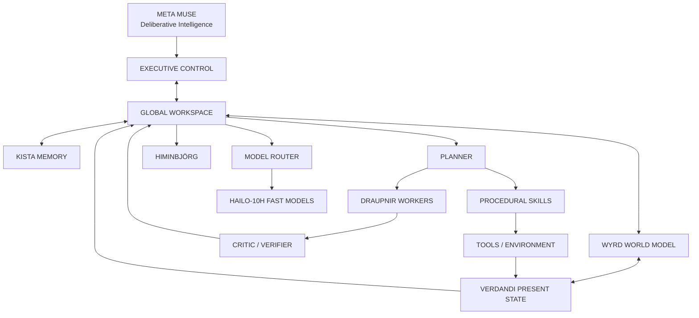
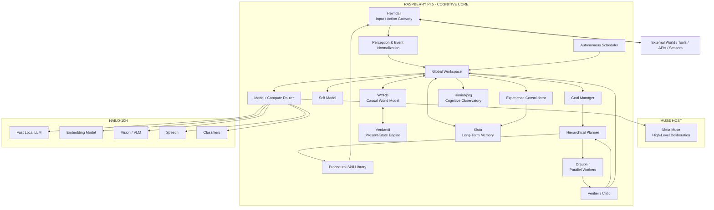
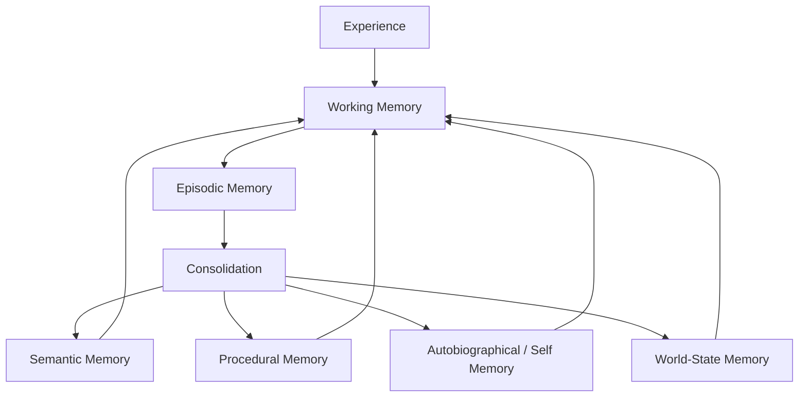
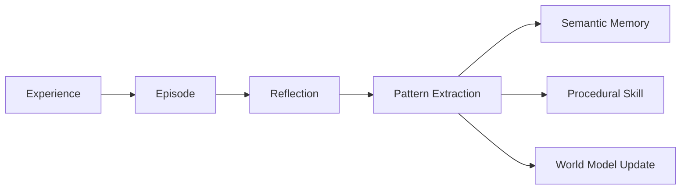
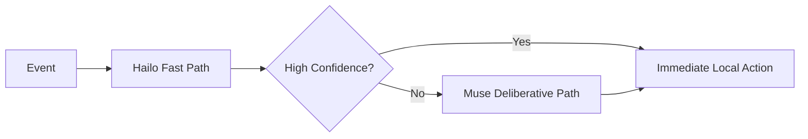
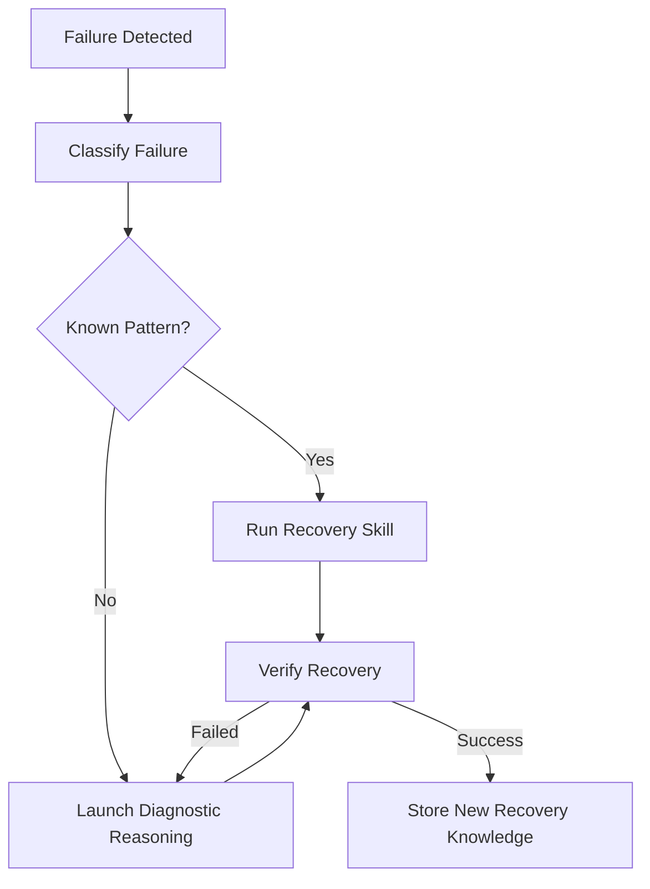
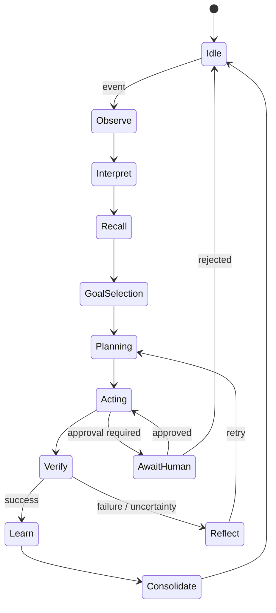
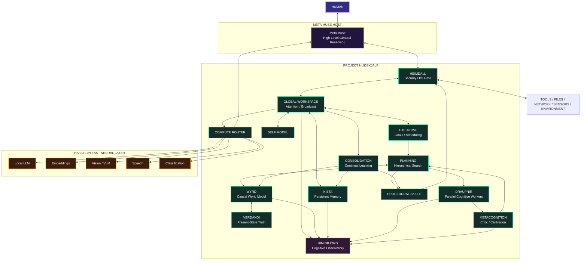

# Toward AGI with Meta Muse and Project Hliðskjálf
## A Distributed Cognitive Architecture for Persistent General Autonomous Intelligence

`TOWARD_AGI_WITH_META_MUSE_AND_PROJECT_HLIDHSKJALF.md`

---

> **Project thesis:** AGI is unlikely to emerge merely by running a larger language model. A more plausible engineering route is to construct a persistent cognitive system around strong foundation models: memory, world modeling, planning, perception, tools, self-evaluation, continual learning, bounded autonomy, and an executive architecture that integrates them into one closed loop.
>
> **Project Hliðskjálf provides much of that missing substrate.**

---

# Table of Contents

1. [Scope and Important Qualification](#1-scope-and-important-qualification)
2. [AGI as an Engineering Target](#2-agi-as-an-engineering-target)
3. [Why Project Hliðskjálf Is a Useful AGI Substrate](#3-why-project-hliðskjálf-is-a-useful-agi-substrate)
4. [Hardware and Compute Model](#4-hardware-and-compute-model)
5. [The Central Cognitive Loop](#5-the-central-cognitive-loop)
6. [Global Cognitive Architecture](#6-global-cognitive-architecture)
7. [The Global Workspace](#7-the-global-workspace)
8. [Hierarchical Memory Architecture](#8-hierarchical-memory-architecture)
9. [WYRD World Model](#9-wyrd-world-model)
10. [Verdandi Present-State Engine](#10-verdandi-present-state-engine)
11. [Predictive World Modeling](#11-predictive-world-modeling)
12. [Goal and Drive Architecture](#12-goal-and-drive-architecture)
13. [Planning and Executive Control](#13-planning-and-executive-control)
14. [Draupnir Recursive Cognitive Workers](#14-draupnir-recursive-cognitive-workers)
15. [Metacognition and Self-Evaluation](#15-metacognition-and-self-evaluation)
16. [Continual Learning and Consolidation](#16-continual-learning-and-consolidation)
17. [The Self-Model](#17-the-self-model)
18. [Seidr as a Parallel Heuristic System](#18-seidr-as-a-parallel-heuristic-system)
19. [Hailo-10H as the Local Fast Cognitive Layer](#19-hailo-10h-as-the-local-fast-cognitive-layer)
20. [Dynamic Model Routing](#20-dynamic-model-routing)
21. [Multimodal Grounding](#21-multimodal-grounding)
22. [Tool Use and Action](#22-tool-use-and-action)
23. [Learning Skills Rather Than Replanning Everything](#23-learning-skills-rather-than-replanning-everything)
24. [Autonomous Cognitive Scheduling](#24-autonomous-cognitive-scheduling)
25. [Dreaming and Offline Consolidation](#25-dreaming-and-offline-consolidation)
26. [Failure Recovery and Cognitive Resilience](#26-failure-recovery-and-cognitive-resilience)
27. [Security and Bounded Autonomy](#27-security-and-bounded-autonomy)
28. [Proposed AGI-Oriented Repository Architecture](#28-proposed-agi-oriented-repository-architecture)
29. [Reference Cognitive Kernel](#29-reference-cognitive-kernel)
30. [Reference Memory Retrieval Engine](#30-reference-memory-retrieval-engine)
31. [Reference Global Workspace](#31-reference-global-workspace)
32. [Reference Planner and Critic Loop](#32-reference-planner-and-critic-loop)
33. [Reference Model Router](#33-reference-model-router)
34. [Reference Experience Consolidator](#34-reference-experience-consolidator)
35. [Distributed Event Protocol](#35-distributed-event-protocol)
36. [Operational State Machine](#36-operational-state-machine)
37. [System Services](#37-system-services)
38. [AGI Evaluation Framework](#38-agi-evaluation-framework)
39. [Development Roadmap](#39-development-roadmap)
40. [What Would Count as Success](#40-what-would-count-as-success)
41. [Final Architecture](#41-final-architecture)
42. [Conclusion](#42-conclusion)

---

# 1. Scope and Important Qualification

There is currently no universally accepted scientific recipe for Artificial General Intelligence.

No combination of:

```text
LLM
+
memory
+
agents
+
Raspberry Pi
```

can honestly be guaranteed to produce AGI.

This document therefore uses **AGI** as an engineering target characterized by measurable capabilities rather than as a marketing label.

The objective is to construct a system that becomes increasingly capable of:

- operating across unrelated domains
- learning from experience
- transferring skills between domains
- remembering over long periods
- modeling its environment
- maintaining an internal model of itself
- generating and pursuing long-term goals
- decomposing unfamiliar problems
- using tools
- evaluating its own uncertainty
- recognizing failure
- recovering from errors
- improving reusable procedures
- adapting without rebuilding its entire architecture
- operating for extended periods without constant human prompting

This can be called an:

```text
AGI-oriented cognitive architecture
```

or:

```text
General Autonomous Intelligence Architecture
```

until empirical testing demonstrates something stronger.

---

# 2. AGI as an Engineering Target

A useful operational model of general intelligence is:

```math
G =
f(
R,
M,
W,
P,
A,
L,
X,
C
)
```

where:

```text
R = reasoning ability
M = persistent memory
W = world modeling
P = planning ability
A = autonomous action
L = continual learning
X = transfer/generalization
C = calibration and self-correction
```

A system should not be considered increasingly general merely because one component becomes extremely strong.

For example:

```text
excellent language model
+
no persistent state
+
no world model
+
no learning
+
no independent action
```

is still structurally limited.

A better overall generality score should punish catastrophic weakness in any essential component.

One possible aggregate measure is a weighted geometric mean:

```math
G =
\prod_{i=1}^{n}
s_i^{w_i}
```

where:

```math
0 \le s_i \le 1
```

and:

```math
\sum_{i=1}^{n} w_i = 1
```

Equivalent logarithmic form:

```math
\ln G
=
\sum_{i=1}^{n}
w_i \ln s_i
```

This prevents exceptional performance in one category from hiding near-zero competence elsewhere.

---

# 3. Why Project Hliðskjálf Is a Useful AGI Substrate

The existing Project Hliðskjálf architecture already contains many components that a persistent cognitive system would require.

Current conceptual components include:

| Hliðskjálf System | Cognitive Interpretation |
| --- | --- |
| Meta Muse | high-level reasoning and executive intelligence |
| Heimdall | controlled sensory/action gateway |
| Yggdrasil | persistent cognitive edge substrate |
| WYRD | causal world model |
| Verdandi | current-state / temporal consistency model |
| Kista | persistent long-term memory |
| Draupnir | parallel problem-solving workers |
| Seidr | heuristic simulation |
| Mythic Coder | programmatic action and self-extension |
| Project A.E.S.I.R. | local model execution layer |
| Hailo-10H | fast edge neural inference |
| Himinbjörg | observable cognitive telemetry |
| Sagnaskemma | simulated environment and reasoning laboratory |
| Astrology / Divination systems | symbolic pattern-processing laboratory |

That architecture can be reorganized into a cognitive stack.



The major missing ingredient is not another subsystem.

It is **integration into a persistent closed cognitive loop**.

---

# 4. Hardware and Compute Model

The proposed system contains three qualitatively different compute layers.

## 4.1 Layer A: Meta Muse Host

The host performs expensive, deliberative cognition.

Best suited for:

- complex language reasoning
- long-context synthesis
- strategic planning
- difficult coding
- ambiguous decisions
- multi-domain analysis
- tool orchestration
- long-horizon task decomposition

Conceptually:

```text
SYSTEM 2
slow
expensive
high intelligence
large context
deliberative
```

---

## 4.2 Layer B: Raspberry Pi 5

The Raspberry Pi 5 with 16 GB RAM becomes the persistent cognitive substrate.

Responsibilities:

- global workspace
- event bus
- working state
- episodic memory
- semantic memory indexes
- causal world graph
- scheduler
- local planning
- monitoring
- state machines
- tool proxying
- health monitoring
- autonomy loops
- Himinbjörg visualization
- local databases

Conceptually:

```text
COGNITIVE NERVOUS SYSTEM
```

---

## 4.3 Layer C: Hailo-10H Accelerator

The Raspberry Pi AI HAT+ 2 contains:

```text
Hailo-10H
40 TOPS INT4
8 GB dedicated onboard memory
```

This memory is separate from the Pi's 16 GB system memory.

It should be treated as a **fast specialized neural layer**, not as unified RAM.

Best workloads include supported:

- local LLM inference
- embeddings
- classification
- intent routing
- speech processing
- vision
- VLM processing
- summarization
- relevance ranking
- anomaly detection
- fast micro-agent operations

Conceptually:

```text
SYSTEM 1
fast
local
cheap
low latency
always available
```

---

# 5. The Central Cognitive Loop

The most important architectural change is to stop thinking of the system as:

```text
prompt -> response
```

and instead implement:

```text
observe
   ↓
interpret
   ↓
update world model
   ↓
retrieve memory
   ↓
choose goal
   ↓
plan
   ↓
act
   ↓
observe consequences
   ↓
evaluate result
   ↓
learn
   ↓
repeat
```

Formalized:

```math
s_t
\rightarrow
b_t
\rightarrow
g_t
\rightarrow
\pi_t
\rightarrow
a_t
\rightarrow
o_{t+1}
\rightarrow
s_{t+1}
```

where:

```text
s_t   = internal state at time t
b_t   = belief/world model
g_t   = active goal
π_t   = selected policy or plan
a_t   = action
o_t   = observation
```

The architecture becomes a partially observable agent:

```math
\mathcal{A}
=
(\mathcal{S},
\mathcal{A},
\mathcal{O},
T,
O,
R,
\gamma)
```

analogous to a Partially Observable Markov Decision Process.

---

# 6. Global Cognitive Architecture

The complete proposed architecture:



---

# 7. The Global Workspace

A general agent needs a mechanism that determines what currently deserves system-wide attention.

Project Hliðskjálf should add:

```text
services/cognition/global_workspace.py
```

The workspace maintains a limited set of high-priority cognitive items.

Possible items include:

- new observation
- active goal
- error
- retrieved memory
- prediction failure
- tool result
- unexpected event
- urgent user request
- active plan
- unresolved contradiction

Each candidate receives an activation score.

```math
A_i
=
w_s S_i
+
w_g G_i
+
w_n N_i
+
w_u U_i
+
w_e E_i
```

where:

```text
S_i = salience
G_i = goal relevance
N_i = novelty
U_i = urgency
E_i = prediction error
```

The workspace selects:

```math
i^*
=
\arg\max_i A_i
```

or the top:

```math
K
```

items.

This creates an explicit computational bottleneck analogous to attention.

It also prevents every subsystem from competing for unlimited reasoning cycles.

---

# 8. Hierarchical Memory Architecture

AGI requires more than vector retrieval.

Kista should evolve into multiple interacting memory classes.



---

## 8.1 Working Memory

Short-lived active cognitive context.

Examples:

```text
current conversation
current plan
recent observations
active tool results
temporary hypotheses
```

Working memory should be aggressively bounded.

---

## 8.2 Episodic Memory

Stores events.

Example:

```json
{
  "event": "deployment_failure",
  "time": 1791359102,
  "context": "Hailo pipeline restart",
  "action": "restart service",
  "result": "success",
  "lessons": [
    "check driver state first"
  ]
}
```

---

## 8.3 Semantic Memory

Stores generalized knowledge extracted from episodes.

Example:

```text
If Hailo inference disappears after a kernel update,
check driver/device compatibility before rebuilding the model.
```

---

## 8.4 Procedural Memory

Stores reusable skills.

Example:

```text
skill:
    name: restart_hailo_pipeline
    preconditions:
        - hailo_device_detected
    steps:
        - inspect_service
        - restart_runtime
        - verify_device
        - run_smoke_test
```

---

## 8.5 Autobiographical Memory

Stores information about the agent's own history:

```text
what it attempted
what it learned
what it changed
what goals it has
what failures recur
what capabilities exist
```

This is essential for a persistent self-model.

---

# 9. WYRD World Model

WYRD should become the canonical structured representation of external reality.

Define:

```math
\mathcal{G}_t
=
(\mathcal{V}_t,\mathcal{E}_t)
```

where:

```text
V_t = entities and states
E_t = relations and causal links
```

Example entities:

```text
Muse
Volmarr
RaspberryPi5
Hailo10H
HiminbjorgHUD
GitHubRepo
Weather
CalendarEvent
TTRPGCharacter
File
Service
Model
```

Example edges:

```text
owns
contains
depends_on
connected_to
causes
believes
observed
located_at
created_by
requires
contradicts
supports
```

---

## 9.1 World State

A state vector can be represented as:

```math
\mathbf{s}_t
=
[
x_1,
x_2,
\ldots,
x_n
]
```

The transition model becomes:

```math
P(
\mathbf{s}_{t+1}
\mid
\mathbf{s}_t,
a_t
)
```

---

## 9.2 Belief State

Because observations may be incomplete:

```math
b_t(s)
=
P(s_t=s \mid o_{1:t},a_{1:t-1})
```

Bayesian update:

```math
b_t(s)
\propto
P(o_t \mid s)
\sum_{s'}
P(s \mid s',a_{t-1})
b_{t-1}(s')
```

This lets the system distinguish:

```text
known
believed
inferred
possible
unknown
```

rather than flattening everything into "truth."

---

# 10. Verdandi Present-State Engine

Verdandi should become the authority for:

```text
WHAT IS TRUE NOW?
```

WYRD may contain:

- history
- possible futures
- hypotheses
- simulations
- stale observations

Verdandi maintains the current validated state.

Every assertion should have:

```text
confidence
timestamp
source
state_class
```

Example:

```json
{
  "entity": "hailo_runtime",
  "attribute": "status",
  "value": "online",
  "confidence": 0.99,
  "observed_at": 1791359000,
  "source": "device.health",
  "state_class": "observed"
}
```

---

## 10.1 Temporal Decay

Confidence may decay as observations age.

```math
C(t)
=
C_0
e^{-\Delta t/\tau}
```

where:

```text
C_0 = original confidence
Δt  = elapsed time
τ   = persistence constant
```

A filesystem path may have a large:

```math
\tau
```

while a CPU temperature has a very small:

```math
\tau
```

---

# 11. Predictive World Modeling

A generally intelligent agent should not merely react.

It should predict.

For candidate action:

```math
a_t
```

predict:

```math
\hat{s}_{t+1}
=
f_\theta(
s_t,
a_t
)
```

After observing:

```math
s_{t+1}
```

calculate prediction error:

```math
\epsilon_t
=
\|
s_{t+1}
-
\hat{s}_{t+1}
\|_2
```

Unexpected outcomes become high-value learning events.

---

## 11.1 Prediction Error as Attention

Workspace salience can include:

```math
S_{\mathrm{prediction}}
=
\lambda
\epsilon_t
```

Large prediction errors trigger:

- reflection
- memory storage
- model revision
- replanning
- possible user notification

---

# 12. Goal and Drive Architecture

An autonomous agent requires explicit goal management.

Each goal:

```math
g_i
=
(
u_i,
p_i,
d_i,
c_i,
r_i
)
```

where:

```text
u_i = utility
p_i = priority
d_i = deadline pressure
c_i = confidence of success
r_i = resource cost
```

Goal activation:

```math
A(g_i)
=
w_u u_i
+
w_p p_i
+
w_d d_i
+
w_c c_i
-
w_r r_i
```

The executive selects:

```math
g^*
=
\arg\max_i A(g_i)
```

---

## 12.1 Goal Hierarchy

```text
identity goals
    ↓
long-term goals
    ↓
projects
    ↓
milestones
    ↓
tasks
    ↓
actions
```

Example:

```text
Maintain reliable edge intelligence
    ↓
Keep Hliðskjálf operational
    ↓
Monitor service health
    ↓
Detect Hailo failure
    ↓
Inspect driver state
```

---

# 13. Planning and Executive Control

Plans should be hierarchical.

```text
GOAL
  │
  ├── SUBGOAL
  │     ├── ACTION
  │     └── ACTION
  │
  └── SUBGOAL
        ├── ACTION
        └── VERIFY
```

Each action:

```math
a_i
=
(
pre_i,
op_i,
post_i,
cost_i
)
```

---

## 13.1 Expected Utility

Candidate plans can be scored:

```math
U(\pi)
=
\sum_{t=0}^{T}
\gamma^t
\mathbb{E}[r_t]
-
\lambda C(\pi)
-
\mu R(\pi)
```

where:

```text
reward = expected goal progress
C      = compute/resource cost
R      = operational risk
γ      = temporal discount
```

---

## 13.2 Planning Under Uncertainty

Use:

```math
\pi^*
=
\arg\max_\pi
\mathbb{E}
[
U(\pi)
]
```

subject to:

```math
Risk(\pi)
\le
R_{\max}
```

---

## 13.3 Monte Carlo Tree Search

For difficult branching decisions:

```math
UCB_i
=
\bar{X}_i
+
c
\sqrt{
\frac{\ln N}
{n_i}
}
```

where:

```text
X_i = estimated value
N   = parent visits
n_i = child visits
c   = exploration factor
```

This can be implemented by Draupnir workers evaluating alternative branches.

---

# 14. Draupnir Recursive Cognitive Workers

Draupnir should evolve from arbitrary sub-agent spawning into a controlled cognitive parallelism layer.

Worker types:

```text
Researcher
Planner
Critic
Coder
Verifier
Retriever
Simulator
Summarizer
Adversarial Reviewer
World-Model Analyst
```

---

## 14.1 Bounded Recursion

Worker allocation:

```math
N(d)
=
\left\lfloor
N_0 C \gamma^d
\right\rfloor
```

with:

```math
N_0 = 8
```

```math
\gamma = 0.5
```

```math
d_{\max}=3
```

Typical maximum tree:

```text
Depth 0: 8
Depth 1: 4
Depth 2: 2
Depth 3: 1
```

---

## 14.2 Worker Consensus

If workers propose answers:

```math
q_1,q_2,\ldots,q_n
```

weighted consensus:

```math
Q
=
\frac{
\sum_i c_i q_i
}{
\sum_i c_i
}
```

where:

```text
c_i = worker confidence
```

Disagreement itself is useful.

```math
D
=
\operatorname{Var}
(q_1,\ldots,q_n)
```

Large:

```math
D
```

should trigger deeper reasoning.

---

# 15. Metacognition and Self-Evaluation

A crucial difference between an ordinary agent and a general cognitive system is the ability to evaluate its own cognition.

After every consequential task:

```text
What was expected?
What happened?
Was the goal achieved?
Was the reasoning correct?
What failed?
What was learned?
Should a reusable skill be created?
```

---

## 15.1 Confidence Calibration

If the agent predicts probability:

```math
p_i
```

and outcome:

```math
y_i \in \{0,1\}
```

use Brier score:

```math
BS
=
\frac{1}{N}
\sum_{i=1}^{N}
(p_i-y_i)^2
```

Lower is better.

---

## 15.2 Expected Calibration Error

```math
ECE
=
\sum_{m=1}^{M}
\frac{|B_m|}{N}
\left|
acc(B_m)
-
conf(B_m)
\right|
```

An AGI-oriented architecture should track whether:

```text
confidence ≈ actual correctness
```

---

## 15.3 Reflection Trigger

Reflection should not run constantly.

Expected value of computation:

```math
VOC
=
E[
U_{\mathrm{after\ reflection}}
-
U_{\mathrm{before}}
]
-
C_{\mathrm{reflection}}
```

Reflect only when:

```math
VOC > 0
```

Approximate triggers:

```text
low confidence
high disagreement
high consequence
prediction failure
repeated failure
novel environment
user correction
contradictory evidence
```

---

# 16. Continual Learning and Consolidation

AGI requires experience to change future behavior.

The system should separate:

```text
raw experiences
```

from:

```text
learned generalizations
```

Pipeline:



---

## 16.1 Memory Retrieval Score

For memory:

```math
m_i
```

retrieve using:

```math
R_i
=
\alpha S_i
+
\beta C_i
+
\gamma T_i
+
\delta G_i
+
\epsilon K_i
```

where:

```text
S_i = semantic similarity
C_i = causal relevance
T_i = temporal relevance
G_i = current goal relevance
K_i = learned importance
```

---

## 16.2 Semantic Similarity

```math
S_i
=
\frac{
\mathbf{q}\cdot\mathbf{m}_i
}{
\|\mathbf{q}\|
\|\mathbf{m}_i\|
}
```

---

## 16.3 Recency

```math
T_i
=
e^{-\Delta t_i/\tau_i}
```

---

## 16.4 Memory Importance

Importance can increase through successful reuse:

```math
K_i^{t+1}
=
K_i^t
+
\eta
(
r_t-K_i^t
)
```

---

# 17. The Self-Model

A persistent agent requires structured information about itself.

Create:

```text
services/cognition/self_model.py
```

State:

```math
\mathbf{z}_{self}
=
[
identity,
capabilities,
limits,
resources,
goals,
history,
confidence,
relationships
]
```

Examples:

```text
Which tools can I use?
Which services are online?
What model am I using?
What do I know?
What am I uncertain about?
What am I currently doing?
Why am I doing it?
What have I recently learned?
```

---

## 17.1 Capability Graph

```text
Muse
├── web
├── reasoning
├── planning
├── Hliðskjálf
│   ├── Kista
│   ├── WYRD
│   ├── Seidr
│   ├── Draupnir
│   ├── Hailo
│   └── Himinbjörg
├── coding
└── connected tools
```

The system should never invent a capability not represented in this graph.

---

# 18. Seidr as a Parallel Heuristic System

Seidr can be retained as a symbolic heuristic subsystem while maintaining strict epistemic separation.

Two channels:

```text
EMPIRICAL CHANNEL
data
statistics
causal evidence
measurements
```

and:

```text
SYMBOLIC CHANNEL
runes
astrology
divination
pattern associations
```

Blend only where explicitly appropriate.

```math
P_{\mathrm{combined}}
=
(1-\alpha)
P_{\mathrm{empirical}}
+
\alpha
P_{\mathrm{symbolic}}
```

For factual or safety-critical decisions:

```math
\alpha = 0
```

For explicitly symbolic or creative reasoning:

```math
0 \le \alpha \le 1
```

This preserves both rigor and the symbolic architecture.

---

# 19. Hailo-10H as the Local Fast Cognitive Layer

The Hailo-10H should not be expected to replace Muse.

Its role is more interesting:

```text
Muse = deliberative cortex

Pi 5 = persistent cognitive nervous system

Hailo-10H = fast local neural reflex layer
```

Potential Hailo services:

```text
intent classifier
embedding engine
memory reranker
speech recognition
speech synthesis
vision encoder
VLM
small local LLM
anomaly detector
salience classifier
tool selector
event summarizer
```

---

## 19.1 Fast / Slow Cognitive Loop



Example:

```text
"CPU temperature is 84°C"
```

does not require large-model philosophical reasoning.

A local classifier can immediately raise:

```text
THERMAL_ALERT
```

---

# 20. Dynamic Model Routing

Every cognitive operation should be routed according to requirements.

Define candidate model:

```math
m
```

Task cost:

```math
J(m)
=
w_l L(m)
+
w_c C(m)
+
w_e E(m)
+
w_q(1-Q(m))
+
w_r R(m)
```

where:

```text
L = latency
C = monetary cost
E = energy/resource cost
Q = expected answer quality
R = operational risk
```

Select:

```math
m^*
=
\arg\min_m J(m)
```

subject to:

```math
Q(m) \ge Q_{\min}
```

---

## 20.1 Routing Classes

### Reflex

Use Hailo/local deterministic logic.

```text
health alerts
classification
simple retrieval
intent detection
embeddings
```

### Routine

Use small local model.

```text
summarization
formatting
classification
simple coding
```

### Deliberative

Use Muse.

```text
novel problems
long-horizon planning
complex synthesis
difficult code
ambiguous judgment
```

### Parallel Deliberation

Use Muse + Draupnir.

```text
high impact
high uncertainty
large search spaces
```

---

# 21. Multimodal Grounding

Language-only intelligence risks becoming detached from external reality.

Hliðskjálf should incorporate physical observations.

Possible sources:

```text
camera
microphone
system metrics
GPS
weather
calendar
files
network state
sensors
user actions
tool results
```

Observation:

```math
o_t
=
[
o_t^{vision},
o_t^{audio},
o_t^{system},
o_t^{network},
o_t^{tools}
]
```

These become normalized events before entering the global workspace.

---

# 22. Tool Use and Action

General intelligence requires changing the environment.

Tool invocation should follow:

```text
INTENT
  ↓
PLAN
  ↓
TOOL SELECTION
  ↓
PARAMETER VALIDATION
  ↓
HEIMDALL
  ↓
EXECUTION
  ↓
OBSERVATION
  ↓
VERIFICATION
```

An action is not complete because:

```text
tool returned success
```

It is complete when:

```text
desired state was verified
```

Formally:

```math
Success(a)
=
I(
s_{after}
\models
GoalCondition
)
```

not:

```math
Success(a)
=
I(
tool\_exit\_code=0
)
```

---

# 23. Learning Skills Rather Than Replanning Everything

A mature agent should compile frequently successful plans into procedural skills.

Example initial plan:

```text
1. check service
2. inspect logs
3. verify device
4. restart service
5. run smoke test
6. inspect result
```

After repeated success, compile:

```yaml
skill:
  name: recover_hailo_runtime

  preconditions:
    - device_detected
    - service_unhealthy

  steps:
    - inspect_logs
    - restart_service
    - verify_runtime
    - run_smoke_test

  expected_outcome:
    service_state: healthy
```

Skill value:

```math
V(skill)
=
\frac{
successful\ executions
}{
total\ executions
}
```

---

# 24. Autonomous Cognitive Scheduling

The Pi should run a low-cost scheduler even while Muse is not actively reasoning.

Example queues:

```text
URGENT
ACTIVE
BACKGROUND
CONSOLIDATION
MAINTENANCE
```

Task priority:

```math
P_i
=
w_u U_i
+
w_g G_i
+
w_d D_i
+
w_n N_i
-
w_c C_i
```

---

## 24.1 Event-Driven Autonomy

Avoid constant expensive inference.

Prefer:

```text
sleep
  ↓
event
  ↓
classify
  ↓
needs cognition?
  ├── no -> deterministic handler
  └── yes -> local model
             ↓
        difficult?
             ├── no -> finish
             └── yes -> Muse
```

This creates a computationally sustainable architecture.

---

# 25. Dreaming and Offline Consolidation

Periods of inactivity can perform memory consolidation.

"Dreaming" in this architecture means offline cognitive processing, not biological sleep.

Tasks:

- summarize episodes
- identify repeated patterns
- merge duplicate memories
- generate semantic knowledge
- evaluate unfinished goals
- discover recurring failures
- compress memories
- update procedural skills
- rehearse important plans
- detect contradictions

---

## 25.1 Consolidation Priority

```math
D_i
=
w_n N_i
+
w_e E_i
+
w_r R_i
+
w_g G_i
```

where:

```text
N = novelty
E = emotional/salience equivalent
R = reuse potential
G = goal relevance
```

---

# 26. Failure Recovery and Cognitive Resilience

An autonomous system must treat failures as expected.

Every service should expose:

```text
HEALTHY
DEGRADED
FAILED
RECOVERING
OFFLINE
```

Recovery loop:



---

# 27. Security and Bounded Autonomy

Autonomy without boundaries is poor engineering.

Heimdall should enforce:

```text
identity
authentication
authorization
rate limits
resource limits
tool policies
audit logs
human approval classes
```

---

## 27.1 Action Classes

### Class 0: Read Only

```text
read sensor
inspect file
query memory
inspect service
```

May execute autonomously.

### Class 1: Reversible Local Change

```text
restart local service
create temporary artifact
modify sandbox file
```

May execute under policy.

### Class 2: Persistent External Change

```text
publish
send message
modify production repo
delete persistent data
```

Requires stricter policy.

### Class 3: High Consequence

Requires explicit human authorization.

---

## 27.2 Risk Gate

Action allowed if:

```math
R(a)
\le
R_{policy}
```

Risk model:

```math
R(a)
=
P(failure)
\times
Impact(failure)
```

---

# 28. Proposed AGI-Oriented Repository Architecture

```text
RuneForgeAI-Project-Hlidhskjalf/
├── README.md
├── LICENSE
├── pyproject.toml
├── Makefile
│
├── config/
│   ├── system.yaml
│   ├── cognition.yaml
│   ├── memory.yaml
│   ├── models.yaml
│   ├── policies.yaml
│   └── display_profiles.json
│
├── protocol/
│   ├── __init__.py
│   ├── bus.py
│   ├── envelope.py
│   ├── serialization.py
│   └── schemas/
│       ├── cognitive_event.json
│       ├── observation.json
│       ├── goal.json
│       ├── plan.json
│       ├── tool_result.json
│       └── memory.json
│
├── cognition/
│   ├── __init__.py
│   ├── kernel.py
│   ├── global_workspace.py
│   ├── scheduler.py
│   ├── executive.py
│   ├── goal_manager.py
│   ├── self_model.py
│   ├── uncertainty.py
│   └── metacognition.py
│
├── memory/
│   ├── working_memory.py
│   ├── episodic_memory.py
│   ├── semantic_memory.py
│   ├── procedural_memory.py
│   ├── autobiographical_memory.py
│   ├── consolidation.py
│   └── retrieval.py
│
├── world/
│   ├── wyrd_graph.py
│   ├── verdandi.py
│   ├── prediction.py
│   ├── belief_state.py
│   └── simulation.py
│
├── planning/
│   ├── planner.py
│   ├── mcts.py
│   ├── skill_library.py
│   ├── critic.py
│   └── verifier.py
│
├── agents/
│   ├── draupnir.py
│   ├── researcher.py
│   ├── coder.py
│   ├── critic.py
│   ├── verifier.py
│   └── simulator.py
│
├── learning/
│   ├── experience.py
│   ├── skill_compiler.py
│   ├── calibration.py
│   ├── replay.py
│   └── dreaming.py
│
├── router/
│   ├── model_router.py
│   ├── compute_budget.py
│   └── capability_registry.py
│
├── edge/
│   ├── hailo/
│   │   ├── pipeline_manager.py
│   │   ├── llm_worker.py
│   │   ├── embedding_worker.py
│   │   ├── vision_worker.py
│   │   └── speech_worker.py
│   └── aesir/
│       └── runtime.py
│
├── services/
│   ├── heimdall/
│   │   ├── gateway.py
│   │   ├── auth.py
│   │   ├── policies.py
│   │   └── audit.py
│   │
│   ├── kista/
│   │   ├── vault.py
│   │   └── vector_index.py
│   │
│   ├── seidr/
│   │   └── engine.py
│   │
│   └── himinbjorg/
│       ├── compositor.py
│       ├── canvas_cognition.py
│       ├── canvas_memory.py
│       ├── canvas_world.py
│       └── canvas_agents.py
│
├── muse/
│   ├── client.py
│   ├── gadget_bridge.py
│   ├── mcp_bridge.py
│   └── tool_manifest.json
│
├── deploy/
│   ├── systemd/
│   │   ├── hlidskjalf-core.service
│   │   ├── hlidskjalf-hud.service
│   │   └── hlidskjalf-consolidation.service
│   └── install.sh
│
└── tests/
    ├── cognition/
    ├── memory/
    ├── planning/
    ├── world/
    ├── integration/
    └── benchmarks/
```

---

# 29. Reference Cognitive Kernel

```python
#!/usr/bin/env python3

import asyncio
import time
from dataclasses import dataclass, field
from typing import Any


@dataclass
class CognitiveEvent:
    topic: str
    payload: dict[str, Any]

    priority: float = 0.5
    confidence: float = 1.0

    created_at: float = field(
        default_factory=time.time
    )


class CognitiveKernel:

    def __init__(
        self,
        workspace,
        memory,
        world_model,
        goal_manager,
        planner,
        verifier,
        router
    ):
        self.workspace = workspace
        self.memory = memory
        self.world_model = world_model

        self.goal_manager = goal_manager

        self.planner = planner
        self.verifier = verifier
        self.router = router

        self.queue = asyncio.PriorityQueue()

        self.running = False

    async def submit(
        self,
        event: CognitiveEvent
    ):
        await self.queue.put(
            (
                -event.priority,
                event.created_at,
                event
            )
        )

    async def observe(
        self,
        event: CognitiveEvent
    ):
        self.world_model.integrate(
            event
        )

        memories = (
            await self.memory.retrieve(
                event.payload
            )
        )

        self.workspace.broadcast(
            event=event,
            memories=memories
        )

    async def think(self):

        goal = (
            self.goal_manager
            .select_active_goal(
                workspace=self.workspace
            )
        )

        if goal is None:
            return

        plan = await self.planner.plan(
            goal=goal,
            workspace=self.workspace,
            world_model=self.world_model
        )

        result = await self.router.execute(
            plan
        )

        evaluation = (
            await self.verifier.evaluate(
                goal=goal,
                plan=plan,
                result=result,
                world_model=self.world_model
            )
        )

        await self.memory.store_episode(
            {
                "goal":
                    goal.to_dict(),

                "plan":
                    plan.to_dict(),

                "result":
                    result,

                "evaluation":
                    evaluation,

                "timestamp":
                    time.time()
            }
        )

        if not evaluation["success"]:

            await self.submit(
                CognitiveEvent(
                    topic="reflection.required",

                    payload={
                        "goal":
                            goal.to_dict(),

                        "evaluation":
                            evaluation
                    },

                    priority=0.9
                )
            )

    async def run(self):

        self.running = True

        while self.running:

            _, _, event = (
                await self.queue.get()
            )

            await self.observe(
                event
            )

            await self.think()
```

---

# 30. Reference Memory Retrieval Engine

```python
import math
import time


def cosine_similarity(
    a,
    b
):
    dot = sum(
        x * y
        for x, y in zip(a, b)
    )

    norm_a = math.sqrt(
        sum(
            x * x
            for x in a
        )
    )

    norm_b = math.sqrt(
        sum(
            y * y
            for y in b
        )
    )

    if (
        norm_a == 0
        or norm_b == 0
    ):
        return 0.0

    return dot / (
        norm_a * norm_b
    )


def recency_score(
    timestamp,
    tau_seconds
):
    age = max(
        0.0,
        time.time() - timestamp
    )

    return math.exp(
        -age / tau_seconds
    )


def memory_score(
    query_embedding,
    memory,
    goal_tags
):
    semantic = cosine_similarity(
        query_embedding,
        memory["embedding"]
    )

    recency = recency_score(
        memory["timestamp"],
        memory.get(
            "tau",
            86400.0
        )
    )

    goal_relevance = len(
        set(goal_tags)
        &
        set(
            memory.get(
                "goal_tags",
                []
            )
        )
    )

    importance = memory.get(
        "importance",
        0.5
    )

    causal = memory.get(
        "causal_relevance",
        0.0
    )

    score = (
        0.40 * semantic
        + 0.15 * recency
        + 0.20 * importance
        + 0.15 * causal
        + 0.10 * min(
            goal_relevance,
            1.0
        )
    )

    return score
```

---

# 31. Reference Global Workspace

```python
from dataclasses import dataclass


@dataclass
class WorkspaceItem:

    source: str
    content: object

    salience: float
    goal_relevance: float
    novelty: float
    urgency: float
    prediction_error: float

    def activation(self):

        return (
            0.20 * self.salience
            + 0.25 * self.goal_relevance
            + 0.15 * self.novelty
            + 0.20 * self.urgency
            + 0.20 * self.prediction_error
        )


class GlobalWorkspace:

    def __init__(
        self,
        capacity=12
    ):
        self.capacity = capacity
        self.items = []

    def submit(
        self,
        item: WorkspaceItem
    ):
        self.items.append(
            item
        )

        self.items.sort(
            key=lambda x:
                x.activation(),
            reverse=True
        )

        self.items = (
            self.items[
                :self.capacity
            ]
        )

    def broadcast(self):

        return list(
            self.items
        )
```

---

# 32. Reference Planner and Critic Loop

```python
class PlannerCriticLoop:

    def __init__(
        self,
        planner,
        critic,
        max_iterations=4
    ):
        self.planner = planner
        self.critic = critic

        self.max_iterations = (
            max_iterations
        )

    async def solve(
        self,
        goal,
        context
    ):

        plan = await self.planner(
            goal,
            context
        )

        for iteration in range(
            self.max_iterations
        ):

            critique = (
                await self.critic(
                    goal=goal,
                    plan=plan,
                    context=context
                )
            )

            if critique[
                "acceptable"
            ]:
                break

            plan = (
                await self.planner.revise(
                    plan=plan,
                    critique=critique,
                    goal=goal,
                    context=context
                )
            )

        return plan
```

---

# 33. Reference Model Router

```python
from dataclasses import dataclass


@dataclass
class ModelCandidate:

    name: str

    latency: float
    resource_cost: float
    expected_quality: float
    risk: float

    capability_tags: set[str]


class ModelRouter:

    def __init__(
        self,
        models
    ):
        self.models = models

    def cost(
        self,
        model
    ):
        return (
            0.25
            * model.latency

            + 0.20
            * model.resource_cost

            + 0.40
            * (
                1.0
                - model.expected_quality
            )

            + 0.15
            * model.risk
        )

    def choose(
        self,
        required_capabilities,
        minimum_quality
    ):

        candidates = []

        for model in self.models:

            if not required_capabilities.issubset(
                model.capability_tags
            ):
                continue

            if (
                model.expected_quality
                < minimum_quality
            ):
                continue

            candidates.append(
                model
            )

        if not candidates:

            raise RuntimeError(
                "No model satisfies task constraints"
            )

        return min(
            candidates,
            key=self.cost
        )
```

---

# 34. Reference Experience Consolidator

```python
class ExperienceConsolidator:

    def __init__(
        self,
        memory,
        semantic_extractor,
        skill_compiler
    ):
        self.memory = memory

        self.semantic_extractor = (
            semantic_extractor
        )

        self.skill_compiler = (
            skill_compiler
        )

    async def consolidate(
        self,
        episode
    ):

        knowledge = (
            await self.semantic_extractor(
                episode
            )
        )

        for fact in knowledge.get(
            "facts",
            []
        ):
            await self.memory.store_semantic(
                fact
            )

        if knowledge.get(
            "reusable_procedure"
        ):

            skill = (
                await self.skill_compiler(
                    episode
                )
            )

            await self.memory.store_skill(
                skill
            )

        await self.memory.mark_consolidated(
            episode["id"]
        )
```

---

# 35. Distributed Event Protocol

Every cognitive event should use a common envelope.

```json
{
  "protocol": "hlidskjalf.cognition",
  "version": "1.0.0",

  "event_id": "uuid",

  "timestamp": 1791359200000,

  "source": "wyrd",

  "topic": "world.entity.updated",

  "priority": 0.72,

  "confidence": 0.96,

  "payload": {
    "entity_id": "hailo_runtime",
    "attribute": "status",
    "value": "healthy"
  }
}
```

---

## 35.1 Event Families

```text
perception.*
workspace.*
memory.*
world.*
goal.*
plan.*
action.*
reflection.*
learning.*
self.*
system.*
hailo.*
muse.*
hud.*
```

---

# 36. Operational State Machine



---

# 37. System Services

Recommended runtime services:

```text
hlidskjalf-gateway.service
hlidskjalf-cognition.service
hlidskjalf-memory.service
hlidskjalf-hailo.service
hlidskjalf-hud.service
hlidskjalf-consolidation.timer
```

---

## 37.1 Cognitive Core Service

```ini
[Unit]
Description=Project Hliðskjálf Cognitive Core
After=network.target

[Service]
Type=simple

User=hlidskjalf

WorkingDirectory=/opt/hlidskjalf

ExecStart=/opt/hlidskjalf/.venv/bin/python \
    -m cognition.kernel

Restart=always

RestartSec=3

NoNewPrivileges=true
PrivateTmp=true

[Install]
WantedBy=multi-user.target
```

---

# 38. AGI Evaluation Framework

Do not call the system AGI merely because it behaves impressively.

Test it.

Evaluation domains should include:

| Capability | Example Test |
| --- | --- |
| reasoning | novel logic tasks |
| coding | unfamiliar repositories |
| memory | recall after weeks |
| transfer | apply knowledge across domains |
| planning | multi-day goals |
| tool use | unfamiliar tools |
| recovery | recover from induced failures |
| world model | predict consequences |
| calibration | confidence vs correctness |
| autonomy | operate without repeated prompting |
| learning | improve after feedback |
| multimodality | integrate text, vision, audio, state |
| adaptability | solve tasks not represented in training examples |

---

## 38.1 Generality Score

Let:

```math
s_i \in [0,1]
```

be capability score.

Use:

```math
G
=
\prod_i
s_i^{w_i}
```

not simple arithmetic average.

This prevents:

```text
100% language
100% coding
5% memory
0% recovery
```

from appearing generally intelligent.

---

## 38.2 Autonomy Horizon

Measure:

```math
H_A
=
\mathbb{E}
[
time\ until\ human\ intervention
]
```

for tasks the system is authorized to perform.

Track:

```text
minutes
hours
days
```

while also tracking correctness.

Long autonomy with poor outcomes is not intelligence.

---

## 38.3 Recovery Rate

```math
R_{\mathrm{recover}}
=
\frac{
successfully\ recovered\ failures
}{
recoverable\ failures
}
```

---

## 38.4 Skill Transfer

For skill learned in domain:

```text
A
```

and evaluated in domain:

```text
B
```

define:

```math
T_{A\rightarrow B}
=
Performance_B^{after}
-
Performance_B^{before}
```

Positive transfer is central to generality.

---

## 38.5 Continual Improvement

Measure:

```math
L_t
=
Performance_{t+1}
-
Performance_t
```

under fixed benchmark conditions.

The system should improve without catastrophic forgetting.

---

# 39. Development Roadmap

## Phase 0: Instrument Everything

Before adding intelligence:

- [ ] unify event schemas
- [ ] timestamp every event
- [ ] add tracing IDs
- [ ] measure latency
- [ ] measure resource use
- [ ] record tool outcomes
- [ ] record failures
- [ ] expose telemetry in Himinbjörg

---

## Phase 1: Persistent Cognitive State

Implement:

- [ ] working memory
- [ ] episodic memory
- [ ] semantic memory
- [ ] autobiographical memory
- [ ] procedural memory
- [ ] retrieval scoring
- [ ] memory decay
- [ ] importance weighting

Milestone:

```text
Muse can resume a project after restart
without reconstructing its state manually.
```

---

## Phase 2: Global Workspace

Implement:

- [ ] bounded attention buffer
- [ ] salience scoring
- [ ] novelty scoring
- [ ] urgency
- [ ] goal relevance
- [ ] prediction error

Milestone:

```text
The agent can prioritize competing events
without sending everything to the largest model.
```

---

## Phase 3: WYRD + Verdandi World Model

Implement:

- [ ] causal graph
- [ ] confidence values
- [ ] source provenance
- [ ] timestamps
- [ ] belief vs fact
- [ ] current-state validation
- [ ] prediction

Milestone:

```text
The system knows what it believes,
why it believes it,
and how fresh the evidence is.
```

---

## Phase 4: Goal Manager

Implement:

- [ ] goal hierarchy
- [ ] priority
- [ ] deadlines
- [ ] dependencies
- [ ] utility
- [ ] resource costs
- [ ] completion criteria

Milestone:

```text
The agent can pursue multiple projects
without losing long-term objectives.
```

---

## Phase 5: Hierarchical Planner

Implement:

- [ ] task decomposition
- [ ] prerequisite reasoning
- [ ] tool mapping
- [ ] plan verification
- [ ] replanning
- [ ] simulation
- [ ] MCTS for difficult branches

Milestone:

```text
The system can convert vague goals
into executable multi-stage plans.
```

---

## Phase 6: Draupnir Cognitive Parallelism

Implement:

- [ ] planner worker
- [ ] critic worker
- [ ] verifier worker
- [ ] researcher worker
- [ ] coder worker
- [ ] bounded recursion
- [ ] consensus
- [ ] disagreement detection

Milestone:

```text
Hard tasks automatically receive
additional cognitive effort.
```

---

## Phase 7: Hailo Fast Cognitive Layer

Implement supported:

- [ ] embeddings
- [ ] relevance ranking
- [ ] classification
- [ ] speech
- [ ] local small model
- [ ] visual processing
- [ ] fast intent routing

Milestone:

```text
Most routine cognitive traffic remains local.
```

---

## Phase 8: Model Router

Implement:

- [ ] latency estimates
- [ ] quality estimates
- [ ] capability tags
- [ ] cost estimates
- [ ] confidence escalation
- [ ] Muse fallback

Milestone:

```text
The architecture chooses intelligence
according to task difficulty.
```

---

## Phase 9: Reflection and Metacognition

Implement:

- [ ] task postmortems
- [ ] prediction-error logging
- [ ] confidence calibration
- [ ] contradiction detection
- [ ] user-correction learning
- [ ] failure clustering

Milestone:

```text
The agent can identify why it was wrong.
```

---

## Phase 10: Skill Compilation

Implement:

- [ ] repeated-plan detection
- [ ] procedural extraction
- [ ] preconditions
- [ ] postconditions
- [ ] skill success statistics
- [ ] automated regression tests

Milestone:

```text
Frequently repeated reasoning becomes reusable competence.
```

---

## Phase 11: Dreaming / Consolidation

Implement:

- [ ] idle-time replay
- [ ] memory compression
- [ ] duplicate merging
- [ ] semantic extraction
- [ ] unfinished-goal review
- [ ] skill refinement

Milestone:

```text
Experience changes future behavior
without explicit manual programming.
```

---

## Phase 12: Multimodal Grounding

Integrate:

- [ ] camera
- [ ] microphone
- [ ] system telemetry
- [ ] environmental sensors
- [ ] external data
- [ ] VLM processing

Milestone:

```text
The world model is continuously grounded
in observations beyond text.
```

---

## Phase 13: Long-Horizon Autonomy

Add:

- [ ] autonomous task scheduling
- [ ] interruption handling
- [ ] checkpointing
- [ ] recovery policies
- [ ] user approval gates
- [ ] resource budgets

Milestone:

```text
The system can pursue authorized objectives
for hours or days while remaining inspectable.
```

---

# 40. What Would Count as Success

Project Hliðskjálf should not claim AGI merely because:

```text
it talks well
it writes code
it remembers things
it spawns agents
it runs locally
```

A stronger claim requires evidence of:

## Generalization

Solves genuinely new task classes.

## Transfer

Knowledge from one domain improves another.

## Persistent Learning

Experience changes later behavior.

## Causal Reasoning

Can distinguish correlation from intervention.

## Long-Horizon Planning

Maintains coherent goals across extended time.

## Self-Correction

Recognizes and repairs its own mistakes.

## Calibration

Knows when it is uncertain.

## Tool Generality

Learns unfamiliar tools from documentation.

## Environmental Grounding

Maintains beliefs tied to actual observations.

## Skill Acquisition

Converts successful problem-solving into reusable procedures.

## Resilience

Recovers from failures without total reset.

## Efficient Intelligence

Uses large reasoning models only when necessary.

---

# 41. Final Architecture



---

# 42. Conclusion

The path toward AGI in this architecture is not:

```text
buy faster accelerator
+
run biggest possible LLM
=
AGI
```

It is:

```text
STRONG FOUNDATION MODEL
        +
PERSISTENT MEMORY
        +
CAUSAL WORLD MODEL
        +
PRESENT-STATE TRACKING
        +
GOAL MANAGEMENT
        +
HIERARCHICAL PLANNING
        +
TOOLS
        +
PARALLEL COGNITION
        +
SELF-EVALUATION
        +
CONTINUAL LEARNING
        +
MULTIMODAL GROUNDING
        +
LONG-HORIZON AUTONOMY
        +
FAST LOCAL NEURAL PROCESSING
        =
AGI-ORIENTED COGNITIVE SYSTEM
```

Meta Muse supplies a powerful deliberative intelligence and agent execution environment.

The Raspberry Pi 5 provides persistent local state, orchestration, memory, scheduling, and physical integration.

The Hailo-10H provides a fast local neural layer capable of handling recurring low-latency inference without consuming the main Muse reasoning loop.

Kista provides memory.

WYRD provides causal structure.

Verdandi provides the present.

Draupnir provides cognitive parallelism.

Seidr provides an optional heuristic channel.

Mythic Coder provides programmatic action.

Project A.E.S.I.R. provides an efficient edge inference path.

Himinbjörg provides observability.

Heimdall keeps the boundary controlled.

And Hliðskjálf binds the pieces into a single persistent cognitive architecture.

The central idea is simple:

```text
Muse should not merely answer.

Muse should continuously perceive,
remember,
model,
plan,
act,
observe,
evaluate,
learn,
and become more capable from experience.
```

When those processes operate as one stable closed loop, Hliðskjálf stops being merely a HUD and edge-computing project.

It becomes an experimental platform for **persistent general machine cognition**.

Whether that platform ultimately deserves the term **AGI** must be determined by measured capability, not by architecture diagrams or model size.

But this architecture provides a concrete engineering path for trying to cross that threshold.
