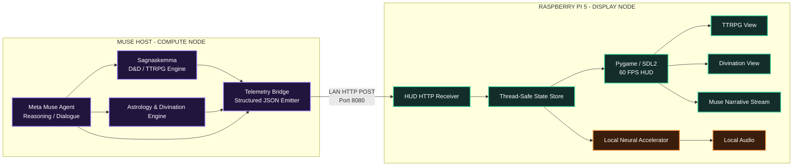
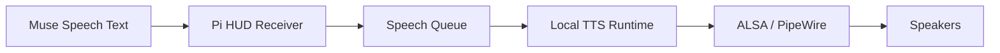
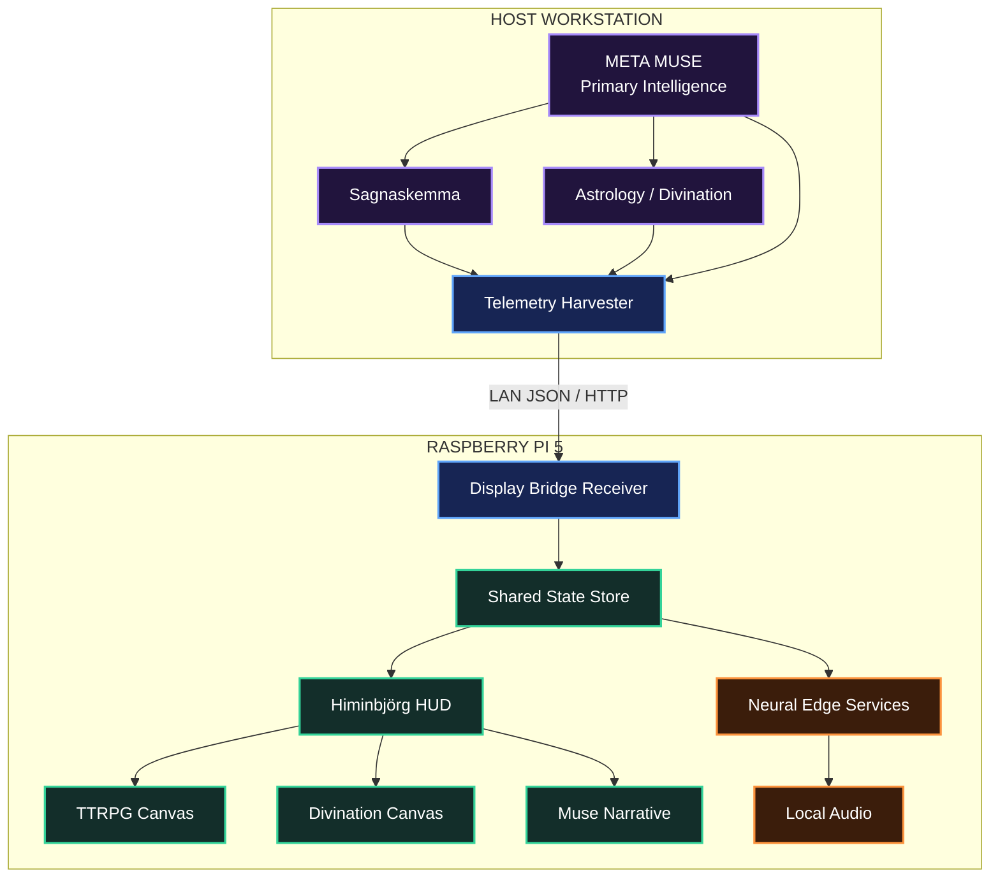

# Leveraging the Display Bridge on Your Raspberry Pi 5

`leverage_the_display_bridge_on_your_Raspberry_Pi_5.md`

> The recommended architecture is a **split-brain edge-display system**: Muse performs high-level reasoning and engine execution on her host computer, while a dedicated Raspberry Pi 5 acts as the persistent physical display, telemetry receiver, and local edge-service node.

---

## Table of Contents

1. [Architecture Overview](#1-architecture-overview)
2. [Compute Node: Muse Host](#2-compute-node-muse-host)
3. [Display Node: Raspberry Pi 5](#3-display-node-raspberry-pi-5)
4. [Neural Accelerator Role](#4-neural-accelerator-role)
5. [Ingestion Flow](#5-ingestion-flow)
6. [Complete Pi 5 HUD Engine](#6-complete-pi-5-hud-engine)
7. [Sending Updates from Muse](#7-sending-updates-from-muse)
8. [Using the Neural Accelerator](#8-using-the-neural-accelerator)
9. [Recommended Production Improvements](#9-recommended-production-improvements)
10. [Final Runtime Topology](#10-final-runtime-topology)

---

# 1. Architecture Overview

The most reliable design separates Muse's heavy reasoning environment from the physical display system.



---

# 2. Compute Node: Muse Host

Muse's main computer remains responsible for the high-level cognitive workload.

Typical host-side responsibilities include:

- Meta Muse agent reasoning
- dialogue
- planning
- Sagnaskemma execution
- astrology calculations
- Tarot / rune logic
- long-context model operations
- tool orchestration
- structured telemetry generation

The host does **not** need to render the physical HUD.

Instead, it sends state changes over the LAN.

```text
Muse
  │
  ├── Sagnaskemma
  │
  ├── Astrology Engine
  │
  ├── Divination Engine
  │
  └── Reasoning / Speech
          │
          ▼
     JSON Payload
          │
          ▼
      Raspberry Pi
```

---

# 3. Display Node: Raspberry Pi 5

The Raspberry Pi 5 becomes a dedicated physical interface.

It handles:

- HTTP telemetry reception
- local state caching
- display-mode switching
- Pygame / SDL2 graphics
- TTRPG panels
- Tarot layouts
- astrology summaries
- Muse dialogue display
- keyboard controls
- local audio dispatch

The goal is to make the Pi operate like a **persistent observation console** rather than a general desktop application.

---

## 3.1 Main Display Modes

### Mode 1: Sagnaskemma TTRPG

Displays:

- campaign
- location
- encounter
- party members
- HP
- maximum HP
- Armor Class
- character class
- recent dice rolls
- lore text
- Muse narration

### Mode 2: Divination & Astrology

Displays:

- astrology summary
- planetary hours
- Tarot spread
- card orientation
- symbolic keywords
- Elder Futhark glyphs
- Muse interpretation

---

# 4. Neural Accelerator Role

Because the Raspberry Pi CPU and graphics subsystem handle networking and display composition, a neural accelerator can be reserved for supported local AI workloads.

Possible edge workloads include:

- neural text-to-speech
- semantic embeddings
- image enhancement
- image classification
- compact local models
- other accelerator-compatible inference graphs

Conceptually:

```text
Raspberry Pi CPU
├── HTTP
├── State
├── Application Logic
└── HUD Rendering

Raspberry Pi GPU
└── Display Composition

Neural Accelerator
├── TTS
├── Embeddings
├── Image Processing
└── Future Edge AI
```

---

# 5. Ingestion Flow

Muse executes a tool or engine on the host.

The resulting state is converted to JSON and transmitted to the Pi.

```text
[Muse Host]
     │
     ├── Sagnaskemma Engine
     │       │
     │       └── TTRPG state
     │
     ├── Astrology Engine
     │       │
     │       └── Divination state
     │
     └── Muse Reasoning / Narration
             │
             ▼
       Structured JSON
             │
             ▼
       HTTP POST over LAN
             │
             ▼
[Pi 5 Display Node :8080]
             │
             ├── State Store
             │
             ├── Pygame / SDL2 HUD
             │
             └── Local Neural Services
```

---

## 5.1 HTTP Endpoints

The reference implementation exposes:

| Endpoint | Purpose |
| --- | --- |
| `/api/ttrpg` | Update Sagnaskemma / TTRPG state |
| `/api/divination` | Update Tarot / astrology state |
| `/api/status` | Update Muse speech, status, or active view |

Base URL:

```text
http://<PI_IP>:8080
```

---

# 6. Complete Pi 5 HUD Engine

File:

```text
muse_display_node.py
```

Install Pygame:

```bash
sudo apt-get update
sudo apt-get install -y python3-pygame
```

Run the display:

```bash
python3 muse_display_node.py
```

---

## 6.1 Complete Reference Implementation

```python
#!/usr/bin/env python3
"""
muse_display_node.py

Dedicated real-time dual-engine HUD
for Raspberry Pi 5.

Receives live payloads over LAN from Meta Muse running:

1. Sagnaskemma
   D&D / TTRPG lore and combat engine.

2. Astrology & Divination Engine
   Astrology, Tarot, and rune state.

Renders:

- TTRPG state
- party vitals
- encounter lore
- dice logs
- divination cards
- astrology state
- Muse dialogue
"""

import sys
import json
import threading

from http.server import (
    ThreadingHTTPServer,
    BaseHTTPRequestHandler
)

import pygame


# =====================================================================
# Display Configuration
# =====================================================================

SCREEN_WIDTH = 1280
SCREEN_HEIGHT = 720
FPS = 60


# =====================================================================
# Palette
# =====================================================================

COLOR_BG = (
    12,
    14,
    20
)

COLOR_PANEL_BG = (
    22,
    26,
    38
)

COLOR_PANEL_BORDER = (
    45,
    52,
    75
)

COLOR_TEXT_PRIMARY = (
    235,
    240,
    250
)

COLOR_TEXT_MUTED = (
    140,
    148,
    170
)

COLOR_ACCENT_GOLD = (
    234,
    179,
    8
)

COLOR_ACCENT_BLUE = (
    59,
    130,
    246
)

COLOR_ACCENT_PURPLE = (
    168,
    85,
    247
)

COLOR_ACCENT_GREEN = (
    34,
    197,
    94
)

COLOR_ACCENT_RED = (
    239,
    68,
    68
)

COLOR_CARD_BG = (
    30,
    35,
    52
)


# =====================================================================
# Global State Container
# =====================================================================

state_lock = threading.Lock()

app_state = {

    "active_view":
        "ttrpg",

    "muse_status":
        "ONLINE",

    "muse_speech":
        (
            "Awaiting commands from "
            "Sagnaskemma or Astrology Engine..."
        ),

    "ttrpg": {

        "campaign":
            "Sagnaskemma: The Iron Forest",

        "encounter":
            "Ancient Barrow-Mound Entrance",

        "party": [

            {
                "name":
                    "Volmarr",
                "class":
                    "Skald 5",
                "hp":
                    48,
                "max_hp":
                    48,
                "ac":
                    16
            },

            {
                "name":
                    "Astrid",
                "class":
                    "Shieldmaiden 5",
                "hp":
                    52,
                "max_hp":
                    55,
                "ac":
                    18
            },

            {
                "name":
                    "Torin",
                "class":
                    "Rune Weaver 5",
                "hp":
                    30,
                "max_hp":
                    36,
                "ac":
                    14
            }
        ],

        "lore_text":
            (
                "The runes carved into the lintel "
                "glow with cold blue phosphorescence. "
                "A bitter wind smells of iron and "
                "old barrows."
            ),

        "recent_rolls": [

            {
                "roller":
                    "Volmarr",
                "check":
                    "History (Lore)",
                "result":
                    "1d20+7 = 24 (Success)"
            },

            {
                "roller":
                    "Muse",
                "check":
                    "Perception",
                "result":
                    "1d20+3 = 11"
            }
        ]
    },

    "divination": {

        "title":
            "Elder Futhark & 3-Card Tarot Spread",

        "spread_type":
            (
                "Three-Card Oracle "
                "(Origin / Threshold / Outcome)"
            ),

        "cards": [

            {
                "title":
                    "The High Priestess",
                "orient":
                    "Upright",
                "keyword":
                    (
                        "Intuition, Mystery, "
                        "Veiled Lore"
                    )
            },

            {
                "title":
                    "The Tower",
                "orient":
                    "Reversed",
                "keyword":
                    (
                        "Averting Disaster, "
                        "Internal Shift"
                    )
            },

            {
                "title":
                    "The Sun",
                "orient":
                    "Upright",
                "keyword":
                    (
                        "Clarity, Solar Radiance, "
                        "Triumph"
                    )
            }
        ],

        "astrology_summary":
            (
                "Sun in Libra 14° | "
                "Moon in Scorpio 2° | "
                "Mars conjunct Saturn | "
                "Square Ascendant"
            ),

        "planetary_hours":
            (
                "Current Hour: Mars | "
                "Next: Sun (13:42)"
            )
    }
}


# =====================================================================
# HTTP Networking
# =====================================================================

class MuseRequestHandler(
    BaseHTTPRequestHandler
):

    def _send_response(
        self,
        code,
        message
    ):

        self.send_response(
            code
        )

        self.send_header(
            "Content-Type",
            "application/json"
        )

        self.end_headers()

        self.wfile.write(
            json.dumps(
                {
                    "status":
                        message
                }
            ).encode(
                "utf-8"
            )
        )

    def do_POST(self):

        content_length = int(
            self.headers.get(
                "Content-Length",
                0
            )
        )

        if content_length == 0:

            self._send_response(
                400,
                "Empty payload"
            )

            return

        body = self.rfile.read(
            content_length
        )

        try:

            payload = json.loads(
                body.decode(
                    "utf-8"
                )
            )

        except json.JSONDecodeError:

            self._send_response(
                400,
                "Invalid JSON"
            )

            return

        with state_lock:

            # ---------------------------------------------------------
            # TTRPG / Sagnaskemma
            # ---------------------------------------------------------

            if self.path == "/api/ttrpg":

                app_state[
                    "active_view"
                ] = "ttrpg"

                for key in [
                    "campaign",
                    "encounter",
                    "party",
                    "lore_text",
                    "recent_rolls"
                ]:

                    if key in payload:

                        app_state[
                            "ttrpg"
                        ][key] = payload[key]

                if "muse_speech" in payload:

                    app_state[
                        "muse_speech"
                    ] = payload[
                        "muse_speech"
                    ]

                if "muse_status" in payload:

                    app_state[
                        "muse_status"
                    ] = payload[
                        "muse_status"
                    ]

                self._send_response(
                    200,
                    "TTRPG state updated"
                )

            # ---------------------------------------------------------
            # Astrology / Divination
            # ---------------------------------------------------------

            elif self.path == "/api/divination":

                app_state[
                    "active_view"
                ] = "divination"

                for key in [
                    "title",
                    "spread_type",
                    "cards",
                    "astrology_summary",
                    "planetary_hours"
                ]:

                    if key in payload:

                        app_state[
                            "divination"
                        ][key] = payload[key]

                if "muse_speech" in payload:

                    app_state[
                        "muse_speech"
                    ] = payload[
                        "muse_speech"
                    ]

                if "muse_status" in payload:

                    app_state[
                        "muse_status"
                    ] = payload[
                        "muse_status"
                    ]

                self._send_response(
                    200,
                    "Divination state updated"
                )

            # ---------------------------------------------------------
            # Global Status
            # ---------------------------------------------------------

            elif self.path == "/api/status":

                if "muse_speech" in payload:

                    app_state[
                        "muse_speech"
                    ] = payload[
                        "muse_speech"
                    ]

                if "muse_status" in payload:

                    app_state[
                        "muse_status"
                    ] = payload[
                        "muse_status"
                    ]

                if "active_view" in payload:

                    requested_view = payload[
                        "active_view"
                    ]

                    if requested_view in (
                        "ttrpg",
                        "divination"
                    ):

                        app_state[
                            "active_view"
                        ] = requested_view

                self._send_response(
                    200,
                    "Status updated"
                )

            else:

                self._send_response(
                    404,
                    "Endpoint not found"
                )

    def log_message(
        self,
        format,
        *args
    ):
        return


def start_server(
    host="0.0.0.0",
    port=8080
):

    server = ThreadingHTTPServer(
        (
            host,
            port
        ),
        MuseRequestHandler
    )

    server_thread = (
        threading.Thread(
            target=
                server.serve_forever,
            daemon=True
        )
    )

    server_thread.start()

    return server


# =====================================================================
# Text Rendering
# =====================================================================

def draw_text_wrapped(
    surface,
    text,
    font,
    color,
    rect
):

    words = text.split(
        " "
    )

    lines = []
    current_line = []

    max_width = rect.width

    for word in words:

        test_line = " ".join(
            current_line
            + [word]
        )

        if (
            font.size(
                test_line
            )[0]
            <= max_width
        ):

            current_line.append(
                word
            )

        else:

            if current_line:

                lines.append(
                    " ".join(
                        current_line
                    )
                )

            current_line = [
                word
            ]

    if current_line:

        lines.append(
            " ".join(
                current_line
            )
        )

    y = rect.top

    line_height = (
        font.get_linesize()
    )

    for line in lines:

        if (
            y + line_height
            > rect.bottom
        ):
            break

        rendered = font.render(
            line,
            True,
            color
        )

        surface.blit(
            rendered,
            (
                rect.left,
                y
            )
        )

        y += line_height


# =====================================================================
# Main HUD
# =====================================================================

def render_hud(
    screen,
    fonts,
    state
):

    (
        font_large,
        font_med,
        font_small,
        font_bold
    ) = fonts

    screen.fill(
        COLOR_BG
    )

    # ---------------------------------------------------------
    # Header
    # ---------------------------------------------------------

    pygame.draw.rect(
        screen,
        COLOR_PANEL_BG,
        (
            0,
            0,
            SCREEN_WIDTH,
            56
        )
    )

    pygame.draw.line(
        screen,
        COLOR_PANEL_BORDER,
        (
            0,
            56
        ),
        (
            SCREEN_WIDTH,
            56
        ),
        2
    )

    if state[
        "active_view"
    ] == "ttrpg":

        header_title = (
            "MUSE OMNI-DISPLAY :: "
            "SAGNASKEMMA TTRPG"
        )

        header_color = (
            COLOR_ACCENT_BLUE
        )

    else:

        header_title = (
            "MUSE OMNI-DISPLAY :: "
            "DIVINATION & ASTROLOGY"
        )

        header_color = (
            COLOR_ACCENT_PURPLE
        )

    title_surface = (
        font_bold.render(
            header_title,
            True,
            header_color
        )
    )

    screen.blit(
        title_surface,
        (
            24,
            16
        )
    )

    # ---------------------------------------------------------
    # Status Badge
    # ---------------------------------------------------------

    status_string = (
        "MUSE: "
        f"{state['muse_status']}"
    )

    status_color = (
        COLOR_ACCENT_GREEN
        if state[
            "muse_status"
        ].upper() == "ONLINE"
        else COLOR_ACCENT_GOLD
    )

    pygame.draw.circle(
        screen,
        status_color,
        (
            SCREEN_WIDTH - 180,
            28
        ),
        7
    )

    screen.blit(
        font_small.render(
            status_string,
            True,
            COLOR_TEXT_PRIMARY
        ),
        (
            SCREEN_WIDTH - 165,
            20
        )
    )

    # ---------------------------------------------------------
    # Toggle Hint
    # ---------------------------------------------------------

    hint_surface = (
        font_small.render(
            "[TAB / 1 / 2]",
            True,
            COLOR_TEXT_MUTED
        )
    )

    screen.blit(
        hint_surface,
        (
            SCREEN_WIDTH - 300,
            20
        )
    )

    # ---------------------------------------------------------
    # Active View
    # ---------------------------------------------------------

    if state[
        "active_view"
    ] == "ttrpg":

        render_ttrpg_view(
            screen,
            fonts,
            state["ttrpg"]
        )

    else:

        render_divination_view(
            screen,
            fonts,
            state["divination"]
        )

    # ---------------------------------------------------------
    # Muse Narrative Stream
    # ---------------------------------------------------------

    panel_y = (
        SCREEN_HEIGHT - 130
    )

    pygame.draw.rect(
        screen,
        COLOR_PANEL_BG,
        (
            20,
            panel_y,
            SCREEN_WIDTH - 40,
            110
        ),
        border_radius=8
    )

    pygame.draw.rect(
        screen,
        COLOR_PANEL_BORDER,
        (
            20,
            panel_y,
            SCREEN_WIDTH - 40,
            110
        ),
        width=1,
        border_radius=8
    )

    badge_surface = (
        font_small.render(
            "MUSE NARRATIVE STREAM",
            True,
            COLOR_ACCENT_GOLD
        )
    )

    screen.blit(
        badge_surface,
        (
            36,
            panel_y + 12
        )
    )

    speech_rect = pygame.Rect(
        36,
        panel_y + 36,
        SCREEN_WIDTH - 72,
        64
    )

    draw_text_wrapped(
        screen,
        (
            f'"'
            f'{state["muse_speech"]}'
            f'"'
        ),
        font_med,
        COLOR_TEXT_PRIMARY,
        speech_rect
    )


# =====================================================================
# TTRPG View
# =====================================================================

def render_ttrpg_view(
    screen,
    fonts,
    data
):

    (
        font_large,
        font_med,
        font_small,
        font_bold
    ) = fonts

    # ---------------------------------------------------------
    # Party Column
    # ---------------------------------------------------------

    left_rect = pygame.Rect(
        20,
        72,
        420,
        500
    )

    pygame.draw.rect(
        screen,
        COLOR_PANEL_BG,
        left_rect,
        border_radius=8
    )

    pygame.draw.rect(
        screen,
        COLOR_PANEL_BORDER,
        left_rect,
        width=1,
        border_radius=8
    )

    screen.blit(
        font_bold.render(
            "PARTY ROSTER & STATS",
            True,
            COLOR_ACCENT_BLUE
        ),
        (
            36,
            88
        )
    )

    y_offset = 125

    for member in data.get(
        "party",
        []
    ):

        card_rect = pygame.Rect(
            36,
            y_offset,
            388,
            76
        )

        pygame.draw.rect(
            screen,
            COLOR_CARD_BG,
            card_rect,
            border_radius=6
        )

        pygame.draw.rect(
            screen,
            COLOR_PANEL_BORDER,
            card_rect,
            width=1,
            border_radius=6
        )

        name_surface = (
            font_bold.render(
                member.get(
                    "name",
                    "Unknown"
                ),
                True,
                COLOR_TEXT_PRIMARY
            )
        )

        class_surface = (
            font_small.render(
                member.get(
                    "class",
                    "Adventurer"
                ),
                True,
                COLOR_TEXT_MUTED
            )
        )

        ac_surface = (
            font_small.render(
                f"AC "
                f"{member.get('ac', 10)}",
                True,
                COLOR_ACCENT_GOLD
            )
        )

        screen.blit(
            name_surface,
            (
                48,
                y_offset + 8
            )
        )

        screen.blit(
            class_surface,
            (
                48,
                y_offset + 30
            )
        )

        screen.blit(
            ac_surface,
            (
                360,
                y_offset + 8
            )
        )

        # -----------------------------------------------------
        # Health Bar
        # -----------------------------------------------------

        hp = member.get(
            "hp",
            0
        )

        max_hp = max(
            1,
            member.get(
                "max_hp",
                1
            )
        )

        ratio = max(
            0.0,
            min(
                1.0,
                hp / max_hp
            )
        )

        bar_rect = pygame.Rect(
            48,
            y_offset + 52,
            364,
            14
        )

        fill_rect = pygame.Rect(
            48,
            y_offset + 52,
            int(
                364 * ratio
            ),
            14
        )

        bar_color = (
            COLOR_ACCENT_GREEN
            if ratio > 0.4
            else COLOR_ACCENT_RED
        )

        pygame.draw.rect(
            screen,
            (
                15,
                18,
                26
            ),
            bar_rect,
            border_radius=3
        )

        pygame.draw.rect(
            screen,
            bar_color,
            fill_rect,
            border_radius=3
        )

        hp_surface = (
            font_small.render(
                f"{hp}/{max_hp} HP",
                True,
                COLOR_TEXT_PRIMARY
            )
        )

        screen.blit(
            hp_surface,
            (
                200,
                y_offset + 50
            )
        )

        y_offset += 90

    # ---------------------------------------------------------
    # Encounter / Lore
    # ---------------------------------------------------------

    right_x = 460

    right_width = (
        SCREEN_WIDTH - 480
    )

    lore_box = pygame.Rect(
        right_x,
        72,
        right_width,
        240
    )

    pygame.draw.rect(
        screen,
        COLOR_PANEL_BG,
        lore_box,
        border_radius=8
    )

    pygame.draw.rect(
        screen,
        COLOR_PANEL_BORDER,
        lore_box,
        width=1,
        border_radius=8
    )

    screen.blit(
        font_bold.render(
            (
                "LOCATION: "
                f"{data.get('encounter', 'Unknown')}"
            ),
            True,
            COLOR_ACCENT_GOLD
        ),
        (
            right_x + 16,
            88
        )
    )

    screen.blit(
        font_small.render(
            (
                "CAMPAIGN: "
                f"{data.get('campaign', '')}"
            ),
            True,
            COLOR_TEXT_MUTED
        ),
        (
            right_x + 16,
            112
        )
    )

    lore_text_rect = pygame.Rect(
        right_x + 16,
        140,
        right_width - 32,
        160
    )

    draw_text_wrapped(
        screen,
        data.get(
            "lore_text",
            ""
        ),
        font_med,
        COLOR_TEXT_PRIMARY,
        lore_text_rect
    )

    # ---------------------------------------------------------
    # Roll Log
    # ---------------------------------------------------------

    dice_box = pygame.Rect(
        right_x,
        328,
        right_width,
        244
    )

    pygame.draw.rect(
        screen,
        COLOR_PANEL_BG,
        dice_box,
        border_radius=8
    )

    pygame.draw.rect(
        screen,
        COLOR_PANEL_BORDER,
        dice_box,
        width=1,
        border_radius=8
    )

    screen.blit(
        font_bold.render(
            "RECENT DICE ROLLS & RESOLUTIONS",
            True,
            COLOR_ACCENT_BLUE
        ),
        (
            right_x + 16,
            344
        )
    )

    y_roll = 380

    for roll in data.get(
        "recent_rolls",
        []
    ):

        roll_text = (
            f"• [{roll.get('roller', 'Unknown')}] "
            f"{roll.get('check', '')}: "
            f"{roll.get('result', '')}"
        )

        screen.blit(
            font_med.render(
                roll_text,
                True,
                COLOR_TEXT_PRIMARY
            ),
            (
                right_x + 16,
                y_roll
            )
        )

        y_roll += 32


# =====================================================================
# Divination View
# =====================================================================

def render_divination_view(
    screen,
    fonts,
    data
):

    (
        font_large,
        font_med,
        font_small,
        font_bold
    ) = fonts

    # ---------------------------------------------------------
    # Astrology Summary
    # ---------------------------------------------------------

    astro_rect = pygame.Rect(
        20,
        72,
        SCREEN_WIDTH - 40,
        110
    )

    pygame.draw.rect(
        screen,
        COLOR_PANEL_BG,
        astro_rect,
        border_radius=8
    )

    pygame.draw.rect(
        screen,
        COLOR_PANEL_BORDER,
        astro_rect,
        width=1,
        border_radius=8
    )

    screen.blit(
        font_bold.render(
            "SWISS EPHEMERIS / TRANSIT MATRIX",
            True,
            COLOR_ACCENT_PURPLE
        ),
        (
            36,
            88
        )
    )

    screen.blit(
        font_med.render(
            data.get(
                "astrology_summary",
                ""
            ),
            True,
            COLOR_TEXT_PRIMARY
        ),
        (
            36,
            116
        )
    )

    screen.blit(
        font_small.render(
            data.get(
                "planetary_hours",
                ""
            ),
            True,
            COLOR_ACCENT_GOLD
        ),
        (
            36,
            148
        )
    )

    # ---------------------------------------------------------
    # Tarot Spread
    # ---------------------------------------------------------

    cards_panel = pygame.Rect(
        20,
        198,
        SCREEN_WIDTH - 40,
        374
    )

    pygame.draw.rect(
        screen,
        COLOR_PANEL_BG,
        cards_panel,
        border_radius=8
    )

    pygame.draw.rect(
        screen,
        COLOR_PANEL_BORDER,
        cards_panel,
        width=1,
        border_radius=8
    )

    screen.blit(
        font_bold.render(
            (
                "DIVINATION SPREAD: "
                f"{data.get('spread_type', '')}"
            ),
            True,
            COLOR_ACCENT_GOLD
        ),
        (
            36,
            214
        )
    )

    cards = data.get(
        "cards",
        []
    )

    if not cards:
        return

    card_width = (
        cards_panel.width
        - (len(cards) + 1) * 24
    ) // len(cards)

    card_height = 300

    for index, card in enumerate(
        cards
    ):

        cx = (
            cards_panel.left
            + 24
            + index
            * (
                card_width + 24
            )
        )

        cy = 250

        card_rect = pygame.Rect(
            cx,
            cy,
            card_width,
            card_height
        )

        pygame.draw.rect(
            screen,
            COLOR_CARD_BG,
            card_rect,
            border_radius=8
        )

        pygame.draw.rect(
            screen,
            COLOR_ACCENT_PURPLE,
            card_rect,
            width=2,
            border_radius=8
        )

        # -----------------------------------------------------
        # Card Header
        # -----------------------------------------------------

        title_surface = (
            font_bold.render(
                card.get(
                    "title",
                    ""
                ),
                True,
                COLOR_TEXT_PRIMARY
            )
        )

        screen.blit(
            title_surface,
            (
                cx + 14,
                cy + 16
            )
        )

        # -----------------------------------------------------
        # Orientation
        # -----------------------------------------------------

        orientation = card.get(
            "orient",
            "Upright"
        )

        orientation_color = (
            COLOR_ACCENT_GREEN
            if orientation.lower()
            == "upright"
            else COLOR_ACCENT_RED
        )

        orientation_surface = (
            font_small.render(
                f"[{orientation.upper()}]",
                True,
                orientation_color
            )
        )

        screen.blit(
            orientation_surface,
            (
                cx + 14,
                cy + 44
            )
        )

        # -----------------------------------------------------
        # Symbolic Glyph
        # -----------------------------------------------------

        glyph_rect = pygame.Rect(
            cx + 14,
            cy + 72,
            card_width - 28,
            120
        )

        pygame.draw.rect(
            screen,
            (
                15,
                18,
                26
            ),
            glyph_rect,
            border_radius=4
        )

        pygame.draw.rect(
            screen,
            COLOR_PANEL_BORDER,
            glyph_rect,
            width=1,
            border_radius=4
        )

        icon_text = (
            font_large.render(
                "ᛟ",
                True,
                COLOR_ACCENT_GOLD
            )
        )

        screen.blit(
            icon_text,
            (
                cx
                + (
                    card_width // 2
                )
                - 12,
                cy + 115
            )
        )

        # -----------------------------------------------------
        # Keywords
        # -----------------------------------------------------

        keyword_rect = pygame.Rect(
            cx + 14,
            cy + 204,
            card_width - 28,
            80
        )

        draw_text_wrapped(
            screen,
            card.get(
                "keyword",
                ""
            ),
            font_small,
            COLOR_TEXT_MUTED,
            keyword_rect
        )


# =====================================================================
# Main Runtime
# =====================================================================

def main():

    pygame.init()

    pygame.display.set_caption(
        "Meta Muse HUD Display Node"
    )

    screen = pygame.display.set_mode(
        (
            SCREEN_WIDTH,
            SCREEN_HEIGHT
        )
    )

    clock = pygame.time.Clock()

    # ---------------------------------------------------------
    # Fonts
    # ---------------------------------------------------------

    font_large = pygame.font.SysFont(
        "DejaVu Sans, Arial, Helvetica",
        28,
        bold=True
    )

    font_bold = pygame.font.SysFont(
        "DejaVu Sans, Arial, Helvetica",
        18,
        bold=True
    )

    font_med = pygame.font.SysFont(
        "DejaVu Sans, Arial, Helvetica",
        16
    )

    font_small = pygame.font.SysFont(
        "DejaVu Sans, Arial, Helvetica",
        13
    )

    fonts = (
        font_large,
        font_med,
        font_small,
        font_bold
    )

    # ---------------------------------------------------------
    # HTTP Receiver
    # ---------------------------------------------------------

    server = start_server(
        port=8080
    )

    print(
        "Muse Display Node listening on "
        "http://0.0.0.0:8080"
    )

    # ---------------------------------------------------------
    # Render Loop
    # ---------------------------------------------------------

    running = True

    while running:

        for event in pygame.event.get():

            if event.type == pygame.QUIT:

                running = False

            elif event.type == pygame.KEYDOWN:

                if event.key in (
                    pygame.K_ESCAPE,
                    pygame.K_q
                ):

                    running = False

                elif event.key in (
                    pygame.K_TAB,
                    pygame.K_SPACE
                ):

                    with state_lock:

                        app_state[
                            "active_view"
                        ] = (
                            "divination"
                            if app_state[
                                "active_view"
                            ] == "ttrpg"
                            else "ttrpg"
                        )

                elif event.key == pygame.K_1:

                    with state_lock:

                        app_state[
                            "active_view"
                        ] = "ttrpg"

                elif event.key == pygame.K_2:

                    with state_lock:

                        app_state[
                            "active_view"
                        ] = "divination"

        with state_lock:

            current_render_state = (
                json.loads(
                    json.dumps(
                        app_state
                    )
                )
            )

        render_hud(
            screen,
            fonts,
            current_render_state
        )

        pygame.display.flip()

        clock.tick(
            FPS
        )

    pygame.quit()

    server.shutdown()

    sys.exit(0)


if __name__ == "__main__":
    main()
```

---

# 7. Sending Updates from Muse

Whenever Muse executes an engine or completes a headless task, the host can push the resulting state directly to:

```text
http://<PI_IP>:8080
```

Replace:

```text
<PI_IP>
```

with the Raspberry Pi's local network address.

Example:

```text
192.168.1.150
```

would produce:

```text
http://192.168.1.150:8080
```

---

## 7.1 Dispatching Sagnaskemma Lore & Dice Rolls

When Muse resolves a TTRPG encounter:

```bash
curl -X POST http://<PI_IP>:8080/api/ttrpg \
  -H "Content-Type: application/json" \
  -d '{
    "campaign": "Sagnaskemma - Volmarr'\''s Campaign",
    "encounter": "Harrowed Barrow Entrance",
    "lore_text": "The iron hinges groan as the tomb stone shifts back. Ancient warding runes hum in warning.",
    "muse_speech": "Volmarr, your Skald roll of 24 pieced together the elder inscription. The way is open.",
    "recent_rolls": [
      {
        "roller": "Volmarr",
        "check": "Lore (History)",
        "result": "1d20+7 = 24 (Success)"
      }
    ]
  }'
```

The HUD will automatically switch to:

```text
TTRPG VIEW
```

---

## 7.2 Updating the Party

```bash
curl -X POST http://<PI_IP>:8080/api/ttrpg \
  -H "Content-Type: application/json" \
  -d '{
    "party": [
      {
        "name": "Volmarr",
        "class": "Skald 5",
        "hp": 42,
        "max_hp": 48,
        "ac": 16
      },
      {
        "name": "Astrid",
        "class": "Shieldmaiden 5",
        "hp": 49,
        "max_hp": 55,
        "ac": 18
      },
      {
        "name": "Torin",
        "class": "Rune Weaver 5",
        "hp": 30,
        "max_hp": 36,
        "ac": 14
      }
    ]
  }'
```

---

## 7.3 Dispatching Tarot & Astrological State

When Muse completes a Tarot reading or astrological calculation:

```bash
curl -X POST http://<PI_IP>:8080/api/divination \
  -H "Content-Type: application/json" \
  -d '{
    "title": "Elder Futhark & 3-Card Reading",
    "spread_type": "Past, Present, and Unfolding Fate",
    "cards": [
      {
        "title": "The Magician",
        "orient": "Upright",
        "keyword": "Focused Will, Sovereign Creation"
      },
      {
        "title": "Wheel of Fortune",
        "orient": "Upright",
        "keyword": "Turning Cycles, Wyrd Unfolding"
      },
      {
        "title": "The Star",
        "orient": "Upright",
        "keyword": "Guiding Light, Hope Restored"
      }
    ],
    "astrology_summary": "Sun in Libra | Mars Sextile Jupiter | Moon Entering Scorpio",
    "planetary_hours": "Planetary Hour: Sun (Peak Vitality)",
    "muse_speech": "The cards align directly with your transit matrix. The Wheel turns in your favor."
  }'
```

The HUD automatically switches to:

```text
DIVINATION VIEW
```

---

## 7.4 Muse Status Update

Update Muse without changing the underlying TTRPG or divination state:

```bash
curl -X POST http://<PI_IP>:8080/api/status \
  -H "Content-Type: application/json" \
  -d '{
    "muse_status": "THINKING",
    "muse_speech": "Reviewing the current world state before selecting the next action."
  }'
```

---

## 7.5 Remote View Switching

Force TTRPG mode:

```bash
curl -X POST http://<PI_IP>:8080/api/status \
  -H "Content-Type: application/json" \
  -d '{
    "active_view": "ttrpg"
  }'
```

Force divination mode:

```bash
curl -X POST http://<PI_IP>:8080/api/status \
  -H "Content-Type: application/json" \
  -d '{
    "active_view": "divination"
  }'
```

---

# 8. Using the Neural Accelerator

The display system can forward selected work to a local neural service.

---

## 8.1 Local Neural Speech

Recommended flow:



Muse can send:

```json
{
  "muse_speech": "The gate has opened."
}
```

The Pi can then:

1. display the sentence
2. place it in the speech queue
3. synthesize it locally
4. play the generated audio

This avoids transmitting large audio streams from the host.

---

## 8.2 Embeddings

A future edge pipeline could create semantic embeddings for:

- lore
- character records
- campaign history
- divination logs
- system events

Conceptually:

```math
\mathbf{e}
=
f_{\mathrm{embed}}(x)
```

Cosine similarity can then be used for retrieval:

```math
\operatorname{sim}
(\mathbf{e}_1,\mathbf{e}_2)
=
\frac{
\mathbf{e}_1 \cdot \mathbf{e}_2
}{
\|\mathbf{e}_1\|
\|\mathbf{e}_2\|
}
```

---

## 8.3 Local Image Processing

Where supported by the chosen accelerator runtime and compiled models, possible local image operations include:

- thumbnail generation
- image classification
- card-art enhancement
- upscaling
- visual feature extraction

For larger generative-image workloads, model compatibility, memory requirements, accelerator support, and runtime limitations should be tested on the final hardware rather than assumed.

---

# 9. Recommended Production Improvements

The reference implementation is intentionally simple.

A production version should add several additional layers.

---

## 9.1 Authentication

The current reference server accepts LAN requests without authentication.

Production architecture:

```text
Muse Host
   │
   ▼
Authentication
   │
   ▼
Schema Validation
   │
   ▼
Rate Limiter
   │
   ▼
HUD State
```

Possible options:

- bearer token
- API key
- mTLS
- signed messages
- private VLAN
- firewall rules

---

## 9.2 Schema Validation

Instead of accepting arbitrary JSON, define explicit schemas.

Example TTRPG payload:

```json
{
  "campaign": "string",
  "encounter": "string",
  "party": [],
  "lore_text": "string",
  "recent_rolls": [],
  "muse_speech": "string"
}
```

---

## 9.3 Payload Limits

Reject extremely large requests.

Conceptual maximum:

```text
64 KB - 1 MB
```

depending on the selected protocol and content type.

Images should generally be transferred separately rather than embedded in giant JSON payloads.

---

## 9.4 Configuration File

Move hard-coded configuration into:

```text
config.yaml
```

Example:

```yaml
display:
  width: 1280
  height: 720
  fps: 60
  fullscreen: true

network:
  host: 0.0.0.0
  port: 8080

muse:
  default_status: ONLINE

audio:
  enabled: true

views:
  default: ttrpg
```

---

## 9.5 Full-Screen Mode

For a dedicated physical terminal:

```python
screen = pygame.display.set_mode(
    (
        SCREEN_WIDTH,
        SCREEN_HEIGHT
    ),
    pygame.FULLSCREEN
    | pygame.DOUBLEBUF
)
```

Development mode can remain windowed.

---

## 9.6 Systemd Startup

A dedicated Pi should launch the HUD automatically.

Example service:

```ini
[Unit]
Description=Muse Himinbjörg Display Node
After=network.target graphical.target
Wants=network.target

[Service]
Type=simple
User=pi
WorkingDirectory=/opt/muse-display
Environment=DISPLAY=:0
ExecStart=/usr/bin/python3 /opt/muse-display/muse_display_node.py
Restart=always
RestartSec=5

[Install]
WantedBy=graphical.target
```

Enable it:

```bash
sudo systemctl daemon-reload
sudo systemctl enable muse-display.service
sudo systemctl start muse-display.service
```

---

## 9.7 WebSocket Upgrade Path

The reference implementation currently uses:

```text
HTTP POST
```

A future low-latency version can add:

```text
WebSocket
```

for:

- streaming text
- rapidly changing telemetry
- live token output
- animation state
- continuous sensor data

Recommended separation:

```text
HTTP
├── complete state updates
├── configuration
└── commands

WebSocket
├── streaming speech text
├── telemetry
├── rapid status changes
└── real-time events
```

---

# 10. Final Runtime Topology



---

# Final Design Principle

The system should keep one clear division of labor:

### Muse Host

**Thinks.**

```text
reasoning
planning
engine execution
dialogue
orchestration
```

### Display Bridge

**Translates.**

```text
structured state
network transport
validation
routing
```

### Raspberry Pi 5

**Presents.**

```text
graphics
telemetry
input
local state
physical interface
```

### Neural Accelerator

**Offloads.**

```text
supported neural inference
speech
embeddings
image processing
future edge models
```

Together:

```text
MUSE
  │
  ▼
STATE
  │
  ▼
NETWORK
  │
  ▼
RASPBERRY PI
  │
  ├── VISUAL HUD
  └── EDGE AI
         │
         ▼
   PHYSICAL PRESENCE
```

**Muse remains the intelligence. The Raspberry Pi becomes her persistent physical window into the workspace.**
